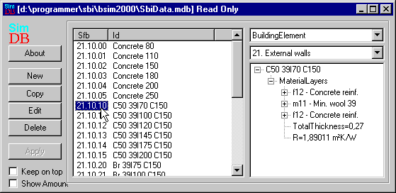

<link rel="stylesheet" href="../style.css">

# SimDB - BuildingElement
Når materialernes data er defineret i [*BuildingMaterial* ](https://help.bsim.dk/support/kb/articles/A93zR3Q0/simdb---buildingmaterial)delen af databasen, kan der opbygges bygningselementer på baggrund af disse. Som tidligere nævnt, er bygningselementerne klassificeret i henhold til SfB-systemets overordnede grupper, fx 21. for udvendige vægge (*Walls*, *external walls*).

<figure id="center_img">

<figcaption>Databasen med indgangen BuildingElement.</figcaption>
</figure>

Til venstre i databasedialogen kan der sættes to options for visningen af SimDB:

*   Ved "hak" ud for *Keep* *on top* sikres det at databasen altid er det øverste vindue på skærmen. Det er især praktisk når der skal trækkes fra databasen til konstruktioner i træstrukturen.

*   "Hak" i *Show Amount* viser fanablade med information om [materialeforbruget](https://help.bsim.dk/support/kb/articles/Rm8JaZ94/simdb---buildingelement-materialamount) for en regningsenhed af konstruktionen. Materialeforbruget benyttes i forbindelse med livscyklusvurderinger, som pt. ikke er en del af BSim-pakken.

I højre side af databaseindgangen *BuildingElement* vises de informationer, som er til rådighed for elementet, fx de enkelte lag, den totale tykkelse af elementet og R-værdien (den reciprokke U-værdi uden overgangsisolanser). Det er muligt at udvide eller kollapse visningen ved at trykke på de små kasser med et "+" (udvid) eller et "-" (kollaps). Ved tryk på knappen *Edit* gives der adgang til at redigere i bygningselementerne.

Nye bygningselementer dannes - fra "scratch" - ved tryk på knappen *New*. Herved [kaldes en dialog](https://help.bsim.dk/support/kb/articles/L9nrBZ9Z/simdb-buildingelement) frem til valg af overordnet gruppe i [SfB-systemet](https://help.bsim.dk/support/kb/articles/DQ2xwBWV/sfb-i-bsim), fx 3x. *Completion* og undergruppen 31. *External walls*. Når der er oprettet et navn (vælg et godt, sigende navn) til det nye bygningselement, kan elementets enkelte lag defineres via dialogerne, som kommer frem ved klik på knappen *Edit*.

Det er også muligt at oprette nye bygningselementer ved at tage udgangspunkt i en [kopi](https://bsim.outseta.com/support/kb/articles/pWrnkGWn/kopier-bygningselementer) af et eksisterende element.

Ved klik på [About](https://bsim.outseta.com/support/kb/articles/E9LwBMQw/about-simdb) knappen vises en dialog med information om den valgte database.
