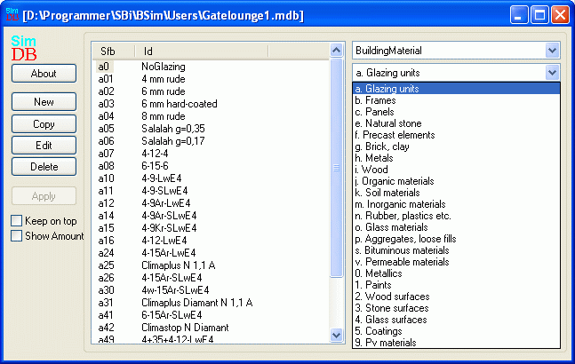

<link rel="stylesheet" href="../style.css">

# SimDB - BuildingMaterial
Ligesom bygningselementerne er materialerne inddelt i [SfB-basisgrupper](https://bsim.outseta.com/support/kb/articles/DQ2xwBWV/sfb-i-bsim), som hver repræsenteres af et bogstav eller et tal, fx "i" for træ. Også her er det vigtigt at overholde konventionen, når der defineres nye materialer:

*   **a** benyttes til glasset (*glazing*) i WinDoor

*   **b** til rammen (*frame*) i WinDoor

*   **c** til fyldningen (*panel*) i WinDoor

*   **e** til **s** er almindelige byggematerialer underopdelt i forhold til materialegrupper

*   **v** er knyttet til egenskaber for lodrette ventilerede luftspalter. Fra og med databasen BSim2006.mdb findes informationer for luftspalter i materialegruppe "v"

*   **0** til **5** indeholder materialeegenskaber overflader (*Finish*)

*   **9** benyttes til definition af solcellesystemer

<figure id="center_img">

<figcaption>Indgangen til definition og udvælgelse af materialer (BuildingMaterial) i databasen.</figcaption>
</figure>

Når der trykkes på *Edit* for et valgt materiale, vises et vindue, hvor de data, der er registreret for det pågældende materiale, kan redigeres. I det følgende gennemgås de enkelte faneblade i materialedatabasen. Fanebladene er opbygget, så der startes med den nødvendige information for databasens hovedformål, og for hvert nyt faneblad tilføjes nye informationer. Antallet og typen af viste faneblade afhænger af den materialegruppe ([SfB-nummer](https://bsim.outseta.com/support/kb/articles/DQ2xwBWV/sfb-i-bsim)), som er valgt.

 

Se også:

*   [Faneblad Material](https://help.bsim.dk/support/kb/articles/4966z49X/simdb---buildingmaterial-material)

*   [Faneblad Thermal](https://help.bsim.dk/support/kb/articles/y9q8b2QA/simdb---buildingmaterial-thermal)

*   [Faneblad PCM](https://help.bsim.dk/support/kb/articles/dQG26zm4/simdb---buildingmaterial-pcm)

*   [Faneblad Environment](https://help.bsim.dk/support/kb/articles/nmDBzx9y/simdb---buildingmaterial-environment)

*   [Faneblad Glazing](https://help.bsim.dk/support/kb/articles/7maw2j9E/simdb---buildingmaterial-glazing)

*   [Faneblad Transmittance](https://help.bsim.dk/support/kb/articles/xmerM5QV/simdb---buildingmaterial-userdefined)

*   [Faneblad Frame](https://help.bsim.dk/support/kb/articles/ZmNreEm2/simdb---buildingmaterial-frame)

*   [Faneblad Finish](https://help.bsim.dk/support/kb/articles/BWzdbgQE/simdb---buildingmaterial-finish)

