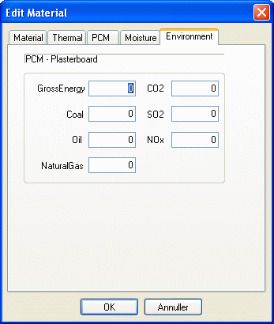

<link rel="stylesheet" href="../style.css">

# SimDB - BuildingMaterial, Environment

Tredje faneblad (*Environment*) indeholder informationer om materialets miljøbelastning pr. regningsmæssige enhed.

<figure id="center_img">

<figcaption>Miljødata (Edit Material | Environment) for materialerne i databasen.</figcaption>
</figure>

Se også:

*   [Faneblad Material](https://help.bsim.dk/support/kb/articles/4966z49X/simdb---buildingmaterial-material)

*   [Faneblad Thermal](https://help.bsim.dk/support/kb/articles/y9q8b2QA/simdb---buildingmaterial-thermal)

*   [Faneblad PCM](https://help.bsim.dk/support/kb/articles/dQG26zm4/simdb---buildingmaterial-pcm)

*   [Faneblad Moisture](https://help.bsim.dk/support/kb/articles/wQXx4nQK/simdb---buildingmaterial-moisture)

*   [Faneblad Environment](https://help.bsim.dk/support/kb/articles/nmDBzx9y/simdb---buildingmaterial-environment)

 

For materialelag til WinDoors

*   [Faneblad Glazing](https://help.bsim.dk/support/kb/articles/7maw2j9E/simdb---buildingmaterial-glazing)

*   [Faneblad UserDefined](https://help.bsim.dk/support/kb/articles/xmerM5QV/simdb---buildingmaterial-userdefined)

*   [Faneblad Frame](https://help.bsim.dk/support/kb/articles/ZmNreEm2/simdb---buildingmaterial-frame)

*   [Faneblad Finish](https://help.bsim.dk/support/kb/articles/BWzdbgQE/simdb---buildingmaterial-finish)
