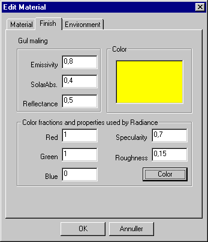

<link rel="stylesheet" href="../style.css">

# SimDB - BuildingMaterial, Finish
Fanebladet *Finish* indeholder information om materialets overfladeegenskaber.

De forskellige data benyttes enten til simulering af det termiske indeklima samt energi- og dagslysforholdene. Data for overfladens farve benyttes dog alene i forbindelse med beregning af dagslysforholdene og ved eksport af bygningsmodeller til videre behandling med [*Radiance*](https://bsim.outseta.com/support/kb/articles/A93zY5Q0/eksport-af-data-til-radiance).

Hvis der ikke vælges et materiale til at repræsentere en overflade vil [*SimLight*](https://bsim.outseta.com/support/kb/articles/LmJvYAmP/dagslysberegninger-med-simlight) benytte følgende standardværdier for lys-reflektansen i simuleringerne:

*   Gulv: 0,1

*   Vægge: 0,4

*   Lofter: 0,7

*   Glas: 0,92

Tilsvarende hentes reflektansen af jordoverfladen omkring modellen fra [Site](https://bsim.outseta.com/support/kb/articles/dQG2Kom4/site-property), hvis den er defineret, ellers benyttes 0,1.

<figure id="center_img">

<figcaption>Information om materialets overfladeegenskaber findes på fanebladet "Finish" (Edit Material | Finish).</figcaption>
</figure>

*   Emissivity: Benyttes i simuleringen af langbølget strålingsudveksling.

*   SolarAbs.: Absorbstans af solstråling benyttes i termisk simulering af solvarmens fordeling til modellens overflader.

*   LightRefl.: Lys-reflektansen benyttes til simulering af dagslys med *SimLight*.

Hvis der for en flade er defineret en farve som overfladeegenskab, overføres denne ved eksport til Radiance. Hvis der ikke er defineret en farve for overfladerne, tildeles de tilfældige farver på en sådan måde, at alle får forskellig farve. Farven vælges ved tryk på knappen *Color*, hvorved en dialog for valg af farve åbnes.

<figure id="center_img">

<figcaption>Dialog for valg af overfladeegenskaben farve.</figcaption>
</figure>

Se også:

*   [Faneblad Material](https://help.bsim.dk/support/kb/articles/4966z49X/simdb---buildingmaterial-material)

*   [Faneblad Moisture](https://help.bsim.dk/support/kb/articles/wQXx4nQK/simdb---buildingmaterial-moisture)

*   [Faneblad Thermal](https://help.bsim.dk/support/kb/articles/y9q8b2QA/simdb---buildingmaterial-thermal)

*   [Faneblad Environment](https://help.bsim.dk/support/kb/articles/nmDBzx9y/simdb---buildingmaterial-environment)

*   [Faneblad Glazing](https://help.bsim.dk/support/kb/articles/7maw2j9E/simdb---buildingmaterial-glazing)

*   [Faneblad UserDefined](https://help.bsim.dk/support/kb/articles/xmerM5QV/simdb---buildingmaterial-userdefined)

*   [Faneblad Frame](https://help.bsim.dk/support/kb/articles/ZmNreEm2/simdb---buildingmaterial-frame)
