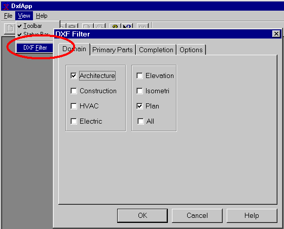

<link rel="stylesheet" href="../style.css">

# SimDXF - Vælg DXF-filter

Indgangen til opsætning af DXF-filteret findes via menuindgangen *<u>V</u>iew* | *DXF <u>F</u>ilter* (Alt + v + f). Her vælges, hvilke dele af tegningen, der skal medtages. Filtrene i SimDXF kan benyttes hvis tegningen overholder retningslinjerne jf ABB's (foreningen for AutoCAD brugere i byggeriet) lagstruktur fra 1990.

<figure id="center_img">

<figcaption>Valg af DXF Filter.</figcaption>
</figure>

Under *Options* angives skala (faktor for omregning fra tegningens enhed til meter og tolerance (hvis afstanden mellem to endepunkter er mindre end tolerancen, er punkterne sammenfaldende).

Vælg kote for gulvplan og etagehøjde. Det anbefales at placere oversiden af gulvet i nederste etage i kote 0, idet det letter afsætningen af de øvrige etager.

<figure id="center_img">

<figcaption>Valg af options.</figcaption>
</figure>

*Window Offset* angiver hvor højt over gulvet vinduer skal placeres i BSim modellen. *Window Height* angiver standardhøjden for de vinduer som indsættes via SimDxf. *Door Height* angiver tilsvarende standardhøjden for døre.

Se også:

*   [Vælg DXF-filter - Edit DXF-filter](https://help.bsim.dk/support/kb/articles/ZmNrexm2/simdxf---valg-dxf-filter)

*   [Hent DXF-fil - Open DXF-file](https://help.bsim.dk/support/kb/articles/BWzdblQE/simdxf---abne-dxf-tegning)

*   [Oprette hjælpelinier](https://help.bsim.dk/support/kb/articles/amRGMZQJ/simdxf---oprette-hjalpelinier)

*   [Knudepunkter (nodes)](https://help.bsim.dk/support/kb/articles/XQYdOMmP/simdxf---oprette-knuder-nodes)

*   [Flade - Face](https://help.bsim.dk/support/kb/articles/4966zA9X/simdxf---flader)

*   [Rum - Room](https://help.bsim.dk/support/kb/articles/y9q8DNQA/simdxf---rum)

*   [WinDoor](https://help.bsim.dk/support/kb/articles/OW4N0pQg/simdxf---windoor)

*   [Tegningsrevisioner](https://help.bsim.dk/support/kb/articles/dQG2xem4/simdxf---tegningsrevisioner)

*   [Tilføjelse af SimDXF som applikation](https://help.bsim.dk/support/kb/articles/7maw2X9E/simdxf---tilfoje-som-applikation)
