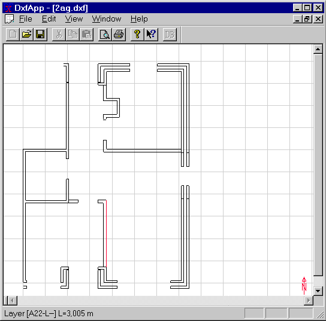

<link rel="stylesheet" href="../style.css">

# SimDXF - Åbne DXF-tegning

Tegningen vises i ét vindue (*DXF-View*).

<figure id="center_img">

<figcaption>Resultat fra filtreret DXF-tegning.</figcaption>
</figure>

Venstreklik på en linie (den aktuelle vises rød), og i statuslinien (nederst i vinduet) vises laginformation og linielængde.

 

Se også:

*   [Vælg DXF-filter - Edit DXF-filter](https://help.bsim.dk/support/kb/articles/ZmNrexm2/simdxf---valg-dxf-filter)

*   [Hent DXF-fil - Open DXF-file](https://help.bsim.dk/support/kb/articles/BWzdblQE/simdxf---abne-dxf-tegning)

*   [Oprette hjælpelinier](https://help.bsim.dk/support/kb/articles/amRGMZQJ/simdxf---oprette-hjalpelinier)

*   [Knudepunkter (nodes)](https://help.bsim.dk/support/kb/articles/XQYdOMmP/simdxf---oprette-knuder-nodes)

*   [Flade - Face](https://help.bsim.dk/support/kb/articles/4966zA9X/simdxf---flader)

*   [Rum - Room](https://help.bsim.dk/support/kb/articles/y9q8DNQA/simdxf---rum)

*   [WinDoor](https://help.bsim.dk/support/kb/articles/OW4N0pQg/simdxf---windoor)

*   [Tegningsrevisioner](https://help.bsim.dk/support/kb/articles/dQG2xem4/simdxf---tegningsrevisioner)

*   [Tilføjelse af SimDXF som applikation](https://help.bsim.dk/support/kb/articles/7maw2X9E/simdxf---tilfoje-som-applikation)

 