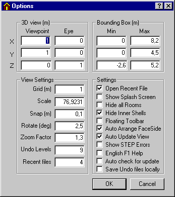

<link rel="stylesheet" href="../style.css">

# SimView - Options

I *Options* menuen kan de generelle data for modelvisningen og programmets opsætning indstilles. 

 Visse ændringer af options træder først i funktion næste gang BSim startes. 

<figure id="center_img">

<figcaption>Dialog for indstilling af standardopsætning for gitter, øjepunkt osv.</figcaption>
</figure>

Options giver mulighed for at fastsætte en række detaljer for visningen af modellen:

3D view

*   Geometrien (*3D-view*), placeringen af sigtepunktet *(Viewpoint)* og øjepunktet *(Eye).*

Bounding Box

*   Ydre begrænsning af modellen (*Bounding Box*) i meter angivet ved to punkter i planen.

*View Settings*

*   *Grid* er størrelsen af nettets masker i meter.

*   *Scale* er skaleringen af den geometriske visning.

*   *Snap* viser hvor tæt på et objekt musemarkøren skal være for at kunne fange det i meter.

*   *Rotate* angiver hvor mange grader modellen drejes ad gangen, fx når der trykkes på pil-tasterne.

*   *Zoom factor* angiver hvor mange gange den grafiske visning skal forstørres eller formindskes når der zoomes ind eller ud på modellen

*   *Undo Levels* giver mulighed for at vælge hvor mange revisioner af modellens geometri der skal gemmes som sikkerhedskopi under arbejdet med opbygning af modellen. Sikkerhedskopien gemmes i samme navn som modellen, blot med foranstillet $-tegn. Standardværdien for undo er 3.

*   *Recent Files* angiver hvor mange af de senest åbnede modellers navne som skal vises nederst i *File* menuen.

*Settings*

*   *Open Recent File* starter programmet med senest benyttede model

*   *Show Splash Screen* viser copyright information ved programstart

*   *Hide all Rooms* skjuler alle rum. Forbedrer overskueligheden for store modeller, når et enkelt rum ad gangen efterfølgende vælges vist

*   *Hide Inner Shells* skjuler tykkelsen af konstruktioner - letter overskueligheden og reducerer opdateringstiden ved store modeller

*   *Floating toolbar* giver mulighed for at have [værktøjsbjælken](https://help.bsim.dk/support/kb/articles/E9Lw5nQw/simview---varktojsbjalken) placeret valgfrit på skærmen (trækkes til en ny placering med musen). Funktionen træder først i kraft næste gang programmet startes.

*   *Auto Arrange FaceSides* sikrer at en model automatisk ændres så:

    *   Flader der vender imod *Outdoor* eller *Ground* altid har side 2 mod disse.

    *   *Internal floors* (etagedæk) altid har side 1 mod det øverste rum.

*   *Auto Update View* gennemfører en automatisk opdatering af den grafiske visning (tykkelser) når der fx tilknyttes en konstruktion til en flade.

*   *Show STEP Errors* viser fejl ved åbning af en model. Ved opdateringer af programmet kan der optræde STEP-fejl ved åbning af "gamle" modeller idet modelbeskrivelsen er ændret. Disse fejl har normalt ingen betydning for muligheden for arbejdet med modellen.

*   *English F1* Help tillader brugere af pc'er med både den danske og den engelske brugervejledning installeret, at bruge den engelske version som standard når der trykkes F1 for hjælp. Hvis der kun findes en sprogversion i den mappe hvor BSim er installeret, åbnes denne når der trykkes F1.

*   *Auto check for update:* Med denne option slået til vil BSim automatisk checke om der findes en nyere version tilgængelig på [www.bsim.dk](https://www.bsim.dk/) når programmet starter.

*   *Save Undo files locally:* Slås denne option til vil midlertidige filer til fortrydelse af ændringer blive gemt lokalt på pc'en i den sti som er defineret vil TMP/TEMP variablen (typisk C:\TEMP). Hurtigere når BSim køres fra netværksdrev. Ellers anvendes samme sti som den aktuelle model.

Se også:

*   [SimView-menuen](https://help.bsim.dk/support/kb/articles/49EdrJQ7/simview---menu)

The general data for the model view and program setup can be adjusted in the <em style="letter-spacing: -0.01em;">Options* menu.</em>
