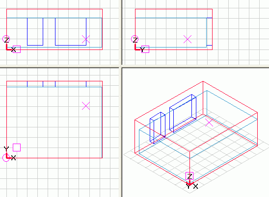
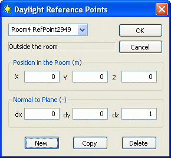

<link rel="stylesheet" href="../style.css">

# Referencepunkt

Det er muligt at definere flere referencepunkter i et rum som reguleringen af den kunstige belysning og solafskærmning kan styre efter. Beregningen og overførsel til den enkelte WinDoor af sollysfaktorerne for styring af kunstlyset i de enkelte referencepunkter sker i [SimLight](https://help.bsim.dk/support/kb/articles/DQ2xz6WV/dagslysberegning-i-et-punkt).

Det aktuelle referencepunkt er vist i SimView som et **X**. Det er muligt at flytte referencepunktet med musen ved at dobbeltklikke et sted i en af de tre plantegninger eller ved at holde Ctrl-knappen nede samtidig med at punktet trækkes til en anden placering med musen når venstre-knappen holdes nede.

<figure id="center_img">
 
<figcaption>Referencepunktet vises i SimView som et X.</figcaption>
</figure>

Et referencepunkt oprettes for de enkelte rum i bygningsmodellen ved at højre-klikke på rummet og vælge Ref Points.

<figure id="center_img">
 
<figcaption>Referencepunkter oprettes ved at højre-klikke på det enkelte rum og vælge Ref Points.</figcaption>
</figure>

Herved åbnes en dialog med information om koordinaterne for det aktuelle referencepunkt. Ved at trykke *New* oprettes et nyt referencepunkt ud fra koordinaterne for det aktuelle referencepunkt. HUSK at give det nye referencepunkt et fornuftigt navn så det kan identificeres i forbindelse med regulering af diverse systemer.

<figure id="center_img">
 
<figcaption>Dialog for definition af flere referencepunkter i et rum.</figcaption>
</figure>

*   Position in room:

    *   X: Referencepunktets X-placering i forhold til modellens globale koordinatsystem.

    *   Y: Referencepunktets Y-placering i forhold til modellens globale koordinatsystem.

    *   Z: Referencepunktets Z-placering i forhold til modellens globale koordinatsystem.

*   *Normal to plane*: Definerer en normalvektor til det plan som referencepunktet befinder sig på. En normalvektor med værdierne 0,0,1 repræsenterer et vandret plan hvor referencepunktet peger opad (modtager lys der reflekteres fra loftet mv.).

    *   dx: X-koordinaten for den vektor der peger vinkelret væk fra planen på planens positive side.

    *   dy: Y-koordinaten for den vektor der peger vinkelret væk fra planen på planens positive side.

    *   dz: Z-koordinaten for den vektor der peger vinkelret væk fra planen på planens positive side.

*   *New:* Opretter et nyt referencepunkt med "0" på alle pladser, undtagen dz.

*   *Copy:* Opretter et nyt referencepunkt som en kopi af de aktuelle referencepunkt.

*   Delete: Sletter det aktuelle referencepunkt.

