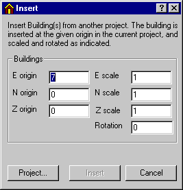
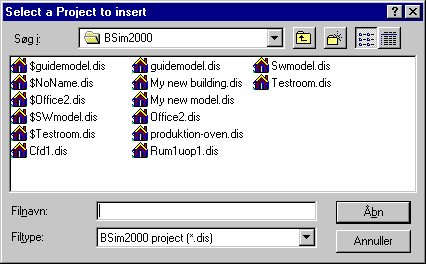
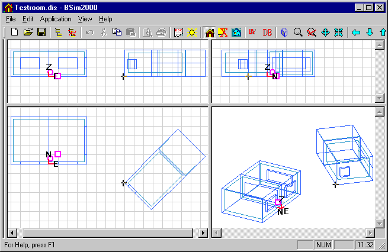

<link rel="stylesheet" href="../style.css">

# Skygger fra omgivelser
Omgivelsernes skygger på bygningen defineres lige som modellen for en bygning. Der kan indsættes bygninger fra en tidligere model som skygge i den aktuelle model. Ved simulering med *tsbi5* vil kun den [aktuelle](https://help.bsim.dk/support/kb/articles/ZmNrOwm2/termisk-simulering) bygning blive simuleret.

Bygninger fra en eksisterende model indsættes ved først at markere (dobbelt klik) et referencepunkt i planen (visningen nederst til venstre i SimView) som lokalt koordinatsystem for den indsatte model og derefter vælge *Insert* fra menuen Edit (*Alt-e + i*).

<figure id="center_img">
 
<figcaption>Insert dialogen viser placeringen af det valgte punkt i planen samt bygningernes skalering i øst, nord og Z retningen og det indsatte projekts rotation.</figcaption>
</figure>

Det er muligt at skalere det indsatte projekts bygning(er) i det lokale koordinatsystem i de tre akseretninger, samt angive en rotation.

*Project-knappen* åbner en dialog for valg af eksisterende projekter til indsættelse i det aktuelle projekt.

<figure id="center_img">
 
<figcaption>Dialog (Select a Project to Insert) for indsættelse af eksterne skygger fra et eksisterende projekt.</figcaption>
</figure>

Bygningerne fra det indsatte projekt kan umiddelbart ses i SimView.

<figure id="center_img">
 
<figcaption>SimView med en ekstern skyggegiver indsat som en bygning fra et eksisterende projekt.</figcaption>
</figure>

Se også:

*   [Simulering med XSun](https://help.bsim.dk/support/kb/articles/amRGdMQJ/analyse-af-solindfald-med-xsun)
