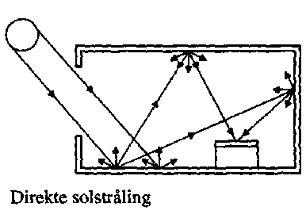
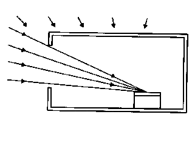
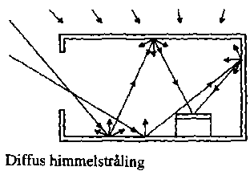
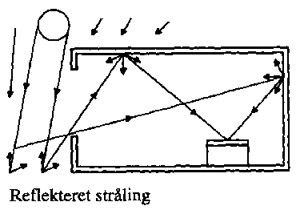
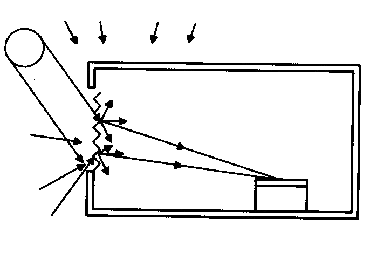
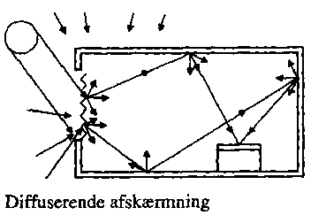
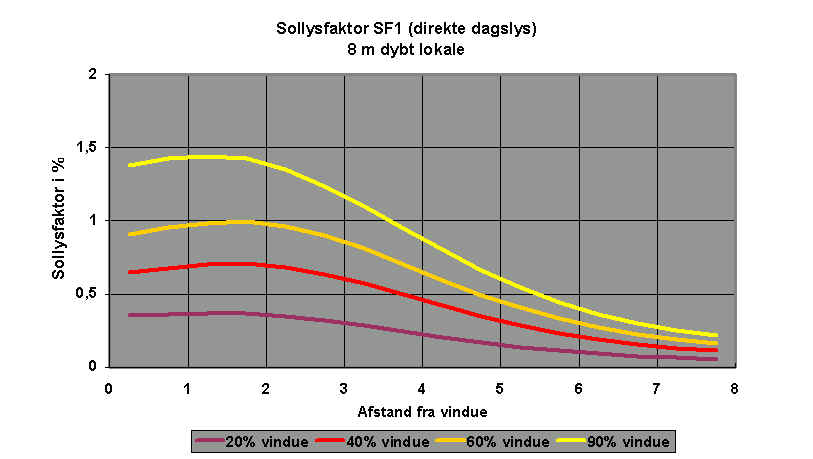
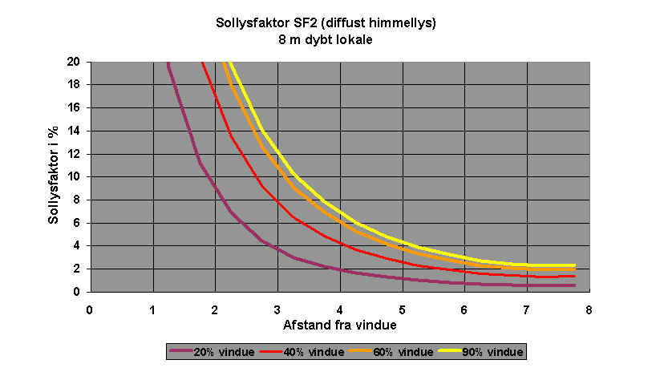
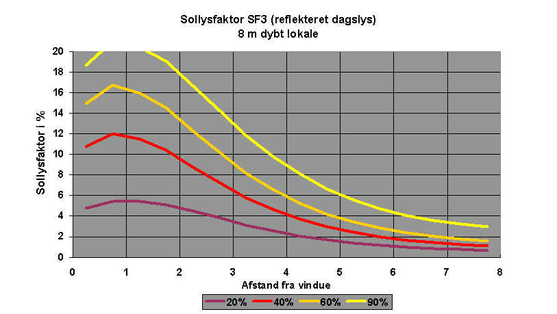
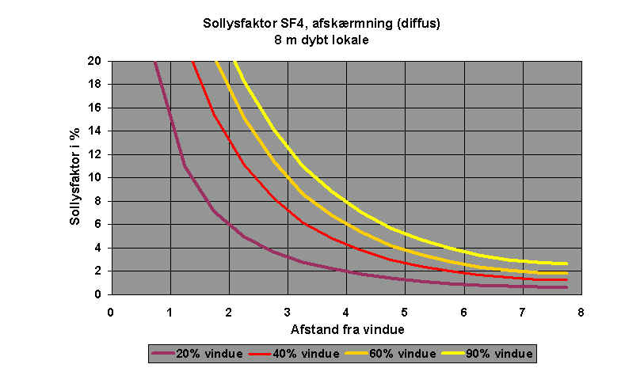

<link rel="stylesheet" href="../style.css">

# Sollysfaktorer for WinDoors

Belysningsstyrken i et punkt er meget afhængig af punktets placering i lokalet. Normalt betragtes belysningsstyrken på et vandret arbejdsplan 0,85 m over gulvet.

Da belysningsstyrken uden for vinduet varierer fra det ene øjeblik til det andet er det mest praktisk at angive belysningsstyrken i et punkt inde i rummet som en relativ størrelse i forhold til belysningen i det fri.

*   Definition

*   Direkte og interreflekterede bidrag

*   Direkte sol, SF1

*   Himmellys, SF2

*   Reflekteret lys, SF3

*   Lys fra solafskærmning (eller skodde), SF4

**Definition af sollysfaktor**

I BSim angives den relative belysningsstyrke i lokalet i forhold til det aktuelle lysindfald på vinduet, og forholdet kaldes sollysfaktoren SF, som ikke må forveksles med dagslysfaktoren (DF).

Sollysfaktoren SF i et punkt i et givet plan er defineret som forholdet mellem belysningsstyrken i punktet i planet og den samtidige belysningsstyrke udendørs på facadens plan uden skygger fra omgivelserne. Belysningsstyrken i et punkt kan ikke beskrives ved en enkelt værdi af sollysfaktoren, men må opdeles i forskellige bidrag, idet der skelnes mellem:

*   SF1    sollysfaktoren for direkte sollys (rettet lys)

*   SF2    sollysfaktoren for himmellys (diffust lys fra himmelhvælvingen)

*   SF3    sollysfaktoren for reflekteret lys

*   SF4    sollysfaktoren for vinduet, når det er forsynet med en afskærmning.

Ved valget af rudetype for et vindue defineres en transmissionsfaktor for henholdsvis solstråling og dagslys. Der skal derfor anvendes beregnede sollysfaktorer for et vindue med en transmissionsfaktor på 1.

**Direkte og indirekte bidrag til sollysfaktorerne SF1 til SF4**

Lyset, som rammer et punkt, består af to bidrag, nemlig

1.  Den direkte komponent (index d), som er lyset direkte til punktet fra lysgiveren, fx himlen eller solafskærmningen.

2.  Den interreflekterede komponent IRK (index i), som udgøres af lyset, der først reflekteres en eller flere gange fra andre flader, inden det rammer punktet.

Sollysfaktorerne kan i et givet tilfælde beregnes ved hjælp af edb eller bestemmes ved mere eller mindre nøjagtige håndberegningsmetoder, eller ved måling i eksisterende bygninger. I håndberegningsmetoderne for dagslysfaktorer indgår kun bidrag fra diffus himmelstråling og stråling fra reflekteret lys.

Beskrivelse af, hvorledes de to bidrag for hver af sollysfaktorerne kan beregnes eller bestemmes ud fra kurver findes i: [Algoritmer til beregning af solstråling og dagslys.](https://help.bsim.dk/support/kb/articles/BWzdaPQE/algoritmer-til-beregning-af-solstraling-og-dagslys)

For normalt anvendte vinduesstørrelser og lokaledimensioner, er der nedenfor angivet retningsgivende formeludtryk til beregning af sollysfaktorerne, men i tilfælde med særlige facader eller konstruktioner, hvor det er nødvendigt med mere nøjagtige faktorer, må disse bestemmes på anden måde.

De anførte formler er tilnærmede udtryk ud fra beregninger på et lokale med en facade på 4 m x 2,8 m og et vindue med et glasareal på 40-60 % af det indvendige facadeareal. Rumdybden kan variere, fra 6 - 10 meter. Reflektanserne på loft, vægge og gulv er henholdsvis 0,7 0,4 og 0,1. Kurver og korrektionsfaktorer for sollysfaktorer i ovennævnte eksempel er angivet i algoritmer til beregning af solstråling og dagslys, hvor der desuden angives resultater for rum med større glasareal og større rumdybde.

 

| SF  | Direkte bidrag, SFd | Indirekte bidrag, SFi |
|-----|--------------------------------|----------------------------------|
| SF1 | I tilfælde af direkte solstråling i punktet medregnes dette ikke i SF1. | <figure id="center_img"></figure> |
| SF2 | <figure id="center_img"></figure> | <figure id="center_img"></figure> |
| SF3 | Reflekteret stråling fra jordoverfladen kan ikke ramme punktet på den vandrette arbejdsflade direkte, og bidrager ikke til SF3. | <figure id="center_img"></figure> |
| SF4 | <figure id="center_img"></figure> | <figure id="center_img"></figure> |

*Illustration af bidragene til de fire sollysfaktorer SF1-SF4 fra direkte og interreflekteret stråling.*

**Direkte sol SF1**

Den direkte sol vil give en lysende plet et sted i lokalet, og det reflekterede lys fra pletten vil virke som en lyskilde. Da plettens placering i lokalet er meget afhængig af solens højde og azimut vil SF1 i et punkt langt fra være konstant. I beregningerne ønskes der dog en enkelt værdi, som er repræsentativ for SF1. I punktet, som rammes af den direkte stråling, vil der være en meget høj belysningsstyrke, som der dog ses bort fra ved beregningen af SF1, idet der kun medtages den interreflekterede komponent IRK.

Figuren nedenfor viser eksempler på beregnede værdier af SF1 på arbejdsplanet i en linie midt i rummet for forskellige vinduesstørrelser og som funktion af afstanden fra vinduet (jf. ([Johnsen, Grau & Christensen, 1993](https://help.bsim.dk/support/kb/articles/A93zbqQ0/litteratur)).

<figure id="center_img">
 
<figcaption>Vinduesstørrelsen er angivet som rudens procentvise andel af den samlede facade (glasprocent GP), og SF1 er proportional med denne glasprocent og med reflektansen for den flade, som det direkte sollys rammer (Rf,sol). SF1 er omvendt proportional med rummets samlede overfladeareal og med faktoren (1 - Rmid), hvor Rmid er middelreflektansen for alle rummets overflader.</figcaption>
</figure>

Det skal bemærkes, at den direkte solstråling i beregningerne antages at ramme gulvet. Under denne forudsætning er sollysfaktoren SF1 direkte proportional med gulvets reflektans, som i beregningerne er sat til 0,1. Ved højere reflektanser kan SF1 således direkte beregnes ved at gange med forholdet mellem den faktiske reflektans og 0,1.

**Himmellys SF2**

SF2 giver normalt det største bidrag til belysningsstyrken i et punkt, der kan "se" himlen. Ved beregningerne antages, at uanset himlens tilstand (skyet eller skyfri), er luminansfordelingen som en CIE-overskyet himmel eller ensartet overskyet, og SF2 beregnes svarende til en af disse tilstande. *Størrelsen* af dagslysindfaldet beregnes efter algoritmer fundet ved målinger under danske forhold ([Petersen, 1982](https://help.bsim.dk/support/kb/articles/A93zbqQ0/litteratur)).

De to bidrag til sollysfaktoren SF2 fra henholdsvis den direkte og den interreflekterede del af den diffuse himmelstråling kan bestemmes hver for sig, som beskrevet i [algoritmer for beregning af solstråling og dagslys](https://help.bsim.dk/support/kb/articles/BWzdaPQE/algoritmer-til-beregning-af-solstr-ling-og-dagslys).

Summen af de to bidrag er vist på den følgende figur, der viser sollysfaktorerne for et 8 meter dybt lokale med forskellige vinduesarealer.

<figure id="center_img">
 
<figcaption>Sollysfaktoren SF2 for den diffuse himmelstrålings bidrag til dagslyset i et lokale med dybden 8 meter ved forskellige vinduesarealer.</figcaption>
</figure>

**Reflekteret lys SF3**

SF3 bestemmer bidraget fra det reflekterede sollys fra jordoverfladen, og heri indgår både bidraget fra diffust himmellys og fra direkte sollys. Der regnes med diffus refleksion fra jordoverfladen. Det reflekterede bidrag er karakteriseret ved, at lyset først skal ramme andre flader i lokalet især loftet, inden det når punktet. denne faktor indeholder derfor kun bidrag fra den interreflekterede del af lyset (punktet i arbejdsplanet kan ikke "se" nogen stråling direkte fra jorden).

<figure id="center_img">
 
<figcaption>Sollysfaktoren SF3 for den reflekterede strålings bidrag til dagslyset i et lokale med dybden 8 meter ved forskellige vinduesarealer.</figcaption>
</figure>

**Korrektionsfaktorer for sollysfaktorer**

Ved definition af WinDoor i databasen indlæses værdier af varme- og lystransmission for den aktuelle rudetype. Normalt anvendes standardværdier for transmissionstallene, som ikke tager hensyn til snavs på ruden, ligesom der ikke korrigeres for lokalt forøget luftforurening, som reducerer solindfaldet. For solvarmeberegninger har sådanne forhold kun lille betydning, mens det i forbindelse med dagslys kan være vigtigt at tage hensyn hertil. I [algoritmer for beregning af solstråling og dagslys](https://help.bsim.dk/support/kb/articles/BWzdaPQE/algoritmer-til-beregning-af-solstr-ling-og-dagslys), er angivet en tabel med vejledende værdier for de vigtigste korrektioner.

**Lys fra solafskærmning (eller skodde) SF4**

Når der anvendes en solafskærmning og lyset "diffuseres" efter passagen af afskærmningen anvendes *SF4* for afskærmningen, jf. figuren. *SF4* angives som de øvrige sollysfaktorer for et vindue med transmittansen 1, da transmissionsfaktorer er indeholdt i data for WinDoor og afskærmning. Det bør bemærkes, at afskærmningsfaktoren ikke har indflydelse på størrelsen af *SF4.*

Lyset fra solafskærmningen giver et direkte bidrag SF4d og et interreflekteret bidrag SF4i til belysningsstyrken, der kan bestemmes hver for sig som beskrevet i [algoritmer for beregning af solstråling og dagslys](https://help.bsim.dk/support/kb/articles/BWzdaPQE/algoritmer-til-beregning-af-solstr-ling-og-dagslys).

<figure id="center_img">

<figcaption>Sollysfaktoren SF4 for sollys, der diffuseres gennem en solafskærmning for et 8 meter dybt lokale ved forskellige vinduesprocenter.</figcaption>
</figure>