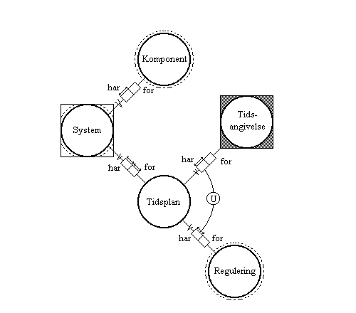
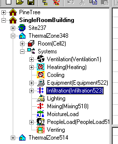

<link rel="stylesheet" href="../style.css">

# SimView - Systemer

Et system består af den generelle fysiske komponent, beskrevet ved en simpel matematisk model, samt en tidsplan, der angiver variationer, styringsstrategier m.m., defineret ved sammenhørende par af regulering og tidsangivelse, jf. figuren.

<figure id="center_img">
 
<figcaption>Generel beskrivelse af systemer.</figcaption>
</figure>

Alle systemer i *BSim* reguleres efter en operative temperatur i den termiske zone de er knyttet til.

Til en bygningsmodel skal alle de installationer og belastninger defineres, som har indflydelse på det termiske indeklima. De kaldes i det følgende under et for *komponenter.*

Komponenter beskrives ved simplificerede modeller af de fysiske installationer, belastninger m.m. De tilhørende variationer, styringsstrategier m.m. beskrives særskilt som en *regulering* af komponenten. Fx beskrives [personlast](https://bsim.outseta.com/support/kb/articles/XQYdjgmP/personer), dvs. varme- og fugtbelastningen fra personer i en zone, som det maksimale antal personer af en given type er angivet som én persons varme- og fugtafgivelse ved et givent aktivitetsniveau. Variationen af personlasten over året og døgnet angives som en regulering, i dette tilfælde som et døgnprofil, dvs. en procentvis døgnvariation af personlasten.

I nedenstående tabel gives en oversigt over elementer med deres mulige tilknyttede komponenter og reguleringer. I tilfælde, hvor en komponent kan have mere end én type regulering, angives tillige reguleringstyper, som kan anvendes ved valg af regulering.

Til ethvert system i en bygningsmodel kan der angives én eller ingen komponent af en given type. I de tilfælde, hvor der er valgt en komponent, angives reguleringen af komponenten ved hjælp af en [tidsplan](https://bsim.outseta.com/support/kb/articles/79O3DZ9E/systemer---tidsplan)*.* En tidsplan består generelt af ét eller flere sammenhørende par af *regulering* og *tidsangivelse.* Ved reguleringen angives, hvorledes komponenten skal reguleres eller modificeres til de tidspunkter, der falder inden for den tilhørende [tidsangivelse](https://bsim.outseta.com/support/kb/articles/VmAOwo9a/tidsangivelse).

Kombinationen af komponent og den tilhørende tidsplan betegnes et system og definerer en indeklimamæssig påvirkning af bygningen til et vilkårligt tidspunkt under en simulering.

| Element | Komponent | Regulering | Type |
|---------|-----------|------------|------|
| <b>Zone</b>    |           |            |      |
|         | [Personlast](https://bsim.outseta.com/support/kb/articles/XQYdjgmP/personer) | [Døgnprofil](https://bsim.outseta.com/support/kb/articles/L9PwDAQJ/dognprofil) | - |
|         | [Last fra udstyr](http://bsim.outseta.com/support/kb/articles/vW5a8pW4/udstyr) | [Døgnprofil](https://bsim.outseta.com/support/kb/articles/L9PwDAQJ/dognprofil) | - |
|         | [Fugtlast](https://bsim.outseta.com/support/kb/articles/xmere5QV/fugt) | [Døgnprofil](https://bsim.outseta.com/support/kb/articles/L9PwDAQJ/dognprofil) | - |
|         | [Infiltration](http://bsim.outseta.com/support/kb/articles/Rm8JRZ94/infiltration) | [Døgnprofil](https://bsim.outseta.com/support/kb/articles/L9PwDAQJ/dognprofil) | - |
|         | [Belysning](http://bsim.outseta.com/support/kb/articles/wQXxbnQK/belysning) | [Lysregulering](http://bsim.outseta.com/support/kb/articles/wQXxbnQK/belysning) | Sol / temperatur |
|         |           | [Dagslysregulering](http://bsim.outseta.com/support/kb/articles/wQXxbnQK/belysning) | Dagslys |
|         | [Udluftning](http://bsim.outseta.com/support/kb/articles/wQXxbnQK/belysning) | [Udluftningsregulering](http://bsim.outseta.com/support/kb/articles/wQXxbnQK/belysning) | - |
|         | [Opvarmning](http://bsim.outseta.com/support/kb/articles/wmjnq7mV/opvarmning) | [Varme](http://bsim.outseta.com/support/kb/articles/wmjnq7mV/opvarmning)-/køleregulering | Heating |
|         |           | [Gulvvarmeregulering](http://bsim.outseta.com/support/kb/articles/L9nr6e9Z/gulvvarmeregulering) | Heating2 |
|         | [Køling](http://bsim.outseta.com/support/kb/articles/y9gBNGQM/koling) | Varme-/[køleregulering](http://bsim.outseta.com/support/kb/articles/y9gBNGQM/koling) | - |
|         | [Ventilationsanlæg](http://bsim.outseta.com/support/kb/articles/OW4N5AQg/ventilation) | [Indblæsningsstyring](http://bsim.outseta.com/support/kb/articles/OW4N5AQg/ventilation) | Indblæsning |
|         |           | [Rumtemperaturregulering](http://bsim.outseta.com/support/kb/articles/DQ2x0yWV/ventilation---rumtemperaturregulering) | Rumtemperatur |
|         |           | [Fugtstyring](http://bsim.outseta.com/support/kb/articles/E9LwjGQw/ventilation---fugtregulering) | Fugt |
|         |           | [VAV regulering](http://bsim.outseta.com/support/kb/articles/j9b8kamn/ventilation---vav-regulering) | VAV |
|         |           | [Natkøling](http://bsim.outseta.com/support/kb/articles/L9nrXz9Z/ventilation---natkoling-ventilation) | Natkøling |
|         |           | [Recirkulation](http://bsim.outseta.com/support/kb/articles/LmJvMEmP/ventilation---recirkulation) |   |
|         | [Mixing](http://bsim.outseta.com/support/kb/articles/Rm8JEd94/mixing) | [Døgnprofil](https://bsim.outseta.com/support/kb/articles/L9PwDAQJ/dognprofil) | . |
| <b>Vindue</b>  |           |            |      |
|         | [Skodde](http://bsim.outseta.com/support/kb/articles/ZmNrMxm2/skodde) | [Temperaturregulering](http://bsim.outseta.com/support/kb/articles/ZmNrMxm2/skodde) | - |
|         | [Solafskærmning](http://bsim.outseta.com/support/kb/articles/7maw8X9E/solafskarmning) | [Afskærmningsregulering](http://bsim.outseta.com/support/kb/articles/7maw8X9E/solafskarmning) | - |
| <b>Fiktiv zone</b> |       |            |      |
|         | -        | Temp og/eller fugt variation | - |

*Oversigt over elementer i bygningsmodellen, hvortil der kan knyttes systemer bestående af komponent og tidsplan.*

Systemer tilknyttes de termiske zoner og vælges ved "afkrydsning" i dialogen *ThermalZone* Property, som kaldes frem ved højre-klik på ikonet for en termisk zone i træ-oversigten til venstre på skærmen. For de valgte systemer skal regulering og tidsplan herefter defineres.

<figure id="center_img">
 
<figcaption>Dialog (ThermalZone Property) for valg, inaktivering og fravalg af systemer der skal tilknyttes en termisk zone.</figcaption>
</figure>

Check-boksene ud for de enkelte systemer har tre funktioner:

*   Første gang der klikkes i en tom boks tilføjes systemet til den termiske zone og markeringen vises som et sort check-mærke i en hvid boks, fx Cooling, Equipment og Heating. Systemet optræder i træ-oversigten uden foranstillet "+" så længe der **ikke** er defineret en tidsplan *(schedule).*

*   Anden gang der klikkes i boksen bliver systemet inaktivt i simuleringen med tsbi5 og markeres med et gråt check-mærke i en grå boks, fx Mixing. Når et system er inaktivt vil det **ikke** blive fejlchecket og **ikke** optræde i *[ModelList](https://bsim.outseta.com/support/kb/articles/z9MKj7m4/udskrift-af-model).* Systemet vises i træstrukturen som den gældende ikon med et rødt kryds over.

*   Tredje gang der klikkes i boksen fjernes check-mærket og boksen fremstår tom. Når der klikkes på OK vil de systemer som findes, men ikke er afkrydsede, forslås slettet som system for den termiske zone.

De valgte systemer vises som underpunkter til den termiske zone i træ-oversigten. Rækkefølgen af systemerne i træstrukturen er den samme som den rækefølge systemerne simuleres i tsbi5. Rækkefølgen af de enkelte systemer kan ændres ved at trække det ønskede system til det system, som skal efterfølge det pågældende.

<figure id="center_img">
 
<figcaption>Systemerne (Systems) vises som underpunkter til den termiske zone.</figcaption>
</figure>

I brugergrænsefladen afspejles denne struktur i dialogerne for de enkelte komponenter, idet der for alle komponenter findes et faneblad [*Schedule*](http://bsim.outseta.com/support/kb/articles/79O3DZ9E/systemer---tidsplan) (tidsplan), som vælges for at definere den tidsplan, der skal anvendes for den konkrete komponent. I dialogen *Schedule* vises tidsplanen som sammenhørende par af [tidsangivelse](http://bsim.outseta.com/support/kb/articles/VmAOwo9a/tidsangivelse) og regulering.

Rækkefølgen af parrene regulering/tidsplan i oversigtsdialogen er af stor betydning, idet den under en simulering bruges til at bestemme, hvilken regulering der skal anvendes sammen med den aktuelle komponent. Til et givet tidspunkt (ved starten af hver time) gennemløbes tidsplanen i den rækkefølge, den er vist på oversigtsfanen *(Schedule).* Ved det første par, hvor det givne tidspunkt falder inden for tidsangivelsen, vil den tilhørende regulering blive anvendt sammen med dens komponent. Hvis det givne tidspunkt derimod ikke falder inden for nogen tidsangivelse i tidsplanen, vil den tilhørende komponent ikke blive aktiveret overhovedet, dvs. der vil ikke være nogen indeklimamæssig påvirkning på det pågældende tidspunkt.

Når de ønskede systemer er tilføjet den termiske zone, kan definitionerne redigeres ved at højre-klikke på systemet i træ-oversigten. Herved åbnes en dialog for definition af det aktuelle system.

Se også:

*   [tidsplan](http://bsim.outseta.com/support/kb/articles/79O3DZ9E/systemer---tidsplan) (Fanebladet *Schedule)*
*   [tidsangivelse](http://bsim.outseta.com/support/kb/articles/VmAOwo9a/tidsangivelse) (Fanebladet *Time)*
*   [reguleringsprioritet](https://bsim.outseta.com/support/kb/articles/BWzd8lQE/reguleringsprioritet-for-systemer)
Systemer (ikke regulerbar) tilknyttet bygningsmodellen
*   [Eksterne skygger](https://bsim.outseta.com/support/kb/articles/E9LwJGQw/skygger-fra-omgivelser)

Systemer tilknyttet termiske zoner:

*   [Mixing](http://bsim.outseta.com/support/kb/articles/Rm8JEd94/mixing)
*   [Personer](http://bsim.outseta.com/support/kb/articles/XQYdjgmP/personer)
*   [Udstyr](http://bsim.outseta.com/support/kb/articles/vW5a8pW4/udstyr)
*   [Fugt](http://bsim.outseta.com/support/kb/articles/xmere5QV/fugt)
*   [Infiltration](http://bsim.outseta.com/support/kb/articles/Rm8JRZ94/infiltration)

*   [Belysning](http://bsim.outseta.com/support/kb/articles/wQXxbnQK/belysning)
*   [Udluftning](http://bsim.outseta.com/support/kb/articles/gWKDJlmp/udluftning)
*   [Opvarmning](http://bsim.outseta.com/support/kb/articles/wmjnq7mV/opvarmning)
*   [Køling](http://bsim.outseta.com/support/kb/articles/y9gBNGQM/koling)
*   [Ventilation](http://bsim.outseta.com/support/kb/articles/OW4N5AQg/ventilation)

Til en WinDoor kan der knyttes to typer af systemer, som vælges via de respektive indgange i WinDoor-dialogen: Skodde og solafskærmning. Endvidere kan der indlæses oplysninger om sollysfaktorer, som vedrører dagslysforhold i forbindelse med regulering af systemet belysning.

Systemer tilknyttet WinDoor:

*   [Skodder](http://bsim.outseta.com/support/kb/articles/ZmNrMxm2/skodde)
*   [Solafskærmning](http://bsim.outseta.com/support/kb/articles/7maw8X9E/solafskarmning)

