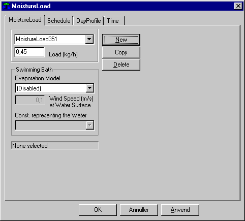

<link rel="stylesheet" href="../style.css">

# Moisture, System

Dialog for angivelse af fugtbelastning i den aktuelle termiske zone, bortset fra fugt fra personer.

Programmets [standard-model](http://bsim.outseta.com/support/kb/articles/ZmNr6nm2/fugtbalancen-for-en-zone) for fugtberegninger er meget enkel, idet der ikke tages hensyn til fugtabsorption og adsorption i rummets overflader eller til fugttransport og fugtakkumulering i materialer. Med udvidelsesmodulet til detaljeret [hygro-termisk simulering](https://help.bsim.dk/support/kb/articles/vW5alXW4/detaljeret-model-for-fugttransport) er det dog muligt at tage højde for disse forhold.

<figure id="center_img">
 
<figcaption>Dialog (MoistureLoad) for definition af fugtbelastning.</figcaption>
</figure>

Det er muligt at vælge mellem to forskellige funktioner for fugtafgivelse i den termiske zone. Øverst i dialogen kan der vælges en dampbefugtning hvor fugten frigives til zonen uafhængigt af indeklimaets temperatur og fugtforhold. Nederst i dialogen er det muligt at vælge en fugtafgivelse svarende til fugtafgivelsen fra en fri vandoverflade som i en svømmebad. Kun en af de to fugtafgivelser kan være aktiv.

*Load*

*   Fugtafgivelsen til rumluften fra alle belastningskilder i zonen, bortset fra personer, angives i kg vand pr. time.

*Swimming Bath* (fra BSim version 3.2.7.25)

*   Fugtafgivelsen bestemmes af to funktioner *Shah* eller *Smith* som begge bl.a. afhænger af lufthastigheden ved vandoverfladen. Vælges *Disabled* benyttes én samlet fugtafgivelse fra alle belastningskilder i zonen som beskrevet under *Load.*

*   Lufthastigheden parallelt med vandoverfladen angives som en middelværdi som er gældende inden for tidsangivelsen. Værdien korrigeres med det valgte døgnprofil. Vindhastigheden benyttes ikke i Shah modellen.

*   Under *Cons. Representing the Water* vælges den konstruktion, som repræsenterer vandet i bassinet.

Fugtafgivelsen beregnes efter følgende formler afhængig af den valgte model:

| Model | Ubenyttet | Benyttet af N personer | Betingelse |
|------|-----------|------------------------|------------|
| **Shah** | $E = \frac{1}{3600} C_{p,w} (\rho_a - \rho_w)^{\frac{1}{3}} (W_w - W_a)$ | $E = E_0 \left( 14.85 \frac{N}{A} + 1 \right)$ | $A/N \ge 45$ |
|  |  | $E = E_0 \left( 5.85 \frac{N}{A} + 1.2 \right)$ | $4.5 < A/N < 45$ |
|  |  | $E = 2.5 E_0$ | $A/N \le 4.5$ |
| **Smith** | $E = \dfrac{0.73(0.0888 + 0.0783V)\sqrt{P_w - P_a}}{h_w}$ | $E = E_0 \left( 4.27 \frac{N}{A} + 1.04 \right)$ |  |

For antal personer N anvendes det antal personer som er angivet i den termiske zones [PeopleLoad](https://help.bsim.dk/support/kb/articles/XQYdjgmP/personer).

hvor:
|            |                                                                                              |
|-----------------------|------------------------------------------------------------------------------------------------------------|
| A                     | Areal af vandoverflade, [m²]                                                                              |
| C                     | C = 35 for (ρa - ρw) > 0,02 C = 40 for (ρa - ρw) ≤ 0,02 hvis (ρa - ρw) < 0 benyttes den absolutte værdi. |
| E                     | Fugtafgivelse [kg/m²/s]                                                                                   |
| E0                    | Fugtafgivelse fra ubenytet bassin [kg/m²/s]                                                               |
| Pw , Pa                | Mættet vanddamptryk af luften ved bassinets temperatur, og vanddamptrykket af luften [Pa].                |
| V                     | Vindhastighed parallel med vandoverfladen [m/s]                                                           |
| Ww , Wa                | Absolut fugtinhold af luften ved vandoverfladens, henholdsvis luftens temperatur [kg/kg]                  |
| hw                    | Latent varmeafgivelse ved fordampning af vand [J/kg].                                                     |
| ρw , ρa                | Massefylden af luften ved vandoverfladens henholdsvis, luftens temperatur [kg/m³]

Fugt- og luftbalancerne er nærmere beskrevet i [det matematiske grundlag](https://help.bsim.dk/support/kb/categories/OW4JLRQg/det-matematiske-grundlag).

[Tidsplanen](https://help.bsim.dk/support/kb/articles/79O3DZ9E/systemer---tidsplan) definerer sammenhørende sæt af regulering og [tidsangivelse](https://help.bsim.dk/support/kb/articles/VmAOwo9a/tidsangivelse). Reguleringen for 'fugtlast' er af typen [døgnprofil](https://help.bsim.dk/support/kb/articles/L9PwDAQJ/dognprofil), hvor variationen over døgnets timer angives i procent.

 

Se også

*   Fanebladet [Schedule](https://help.bsim.dk/support/kb/articles/79O3DZ9E/systemer---tidsplan)
*   Fanebladet [DayProfile](https://help.bsim.dk/support/kb/articles/L9PwDAQJ/dognprofil)
*   Fanebladet [Time](https://help.bsim.dk/support/kb/articles/VmAOwo9a/tidsangivelse)
