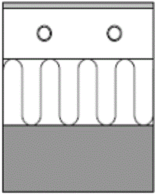

<link rel="stylesheet" href="../style.css">

# Gulvvarme, System
### **RADIANT HEATING/COOLING MODULE FOR BSim**

**By Massimiliano Scarpa**

 

**OBS:**

*   Floor heating is placed on top of the selected layer.

*   Make sure that the thickness of the layers above the floor heating pipes is bigger than the external pipe diameter!

*   Use different names for constructions in different thermal zones that hosts a floor heating system!

 

The input data to be entered by the user consist in data regarding the building construction where pipes are going to be placed and in data regarding the pipe and the circuit. Moreover, additional input data may be required, depending on the type of slab to be simulated.

In the figure below, the window dialog collecting the main input data for the description of the slab is shown:

<figure id="center_img">

<figcaption>Window dialog for the description of hydronic thermo-active building structures</figcaption>
</figure>

The data regarding the building construction are in the section "Destination" of the window dialog. Here, the first item assigns the name of the surface where the circuit is embedded. The related material layers are described in the small window placed below the first item. The description of the layers comes directly from the building construction assigned to the current radiant surface in the input section of BSIM dedicated to geometry and constructions. In particular, the pipes are placed between the ticked layer and the previous one. For instance, if the pipes must be embedded in the middle of the screed, then the screed is described via two layers: the first layer is the one placed on the pipe level, whereas the second one consists in the material layer placed just below the pipe level. The figure below shows what has just been described.

<figure id="center_img">

<figcaption>Example of split of screed aimed at the definition of the pipe level.</figcaption>
</figure>

The computation tool can calculate the thermal behavior of various kinds of radiant slab. Some examples are shown in the figure below:

| Type A | Type E |
|-----------|-----------|
| |  |

| <b>Type X1 </b>        |  <b> Type G </b>         |
|-------------|------------|
|||

 

*Some kinds of radiant systems that can be described via the current computation tool.*

In particular, G type and X1 type require some more indications:

*   G type. The type G is characterized by a metal plate enclosing the pipes by half the circumference. In the case "G type" is chosen, then two additional values have to be set:

    *   The thickness of the metal plate [m]

    *   The thermal conductivity of the metal plate [W/(m K)]

    *   Additionally, the pipe level must be set where the metal plate is. In fact, in this case, the active layer is not where the pipes are placed, since the heating/cooling action is performed along the metal plate. As a consequence, in the example of Fig. 3, the pipe level is placed between the floor covering and the insulation layer.

*   X1 type. In the case the user uses a radiant surface of kind X1, then no additional value must be entered, but the description of the layers constituting the slab must be modified, so that the presence of voids can be described. In fact, the layer of concrete embedding the voids must be characterized by virtual values of thermal conductivity and density. In particular, assumed T [m] is the pipe distance and s0 [m] is the maximum width of each void, then the resulting thermal properties of the layer embedding the voids must be corrected as shown in the figure below:

Original:                    <figure id="center_img">

<figcaption></figcaption>
</figure>

Provided by the user:<figure id="center_img">

<figcaption></figcaption>
</figure>

With:

$$ \begin{cases} \lambda_{Corrected} = \lambda_{Original} \cdot \frac{T-s_0}{T} \\ \rho_{Corrected} = \rho_{Original} \cdot \frac{T-s_0}{T} \\ c_{p,Corrected} = c_{p,Original} \end{cases} \tag{1} $$

 

*Correction of material properties of the material layer embedding the voids in X1 type.*

Then, the main data regarding the pipe and the circuit are collected in the window section called "Pipe". There, the following parameters are entered:

*   Pipe spacing [m]

*   External diameter of the pipe [m]

*   Thickness of the pipe wall [m]

*   Thermal conductivity of the pipe wall [W/(m·K)]

The last parameter to be entered is the maximum radiant surface area per circuit [m²]. It is useful in order to take into account the presence of various similar circuits in the same radiant surface. As a consequence, the pipe is split into various circuits, basing on the ratio between the radiant surface area and the maximum area per circuit. The default value is 10 m² when nothing is specified.

See also the [mathematical basic for the system](https://help.bsim.dk/support/kb/articles/BWzdVPQE/vandbaren-opvarmningkoling-i-konstruktioner).

 
