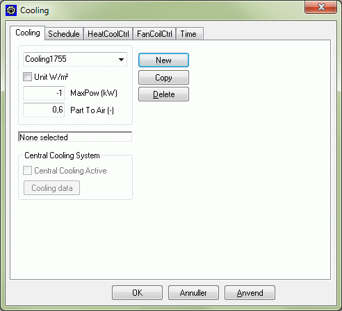

<link rel="stylesheet" href="../style.css">

# Cooling, System

Modellen simulerer en termostatstyret køleradiator, fx et køleloft eller en anden køleflade placeret inde i den aktuelle termiske zone. Modellen svarer til den, der er beskrevet under opvarmning. Funktionen er dog her at køle rummet, dvs. ved tendens til overtemperatur i den termiske zone, at regulere køleydelsen således, at temperaturen så vidt muligt holdes på det valgte kølesetpunkt.

<figure id="center_img">

<figcaption>Dialog for definition af køleradiator.</figcaption>
</figure>

*Unit:* Ved at sætte et "hak" ud for *Unit* er det muligt at skifte fra angivelse af den termiske zones absolutte installerede effekt til den installerede effekt pr. m2 gulvareal. Dette er især nyttigt hvis det samme varmesystem ønskes benyttet (kopieret) i flere termiske zoner med forskelligt varmetab.

*Max Power* er den maksimale køleeffekt, der kan 'afgives' fra kølefladen. Køleeffekten skal indlæses som et negativt tal. Den til rådighed værende køleydelse reguleres efter udetemperaturen, således at den (numerisk) maksimale værdi opnås ved den dimensionerende udetemperatur om sommeren.

*Part To Air* er den andel af køleydelsen, der regnes afgivet ved konvektion til rumluften. Den resterende del tilføres ved stråling til overfladen af konstruktionerne i zonens flader.

Central Cooling System angiver at køleeffekten til anlægget kommer fra et centralt system. Et centralt kølesystem kan først aktiveres som kilde til kølesystemet når programmet [PackCalc](https://help.bsim.dk/support/kb/articles/j9b8ZOmn/packcalc-koling) er installeret. PackCalc er udviklet af IPU Teknologiudvikling og kan hentes fra SBi's hjemmeside.

*Cooling data* åbner en dialog som giver mulighed for at indtaste data for et centralt køleanlæg.

I [tidsplanen](https://help.bsim.dk/support/kb/articles/79O3DZ9E/systemer---tidsplan) findes en liste med sammenhørende sæt af reguleringer og tidsangivelser.

Se også:

*   [Faneblad Schedule](https://help.bsim.dk/support/kb/articles/79O3DZ9E/systemer---tidsplan)
*   [Faneblad Time](https://help.bsim.dk/support/kb/articles/VmAOwo9a/tidsangivelse)