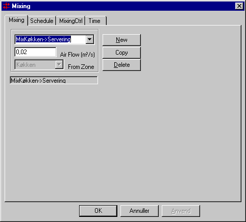

<link rel="stylesheet" href="../style.css">

# Mixing, System

Mixing er defineret som en luftudveksling mellem termiske zoner og rum i modellen som støder op til hinanden (har mindst en flade fælles). Det er dog ikke muligt at mixe <u>fra</u> et rum der er defineret som havende samme temperatur som den termiske zone der ønskes mixet <u>til</u>.

*Air Flow* angiver volumenstrømmen af luft ind i den aktuelle termiske zone fra den zone, som er angivet i *From Zone*.

<figure id="center_img">

<figcaption>Mixing for en termisk zone består af en luftstrøm i m3 pr. sekund og en termisk zone eller et rum, som luften kommer fra.</figcaption>
</figure>

*   *Air Flow* angiver størrelsen af den luftstrøm som overføres ved mixing.

*   *From Zone* viser hvilken termisk zone eller rum luften kommer fra.

**Note:** Enhver ubalance i luftstrømmene til eller fra en termisk zone (skabt af et vilkårligt system som påvirker luftbalancen) vil i tsbi5 automatisk blive balanceret ved infiltration eller exfiltration til udeluften (outdoor) - lige gyldigt om den termiske zone er helt omsluttet af andre termiske zoner eller rum.

**Note:** Det er muligt at vælge mixing fra en fiktiv zone (et rum med samme termiske egenskaber som en egentlig termisk zone) som støder op til den termiske zone som skal modtage luften. Det er dog <u>kun</u> muligt at have en mixing fra hver termiske zone, og den fiktive zone opfattes som værende den samme som den termiske zone den har samme egenskaber som. Derfor vil der <u>kun</u> optræde mixing fra den egentlige termiske zone.

Ved hjælp af [reguleringen](https://help.bsim.dk/support/kb/articles/zWZAEb9p/mixing-regulering) er der mulighed for at kontrollere en ønsket varme- (eller kulde-) overførsel fra en tilstødende zone til den aktuelle zone. Mixing reguleres on/off med en procentdel af luftstrømmen defineret i det tilhørende døgnprofil.

Se også

*   [Faneblad MixingCtrl](https://help.bsim.dk/support/kb/articles/zWZAEb9p/mixing-regulering)
*   [Faneblad Schedule](https://help.bsim.dk/support/kb/articles/79O3DZ9E/systemer---tidsplan)
*   [Faneblad Time](https://help.bsim.dk/support/kb/articles/VmAOwo9a/tidsangivelse)