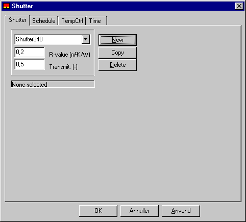

<link rel="stylesheet" href="../style.css">

# Shutter, System

Skodden er primært tænkt som en natskodde, der lukkes for den aktuelle WinDoor, når udetemperaturen er under en vis værdi. Virkningen er, at U-værdien for den aktuelle WinDoor forbedres og at solindfaldet reduceres, evt. til 0.

<figure id="center_img">

<figcaption>Dialog for definition af natskodder.</figcaption>
</figure>

*R*-value eller isolansen er den samlede modstand mod varmetransmission gennem skodden. Det vil sige fra overflade til overflade - uden overgangsinolanser. U-værdien for den samlede konstruktion beregnes af:

$$ U_{tot} = \frac{1}{\frac{1}{U_{windoor}} + h_s} \tag{1} $$

*Utot*                      er transmissionskoefficienten for WinDoor + skodde (W/m² K),   
*UWinDoor*            er U-værdien for WinDoor (inkl. overgangsisolanser) (W/m² K),   
*hs*                         er isolansen for skodden (ekskl. overgangsisolanser) (W/m² K),

 

Da U-værdien for en WinDoor er defineret inklusive indvendig og udvendig overgangsisolans, bør eventuelle ændringer af disse indregnes i den samlede isolans. Ligeledes må en eventuel isolans af luftmellemrum mellem ruden og skodden indregnes i isolansen for skodden.

*Transmit.* angiver transmittansen for solstråling (varme) gennem skodden. Angivelse af en transmittans forskellig fra 0 giver mulighed for at definere fx forsatsruder, som benyttes en del af året, eller mere avancerede skoddesystemer med en isoleringstype, der er transparent eller translucent.

[Tidsplanen](https://help.bsim.dk/support/kb/articles/79O3DZ9E/systemer---schedule) for skodde består af en '[skodderegulering](https://help.bsim.dk/support/kb/articles/Rm8JXX94/skodderegulering)' og en [tidsangivelse](https://help.bsim.dk/support/kb/articles/VmAOwo9a/tidsangivelse). I reguleringen defineres ved hvilken udetemperatur, skodden skal lukkes, samt en solfaktor for WinDoor med lukket skodde.

Se også

*   Faneblad [ShutterCtrl](https://help.bsim.dk/support/kb/articles/Rm8JXX94/skodderegulering)
*   Faneblad [Schedule](https://help.bsim.dk/support/kb/articles/79O3DZ9E/systemer---schedule)
*   Faneblad [Time](https://help.bsim.dk/support/kb/articles/VmAOwo9a/tidsangivelse)