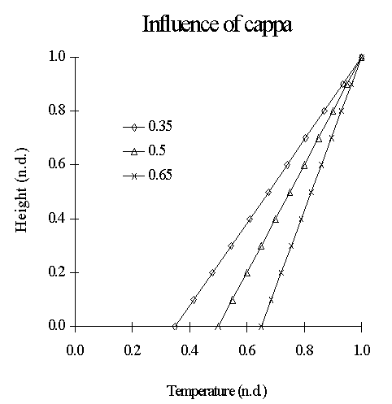

<link rel="stylesheet" href="../style.css">

# Kappa-modellen - modelbeskrivelse
Når temperaturen af udsugningsluften fra et rum er kendt (fx ved hjælp af en varmebalance baseret på fuldstændig opblanding af rumluften), kan den vertikale temperaturfordeling bestemmes tilnærmet ved hjælp af følgende model, når rummets geometri og varmekilder er kendte.

#### **Forudsætninger**

Den vertikale temperaturfordeling afhænger meget af strømningsfeltet. Hvis rumluften er tæt på at være fuldt opblandet, vil der ikke forekomme nogen særlig temperaturgradient, mens en stratificeret strømning som ved fortrængningsventilation vil kunne skabe en betydelig gradient.

I naturligt ventilerede rum, hvor rumhøjden er begrænset (fx under 2,5 m), vil temperaturgradienten normalt være ubetydelig i vintertilfældet, mens en sommertilstand vil kunne skabe en lille gradient. I tilfælde af høje rum vil både vinter- og sommertilstanden kunne give anledning til temperaturgradienter, især når indblæsningsåbningerne er placeret lavt og udsugningsåbningerne højt. En fleretagers bygning med relativt store åbninger i vertikal retning kan have en næsten ensartet temperaturfordeling på hver etage, og samtidig en trinvist stigende vertikal temperatur for bygningen som helhed.

Den følgende metode antager, at der forekommer et stratificeret strømningsfelt. Den antager også, at en eventuel horisontal temperaturgradient kan negligeres.

#### **Beskrivelse af den simple model**

En simplificeret fremgangsmåde anvendes til at bestemme den vertikale temperaturgradient, hvor det faktiske temperaturprofil modelleres med et tilnærmet lineært profil. Hældningen bestemmes fx ud fra kendskab til varmekilderne jævnfør tabel 1.

For lokaler med store rumhøjder og varmekilder placeret i flere niveauer, vil det lineære lodrette temperaturprofil som "Kappa-modellen" beskriver ofte være en ret grov tilnærmelse. Såfremt der for fortrængningsventilerede lokaler afviges væsentligt fra de situationer, hvor κ kan sættes til 0,5, bør valget af κ ske på baggrund af luftstrømningsmæssige betragtninger.

Der gøres opmærksom på, at en brugbar tilnærmelse af temperaturgradientens forløb i nogle tilfælde kun kan opnås ved introduktion af et stykkevist lineært temperaturprofil, hvilket "Kappa-modellen" i sin nuværende form ikke er i stand til.

<figure id="center_img">

<figcaption>Tabel 1. Bestemmelse af tilnærmet vertikal temperaturfordeling i tilfælde af stratificeret strømning. Resultaterne er blandt andet baseret på Ryberg og Bech (1997).</figcaption>
</figure>

Når varmekilderne er kendte, kan κ findes. Temperaturen ved gulvet og det vertikale temperaturprofil bestemmes da ved hjælp af:

$$ T_f = T_0 + \kappa (T_R - T_0) \tag{1} $$

hvor

*Tf* er lufttemperatur ved gulvet (°C)  

*T0* er indblæsningstemperatur (°C), se også under afsnit 3  

*TR* er udsugningsluftens temperatur (°C)  

og således

$$ \kappa = \frac{T_f - T_0}{T_R - T_0} \tag{2} $$

Under forudsætning af fuld opblanding, kan *TR* fx findes ved

$$ T_R = T_0 + \frac{\Phi_{konv}}{\rho c_p q_v} \tag{3} $$

hvor

Φkonv. er konvektiv varmebelastning (W)  

r er densitet (kg/m3)  

cP er varmekapacitet (J/kg °C)  

qv er luftmængde (m3/s)  

På dimensionsløs form fås udtrykket

$$ T^* = y^* (1-\kappa)+\kappa \tag{4} $$

hvor *y** er den dimensionsløse højde, og *T** er den dimensionsløse temperatur

$$ y^* = \frac{y}{H} \tag{5} $$

$$ T^* = \frac{T - T_0}{T_R - T_0} \tag{6} $$

Ved gulvet er *y** = 0 og *T** = κ . Ved loftet er *y** = 1 og *T** = 1.

Når κ = 0,5 svarer denne metode til "50% - reglen", en tommelfingerregel der ofte anvendes ved dimensionering af fortrængningsventilation (Skistad, 1994). Ved fuldt opblandet rumluft fås κ = 1,0.

Skrives udtrykket direkte, fås den vertikale temperatur som funktion af højden

$$ T = T_0 + (T_R - T_0) \left( \frac{y}{H} (1-\kappa)+\kappa \right) \tag{7} $$

Figur 1 viser en dimensionsløs afbildning af det vertikale temperaturprofil for de tre tilfælde i tabel 1.

I praksis vil man skulle skønne k efter et kendskab til varmekilderne i et givet rum, hvor der vil forekomme en stratificeret strømning jævnfør ovennævnte forudsætning. Hvis man er i besiddelse af målinger eller erfaringer for temperaturforløbet, anvendes den værdi af κ, som giver den bedste lineære tilnærmelse af det sande temperaturprofil.

En anden mulighed er at "kalibrere" temperaturforløbet iterativt ved hjælp af CFD-simulering. Her anslås først en værdi af κ, hvorved BSim kan beregne den konvektive varmestrøm fra de indvendige overflader. Varmestrømmene anvendes som randbetingelse i CFD-simuleringen, der returnerer det vertikale temperaturforløb, som nu kan anvendes til at korrigere den først anslåede værdi af κ, osv.

<figure id="center_img">

<figcaption>Figur 1. Dimensionsløs vertikal temperaturfordeling ved tre forskellige værdier af k svarende til de tre forskellige slags varmekilder i tabel 1.</figcaption>
</figure>

Se også:

*   [Baggrund](https://help.bsim.dk/support/kb/articles/MQvEaomY/baggrund)
*   [Implementering af modellen](https://help.bsim.dk/support/kb/articles/DmwA6g94/kappa-modellen---implementering-i-tsbi5)
*   [Inddata i SimView](https://help.bsim.dk/support/kb/articles/yW1xGP9B/kappa-modellen-inddata)
*   [Referencer](https://help.bsim.dk/support/kb/articles/gWKDo0mp/kappa-modellen---referencer)
*   [Nomenklatur](https://help.bsim.dk/support/kb/articles/VmAOoa9a/kappa-modellen---nomenklatur)