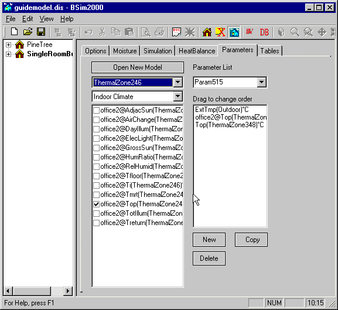

<link rel="stylesheet" href="../style.css">

# tsbi5 - Parameters

### **Timeværdier**

Fanebladet *Parameters* indeholder lister med de [parametre, der er gemt på timebasis under simuleringen](https://help.bsim.dk/support/kb/articles/vW5a6gW4/parametre-i-resultatloggen) for senere analyse.

 De værdier som vises i resultat-loggen er et øjebliksbillede af forholdene i det sidste tidsskridt (ved timens slutning) i hver time, med mindre andet er angivet for den enkelte parameter. 

<figure id="center_img">

<figcaption>Fanebladet Parameters indeholder en liste med gemte parametre, som kan vises på timebasis.</figcaption>
</figure>

I valgmenuen øverst til venstre vælges forskellige grupper af parametre, som vises i listen umiddelbart under. Her kan den enkelte parameter vælges med et 'hak' eller 'check-mærke' i boksen ud for parameteren. Derved optræder de valgte parametre i listen til højre. Parameterlister kan gemmes under et navn. I valgmenuen øverst til højre findes de eksisterende parameterlister og ved tryk på knappen *New*, kan der oprettes en ny.

Der er ingen begrænsning på antal parametre pr. parameterliste - det anbefales dog at holde antallet nede da graferne ellers bliver uoverskuelige. De valgte parametre gemmes når man skifter til et andet faneblad i *tsbi5*. Hvis man derimod skifter fra parameters fanebladet direkte til SimView eller *XSun* gemmes parametrene ikke.

Knappen *Open New Model* giver mulighed for at vælge resultater fra andre modeller som kan vises i samme tabel eller grafiske repræsentation. Det er <u>nødvendigt</u> at de modeller som skal sammenlignes fysisk er placeret i samme mappe på pc'en. Der kan skelnes imellem de forskellige modeller ved et foranstillet modelnavn@ ved den enkelte parameter (se parameterlisten til venstre i ovenstående figur).

 
<em> I nogle tilfælde viser BSim en fejlmeddelelse som "The selected file must be located in the folder 'x:\xxxxxxxxxxxx' like the current log". Det betyder at BSim opfatter at de to resultatfiler er placeret i forskellige fil-mapper, og dermed <u> ikke </u> kan sammenlignes. Fænomenet optræder på visse typer af netværk. Det er muligt at omgå problemet ved at sørge for at alle fil-mapper i den aktuelle sti er navngivet med højest 8 karakterer og uden mellemrum eller specialtegn. </em>

 

<em> Hvis filnavnet er for langt er det ikke muligt at sammenligne resultater fra forskellige modeller på fanebladet Tables. </em> 

Resultatfiler fra simulering med [SimPv](https://help.bsim.dk/support/kb/articles/pWrnRaWn/simpv) (udvidelse til BSim) kan også integreres i den almindelige resultatvisning på denne måde. Disse resultatfiler navngives som modelnavn#pv. Resultaterne optræder som to parametre (*qPvGross* og *qPvNet*) på de konstruktioner som indeholder solceller. Der <u>skal</u> således være "hak" ud for *Constructions* på [*Options*](https://help.bsim.dk/support/kb/articles/nmDBKR9y/tsbi5---options) fanebladet for at få vist disse parametre.

Er der gennemført en simulering der strækker sig over flere år vil resultaterne for de enkelte år optræde som selvstændige resultatfiler. Disse resultatfiler er navngivet med modelnavnet efterfulgt af "#yy", hvor yy er de sidste to cifre i årstallet. I *tsbi5* viser automatisk det første år i en serie. Efterfølgende år skal åbnes som selvstændige resultatfiler.

Parametre fra andre modeller fjernes automatisk når fanebladet forlades, hvis parametre fra modellen ikke optræder i en parameterliste.

En eksisterende parameterliste kan let rettes ved at dobbelt-klikke på en indgang i listen (vinduet til højre i tsbi5). Herved skifter fokus til den aktuelle parameter i den globale parameterliste (vinduet til venstre i tsbi5) og 'check-mærket' kan fjernes.

Hvis data for *Construction* er valgt gemt på [*Options* fanebladet](https://help.bsim.dk/support/kb/articles/nmDBKR9y/tsbi5---options), vil der optræde grupper med data for de beregnede værdier på overfladerne af og i knudepunkterne for konstruktionerne. Fx. angiver parametrene T2 til T6 på figuren de beregnede temperaturer i knudepunkterne ind gennem konstruktionen. På overfladerne af konstruktionen er beregnet temperaturerne SurfTmp1 og SurfTmp2 for henholdsvis den indvendige og den udvendige overflade. Data for den relative fugtighed i konstruktionerne vil <u>kun</u> optræde hvis der benyttes en database med fugttekniske data for materialerne.

Under parameterlisten findes tre knapper: *New, Delete* og *Copy*, som benyttes til at oprette en ny tom parameterliste, slette en parameterliste og oprette en kopi af den parameterliste som vises.

Se også:

*   [Faneblad *Options*](https://help.bsim.dk/support/kb/articles/nmDBKR9y/tsbi5---options)
*   [Faneblad *Moisture*](https://help.bsim.dk/support/kb/articles/XQYdbPmP/tsbi5---fugt)
*   [Faneblad *Simulation*](https://help.bsim.dk/support/kb/articles/DQ2xjyWV/tsbi5---simulation)
*   [Faneblad *HeatBalance*](https://help.bsim.dk/support/kb/articles/wmjn57mV/tsbi5---heatbalance)
*   [Faneblad *Parametres*](https://help.bsim.dk/support/kb/articles/nmDBAR9y/tsbi5---parameters)
*   [Faneblad *Tables*](https://help.bsim.dk/support/kb/articles/BWzdLlQE/tsbi5---tables)