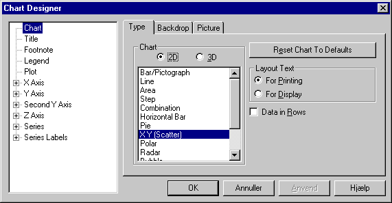
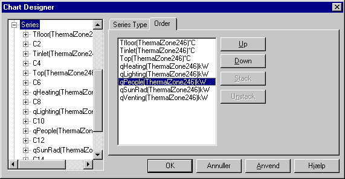
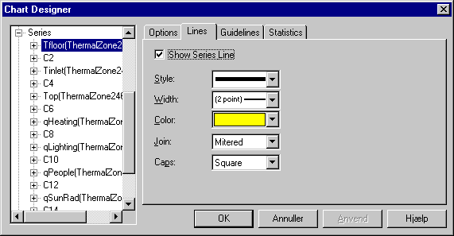

<link rel="stylesheet" href="../style.css">

# Chart Designer

I *Chart Designer* dialogen er det muligt at ændre den generelle layout for den aktuelle grafik. Det anbefales dog at anvende Wizard, hvis udseendet fx ønskes ændret fra stavdiagram til lagkage. Til hver indgang (punkt) i venstre side af vinduet hører en række faneblade (til højre), som giver mulighed for ændring af data relateret til punktet.

<figure id="center_img">

<figcaption>Punktet Chart Designer.</figcaption>
</figure>

I **Chart** er det muligt at ændre grafens type og baggrunden for hele det grafiske afbildningsområde, fx kan der fra fanen *Backdrop* tillægges en farve eller en gradueret farve til baggrunden, eller der kan vælges et billede fra *Picture* som baggrund.

På fanebladet *Type* under *Chart* findes knappen *Reset Chart To Defaults*. Et tryk på denne knap bringer indstillingerne for visningen tilbage til den standard, som er defineret for grafikken.

I **Title** kan grafens overskrift ændres: Placering på grafen (*Location*), tekstbaggrunden (*Backdrop*), baggrundsbillede (*Picture*), skriftretning og justering (*Layout*), overskrift (*Text*) og skrifttype (*Font*).

<figure id="center_img">

<figcaption>Punktet overskrift (Title).</figcaption>
</figure>

I **Legend** kan oplysninger om grafens signaturforklaring ændres. Denne dialog har i hovedsagen samme opbygning som dialogen for overskriften (*Title*).

I **Plot** kan baggrunden for selve grafen ændres. Mulighederne er i øvrigt de samme som nævnt for *Chart*.

Indgangene **X Axis, Y Axis, second Y Axis** og **Z Axis** giver mulighed for at ændre udseendet af grafens akser. På første faneblad (*Value Scale*) er det muligt at ændre grafens tegnegrænser (*Scale*), antallet af underinddelinger (*Divisions*), placeringen og størrelsen af stregerne for underinddeling af akserne (*Ticks*) og hvor den anden akse skærer den aktuelle (fx hvor Y-aksen skærer X-aksen) (*Intersection*).

<figure id="center_img">

<figcaption>Ændring af aksernes udseende (her X-aksen) udseende Maks/min, markeringer og skæring med anden akse.</figcaption>
</figure>

På *Scale Type* er det muligt at vælge aksens type. Der kan vælges mellem lineær, logaritmisk og procentuel akse. For en logaritmisk akse er det muligt at vælge grundtallet for logaritmen (fx 10 eller e). For den procentuelle akse kan der vælges mellem en procentvis afbildning i forhold til en række forskellige opsummeringer (se figur).

<figure id="center_img">

<figcaption>Ændring af aksetype.</figcaption>
</figure>

Stregtyperne for aksen (type (*Style*), tykkelse (*Width*) og farve (*Color*)), kan ændres på fanen *Pens*. Akserne er opdelt i tre grupper: Selve aksen (*Axis Pen*), underinddeling af akseinddelinger (*Minor Grid Pen*) og aksens hovedinddeling (*Major Grid Pen*).

<figure id="center_img">

<figcaption>Ændring af aksens stregtype (her X-aksen).</figcaption>
</figure>

Indgangen **Series** giver mulighed for ændring af den enkelte dataseries udseende. I selve hovedindgangen Series kan der for visse graftyper ændres på graftypen for en enkelt serie, og der kan byttes om på rækkefølgen af de enkelte serier.

<figure id="center_img">

<figcaption>Andet faneblad i Series giver mulighed for at ændre på rækkefølgen af de viste data.</figcaption>
</figure>

Ved at klikke på navnet for den enkelte serie (se figur) fremkommer der 4 faneblade (*Options, Lines, Guidelines og Statistics*) hvor forskellige indstillinger for den enkelte serie kan ændres.

<figure id="center_img">

<figcaption>Punktet Options for en dataserie.</figcaption>
</figure>

I *Options* kan serien skjules (*Hide Series*) eller slettes fra data (*Exclude Series*). Det er også muligt at plotte en serie på den sekundære Y-akse og dermed forbedre opløsningen på enkelte serier, fx ved at plotte på en sekundær Y-akse, der kun viser værdier mellem 500 og 1500 kWh (virker <u>kun</u> for stavdiagrammer som fx i varmebalancen). Se formatering af sekundær Y-akse.

<figure id="center_img">

<figcaption>Dialog for ændring af udseendet for en serie.</figcaption>
</figure>

Udseendet af den enkelte serie kan ændres via fanen *Lines*. Linietypen (streger, prikker eller streger og prikker) ændres ved valg fra punktet *Style*, tykkelsen (*Width*) angives i punkter (*points*), og farven vælges fra punktet *Color*. Det er muligt at vælge 8 forskellige stregtyper for lettere at kunne skelne mellem de forskellige parametre, når grafikken udskrives på en sort-hvid printer.

På fanebladet *Statistics* kan vælges statistiske oplysninger, der skal vises for den enkelte serie i grafen. Ved valg af et punkt i dialogen *Show* tegnes en eller flere vandrette linier for markering af værdierne på Y-aksen. Mulighederne inden for afbildningens længde (X-aksen) er: Minimumsværdien (*Minimium*), maksimumsværdien (*Maximum*), middelværdien (*Mean*), standardafvigelsen (*Standard Derivation*) og en lineær tilnærmelse til de afsatte punkter (*Regression*). Det er desuden muligt at vælge stregtypen og farven for den enkelte statistiske variabel.

<figure id="center_img">

<figcaption>Dialog for ændring af grafisk visning af statistiske informationer om en serie.</figcaption>
</figure>

Hvis man skulle fortryde ændringerne af grafens udseende, er det muligt at vende tilbage til udgangspunktet ved tryk på *Reset Chart To Defaults* på første faneblad i *Chart Designer*.

Se også:

*   [Wizard](https://help.bsim.dk/support/kb/articles/1Qpn73WE/chart-wizard)
