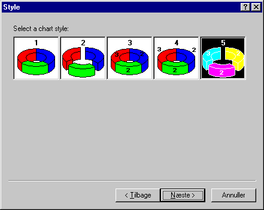
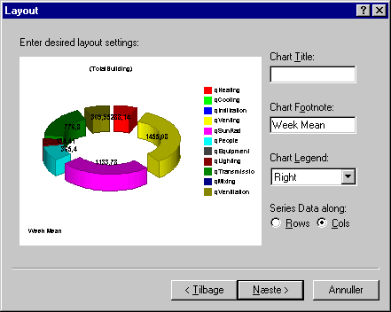

<link rel="stylesheet" href="../style.css">

# Chart Wizard

Udnyttelse af de indbyggede skabeloner (*Wizard*) til ændring af grafikkens udseende er en hurtig og fejlsikker metode. I første dialog kan der vælges mellem 2D- og 3D-grafik.

<figure id="center_img">

<figcaption>Dialog (Chart Wizard | Gallery) for valg mellem forskellige 2D-visninger af resultater.</figcaption>
</figure>

<figure id="center_img">

<figcaption>Dialog for valg mellem forskellige 3D-visninger af resultater.</figcaption>
</figure>

Ved at vælge en ny visning af resultaterne fremkommer en dialog med forskellige valgmuligheder.

<figure id="center_img">

<figcaption>Dialog (Chart Wizard | Style) for detailopbygning af den valgte visning.</figcaption>
</figure>

Til den valgte graftype hører normalt forskellige valgmuligheder for præsentationen.

<figure id="center_img">

<figcaption>Dialog (Chart Wizard | Layout) med eksempel på den endelige grafiske repræsentation af data inkl. mulighed for tildeling af ny titel (Chart Title), fodnote (Chart Footnote) og placering af signaturforklaring (Chart Legend).</figcaption>
</figure>

På det sidste faneblad vises et eksempel på præsentationen af data inden valget effektueres ved tryk på knappen *Udfør*.

Hvis man skulle fortryde ændringerne af grafens udseende, er det muligt at vende tilbage til udgangspunktet ved tryk på [*Reset Chart To Defaults*](https://help.bsim.dk/support/kb/articles/rm0x5YmX/chart-designer) på første faneblad i *Chart Designer*.

Se også:

*   [Chart Designer](https://help.bsim.dk/support/kb/articles/rm0x5YmX/chart-designer)

 
