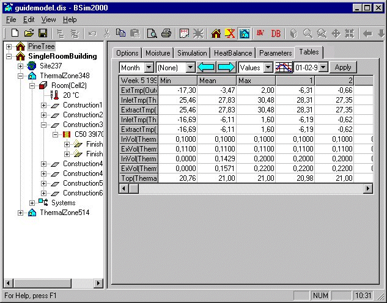
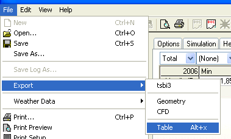

<link rel="stylesheet" href="../style.css">

# tsbi5 - Tables

De valgte parametre (*Parameters*) bruges som timeværdier til tabelvisning og grafisk visning ved tryk på fanebladet *Tables*.

<figure id="center_img">

<figcaption>Visning af timeværdier i tabelform.</figcaption>
</figure>

Tabelvisningen af timeværdierne har en række valgmenuer og trykknapper øverst. Funktionen af knapperne er (fra venstre):

*   Valg af opløsning (bredde) for visningen (dag, uge, måned eller periode).

*   Valg af periode for visningen, fx arbejdstiden. Med dette valg, sammen med visningsformen, er det muligt at analysere hvor mange timer en given parameter ligger over hhv under en vilkårlig grænse. Data i tabellen opdeles i 100 intervaller, og det er således ikke altid muligt at finde eksakt den grænse som der ønskes. I dette tilfælde kan det være nødvendigt at interpolere mellem to værdier i tabellen.

*   Skift til forrige periode for visningen (perioden ses i øverste venstre celle).

*   Skift til næste periode for visningen.

*   Valg af visningsform for parameterlisten (værdier/procent under/timer under/procent over/timer over).

*   Skift til [grafisk præsentation](https://help.bsim.dk/support/kb/articles/49Ed7jQ7/tsbi5-graf) af resultaterne.

*   Valg af tidspunkt fra kalenderfunktionen (dato, uge eller måned) for visningen (afhænger af den valgte opløsning).

*   Manuel opdatering (*Apply*) af indholdet i tabellen efter der er skiftet dato. Knappen er kun aktiv hvis check-mærket *Dynamic update of Tables* *er fjernet under Tables* på [Options fanebladet](https://help.bsim.dk/support/kb/articles/nmDBKR9y/tsbi5---options). Normalt skifter den grafiske visning automatisk ved valg af et nyt tidspunkt for visningen.

Timeværdier for den valgte periode (opløsning) kan eksporteres til en *.txt fil for behandling i andre programmer, fx regneark. Klik *File* + *Export* + *Table*, eller Alt+x med *tables* fanen under tsbi5 aktiveret for at eksporter parametrene i den aktuelle tabel som timeværdier i perioden angivet i den første valgmenu over tabellen. Handlingen åbner en dialog for valg af placering for *.txt fil med timedata.

<figure id="center_img">

<figcaption>Eksport af timeværdier for de valgte parametre til *.txt fil i den angivne periodelængde, her 'Total'.</figcaption>
</figure>

Se også:

*   [Faneblad *Options*](https://help.bsim.dk/support/kb/articles/nmDBKR9y/tsbi5---options)
*   [Faneblad *Moisture*](https://help.bsim.dk/support/kb/articles/XQYdbPmP/tsbi5---fugt)
*   [Faneblad *Simulation*](https://help.bsim.dk/support/kb/articles/DQ2xjyWV/tsbi5---simulation)
*   [Faneblad *HeatBalance*](https://help.bsim.dk/support/kb/articles/wmjn57mV/tsbi5---heatbalance)
*   [Faneblad *Parametres*](https://help.bsim.dk/support/kb/articles/nmDBAR9y/tsbi5---parameters)
*   [Faneblad *Tables*](https://help.bsim.dk/support/kb/articles/BWzdLlQE/tsbi5---tables)