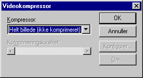
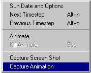

<link rel="stylesheet" href="../style.css">

# XSun video

Det er muligt at gemme video-klip fra en XSun animation af filtypen ".avi" som bl.a. kan afspilles af *Microsoft Media Player* eller *Real Player*.

<figure id="center_img">

<figcaption>Dialog for navngivning af video filer med XSun animation.</figcaption>
</figure>

Herefter åbnes en dialog for valg af komprimeringsmetode for video-filen.

<figure id="center_img">

<figcaption>Dialog for valg af kompression af video-fil.</figcaption>
</figure>

Der er en række kompressionsformater til rådighed.

<figure id="center_img">

<figcaption>Valgmenu for definition af komprimerings-rutine til video-filer.</figcaption>
</figure>

**NB:** I visse versioner af Windows 98, Windows 2000 og Windows ME er denne valgmenu ikke aktiv ved brug af musen, og umiddelbart er det kun muligt, at vælge *Helt billede* (*ikke komprimeret*). Det er dog muligt at vælge en komprimering ved, at aktivere valgmenuen (klik med musen) og bruge pil-tasterne på tastaturet til at flytte mellem de forskellige komprimeringsformater.

Hvis videoklippet ønskes overført til en anden computer, er det nødvendigt at den benyttede komprimeringsmetode et tilgængelig på begge maskiner. De mest almindeligt udbredte komprimeringsmetoder er *Microsoft RLE* og *Microsoft Video 1*.

Når et komprimeringsformat er valgt, er det muligt at ændre på graden af komprimeringen (komprimeringskvaliteten) ved at justere på det vandrette rullepanel nederst i dialogen.

Herefter kan optagelsen startes fra XSun-menuen ([højre-klik menu](https://help.bsim.dk/support/kb/articles/j9b8Vwmn/xsun-menu) eller [programmenu](https://help.bsim.dk/support/kb/articles/nmDBw09y/xsun)). Optagelsen af levende billeder startes fra XSun-menuen via indgangen *Capture Animation*.

<figure id="center_img">

<figcaption>XSun menuen for start af optagelse af video-klip.</figcaption>
</figure>

Hvis der allerede er foretaget en optagelse af en video, springes der direkte fra *Capture Animation* til optagelse af yderligere videosekvenser i slutningen af den eksisterende video-fil.

 
<b> Note: </b> <em> Optagelse og afspilning af videosekvenser sker i den størrelse vinduet havde under optagelsen fra BSim. Derfor bør man normalt bør ikke optage videosekvenser fra vinduer i fuld skærmstørrelse da der tilføjes yderligere top og bund under afspilningen.</em> 

