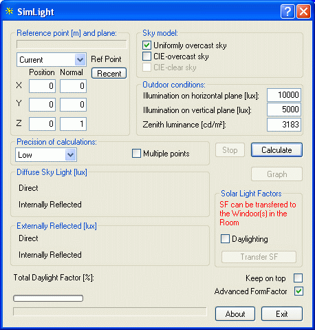

<link rel="stylesheet" href="../style.css">

# Dagslysberegning i et punkt

Referencepunktet (markeret ved et kryds i plan og opstalter i SimView) overføres automatisk til SimLight. Referencepunktets position i bygningen kan ændres ved indtastning i dialogboksen eller ved at dobbeltklikke eller shift-klikke i et af vinduerne. Referenceplanets orientering angives som en normal til planen, og kan ændres i dialogboksen. Hvis der tidligere har været defineret et referencepunkt for det aktuelle rum vises det under recent pos. Klik på recent for at anvende dette punkt igen.

Det er muligt at vælge mellem forskellige referencepunkter som er defineret inden for de aktuelle rum. Der kan oprettes flere referencepunkter ved at højre-klikke på et rum og vælge indgangen [*Ref. points*](https://help.bsim.dk/support/kb/articles/79O3J49E/referencepunkt).

Efter hvert dobbeltklik i et af vinduerne startes en ny beregning for det netop valgte punkt. Ved klik på *Calculate* eller en af de tre beregningsnøjagtigheder (Low, Medium, High) starter beregning for det aktuelt valgte beregningspunkt.

Ved afkrydsning i boksen *Keep on top* vil dialogen forblive forrest på skærmen og referencepunktets placering kan ændres ved, at dobbelt-klikke i plan og opstalter. Der gennemføres automatisk en ny beregning af dagslysfaktorerne for hver ny placering af referencepunktet.

<figure id="center_img">

<figcaption>Dialog for dagslysberegningsprogrammet SimLight.</figcaption>
</figure>

Resultaterne, der vises nederst i dialogboksen, omfatter mængden af direkte lys, mængden af eksternt reflekteret lys, mængden af internt reflekteret lys (alle i lux) samt den samlede dagslysfaktor i referencepunktet (%).

Programmet beregner desuden sollysfaktorerne ([SF1, SF2 og SF3](https://help.bsim.dk/support/kb/articles/49EdwkQ7/sollysfaktorer-for-windoors)) for rummets WinDoor og de kan overføres automatisk til alle WinDoor i det rum der er regnet på ved tryk på *Transfer SF* knappen. Samtidig gemmes referencepunktet for det aktuelle rum. Det er således muligt at beregne, gemme referencepunktet og overføre sollysfaktorerne for alle rum i modellen, et rum ad gangen. De overførte sollysfaktorer kan ses i [*Windoor Property*](https://help.bsim.dk/support/kb/articles/rQV5MLm6/windoor-property) dialogen når der højre-klikkes rummets WinDoor i træ-strukturen.

*   Ved afkrydsning i feltet *Daylighting* under *Transfer SF* overføres et sekundært sæt sollysfaktorer for det valget sekundært referencepunkt til senere brug ved regulering af solafskærmning.

Ved markering i *Keep on top* er det muligt at bevare dialogen forrest på skærmen. Derved er det muligt at flytte referencepunktet (træk eller dobbelt-klik i planen eller opstalterne) og automatisk få gennemført en beregning af dagslysforholdene i det nye referencepunkt.

*Advanced FormFactor* giver mulighed for at vælge en mere [avanceret](https://help.bsim.dk/support/kb/articles/A93zbqQ0/litteratur) algoritme for beregning af vinkelstrålingstallet. Dette kan især være nyttigt hvis resultaterne med den [almindelige](https://help.bsim.dk/support/kb/articles/A93zbqQ0/litteratur) algoritme giver utroværdige resultater.

Beregningstiden øges i takt med, at beregningsnøjagtigheden øges. Foreløbige prøvekørsler med programmet antyder, at fejlen på beregningerne i almindelige tilfælde (simple, kasseformede rum) er <10 %, < 5 % og < 2 % for de tre beregningsnøjagtigheder. Fejlen på resultaterne er størst på den inter-reflekterede lysmængde og mindst på mængden af det direkte dagslys. Ved valg af referencepunkter der ligger meget tæt på en flade (< 5 cm afstand), bør man vælge høj præcision. Beregningstiden øges omtrent med en faktor to, hver gang beregningsnøjagtigheden øges.

Ved klik i [*Calculation for multiple points*](https://help.bsim.dk/support/kb/articles/L9nrPG9Z/simlight---dagslysberegning-i-et-plan) åbnes en dialog til definition af en plan hvori der skal foretages en beregning af dagslysforholdene.

Nederst til venstre i dialogen ses tre informationsfelter:

*   *Diffuce Sky Light (lux)*: Belysningsstyrken i referencepunktet fra diffus himmelstråling, henholdsvis det direkte bidrag og det interreflekterede bidrag.

*   *Externally Reflected (lux)*: Belysningsstyrken i referencepunktet fra eksternt reflekteret lys fra jordoverfladen, henholdsvis det direkte bidrag og det interreflekterede bidrag.

*   *Total Daylight Factor (%)*: Angiver den totale dagslysfaktor som er beregnet for den aktuelle placering af referencepunktet (vist som et lilla kryds i den grafiske visning).

  

Se også:

*   [Dagslysberegning i et plan](https://help.bsim.dk/support/kb/articles/L9nrPG9Z/simlight---dagslysberegning-i-et-plan)
