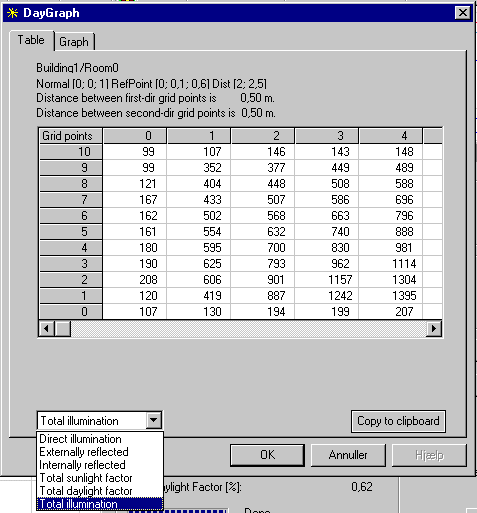

<link rel="stylesheet" href="../style.css">

# SimLight - Dagslysberegning i et plan

Det er muligt at beregne dagslysindfaldet på et plan. Ved klik på *Calculate illumination* *on plane* fremkommer en dialogboks, hvori koordinaterne for et centrum i beregningsplanet (origo for planet) og planets udstrækning i to retninger skal indtastes. Der skal benyttes et højreskruet koordinatsystem, dvs. at drejningsvinklen mellem beregningsplanets 1. og 2. retning skal være større end 0° og mindre end 180°. Endvidere skal beregningsnettets maskestørrelse i planets to retninger angives. Programmet er indrettet således, at beregningsplanets og referenceplanets orienteringer er uafhængige af hinanden. Beregningsplanets normal udregnes på grundlag af de valgte hovedretninger, mens referenceplanets normal er valgt i hoveddialogboksen. Dette gør det muligt på én gang at beregne fx lysindfaldet på et antal vandrette referenceplaner i forskellige højder.

<figure id="center_img">

<figcaption>Definition af beregningsplan i rummet (Calculate plane specification).</figcaption>
</figure>

Efter godkendelse af plankoordinater (centrum og udstrækning i to retninger) og maskestørrelse ved klik på knappen *OK* (returnerer til hoveddialogen), vil klik på *Calculate* eller en af de tre beregningsnøjagtigheder starte beregningen for punkterne i beregningsplanen. Efter endt beregning aktiveres knappen *Daylight graph*. Ved tryk på knappen fremkommer et vindue, hvori vises lysfordelingskurver, samt en tabel med de punktspecifikke resultater fra beregningen. Der kan vælges resultater for direkte dagslys, eksternt hhv. internt reflekteret lys, samlet lysindfald (alle i lux) samt den samlede dagslysfaktor i referencepunkterne (i %). Lysfordelingskurverne optegnes vha. lineær interpolation, hvorfor der for beregninger på grovmaskede net kan forekomme synlige tangentielle diskontinuiteter i grænseovergangene.

Resultaterne kan vises individuelt som grafik eller som tabeller for de følgende beregnede dagslysbidrag: *Direct illumination, Externally reflected, Internally reflected, Total sunlight factor, Total daylight factor* and *Total illuminantion.* Det ønskede bidrag vælges i valg-menuen nederst til venstre i dialogen

<figure id="center_img">

<figcaption>Dagslysfaktor beregnet med SimLight og vist som grafik.</figcaption>
</figure>

<figure id="center_img">

<figcaption>Dagslysfaktor beregnet med SimLight og vist som tabel.</figcaption>
</figure>

*Copy to clipboard* danner en kopi af den aktuelle graf eller tabel i pc'ens hukommelse, som derefter kan indsættes i et andet Windows-baseret program, fx et tekstbehandlingsprogram eller et regnearksprogram.

**NB:** *Nyere versioner af Microsoft Office-programmer understøtter ikke denne måde at kopiere grafik. Det er derfor nødvendigt først at indsætte den kopierede grafik ind i et tegneprogram, fx Paint, og derefter at kopiere grafikken herfra og ind i Office-programmet.*

Diverse forudsætninger for beregningerne:

*   Der medregnes kun bidrag fra de døre / vinduer, der findes i det valgte rum,

*   Rummet skal være konvekst (der tages ikke højde for indadvendte hjørner),

*   Eksterne skyggegivere inkluderes ikke i beregningerne. Kun skygge fra murhullets sider,

*   Såfremt begrænsningsfladerne er opbygget af konstruktioner fra databasen, antages vinduet at være centreret i midten af konstruktionens plan,

*   Alle indvendige overflader har reflektansen 40 %,

*   Udendørs terræn har reflektansen 10 %.

 

Se også:

*   [Dagslysberegning i et punkt](https://help.bsim.dk/support/kb/articles/DQ2xz6WV/dagslysberegning-i-et-punkt)

