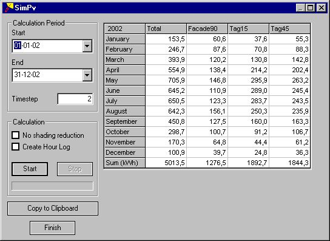

<link rel="stylesheet" href="../style.css">

# SimPV

SimPv er et udvidelsesmodul til BSim for simpel beregning af den elektriske ydelse fra et bygningsintegreret solcelleanlæg.

SimPv er implementeret som en integreret del af XSun, og kan kun kaldes hvis der er opnået licens til brug af modulet.

Arealer med solceller [indsættes i modellen](https://help.bsim.dk/support/kb/articles/E9LwrZQw/inds-tte-solceller-i-modellen) lige som WinDoors.

<figure id="center_img">

<figcaption>Beregning af ydelsen fra et bygningsintegreret solcelleanlæg summeres op gennem beregningsperiodens måneder individuelt for hver konstruktion som indeholder solceller.</figcaption>
</figure>

**Calculation Period**

*   *Start* angiver første dag i beregningsperioden.

*   *End* angiver sidste dag i beregningsperioden.

*   *Timestep* angiver antallet af tidsskridt i hver time af beregningsperioden. Klimadata er givet som konstante værdier for hver hele time, og det er alene den skyggede andel af solcellepanelerne der varierer fra tidsskridt til tidsskridt.

 

**Calculation**

*   *Start* starter beregningen af solceller i modellen.

*   *Stop* afbryder beregningen inden afslutning.

*   *No shading reduction* giver mulighed for at gennemføre en beregning af ydelsen fra modellens solceller hvis der ikke havde været slagskygger på panelerne. Forskellen mellem ydelse med og uden skygger udtrykker solcellernes *performance ratio*.

*   *Create Hour Log* giver mulighed for at gemme beregningsresultaterne fra *SimPv* i en resultatfil (*modelnavn#pv*) som kan hentes ind i den almindelige resultatbehandling i *tsbi5* med *Open New Model* fra [*Parametres* ](https://help.bsim.dk/support/kb/articles/nmDBAR9y/tsbi5---parameters)fanebladet.

*   Nederst vises løbende hvor lang beregningen er kommet.

 

**Note:** Hvis der ikke er tilknyttet et materiale til de arealer i modellen som er med solceller, benyttes data for almindelige polykrystallinske solceller (systemeffektivitet 10 % og ingen proportional reduktion af ydelsen ved delskygger).

*Copy to Clipboard* funktionen lagrer en kopi af indholdet i tabellen i pc'ens arbejdshukommelse. Kopien kan hentes ind i et andet program, fx et regnearksprogram, med funktionen *Indsæt* og viderebehandles her.

*Finish* lukker dialogen.

Tabellens første kolonne viser den samlede ydelse fra alle konstruktioner med solceller i modellen måned for måned. I hver af de følgende kolonner vises ydelsen fra hver konstruktion med solceller. Nederst summeres ydelsen for hele beregningsperioden.
