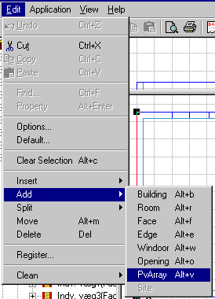
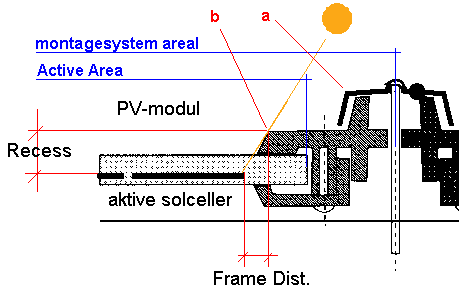
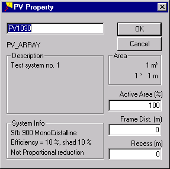

<link rel="stylesheet" href="../style.css">

# Indsætte solceller i modellen

Solceller indsættes i en bygningsmodel lige som *WinDoors* - der vælges en flade som skal indeholde solcellerne samt et lokalt koordinatsystem i fladen, hvor ud fra solcellerne placeres. Funktionen for indsættelse af solceller i den valgte flade findes via menuen *Edit* under punktet *Add* + *PvArray*.

<figure id="center_img">

<figcaption>Funktionen til indsættelse af solceller i en flade findes under menuen "Edit".</figcaption>
</figure>

Det pv-areal som indsættes kan defineres som panelernes arealer med en indbyrdes afstand i de to akseretninger, eller som arealet mellem centerlinien i montagesystemet. Hvilken af de to muligheder der vælges afgøres af geometrien for montagesystemet. Hvis den kant som kaster skygge på de aktive solceller i panelerne som er nærmest kanten ligger inden for panelernes areal (punkt "b" på nedenstående figur), kan planernes areal benyttes. Hvis den skyggegivende kant derimod er placeret uden for panelernes areal (punkt "a" på nedenstående figur), skal centerafstande mellem montagemodulerne benyttes som solcelleareal.

<figure id="center_img">

<figcaption>Definition af lokale skygger og solcellernes areal. Snit gennem solcellemodul og montagesystem.</figcaption>
</figure>

Når arealerne med solceller er placeret på modellen i forhold til ovenstående er det muligt at definere de lokale skygger (fra panelernes rammer eller montagesystemet) som skal tages med i beregningerne. Disse skygger defineres ved en *Frame Dist*(ance) og en *Recess*, lige som det gælder for *WinDoors*.

Med *Frame Dist*. er det muligt at definere afstanden - i solcellernes plan - fra de aktive solceller som ligger nærmest panelets kant og ud til et punkt som først kaster skygge på cellerne (punkt "a" eller "b" i ovenstående figur).

I modsætning til *WinDoors* er det dog muligt at definere en *Recess* som er større end tykkelsen af den underliggende konstruktion. *Recess* bliver behandlet som en frembygning i forhold til solcellernes aktive overflade. Det antages at *Recess* er den samme på alle sider af arealerne med solceller.

Tilsammen beskriver *Frame Dist*. og *Recess* skyggevinklen mellem lokale fremspring og de aktive solceller som er placeret nærmest det enkelte moduls kant. *Frame Dist*. og *Recess* defineres i property dialogen for det enkelte solcelleareal, som vist i nedenstående figur.

*Active Area* er den del af solcellepanelets geometriske areal som er udfyldt med solcellemoduler og bestemmer på denne måde faktoren *Fpv *. *Active Area* benyttes i beregningerne som det areal hvor solens stråler omsættes til elektricitet. Parameteren *Active Area* angiver således hvor stor en del af det samlede areal for en valgt solcelle der udgøres af aktive moduler.

Hvis det geometriske areal er givet på baggrund af indbygningssystemets modulmål på grund af skygger fra punktet "a", er det således andelen af aktive moduler i forhold til arealet mellem montagesystemets symmetrilinier som skal således beregnes for det aktuelle system. Hvis arealet derimod er angivet som de enkelte modulers areal, skal *Active Area* gives som 100 %.

<figure id="center_img">

<figcaption>Egenskaber for pv arealer.</figcaption>
</figure>
