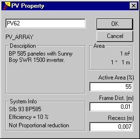
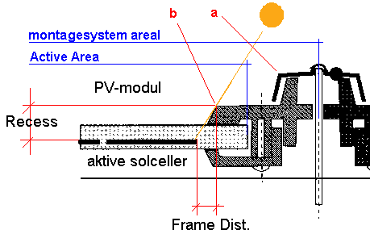

<link rel="stylesheet" href="../style.css">

# PV property

<figure id="center_img">

<figcaption>Dialog til definition af egenskaberne for et areal på bygningsmodellen med solceller.</figcaption>
</figure>

*Description*: Feltet viser den tekstmæssige beskrivelse som er givet i databasen for det valgte solcellesystem.

*System Info*: Feltet summerer solcellesystemets inddata fra databasen. Første linie viser SfB-nummeret, anden linie systemeffektiviteten og tredje linie om der med opstrengning eller solceller er sikret proportional ydelsesreduktion ved delskygger på arealet.

*Area*: Feltet viser solcellearealet samt arealets bredde og højde.

*Active Area*: Definerer den del af arealet som udgøres af aktive solceller. Hvis solcellerne fx. er monteret mellem to lag glas med en vis indbyrdes afstand for at lade sollys trænge igennem til et underliggende rum, skal det areal som reelt udgør solcellerne gives i m².

*Frame Dist.*: Der er muligt at angive en afstand - den samme hele vejen rund om et modul - fra rammen til de solceller som ligger nærmest rammen. Denne oplysning benyttes samme med *Recess* til at beregne slagskygger fra rammen.

*Recess*: Angiver afstanden fra solcellernes overflade til rammens yderste fremkant. Denne størrelse benyttes sammen med *Frame Dist*. til at beregne slagskygger fra indbygningen af solcellerne i en ramme.

*Frame Distance* og *Recess* udtrykker de lokale skygger på solcellerne fra modulernes eller indbygningssystemets profiler. Det er således ikke nødvendigvis profilets forkant i forhold til solcellerne som udgør *Recess*, men dybden af den kant som først kaster skygge på solcellerne nærmest kanten. På nedenstående figur er *Resess* og *Frame Distance* optegnet for et virkeligt indbygningssystem.

<figure id="center_img">

<figcaption>Recess og Frame Dist. beregnes for den del af indbygningssystemet som først kaster skygge på solcellerne nærmest kanten af modulerne.</figcaption>
</figure>

