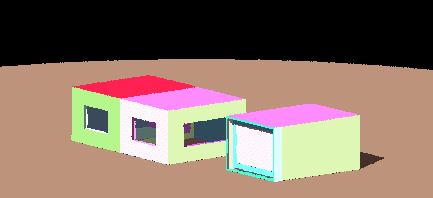

<link rel="stylesheet" href="../style.css">

# Eksport af data til Radiance

Det er muligt at eksportere bygningsmodellen til *Radiance* for visualisering af bygningen og *ray-tracing* beregning af dags- og kunstlysforholdene. Bygningsmodellen eksporteres ved at trykke: *<u>F</u>ile* | *Save as Radiance*.

[Radiance](https://radsite.lbl.gov/radiance/HOME.html) er oprindeligt udviklet til afvikling på UNIX arbejdsstationer, men en modificeret version, [Desktop Radiance](https://radsite.lbl.gov/radiance/desktop.html), er udviklet til brug under Windows NT/9x. Radiance er desuden en del af [Adeline](https://www.ibp.fraunhofer.de/wt/adeline.html)-programpakken beregnet til design af belysningsforhold i bygninger. Adeline-pakken er udviklet under det [Internationale Energi Agenturs (IEA) Solar Heating and Cooling Programme](https://www.iea-shc.org/) Task 12 og kan afvikles på en pc.

Hvis der for en flade er defineret en farve som overfladeegenskab, overføres denne ved eksport til Radiance. Hvis der ikke er defineret en farve, tildeles overfladerne tilfældige farver på en sådan måde, at alle flader får forskellig farve.

<figure id="center_img">

<figcaption>Eksempel på billede genereret med Radiance på baggrund af en model eksporteret fra BSim.</figcaption>
</figure>
