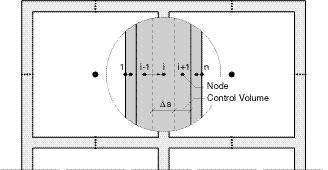

<link rel="stylesheet" href="../style.css">

# Detailed moisture balance

### **A model for hygrothermal simulation of a building and its indoor climate**

Carsten Rode 
Department of Civil Engineering 
Technical University of Denmark 
www.byg.dtu.dk 
June, 2002

This document describes the theoretical basis for dynamic calculation in *BSim* of the humidity conditions in rooms, constructions and furnishing. A building is understood by *BSim* as a number of zones, separated from each other and from outside air, or from possible virtual zones, by constructions of different kinds. Furnishing can be considered as a kind of construction that is exposed to the same zone on both sides, or it could be a construction that is adiabatic and moisture tight on one surface.

A humidity balance is set up separately for each zone. The balance equation expresses that humidity is exchanged by infiltration, ventilation and "mixing" with the surroundings (the outdoor climate and the neighbour zones), that humidity is exchanged by convective transfer to and from constructions, and that moisture is released to the zones as a result of activities in the rooms. The balance equation is dynamic, so it takes into consideration the buffering capacity of the zone air itself. A dynamic calculation of moisture conditions is carried out for every individual construction. The zones on each side of the constructions give the boundary conditions. Only moisture transport by vapour diffusion is considered within the constructions – that is, convective moisture transport and capillary suction are not taken into account. Constructions are considered in the same way as in the thermal calculation of *BSim* (in the following called *BSim-t)* as composite building components consisting of several layers and materials. Every single material layer is again subdivided in one or several control volumes for which the calculations are carried out. A node point in the centre of each control volume represents the conditions in the whole volume. Special configurations of the control volumes may occur at the boundaries of the constructions, and it may be necessary to use a finer grid here than in a pure thermal calculation. This is described in the document on ["Effective Moisture Penetration Depth"](https://help.bsim.dk/support/kb/articles/EWBOLNmr/effective-moisture-penetration-depth-and-automatic-grid-generation-in-bsim2000-for-moisture-calculations).

Calculations of the temperature conditions in the constructions and in the zones are carried out first in each time step before calculating the moisture conditions. The same control volumes are used for the moisture as for the thermal calculations. Compared to the pure thermal calculation some additional properties about the control volumes are needed to deal with the moisture transport. It may also be necessary in a model for moisture calculations to add some new layers or resistances to represent thin membranes that play no essential role in a thermal calculation.

### ***1 The program’s view of a building, grid discretization***

A building consists of an arbitrary number of zones and an arbitrary number of constructions. Besides there must be at least one so-called fictive zone, namely the outdoor air described by data from a file. Every zone is delimited by an arbitrary number of surfaces. An excerpt of a plan of a building with at least two zones is shown in Figure 1.

In the description of the building the zones are represented by one node point for which information is to be known about the temperature θ [°C] and the water vapour content of the air x [kg/kg]. The air in a zone is considered fully mixed. The balance equations that give the conditions of the node point are described in a subsequent section.

The constructions consist of one or more layers of building material for which the thickness and their properties for moisture transport are specified. Thick layers are subdivided into several control volumes to get sufficient accuracy of the calculation. This is done by attempting the thickness of control volumes to be less than 0.05 m – or less for control volumes near the surfaces of the constructions. The user is able to change this default thickness of the control volumes. The creation of control volumes is given by dividing the material layers into volumes of equal thickness. The node point is always located centrally in each control volume. Special conditions apply at the surface layers on each side since there is always an extra node point placed on the surfaces. Thus, a construction will always have at least three node points.

 
<figure id="center_img">

<figcaption>Figure 1. Conceptual plan of a building with two zones with indication of node points and control volumes for the zones of the building (1 node point in each), constructions (several node points in each), and the outdoor air (1 node point).</figcaption>
</figure>

### ***2 The humidity balance for the zone air***

The following influences on the air’s humidity condition are considered:

*   Humidity transfer from adjoining constructions;

*   Contribution of humidity from various sources and activities, e.g. person load, laundry and drying, bathing, cooking, industrial processes, humidification/drying, and other;

*   Penetration of humidity from outdoor air (infiltration, venting);

*   Supply of humid air from ventilation systems

*   Humid air transferred from other zones (mixing).

Humidity balances for zones are made up for the water vapour ratio x [kg/kg] (mass of water vapour per mass of dry air). With the ventilation (mass of air supplied or removed per unit time) follows a certain mass of humidity, humidity is also gained by moisture production, and humidity is exchanged with constructions and furnishing.

The time dependency of changing the moisture content of air is taken into account. When the different contributions of humidity to the air are summed up as ΣG, the equation for the moisture balance reads:   

$$ V \cdot \rho_{air} \frac {x^{new} - x^{old}}{\Delta t} = \sum G \tag{1} $$

### **Humidity transfer from internal and external constructions**

Humidity exchange between the respective construction surfaces and air takes place via the convective mass transfer coefficients which are specified for each surface. The humidity transferred to the air is calculated from Equation 2. 

$$ G_{air, constr} = \sum_{constructions} A_{surf} \frac{p_{surf} - p_{air}}{Z_{surf}} \tag{2} $$

where:

Gair, constr                      is the rate of induced humidity to the air from all surfaces, kg/s   
Asurf                              is the area of a surface, m2   
p                                   is the partial pressure for water vapour ("vapour pressure"), Pa   
Zsurf                              is the resistance for convective humidity transfer, m2sPa/kg

The resistance for convective humidity transfer is usually a small number compared to the resistances for vapour diffusion internally in the materials. The following relations exist between the partial pressure for water vapour and the water vapour ratio of the air:         

$$
x = 0.62198 \frac{p}{P - p} \tag{3}
$$

$$
p = \frac{x}{x + 0.62198} P
$$                        

where:

*P*                                 is the barometric pressure, Pa (101325 Pa at sea level).

### **Humidity supply by air change**

The air supplied to the zone may originate from four different types of Systems: "Mixing" (from other zones), infiltration, venting, and (mechanical) ventilation. The supplied air brings humidity with it and supersedes air from the zone of the same humidity ratio as the zone air. The effect of each of these individual contributions on the air’s humidity balance depends on the volume flow and on the water vapour ratio of the air that is supplied to the zone. In the humidity balance, each term is determined individually, since they are all calculated on the basis of a formula corresponding to Equation 4, allowing for the variations that are determined by schedules for the individual systems. 

$$ G_{air, vent} = n_{vent} V \rho (x_{vent} - x_{air}) \tag{4} $$

where:

Gair, vent               is the humidity supplied by the ventilation air, kg/s   
nvent                    is the air change in the zone by ventilation, s-1   
V                         is the volume of the zone, m3   
ρ                         is the density of the air, kg/m3.

*nvent V* *ρ* expresses the mass exchange of air to the zone. In many cases it can be expressed in another way than by the zone’s volume and air exchange rate. (It should be borne in mind that mass flow into the zone and mass flow out of the zone must be equal. By temperature changes, it means that the inward and outward volume flows are not equal).

### **Humidity supply from systems**

These supplies originate from the following *Systems:* People and moisture load in the zone. The systems’ influences on the humidity of the air vary according to defined schedules, and by various control strategies. For the purpose of this section, the humidity contributions will be gathered in one single quantity that will be called Gair, syst.

### **The zone’s total humidity balance**

Now the total humidity balance can be calculated by gathering the different moisture contributions, *G*, in one equation such that the change in humidity of the air in a zone can be found. This calculation is made over a time step *Δτ*. After separating the yet unknown, or *new* conditions on one side of the equation sign, and known or old conditions on the other, the following results:

$$ x_{air}^{new} \left( 1 + \frac{\Delta t}{V \rho_{air}} \sum_{constr} \frac{P}{x_{air}^{old} + 0.62198} \frac{A_{surf}}{Z_{surf}} + \Delta t \left( n_{out} + \sum_{zones} n_{zone} \right) \right) = $$

 

$$ x_{air}^{old} + \frac{\Delta t}{V \rho_{air}} \sum_{constr} \frac{A_{surf} p_{surf}}{Z_{surf}} + \Delta t \left( n_{out} x_{out} + \sum_{zones} n_{zone} x_{zone} \right) + \frac{\Delta t}{V \rho_{air}} G_{air, syst} \tag{5} $$

where:

*Δτ* is the size of the time step, s.

### ***3 Moisture transport in the constructions***

The model for moisture transport in the constructions considers only moisture transport in the form of vapour diffusion. Other transport forms are convection with air that flows through the constructions, and capillary (liquid) moisture transport. For this approximation to be true, it is a prerequisite that constructions are airtight, and that the moisture contents in the building materials are not too high (the equilibrium RH must not be close to 100 %). These conditions are normally desired for most building structures anyway.

The moisture transport internally in the constructions is described in a transient (non-stationary) way, by considering each layer’s moisture buffering capacity. An example of the breakdown of a construction is shown in Figure 2. The construction consists of several layers, each of which are divided further into one or several control volumes, as mentioned in Section 1. The control volumes are indexed by the letter i.

A check is carried out in each time step and for every control volume of how much moisture is induced by vapour diffusion, and how much is removed. The sum of these contributions gives rise to a change of the moisture content from one time step to the next. Using the sorption curves of the materials, the new moisture contents can be recalculated into new relative humidities and vapour pressures.

Consider the control volume i in Figure 2. Vapour diffusion from the neighbour element *i-1* can be calculated on the basis of Fick's law with the approximation, that the course of the vapour pressure between the node points of these two control volumes is the same as in a steady state situation. This approximation, the *difference approximation*, replaces the differential vapour pressure gradients in Fick’s law with gradients calculated from finite vapour pressure differences between the node points which are at finite distance. Such an approximation is a common technique which is the basis of most numerical methods, and it is reasonably accurate as long as the discretization (the node distance) is not too coarse.

<figure id="center_img">

<figcaption>Figure 2. The breakdown into control volumes and placing of nodal points for a wall consisting of three layers of different materials.</figcaption>
</figure>

To make the description general, it is assumed that the two materials each have their own water vapour permeability and that the control volumes have their own thickness. Thus, one has the vapour transmission per unit time and area (the vapour flux) in the interface between the two control volumes: 

$$ g_{i}^{j+1} = - \frac{p_{i}^{j+1} - p_{i-1}^{j+1}}{\frac{\Delta x_{i-1}}{2 \delta_{i-1}} + \frac{\Delta x_i}{2 \delta_i} + Z_i} \tag{6} $$

where:

*g                                  is the vapour flux, kg/m2s*   
*Δs                                is the width of the control volume, m*   
*δ                                  is the water vapour permeability of the material, kg/(m s Pa)*   
*Z                                  is the resistance between control volumes (if any), Pa m2 s /kg*   
*i                                   is the control volume index*   
*j                                   is the time index.*

The moisture flux is reckoned positive with the x-axis, which is also the positive direction of the control volumes' indexation. The sum of vapour diffusion resistances between nodes i-1 and i is expressed in the denominator. The vapour diffusion resistance at the separation between the control volumes will be zero, unless another value is specified at the interface between two layers (it could for instance be a vapour retarder or a layer of paint).

On the basis of Equation 6 the vapour flux is calculated from the vapour pressures at the end of the time step. When the calculation has come to time step j, and the conditions are to be calculated up to time j+1, the condition at the end of this time step are not yet known. Therefore, one cannot just insert explicit values for the vapour pressures on the right-hand side of Equation 6. An implicit calculation procedure is used instead, as described below.

Throughout the time step, the implicitly indicated vapour flux from Equation 6 is assumed to be constant, and the increase in moisture content for the control volume i is summed up as follows:  

 $$ \rho_i \Delta s_{i} \frac{u_{i}^{j+1} - u_{i}^{j}}{\Delta t} = - \left(g_{i+1}^{j+1} - g_{i}^{j+1}\right) \tag{7} $$

where:

u is the moisture content (mass of moisture per mass of dry material), kg/kg.

By expressing the change of moisture content as the change in relative humidity (of the air in the pores of the material) times the specific moisture capacity (slope of the sorption curve), and by inserting the expressions for g from Equation 6, the following expression can be set up:

$$ \left( \rho \xi \right)_i \Delta s_i \frac{\varphi_{i}^{j+1} - \varphi_{i}^{j}}{\Delta t} = \frac{p_{i-1}^{j+1} - p_i^{j+1}}{\frac{\Delta s_{i-1}}{2 \, \delta_{i-1}} + \frac{\Delta s_i}{2 \, \delta_i} + Z_i}  
+ \frac{p_{i+1}^{j+1} - p_i^{j+1}}{\frac{\Delta s_i}{2 \, \delta_i} + \frac{\Delta s_{i+1}}{2 \, \delta_{i+1}} + Z_{i+1}} \tag{8} $$

where:

*ξ                          is the specific moisture capacity (slope of the sorption curve), kg/kg*   
*φ                         is the relative humidity.*

*The calculation procedure now follows the sequence 1–3:*

1. The relative humidity is the ratio between vapour pressure, p, and saturation vapour pressure, ps, at the same time and location. The saturation vapour pressure depends only on the temperature and can therefore be calculated for all control volumes every time the temperature has been determined. Equation 8 can now be written in vapour pressure alone:

$$ \left( \rho \xi \right)_i \, \Delta x_i \, \frac{\frac{p_i^{j+1}}{p_{s,i}^{j+1}} - \frac{p_i^j}{p_{s,i}^j}}{\Delta t}  
= \frac{p_{i-1}^{j+1} - p_i^{j+1}}{\frac{\Delta x_{i-1}}{2 \delta_{i-1}} + \frac{\Delta x_i}{2 \delta_i} + Z_i}  
+ \frac{p_{i+1}^{j+1} - p_i^{j+1}}{\frac{\Delta x_i}{2 \delta_i} + \frac{\Delta x_{i+1}}{2 \delta_{i+1}} + Z_{i+1}} \tag{9} $$

An equation like this is set up for all i's and they are solved simultaneously. This is only possible if the boundary conditions are known. Equation 9 is therefore expressed in a slightly different form, which is valid for the boundary, i=1, at face 1 of the construction and is calculated without thickness (*Δs1* = 0). Equation 10 expresses the vapour balance over the first node:

$$ 0 = \frac{p_{\text{air}} - p_1^{j+1}}{Z_{\text{surf, face1}}} + \frac{p_2^{j+1} - p_1^{j+1}}{\frac{\Delta s_2}{2 \delta_{i+1}} + Z_2} \tag{10} $$

where:

*Zsurf, face1             is the resistance for convective humidity transfer at the surface, m2sPa/kg.*   
*p1                         is the same quantity, which in the section entitled The zone’s total humidity balance was called psurf.*

1. Equation 10 gives no indication of what time level is valid for the neighbouring zone’s vapour pressure pair. This question is dealt with at the end of this note.  
An equation corresponding to (10) is valid for face 2 (i=n).  
The numerical procedure for solving Equation 9 is given in a separate section later on.  

2. Now the "new" vapour pressure distribution has been determined. However, since the whole problem is non-linear (because the moisture capacity depends on the moisture content), a special procedure must be followed to ensure that the mass balance will be correct. The vapour pressures just found have to be regarded as preliminary indications of the new values. The vapour pressures are then used in the moisture balance of each control volume. By using Equation 6 and 7, the new moisture contents are found for each control volume.  

3. Then the equilibrium relative humidity is determined for each control volume by taking he calculated moisture contents and using the sorption curve for the relevant material (that is, an inverse expression for the sorption curve is used).
Finally, the "true" new vapour pressures are determined as the equilibrium relative humidity times the saturation vapour pressure.   

### ***Numerical treatment of equation 9***

$$  
HZ_i = \frac{1}{\frac{\Delta s_{i-1}}{2\delta_{i-1}} + \frac{\Delta s_i}{2 \delta_i} + Z_i} \tag{11} 
$$  

$$ 
HZO_i = \frac{(\rho \xi)_i \Delta s_i}{\Delta t} \tag{12} 
$$

*For use in setting up the equation system for all i's, the coefficients, HZ and HZO, are introduced for the inner control volumes.*

*For the surface control volume at face 1 HZO1 is defined as above, while HZ1 and HZ2 are determined by:*   

$$ 
HZ_1 = \frac{1}{Z_{surface1}} \tag{13}
$$ 

$$ 
HZ_2 = \frac{1}{\frac{\Delta s_2}{2 \delta_2} + Z_2} \tag{14} $$

*Expressions corresponding to these exist for the HZ-functions close to the surface at face 2 (HZn and HZn-1).*

*By means of these coefficients, Equations 9 and 10 can be rewritten in a simpler form. Terms that involve the vapour pressures on the "new" time level, j+1, are written on the left-hand side of the equation sign, and the values given explicitly, such as terms that involve the vapour pressures on the "old" time level j, are written on the right-hand side.*

*For the inner control volumes, the following is obtained:*  

$$ - HZ_i p_{i-1}^{j+1} + \left(HZO_i + HZ_i + HZ_{i+1}\right) p_{i}^{j+1} - HZ_{i+1} p_{i+1}^{j+1} = HZO_i p_{i}^{j} \tag{15} $$

*This expression can be further simplified by introducing the coefficients A, B, C and D, the definition of which is immediately apparent by comparing Equation 15 and the following Equation 16:*

$$ A_i  p_{i-1}^{j+1} + B_i p_{i}^{j+1} + C_i p_{i+1}^{j+1} = D_i \tag{16} $$

*For surface control volumes at face 1, the following is obtained:*

$$ (HZ_1 + HZ_2) p_{1}^{j+1} - HZ_2 p_{2}^{j+1} = HZ_1 p_{air} \tag{17} $$

*This expression can also be simplified by introducing the coefficients B, C and D:*

$$ B_1 p_{1}^{j+1} + C_1 p_{2}^{j+1} = D_1  \tag{18 }$$

*The expressions from Equations 16, 18 and the corresponding expression that exists for the surface at face 2, are set up in an equation system:*

$$ \left[\begin{array}{cccccc}B_1 & C_1 & & & & \\ \cdot & \cdot & \cdot & & & \\ & A_i & B_i & C_i & & \\ & & \cdot & \cdot & \cdot & \\ & & & A_n & B_n & \end{array} \right] \left[ \begin{array}{c} p_1^{j+1} \\ \cdot \\ p_i^{j+1} \\ \cdot \\ p_n^{j+1} \end{array} \right] = \left[ \begin{array}{c} D_1 \\ \cdot \\ D_i \\ \cdot \\ D_n \end{array} \right] \tag{19} $$

*The coefficient matrix in this equation system has zeros outside all three main diagonals and can therefore be solved by a simple and quick algorithm, the so-called double sweep or tri-diagonal algorithm. This method is described in several textbooks.*

*When moving from one time step to the next, the newly calculated vapour pressures become the "old" vapour pressures in the next time step. In this manner the calculation can proceed forward in time.*

*The time step’s size*

*In order to achieve reasonable accuracy in the calculation it is necessary to limit the time step’s size. The weather data are read with one-hour intervals, but every hour is calculated with at least two time steps. Furthermore, there is a limit to the size of the so-called Fourier numbers for the control volumes. For a control volume, the Fourier number for moisture transport can be calculated as follows:*

$$ R_m = \frac{p_s \delta}{\rho \xi} \frac{\Delta t}{(\Delta x)^2} \tag{20} $$

 

In BSim the standard value for the time step D t is chosen such that the Fourier number does not exceed 1.25 for any of the control volumes comprised in the building model (also considering the similar Fourier numbers for heat flow). Thus, the following maximum time step is obtained:

$$ (\Delta t)_{max} \min\limits_{all \; control \; volumes} \left(1.25 \frac{\rho \xi}{p_s \delta} (\Delta x)^2\right) \tag{21} $$

*The value 1.25 is arbitrarily chosen, and does not reflect a numerical limit in the implicit calculation method. For comparison, the critical Fourier number is 0.5 for an explicit calculation method (which uses old temperatures on the right-hand side of equations like Equation 9). The time step demand will be the most critical for calculations concerning thin layers of materials with a combination of high vapour permeability and low density and moisture capacity. The quadratic dependency on the control volume thickness should be specially noted since, all things being equal, this means that four times as many time steps must be used if the thickness of the critical control volume is halved.*

*Before starting up a new simulation, the program informs the user about the recommended number of time steps per hour. The user should be aware that if there is significant difference between the recommended and the selected number, it might cause some inaccuracy in the calculations.*

*Coupling moisture transport in the constructions to the humidity balance of the zones*

*The calculation of moisture flows in the constructions requires information about the humidity in all adjoining zones, and the calculation of the humidity in the zones requires, among other things, knowledge of the surface humidity of all constructions. This mutual dependency could tempt one to set up a large equation system, in which the humidity of all the zones and the moisture distributions of all constructions would be solved at once. This is theoretically possible, but not especially efficient, the equation system’s coefficient matrix will then not be tri-diagonal as in Equation 19, and therefore the equation solver will not be as fast. Sufficient accuracy can be achieved with the following procedure:*

1. *First, the humidity of each of the zones is calculated on the basis of the release of humidity within the zone in the actual time step and the vapour flows through the surfaces of the constructions from the previous time step.*   
2. *On the basis of the calculated humidity of the zone air, transient calculations are carried out of the new moisture distribution in the constructions.*   
3. *The calculation of the humidity of the zone air from (1) is now repeated with vapour flows that are given by the new moisture distributions in the constructions.*

*By this means, the zones’ vapour balances are calculated twice in each time step. However, this part of the calculations is not so demanding seen in comparison with the calculation of the transient conditions in the constructions.*

*Material properties needed for the moisture calculations*

*   Sorption curves give the moisture content *u* (kg/kg) as a function of the relative humidity (dimensionless). The sorption curves are implemented as linked lists with pairs of real numbers as elements. There has to be a minimum of two pairs, with (0,0) as the first pair. The pairs must express a monotonically increasing function. The program makes linear interpolation between the pairs. The maximum possible argument *(RH)* to the sorption curve is the value 1.0. This does not have to be the RH-value for the pair with the highest RH-value, but then the program will extrapolate from the two pairs with the highest RH-values.

*   Vapour permeability depends on RH. The vapour permeability as a function of RH should be implemented as a linked list of pairs (a table) with at least one element. There will be interpolated between the pairs. The function that the pairs express can be increasing, decreasing or constant. By abscissa values smaller than the smallest RH-value of the pairs, or larger than the largest, the vapour permeability of the smallest (respectively, the largest) pair is given as result.

*   Vapour permeability in the over-hygroscopic region is described in the same way as vapour permeability as a function of RH, but now as a function of moisture content of the material. Thus, also a table for this should be made for every material.

*Special conditions for running the program with the moisture model*

*   Initial moisture content. The user specifies the initial moisture content, or the initial RH, for all layers of all constructions. It is possible to enter a default RH for the equilibrium relative humidity of all layers at the beginning of the calculation.

*   The calculation period could extend over more than one year. Unlike in pure thermal simulations, this is needed in some cases, because moisture flow is a slow process, so the drying or wetting of building materials may extend over several years.

*Furnishing is considered as building constructions that face the same zone on both sides, or which are calculated from one side and to an adiabatic, vapour tight centre.*

 
