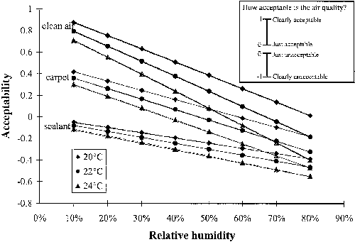
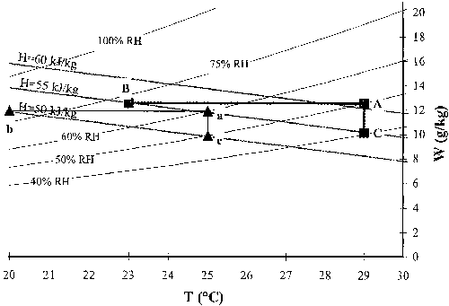

<link rel="stylesheet" href="../style.css">

# PAQ

<strong>Oplevet indeluftkvalitet</strong> 
<strong>Perceived indoor Air Quality</strong>

 

<em> Nedenstående tekst stammer fra: Carey J. Simonson, Mikael Salonvaara & Tuomo Ojanen (2001). Improving Indoor Climate and Comfort with Wooden Structures. VTT publications 431. VTT, Technical Research Centre of Finland. ESPOO 2001. </em>

 

Local thermal comfort due to inadequate respiratory cooling and perceived indoor air quality (PAQ) are closely related because inadequate cooling makes the air feel stuffy and unacceptable. Research has shown that the odour intensity of air is not strongly influenced by temperature and humidity, but PAQ is strongly affected (Toftum et al., 1998b and Fang et al., 1998a and b). In fact, PAQ and acceptability are linear related to enthalpy. Air is more acceptable (has a higher perceived quality) at low enthalpies and as the enthalpy increases, the acceptability decreases. Fang et al. (1998a) conducted laboratory tests where 40 subjects were facially exposed to air supplied through a diffuser and asked the following question: "Imagine that during your daily work you would be exposed to the air from the diffusers. How acceptable is the air quality?" The subjects assessed the acceptability of polluted and unpolluted air at different temperature and humidity and Fang et al. (1998a) developed the following equation to calculate the acceptability of air:

$$ \text{Acceptability} = aH + b $$

Where H is the enthalpy of the air (kJ/kg) and a and b are empirical coefficients. The constants a and b have been calculated for clean air and air polluted with five building materials at two different loading levels. For clean air, a=-0.033 and b=1.662 giving (used in BSim from version 2002),

$$ \text{Acceptability} = -0.033 H + 1.662 $$

Which will be used in this report to estimate the acceptability of indoor air. The next figure presents the acceptability of clean air and air polluted with carpet (a = -0.023 and b = 0.966) and sealant (a = -0.013 and b = 0.263) under loading 2 conditions described by Fang et al. (1998a). Figure 5 shows that as the temperature and humidity increase (enthalpy increases), the acceptability decreases for all pollution sources and the importance of the pollution source decreases. Above an enthalpy of 50 kJ/kg (24 °C and 55 % RH), the air is unacceptable regardless of the pollution source. This shows that PAQ is better at lower humidity (in fact enthalpies), which means that ventilation rates could be decreased notably by maintaining a moderate enthalpy in spaces.

The relative importance of temperature and humidity on PAQ can be directly compared using the next figure. For example, clean air at 20 °C and 60 % RH is slightly more acceptable than clean air at 24 °C and 40 % RH. This means that if the air temperature in a room increases from 20 °C to 24 °C (AT=4°C), the acceptability of the air will remain nearly constant provided the relative humidity decreases from 60 % RH to 40 % RH (ARH = 20 %). Therefore, a temperature change of 1 °C is approximately equivalent to a humidity change of 5 % RH. This means that if the temperature increases by 1 °C, the humidity must be decreased by 5 % RH to keep the same acceptability. On the other hand, if the temperature decreases by 1 °C, the humidity of the air is allowed to increase by 5 % RH and the acceptability will still be similar.

<figure id="center_img">

<figcaption>The acceptability of indoor air as a function of relative humidity for different temperatures and pollution sources.</figcaption>
</figure>

The effect of humidity on PAQ is typically greater than the effect of humidity on thermal sensation. For example, Toftum et al. (1998b) state that changing the air temperature by 1 °C has the same effect on acceptability, freshness and thermal comfort as changing the vapor pressure by 121, 130 and 231 Pa respectively. This means that at 22 °C, changing the relative humidity by 10 % RH has a similar effect on PAQ and thermal sensation as changing the temperature by 2.2 °C and 1.1 °C respectively. Therefore, according to these results, humidity is about twice as important for PAQ as it is for thermal comfort.

If we consider a cooling system that removes heat from a space, but does not remove moisture unless condensation occurs, such as radiant cooling without dehumidification (Olesen, 2000, Simmonds, et al., 2000 and Olesen, 1997), the importance of humidity is very clear. The next figure shows the sensible cooling of air in a room (i.e., no change in absolute humidity) from 29 °C and 50 % RE to 23 °C (process AB) and from 25 °C and 60 % RH to 20 °C (process ab). These processes are expected to significantly increase thermal comfort and productivity (Seppånen and Vuolle, 2000 and Wyon, 2000). Nevertheless, the next figure shows that the same change in enthalpy of air can be achieved by simply reducing the humidity by 10 % RH and keeping the temperature constant (processes AC and ac). Since PAQ is a function of enthalpy, the acceptability of the air after either process (cooling or dehumidifying) is expected to be the same. Here a change in humidity of 10 % RH at constant temperature is equivalent to a change in temperature of 5 or 6 °C at constant absolute humidity. Since temperature strongly affects comfort and productivity, these results also indicate that indoor humidity affects ventilation requirements, symptoms of sick building syndrome and human productivity, but additional research is needed to quantify these effects.

<figure id="center_img">

<figcaption>Sensible cooling and dehumidification process lines on the psychromertic chart showing the importance of humidity on enthalpy.</figcaption>
</figure>

#### **References**

Fang L. Calusen G & Fanger P.O. (1998a). *Impact of temperature and humidity on the perception of indoor air quality*. Indoor Air, 8, p 80-90.

Fang L. Calusen G & Fanger P.O. (1998b). *Impact of temperature and humidity on the perception of indoor air quality during immediate and longer whole-body exposures*. Indoor Air, 8, p 276-284.

Olesen B.W. (2000). *Low temperature heating and high temperature cooling of buildings using hydronic surface systems*. Proceedings of Healthy Buildings 2000, Vol. 2, (edited by O. Seppänen & J. Säteri), SIY Indoor Air Information OY, p 635-640.

Olesen B.W. (1997). *Possibilities and Limitations of Radiant Floor cooling*. ASHRAE Trans., 103(1), p 42-48.

Simmonds P, Gaw W, Holst S & Reuss S (2000). *Using radiant cooled floors to condition large spaces and maintain comfort conditions*. ASHRAE Trans. 106(1).

Seppänen O & Vuolle M (2000). *Cost effectiveness of some remedial measures to control summer time temperatures in an office building*. Proceedings of Healthy Buildings 2000, Vol. 1 (edited by O. Seppänen & J. Säteri), SIY Indoor Air Information OY, p 665-670.

Toftum J., Jørgensen, A.S. & Fanger, P.O. (1998b). *Upper limits of air humidity for preventing warm respiratory discomfort*. Energy and Buildings, 28, p 15-23.

Wyon D. (2000). *Individual control at each workplace: the means and the potential benefits*. Creating the productive workplace (edited by D. Clemens-Croome), E&FN Spon, London and New York.
