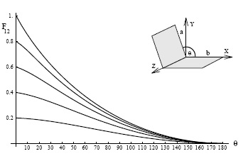

<link rel="stylesheet" href="../style.css">

# On the Form Factor between Two Polygons

Peter Schröder & Pat Hanrahan  
Department of Computer Science Princeton University

 

### **Abstract**

Form factors are used in radiosity to describe the fraction of diffusely reflected light leaving one surface and arriving at another. They are a fundamental geometric property used for computation. Many special configurations admit closed form solutions. However, the important case of the form factor between two polygons in three space has had no known closed form solution. We give such a solution for the case of general (planar, convex or concave, possibly containing holes) polygons.

**CR Categories and Subject Descriptors**: I.3.7 [Computer Graphics]: Three-Dimensional Graphics and Realism – Radiosity; J.2 [Physical Sciences and Engineering]: Engineering.

**Additional Key Words and Phrases**: Closed form solution; form factor; polygons. 

### **1 Introduction**

When using the radiosity technique to create images the form factor plays a central role. It describes the fraction of radiation diffusely emitted from one surface reaching another surface. The accurate computation of form factors is the central theme in many recent papers. Goral et al. [4], who introduced radiosity to the computer graphics community, used numerical contour integration to compute form factors between polygons. Cohen and Greenberg [3] took visibility into account with their hemicube algorithm. More recent hierarchical and adaptive algorithms compute still more accurate form factors [10; 5]. Nishita and Nakamae [8] and Baum et al. [2] have used an exact solution for the form factor between a differential surface element and a polygon. Most radiosity algorithms are restricted to polygonal environments, and so a closed form solution for the form factor between polygons is potentially of great utility.

The history of computing form factors is very long. A closed form expression for the form factor between a differential surface element and a polygon was found by Lambert in 1760 [7]. Lambert proceeded to derive the form factor for a number of special configurations among them the form factor between two perpendicular rectangles sharing a common edge. He writes about the latter derivation:

Although this task appears very simple its solution is considerably more knotted than one would expect. For it would be very easy to write down the differential expression of fourth order, which one would need to integrate four fold; but the highly laborious computation would fill even the most patient with disgust and drive them away from the task.

Other workers have derived closed form solutions for the form factors between many different geometric configurations and these can be found in standard textbooks. However, we are not aware of a closed form solution for the form factor between two general polygons. Thus, this problem has remained open for over 230 years.

In this paper we present a formula for the form factor integral between two general polygons. The derivation of this formula is quite involved, and the interested reader is referred to [9] for a detailed derivation. The purpose of this paper is to bring this result to the attention of the graphics community.

 

### **2 Closed form solution**

The form factor integral can be reduced to a double contour integral by two applications of Stokes’ theorem [6]

$$ \pi A_{1} F_{12} = \int_{A_{1}} \int_{A_{2}} \frac{\cos \theta_{1} \cos \theta_{2}}{\|\vec{r}\|^{2}} d A_{2} d A_{1} $$

$$ = \frac{1}{4} \int_{\partial A_{1}} \int_{\partial A_{2}} \ln (\vec{r} \cdot \vec{r}) d \vec{x}_{2} \cdot d \vec{x}_{1} $$

where θ1, θ2 are the angles between the normal vector of the respective surface and a radius vector $ \vec{r} $, which connects two points on the surfaces. The above equation holds for all surfaces such that every point on either surface sees the same contour of the other surface. In the case of polygons P1 and P2 the contour integral reduces to a sum of double line integrals over all pairwise combinations of edges

$$ 4 \pi A_{P_{1}} F_{P_{1} P_{2}}=\sum_{E_{i} E_{j}} \cos \angle E_{i} E_{j} \int_{E_{i}} \int_{E_{j}} \ln (\vec{r} \cdot \vec{r}) d s_{j} d t_{i} $$

Ignoring the factor cos $ \angle $ EiEj we are left with the task of giving a solution to integrals of the general form $ \int_{0}^{c_2} \; \int_{0}^{c_0} $ . ln f(s; t) ds dt. c0 and c2 are the lengths of the edges over which a given double contour integral is taken and $ f(s; t) = s^2 + c_1st + t^2 + c_3s + c_4t + c_5 $ is the bi-quadratic form which arises from the expansion of the dot product (see Table 2 for definitions of all variables). If the two line segments lie in a common plane we can factor $ f(s; t) $ into two bi-linear forms and a solution is readily obtained with standard integration tables (see [9]). Lines in general position lead to the following result:

$$
\int_{0}^{c_{2}}\int_{0}^{c_{0}} \ln f(s,t)\,ds\,dt
$$

$$
=
\left.\left\{\left.\left[\left(s+\frac{c_{3}}{2}\right)\mathrm{G}\big(f(\cdot,t)\big)(s)
+\frac{c_{1}}{2}\mathrm{H}\big(f(\cdot,t)\big)(s)\right]\right|_{s=0}^{s=c_{0}}\right\}\right|_{t=0}^{t=c_{2}}
$$

$$
\quad -2c_{0}c_{2} + c_{14}c_{15}\Bigg\{\Big[ \pi\big(2k(s)+1\big)\mathrm{M}(t)
$$

$$
\qquad -\,i\big(\mathrm{L}(-c_{17}(s))(t)+\mathrm{L}(-c_{18}(s))(t)
$$

$$
-\mathrm{L}(c_{17}(s))(t)-\mathrm{L}(c_{18}(s))(t)\big)\Big]_{s=0}^{s=c_{0}}\Bigg\}\Bigg|_{t=\sqrt{\frac{c_{13}}{c_{13}}}}^{\,t=\sqrt{\frac{c_{13}+c_{2}}{c_{13}+c_{2}}}}
$$

where $ k(s)  \in \{-1; 0; 1\} $ according to the particular branchcut of the complex logarithm choosen in L. The auxiliary functions G, H, L, and M are given in Table 1.

### **3 An example**

We have implemented our closed form solution in Mathematica [11] (this code is available from ps@princeton.edu). The implementation requires some care because of the complexities of the functions that are involved.

A simple example, which requires the full power of our formula, concerns the form factor between two equal width rectangles sharing an edge with an enclosing angle $ θ \in [0; π] $. The configuration is illustrated in Figure 1 together with the form factor as a function of $θ$ for different aspect ratios l = a/b (common edge length b).

$$
\mathrm{L}(b)(y)\;:=\;\int^{y} t^{2}(1-t^{2})^{-3}\ln(b+t)\,dt
\;=\;\frac{1}{16}\Bigg[
-\frac{b\ln(y-1)}{(b+1)^{2}}
-\frac{b\ln(1+y)}{(b-1)^{2}}
+\Bigg(\frac{2(b+y)(1+by)\big[(b-y)^{2}+(by-1)^{2}\big]}{(b^{2}-1)^{2}(y^{2}-1)^{2}}
+\ln\frac{(1-y)(1-b)}{(1+y)(1+b)}\Bigg)\ln(b+y)
+\frac{2(b-y)}{(b^{2}-1)(y^{2}-1)}
+\mathrm{Li}_{2}\!\!\left(\frac{1-y}{1+b}\right)
-\mathrm{Li}_{2}\!\!\left(\frac{1+y}{1-b}\right)
\Bigg]
$$

$$
\mathrm{M}(y)\;:=\;\int^{y} t^{2}(1-t^{2})^{-3}\,dt
\;=\;\frac{1}{16}\Big[\,4y(y^{2}-1)^{-2}+2y(y^{2}-1)^{-1}+\ln\frac{y-1}{y+1}\,\Big]
$$

$$
\mathrm{G}(q)(y)\;:=\;\int^{y}\ln q(t)\,dt
\;=\;\frac{q'(y)}{2a}\ln q(y)\;-\;2y\;+\;\frac{d}{a}\tan^{-1}\!\!\left(\frac{q'(y)}{d}\right)
$$

$$
\mathrm{H}(q)(y)\;:=\;\int^{y} t\ln q(t)\,dt
\;=\;\Big(\frac{y^{2}}{2}+\frac{c}{2a}-\frac{b^{2}}{4a^{2}}\Big)\ln q(y)
-\frac{y(ay-b)}{2a}-\frac{bd}{2a^{2}}\tan^{-1}\!\!\left(\frac{q'(y)}{d}\right)
$$

 

**Table 1:** Four auxiliary integrals needed in the solution. Notice that L(b)(y) uses the dilogarithm [1], $ Li_2(z) = \sum_{1}^{\infty} \frac{z^k}{k^2}, \frac{d}{dz}Li_2(z) = - \frac{\ln (1-z)}{z} $. In G and H the argument *q* is an arbitrary quadratic polynomial $ q(t) = at² + bt + c $ and $ d = \sqrt{4ac-b^2} $.

 

$$ c_0 = ||E_j|| $$

$$ c_1 = -2 \vec{d}_i \cdot \vec{d}_j $$

$$ c_2 = ||E_i|| $$

$$ c_3 = -2 \vec{d}_j \cdot (\vec{p}_i - \vec{p}_j) $$

$$ c_4 = 2 \vec{d}_i \cdot (\vec{p}_i - \vec{p}_j) $$

$$ c_5 = ||\vec{p}_i - \vec{p}_j||^2 $$

$$ c_{10} = 4 - c_1^2 $$

$$ c_{11} = 4 c_4 - 2 c_1 c_3 $$

$$ c_{12} = 4 c_5 - c_3^2 $$

$$ c_{13} = \frac{c_{11} - \sqrt{c_{11}^2 - 4 c_{10} c_{12}}}{2 c_{10}} $$

$$ c_{14} = \frac{\sqrt{c_{11}^2 - 4 c_{10} c_{12}}}{c_{10}} $$

$$ c_{15} = \sqrt{c_{10} c_{14}} $$

$$ c_{16}(s) = c_1 c_{13} - c_3 - 2 s $$

$$ c_{17}(s) = \frac{-c_{15} + \sqrt{c_{15}^2 - 4 |c_{16}(s)|^2}}{2 i c_{16}(s)} $$

$$ c_{18}(s) = \frac{-c_{15} - \sqrt{c_{15}^2 - 4 |c_{16}(s)|^2}}{2 i c_{16}(s)} $$

 

**Table 2**: All expressions for two edges Eij with parameterization $ \vec{x_i}(t) = \vec{p_i} + t \vec{d_i} $ and $ \vec{x_j}(s) = \vec{p_j} + s \vec{d_j} \left( ||\vec{d_{i,j}}|| = 1 \right) $.

<figure id="center_img">

<figcaption>Figure 1: Geometry for two rectangles sharing a common edge with an enclosing angle of θ. The graphs show the form factor as a function of θ for edge ratios l = a/b of 0,2, 0,4, 0,6, 0,8, and 1,0.</figcaption>
</figure>

### **4 Conclusion**

We have given a closed form solution for the form factor between two general polygons. This solution is non-elementary since it involves the dilogarithm function. The principal value of our solution is in determining exact answers for general polygonal configurations. This can be used in practice for reference solutions to check more efficient approximations. Baum et al. [2] have also shown that the error in the computed solution can be reduced significantly when using a closed form solution near singularities of the integrand.

There has been a long history of computing closed form expressions for form factors starting with Lambert in 1760. The literature lists many special cases for which closed form solutions exist, but hitherto no solution had been given for general polygonal configurations. The present paper closes this gap.

### **Acknowledgements**

The first author would like to thank the Sci-Vis group at HLRZ for their support. Other support came from Apple, Silicon Graphics and the NSF (contract no. CCR 9207966).

#### **References**

1.  Abramowitz, M., and Stegun, I. A. *Handbook of Mathematical Functions, 9th ed*. Dover Publications, 1970.

2.  Baum, D. R., Rushmeier, H. E., and Winget, J. M. *Improving Radiosity Solutions Through the Use of Analytically Determined Form-Factors*. Computer Graphics 23, 3 (July 1989), 325– 334.

3.  Cohen, M. F., and Greenberg, D. P. The Hemi-Cube: *A Radiosity Solution for Complex Environments*. Computer Graphics 19, 3 (July 1985), 31–40.

4.  Goral, C. M., Torrance, K. E., Greenberg, D. P., and Battaile, B. *Modelling the Interaction of Light between Diffuse Surfaces*. Computer Graphics 18, 3 (July 1984), 212–222.

5.  Hanrahan, P., Salzman, D., and Aupperle, L. *A Rapid Hierarchical Radiosity Algorithm*. Computer Graphics 25, 4 (July 1991), 197–206.

6.  Herman, R. A. *A Treatise on Geometrical Optics*. Cambridge University Press, 1900.

7.  Lambert. *Photometria sive de mensura et gradibus luminis, colorum et umbrae*. 1760. German translation by E. Anding in Ostwald’s Klassiker der Exakten Wissenschaften, Vol. 31-33, Leipzig, 1892.

8.  Nishita, T., and Nakamae, E. *Continuous Tone Representation of Three-Dimensional Objects Taking Account of Shadows and Interreflection*. Computer Graphics 19, 3 (July 1985), 23–30.

9.  Schröder, P., and Hanrahan, P. *A Closed Form Expression for the Form Factor between Two Polygons*. Tech. Rep. CS-404- 93, Department of Computer Science, Princeton University, January 1993.

10.  Wallace, J. R., Elmquist, K. A., and Haines, E. A. *A Ray Tracing Algorithm for Progressive Radiosity*. Computer Graphics 23, 3 (July 1989), 315–324.

11.  Wolfram, S. *Mathematica*. Addison-Wesley, 1988.

 

Permission to copy without fee all or part of this material is granted provided that the copies are not made or distributed for direct commercial advantage, the ACM copyright notice and the title of the publication and its date appear, and notice is given that copying is by permission of the Association for Computing Machinery. To copy otherwise, or to republish, requires a fee and/or specific permission. ©1993 ACM-0-89791-601-8/93/008/0015…$1.50

