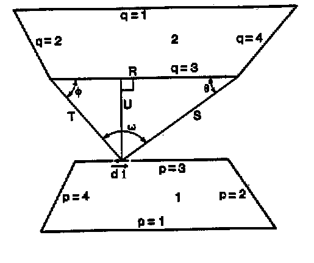

# SimLight teori

<em>Troels Ravn</em>

## **Contents**

*   Models for the environment

    *   Uniformly overcast sky

    *   CIE-overcast sky

    *   CIE-clear sky

*   Calculation of the direct illumination

*   Calculation of the externally reflected illumination

*   Calculation of the internally reflected illumination

    *   Surface subdivision

    *   Calculation of initial illumination

    *   Shape-factor calculation

    *   Inter-reflection calculation

*   Validation

*   Default material properties

*   Limitations

*   References

The SimLight application is a tool which is available as part of the BSim-package. The modeling of the spaces are performed by SimView and the accessibility of the modeling of the daylighting specifics in SimLight concerns mainly the modeling of the environmental characteristics and the definition of reference points. The user interface for the SimLight application is a dialog box containing all information concerning single point daylighting contribution calculations. There are two additional underlying dialog boxes, which come in to play when multiple-point daylighting calculations are to be carried out. One dialog box is used to define the grid of calculation points, the other to present the results of the multiple-point calculation.

The general approach to the daylighting calculations in SimLight is of a Finite Element Method (FEM). As FEM-based radiation calculation can require excessive computational time, functions permitting dynamical altering of the inhomogeneous finite element grid have been implemented. This is of particular significance when calculating the internally reflected illumination.

 

## **Models for the environment**

The outdoors terrain is modeled as a Site object. BSim facilitate modeling of outdoors obstructions, but SimLight does not take it into account yet.

The sky can be defined according to three different models, all taken from (1), which are described below.

 

### **Uniformly overcast sky**

The model of the uniformly overcast sky is based on the assumption that the sky is a perfect diffuser and has a uniform luminance at all points on the celestial dome. The relation between the illumination on the horizontal plane (EH) and the zenith luminance (LZ) is given by:

$$  E_H = \pi \cdot L_Z $$

 

### **CIE-overcast sky**

The luminance of the CIE-overcast sky follows the Moon and Spencer distribution. The luminance at the horizon is one third of the zenith luminance. The relation between the luminance at angle θ (Lθ) and the zenith luminance (LZ, Z=90°) is given by:

$$  L_{\gamma_s} = L_Z \left( \frac{1 + 2 \sin \gamma_s}{3} \right) $$

 

The relation between the illumination on the horizontal plane (EH) and the zenith luminance (LZ) is given as:

$$  E_H = \frac{7 \pi}{9} \cdot L_Z $$

 

### **CIE-clear sky**

The luminance of the CIE-clear sky is described by Kittlers formula. It takes into consideration the atmospherically diffusion of the sunlight when the sky is clear, but does not include the special conditions of luminance near and on the solar disc. The relation between the luminance at a point on the celestial dome (Lθ,α) and the zenith luminance (LZ, Z=90°) is:

$$ L_{\theta, \alpha} = \frac{1 - e^{\frac{-32}{\cos \varepsilon}}}{0.274}   
\left( \frac{0.91 + 10 \cdot e^{-3 \psi} + 0.45 \cdot \cos^2 \psi} {0.91 + 10 \cdot e^{-3 Z_s} + 0.45 \cdot \cos^2 \gamma_s} \right) L_z $$

 

where:   
ψ     is the angle between the sun and the point in question,   
ε      is the angle between zenith and the point in question,   
Zs   is the angle between zenith and the sun and   
γs    is the sun height, all measured in radians.

 

The zenith luminance is approximated by the formula:

$$  L_Z = 72 \cdot H $$

and the illumination on a horizontal plane is approximated by the empirical formula:

$$ E_H = 1100 + 15500 \cdot \sqrt{\sin H} $$

where H is the sun height measured in degrees.

 

 

## **Calculation of the direct illumination**

The calculation of the direct illumination at the reference point is based on the theory presented in (2). The basic formula used to calculate the illumination contribution from a light source is:

$$ E_R = \int\limits_{\text{A = area}} \frac{L_{dA} \sin \theta \cos \theta}{R^2} \, dA $$

where   
LdA is the luminance at dA,   
θ is the angle between the angle of incidence and the perpendicular at the reference point,   
R is the distance between the reference point dA.

 

Numerical integration can be applied if and when dA is of such size and geometry that the values of θ and LdA can be assumed constant throughout dA. In SimLight, this quality is obtained in the following manner: The windows are subdivided in to triangular elements. The subdivision is handled in such a way that all subdivisions are carried out by splitting the longest side in the triangle at the midpoint. This ensures that the geometrical moment of inertia of the triangles is minimized and thus the geometrical requirements on dA are met. To ensure that the variation of θ and LdA are "small" throughout the triangular elements, the subdivision algorithm in SimLight compares the upper limit of the apparent area of the triangular elements, as seen from the reference point, to the area of a sphere which is centered at the reference point and which has a radius that is equal to the distance between the reference point and the center-point of the triangle in question. If the ratio between the two exceeds a certain value, the triangle is subdivided. In the present version, the ratio has been experimentally determined. The ratio between the maximum apparent area and the area of the sphere is set to 1/20, 1/32 and 1/44 for low, medium and high precision respectively.

When the window has been subdivided into triangular elements, the contribution to the illumination at the reference point from all elements whose center-points map to a point on the celestial dome are summed up.

If the window has not been defined with a specific type of window in SimView, the illumination of every triangle is set equal to the illumination of the point on the celestial dome, to which the triangle's center-point map. If the window has been defined with a type, the illumination of the triangle is multiplied with the transmittance of the glazing. In the present version of SimLight, only clear, double glazed windows can be handled. Therefore, all windows, which have been defined with a type, are treated as windows with this kind of glazing. The calculation of the transmittance of the glazing includes dependency on the angle of incidence in the cases where a window has been defined with a type. The algorithm is taken from the tsbi3 application, which was released by Danish Building Research Institute in 1993.

With the correction for reduced transmittance included, the sum of contributions from all triangular elements is given as the result for the direct illumination at the reference point.

The database in BSim includes information on the amount of framing material used for each type of window. In SimLight, the framing material is assumed to be uniformly distributed along the circumference of the window and with a width as defined in the database. Triangular elements whose center-points map to a point on the frame do not contribute to the direct or to the externally reflected illumination.

 

## **Calculation of the externally reflected illumination**

The calculation of the externally reflected illumination takes place in the same step as the calculation of the direct illumination. The triangles whose center-points do not map to a point on the celestial dome, maps to either the outdoors terrain, the fins around the window (defined in SimView), the sides of the opening containing the window or the frame around the window glazing.

In case a center-point maps to the outdoors terrain, the illumination of the triangle is set to the site reflectance multiplied by the zenith luminance of the sky model. It can be argued that the zenith luminance should not be used for the estimate in other cases than for skies of uniform luminance, but that the average sky luminance should be used in stead. However, as the estimate of the reflectance of the outdoors terrain is very uncertain and as the externally reflected component rarely constitutes a significant fraction of the illumination at the reference point, the error introduced by basing the luminance on the zenith luminance is estimated to be insignificant.

In case a center-point maps to the fins around the window, the illumination of the triangle is set to the zenith luminance multiplied by the reflectance of the outer finish of the construction containing the window (defined in SimView or otherwise the default reflectance). Again it may be argued that the zenith luminance is not the correct basis for the calculation of the illumination on the fin. Indeed, in this case it would be better to carry out yet another calculation, namely to calculate the illumination falling upon the point on the fin where the triangle center-point maps. The significance of the consequences of the chosen approximation and the trade-off that will arise (increased computational time) when implementing the more correct method will be investigated in the future.

In case a center-point maps to the sides of the opening containing the window, the illumination of the triangle is calculated as in the case with the mapping to the fin. The same arguments as above apply.

As mentioned in the previous section, no contribution from the triangle in question is calculated in case a center-point maps to the frame around the window glazing.
 

## **Calculation of the internally reflected illumination**

The calculation of the internally reflected illumination is the crucial part of the calculation process seen from a computational point of view. Calculation of this component requires knowledge about the luminance at every point on the interior surfaces of the space. The luminance is determined by the illumination on the interior surfaces. This illumination is also composed of direct, externally reflected and internally reflected illumination. The first step of the calculation of the internally reflected illumination at the reference point is therefore to calculate the illumination at all points on the interior surfaces and the inter-reflection between each one of these points. These calculations comprise the most time consuming steps of the entire process.

SimLight applies an FEM approach to model the inter-reflection in a space. First, all interior surfaces in the space are subdivided with triangular elements. Then, the direct and externally reflected illumination falling upon all surface elements are calculated and the shape factors between all elements which "see" each other are calculated. The reflectance of the surfaces, the illumination and the shape-factors are then utilized to set up a daylighting balance in the space. Once this balance has been determined, the internally reflected illumination at the reference point is calculated. A step-by-step description of the processes is found below.

Two steps in particular requires considerable computational time:

*   (Repeated) subdivision of the interior surfaces and calculation of initial illumination.

*   Calculation of shape-factors between all triangular elements on the interior surfaces.

In order to reduce the computational time required, the critical steps of the calculation process have been handled in the following manner.

 

### **Surface subdivision**

The subdivision of the interior surfaces is carried out in almost the same manner as in the case of the subdivision of the windows. However, as the subdivision is very dependent on the location of the reference point, it is necessary to generate a new mesh on the interior surfaces every time the location of the reference point is changed, in order to obtain correct results. Every time a mesh is generated, it is necessary to re-compute the illumination on the interior surfaces. In the case of a multiple point calculation, the repeated mesh generation and re-computation of the illumination requires an excessive amount of computational time. It would therefore be convenient if as many of the triangular elements as possible could be used and reused in consecutive calculations. This has been achieved by implementing a dynamical mesh generation procedure.

When a mesh is generated, a "basic" mesh is initially generated. The idea of the basic mesh is that it should form the basis of all meshes used in consecutive calculations (i.e. in a multiple point calculation process). Therefore, the direct and externally reflected illuminations in all center-points of the triangular elements are calculated. Then, a finer mesh based on the location and orientation of the reference point is generated in the same way as described in Calculation of the direct illumination, except that the limits in the area - sphere relation are now 1/40, 1/64 and 1/88, for the three precision's respectively. The values are again experimentally determined. This finer mesh is generated such that the elements in the basic mesh form the basis of the generation of the finer mesh. Only in the case where the basic mesh elements do not satisfy the apparent area - sphere relation, is further subdivision carried out. The direct and externally reflected illuminations in all new elements are then calculated. In the case of a multiple-point calculation process, the finer mesh is deleted after each calculation for a reference point is completed. However, the basic mesh still exists and again forms the basis of further subdivisions, which depend on the location, and orientation of the new reference point. As a large part of the basic mesh is very often reusable, this approach saves much computational time. It may be argued that an easier approach would be to make the basic mesh sufficiently fine in the first place, thus eliminating the repeated elimination - regeneration processes. However, a sufficiently fine mesh must consist of very small elements if correct results for illumination at points close to a bounding surface are to be obtained. A large number of elements hugely diminishes the efficiency of the calculation, as will be obvious in the following two sections.

The basic mesh is initially generated on the basis of the volume of the space. The interior faces are subdivided until no triangular element has an area of more than 1/70, 1/90 and 1/110 m-1 (for low, medium and high precision respectively) of the volume of the space it faces. The values are experimentally determined. The reason why the volume has been chosen, as the proportional factor is this: the inter-reflection between elements becomes more significant where the elements are "close" to one another. It is therefore desirable to have a finer mesh in, says a long, narrow room than in a cubic room. As the volume of a space indicates the geometry better than the total surface area does, it is chosen to use the volume rather than the total area of the interior surfaces as proportional factor for the limit on the element area. Other methods for the initial subdivisions will be tested in the future. A method, which in some way bases the limit on the element area on the distance between an element and its nearest edge, seems to be a better alternative.

 

### **Calculation of initial illumination**

The calculation of the direct and externally reflected illumination falling upon the elements on the interior surfaces of the space is calculated in the same way as described in the section Calculation of the direct illumination. This step in the calculation process also reaps the benefits of the existence of the basic mesh in the case of multiple-point calculations. The illumination falling upon the elements in the basic mesh needs only to be calculated once. In succeeding calculations there is only need to calculate the initial illumination falling upon the elements in the finer mesh. This also reduces the required computational considerably.

 

### **Shape-factor calculation**

 

There is basically two ways of performing a shape-factor calculation for a space:

*   Divide the space surfaces in n sub-surfaces in which the illumination can be assumed constant. Perform integration over all pairs of sub-surfaces which "see" each other.

*   Divide the space surfaces in n sub-surfaces in which the illumination can be assumed constant. Use approximated formulas to estimate shape-factors between all pairs of sub-surfaces which "see" each other.

The second approach is by far the fastest for obvious reasons. However, approximate formulas exist only for rectangular sub-surfaces, which cannot be used in cases where the surface itself is not rectangular. The approximate formula for the shape-factor between rectangular elements is:

$$  SF_{12} = \frac {\cos \theta_1 \cdot \cos \theta_2}{\pi r^2} A_2  $$

 

where   
SFij denotes the shape-factor of element j seen from element i,   
θi is the angle of incidence at element i,   
r is the distance between the elements and   
Ai is the area of element i.

 

A possible solution could be to treat the triangular elements as rectangular elements during the shape-factor calculation provided that the assumption, that the change of the geometrical mass-distribution of the sub-surface is negligible, will hold. In the case where the sub-surfaces are "far" from each other, the approximation only gives rise to very small errors, but if relatively large sub-surfaces are "close" to each other, significant errors are observed.

The first approach, on the other hand, leads to correct results but is very time-consuming. Every shape-factor calculation is a calculation of a surface integral:

$$  A_{1}F_{12} = \int\limits_{A_1} \int\limits_{A_2} \frac {(dA_1 \cos \theta_1)(dA_2 \cos \theta_2)} {\pi r^2} $$

where   
Ai is the area of surface i,   
Fij is the shape-factor of element j seen from element i,   
θi is the angle of incidence at element i and   
r is the distance between the elements.

In the case with n sub-surfaces on the boundaries of the space, the required number of shape-factor calculations is:

$$ n_{SF} = \frac{\sum_i n_i (n-n_i)}{2} = \frac{n^2 - \sum_{i} n_{i}^2}{2} \cong \frac{i-1}{2i} n^2 $$

where   
ni is the number of sub-surfaces on surface i,   
n is the total number of sub-surfaces.

The division by 2 comes in to play as Area1 SF12 = Area2 SF21.

The approximate equality sign expresses equality when all ni are equal.

Hence, the number of necessary calculations is proportional to n².

In SimLight, it has been chosen to use both methods such that the advantages of both methods can be reaped. The choice of which method to apply is set to depend on the areas of the triangular elements and the distance between these. If the ratio of the sum of the areas to the square of the distance between them exceeds 1, the approximate shape-factor formula is applied; otherwise an integral method is applied. The value 1 has been experimentally determined.

In SimLight, the Mitalas-Stephenson method is utilized for exact shape-factor calculation. This method is based on the line integral method, but with one of the integrals integrated analytically beforehand. The remaining integral, which is calculated numerically, is:

$$  A_{1}F_{12} = \frac{1}{2\pi} \sum_{p=1}^{n_1} \sum_{q=1}^{n_2} \Phi_{pq} \sum^{m_p} \left( (T \cos \varphi \ln T + S \cos \theta \ln S + U_\omega - R) \nu_i \right) _{p,q} $$

where   
S, T, U, φ, θ and ω are functions of the edge vector in the line integral.

The figure below illustrates the symbols in the equation. See (5) for further details.

<figure id="center_img">

<figcaption>Illustration of symbols used in the Mitalas-Stephenson method.</figcaption>
</figure>

Using this combination of calculation methods, correct shape-factors are calculated reasonably quickly.

### **Interreflection calculation**

The inter-reflection calculation can be performed by solving n equations with n variables (implicitly or explicitly) or by finding the solution by means of an iterative method. As the matrix holding the shape-factors is almost a full matrix, an iterative method is likely to be more efficient than an equation solver as the Gauss elimination will require considerable computational time (proportional to n³). In SimLight, a simple Jacobi-iterative method is used.

The daylighting contribution from element i to element j is calculated as:

$$ dE_j = SF_{ji} \cdot E_i \cdot r_i $$

where   
dEj is the contribution to the illumination falling upon element j,   
SFji is the shape-factor of element i seen from element j,   
Ei is the illumination falling upon element i and   
ri is the reflection coefficient of element i.

 

The reflection coefficient is taken from the finish of which element i is part. If the surface has no defined reflectance it is automatically set to the default.

The iteration procedure stops when the illumination falling upon any triangular element does not change by more than 5 % from one iteration to the next.

Finally, the contribution from all triangular sub-surfaces, visible from the reference point, to the illumination at the reference point is summed up in the same manner as described in the section *Calculation* *of the direct illumination*, with the luminance of sub-surface i calculated as:

$$  L_i = \frac{r_i \cdot E_i}{\pi} $$

where  
ri is the reflection coefficient of element i and   
Ei is the illumination falling upon sub-surface i.

The relation is given in (4).

## **Validation**

The validation of the results obtained with SimLight consists of

1. Comparison of calculated values for direct illumination with an analytical solution (formula given in (2)).   
2. Comparison of calculated values for direct and internally reflected illumination with results obtained with the application Prolight.   

No recent and sophisticated software has been available for validation purposes during the development of the SimLight application. Therefore, the validation of the results sets certain limitations on which cases can be analyzed. The comparison with the analytical solution sets the restrictions that:

*   The sky must be of uniform luminance,

*   The reference plane must be perpendicular to the window plane,

*   The perpendicular at the reference point must be parallel to two of the edges of the rectangular window.

The comparison with the *Prolight* software sets the restrictions that:

*   The sky must be of uniform luminance,

*   The space must be box-shaped,

*   The reference plane must be vertically or horizontally oriented.

Therefore, the results have not been validated in the general case with CIE-sky-models, irregularly shaped spaces and randomly oriented reference planes. However, tests with a gradual change of e.g. reference plane orientation have been carried out, and the results seem reasonable.

The details of the validation comparisons are not included in this paper. The general disagreement with the correct results obtained with the analytical solution appears not to exceed 4 %, 2 % and 1 % for calculations of low, medium and high precision respectively. The error is smaller the greater the distance of a bounding plane from the reference point. The general disagreement with the results obtained with the Prolight application does not seem to exceed 12 %, 5 % and 3 % for calculations of low, medium and high precision respectively. In general, the disagreement does not exceed 6 %, 3 % and 2 %, but the disagreement increases as the distance of a bounding plane to the reference point decreases. Neither a finer meshing nor a more accurate shape-factor calculation can eliminate this disagreement. Until the application has been tested against measurements or yet another application, it can not be ruled out that the results obtained with Prolight are in fact not completely accurate.

 

 

## **Default material properties**

When no reflectance or light transmission is specified the following will be used:

 | Building element      | Reflectance | Light transmission |
|----------------------|:-----------:|:------------------:|
| Wall                 |   0,40      |                   |
| Roof                 |   0,70      |                   |
| Floor                |   0,10      |                   |
| Ground               |   0,10      |                   |
| WinDoor              |   0,15      |       0,70        |
| Overhang/sidefinn    |   0,40      |                   |
 

## **Limitations**

There are a number of restrictions on the models that can be handled appropriately. It is required that the model complies with the following guide-lines:

*   The room must be of convex nature.

*   The building must not have apertures connecting two rooms. These apertures will be treated as apertures to the outside.

*   Shading from outdoors obstructions is not considered. Only shading from fins is taken in to consideration.

*   Results are valid only for apertures with no glazing (no type) or clear, double glazing (any defined type).

The following condition is given for all calculations:

*   The windows are always assumed to be situated in the centerline of the construction it penetrates

 

## **References**

1. Christoffersen, J., Petersen, E. and Johnsen, K. Calculation Tools for Analysis of Daylighting in Buildings (in Danish), SBI-report 277, Statens Byggeforskningsinstitut, 1998.

2. Hopkinson, R.G., Petherbridge, P. and Longmore, J., Daylighting, Heinemann, 1964.

3. Mills, A.F., Heat Transfer, Irwin, 1993.

4. Ovesen, Ib, Concepts and Measurements, Light and Lighting (in Danish), Aschehoug,19??.

5. Walton, G.N., Algorithm for Calculating Radiation View Factors Between Plane Convex Polygons With Obstructions, National Bureau of Standards, Washington D.C., 1986.
