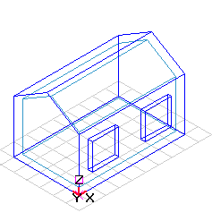
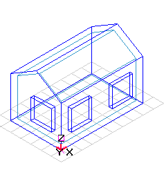
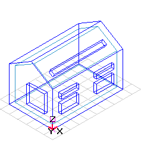

<link rel="stylesheet" href="../style.css">

# Naturlig ventilation

Simulering af naturlig ventilation i BSim kræver inddata på en række [forskellige steder](https://help.bsim.dk/support/kb/articles/49EdKkQ7/naturlig-ventilation-system) i modellen.

Naturlig ventilation kan aktiveres på termisk zone niveau.

I beregningerne tages kun hensyn til WinDoors/åbninger mod det fri.

Den anvendte model kan identificeres automatisk af BSim.

Naturlig ventilation er implementeret som en speciel form for *Venting* i et udvidelsesmodul til BSim. [De matematiske modeller](https://help.bsim.dk/support/kb/articles/yW1xrD9B/uddrag-fra-by-og-byg-anvisning-202) for naturlig ventilation er opbygget i henhold til beskrivelsen i [Andersen, Heisselberg & Aggerholm (2002)](https://help.bsim.dk/support/kb/articles/A93zbqQ0/litteratur).

### **Beregningsmodeller for naturlig ventilation**

$$ q_v = \left| \pm q_{Vv}^2 \pm q_{\text{VT}}^2 \right|^{½} = \left| \frac{c_v}{|c_v|} \left( c_v v_{10} \right)^2 + \frac{\Delta T}{|\Delta T|} \left( c_T |\Delta T|^{½} \right)^2 \right|^{½} $$

 
#### **Single Sided One Level**
Èt sæt åbninger i én flade, i samme lodrette niveau.  
Termisk opdrift og vind:
$$
c_V = 0{,}03A
$$

$$
c_T = 0{,}05 h^{1/2} A
$$

<figure id="center_img">

<figcaption></figcaption>
</figure>

#### **Single Sided Horizontal**
Èt sæt åbninger i én ikke lodret flade.  
Termisk opdrift:

$$
c_T = 0{,}06A \left( \frac{gA^{1/2}}{T_i} \right)^{1/2} \quad \text{for } h/A^{1/2} < 0{,}1
$$

$$
c_T = 0{,}18A \left( \frac{gh}{T_i} \right)^{1/2} \quad \text{for } 0{,}1 < h/A^{1/2} < 0{,}7
$$

Vind:

$$
c_V = 0
$$

<figure id="center_img">

<figcaption></figcaption>
</figure>

#### **Single Sided Dif Level**
Flere sæt åbninger i én flade i forskellig lodret niveau.  
Ensartet temperatur i zonen. 
Termisk opdrift: 
$$
c_T = \sum_{j=1}^{n_0} C_{d,j} A_j \left( \frac{2(H_0 - H_j)g}{T_i} \right)^{1/2}
$$

$$
\sum_{j=1}^{n} C_{d,j} A_j |H_0 - H_j|^{1/2} \frac{H_0 - H_j}{|H_0 - H_j|} = 0
$$

Vind:

$$
c_V = 0{,}03A
$$

<figure id="center_img">

<figcaption></figcaption>
</figure>

#### **Cross**
Åbninger i to flader i samme højde (tværventilation)  
Termisk opdrift:

$$
c_T = 0
$$

Vind:

$$
c_v = \sum_{j=1}^{n_v} C_{d,j} A_j \left( C_{p,j} - \frac{2p_i}{\rho_u (k h^{\alpha} v_{10})^2} \right)^{1/2} k h^{\alpha}
$$

$$
\sum_{j=1}^{n} C_{d,j} A_j \left( \frac{ |2\Delta p_j| }{ \rho } \right)^{1/2} \frac{ \Delta p_j }{ |\Delta p_j| } = 0
$$

$$
\Delta p_j = p_{v,j} - p_i = \frac{1}{2} C_{p,j} \rho_u v_{\text{ref}}^2 - p_i \neq 0
$$

<figure id="center_img">

<figcaption></figcaption>
</figure>

#### **Combined Two Level**
Åbninger i flere niveauer i to ikke parallelle flader  
Termisk opdrift:
$$
c_T = \sum_{j=1}^{n_0} C_{d,j} A_j \left( \frac{2(H_0 - H_j)g}{T_i} \right)^{1/2}
$$

$$
\sum_{j=1}^{n} C_{d,j} A_j |H_0 - H_j|^{1/2} \frac{H_0 - H_j}{|H_0 - H_j|} = 0
$$

Vind:

$$
c_v = \sum_{j=1}^{n_v} C_{d,j} A_j \left( C_{p,j} - \frac{2p_i}{\rho_u (k h^{\alpha} v_{10})^2} \right)^{1/2} k h^{\alpha}
$$

$$
\sum_{j=1}^{n} C_{d,j} A_j \left( \frac{2|\Delta p_j|}{\rho} \right)^{1/2} \frac{\Delta p_j}{|\Delta p_j|} = 0
$$

$$
\Delta p_j = P_{v,j} - p_i = \frac{1}{2} C_{p,j} \rho_u v_{\text{ref}}^2 - p_i \neq 0
$$

<figure id="center_img">

<figcaption></figcaption>
</figure>

#### **Combined**
Åbninger i flere niveauer i mere end to flader (kombineret opdrift- og tværventilation).
$$
q_v = \sum_{j=1}^{n_1} C_{d,j} A_j \left( \frac{2\Delta p_j}{\rho} \right)^{1/2}
$$

$$
\Delta p_j = p_j - p_i = \left( \frac{1}{2} \rho_u C_{p_j} \cdot v_{\text{ref}}^2 + \rho_u g (H_{0,\text{ref}} - H_j) \frac{\Delta T}{T_i} \right) - p_i \neq 0
$$

<figure id="center_img">

<figcaption></figcaption>
</figure>