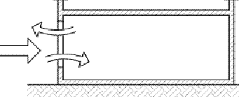
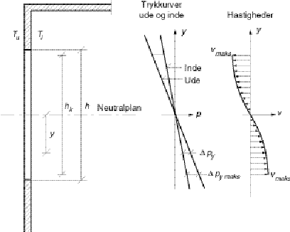

<link rel="stylesheet" href="../style.css">

# Uddrag fra By og Byg Anvisning 202

Naturlig ventilationsmodel i BSim.  
Karl Terpager Andersen   
Statens Byggeforskningsinstitut  

 

### **INDLEDNING**

Der behandles kun naturlig ventilation, og der skelnes mellem ensidet ventilation, tværventilation, opdriftventilation og en kombination mellem de to sidstnævnte. Der regnes kun på en enkelt zone og kun på luftudvekslingen med det fri. Der indgår således ikke mixing. Det antages, at åbningernes antal, størrelse, placering og orientering er kendte størrelser. Desuden kendes udeklimaforhold og ønskede indeklimaforhold. Der er med mindre skift i parentes anført, hvorfra de enkelte størrelser kommer. Til simple beregninger kan der tages udgangspunkt i følgende udtryk:

$$ q_v = \left| \pm q_{Vv}^{2} \pm q_{VT}^{2} \right|^{1/2} = \left| \frac{c_v}{|c_v|} (c_v v_{10})^2 + \frac{\Delta T}{|\Delta T|} \left( c_T |\Delta T|^{1/2} \right)^2 \right|^{1/2} \tag{1} $$

hvor:

*   qV er den samlede volumenstrøm, m³/s,

*   qVv er volumenstrømmen fra vind alene, m³/s,

*   qVT er volumenstrømmen fra opdrift alene, m³/s

*   cv er en konstant, der bestemmes af bygnings- og vindmæssige forhold,

*   cT er en konstant , der bestemmes af bygnings- og temperaturmæssige forhold,

*   v10 er den meteorologiske vindhastighed i det åbne land i 10 meters højde, m/s (vejrdata),

*   ΔT er forskellen mellem inde- og udetemperatur, K.

Ligning (1) er et tilnærmet udtryk når der både optræder vind og opdrift og der samtidig er flere end to åbninger. Der skal holdes styr på om vind og opdrift forstærker eller svækker hinanden, og dette sker via fortegnene for cv og ΔT. Der regnes med positive værdier, når vind og opdrift hver for sig giver opadrettet strømning i rummet og negativ når de hver for sig giver nedadrettet strømning. Termisk opdrift alene optræder ved vindstille, dvs. når v10 = 0, og dette antages at være tilfældet når v10 < 1,0 m/s. Ved vind alene sættes ΔT = 0.

### **ENSIDET VENTILATION**

Ensidet ventilation er karakteriseret ved, at alle åbninger er placeret i samme udvendige bygningsflade, hvorfor vinden kun medvirker i kraft af vindhastighedens fluktuationer. Der findes kun tilnærmede udtryk til beregning af ensidet naturlig ventilation, og udtrykkenes nøjagtighed kan ikke angives. Der skal skelnes mellem om åbningerne er lodrette eller vandrette. Derimod indgår vindretning ikke - og dermed heller ikke bygningsfladernes orientering - i de af de efterfølgende formeludtryk, hvor vinden indgår.

#### **Enkelt, lodret, rektangulær åbning eller flere ens, lodrette, rektangulære åbninger i samme niveau. Termisk opdrift** 

<figure id="center_img">

<figcaption></figcaption>
</figure>

Der antages lodret, parabolsk hastighedsfordeling over åbningen, og da kan formel (1) anvendes med:

$$ c_T = \frac{1}{3} C_d A \left( \frac{gh}{T_i} \right)^{1/2} \tag{2} $$

hvor:

*   Cd er åbningens udstrømningskoefficient (bruger/bibliotek),

*   A er det geometriske åbningsareal, m²,

*   h er åbningens geometriske højde, m.

#### **Flere lodrette åbninger i forskellige niveauer. Termisk opdrift**

Svarer til forholdene ved opdriftventilation, der behandles senere.

#### **Enkelt, lodret åbning. Termisk opdrift og vind**

Formel (1) kan anvendes med cv = 0,03A og cT = 0,05h½A.

#### **Enkelt, vandret åbning. Termisk opdrift**  

<figure id="center_img">

<figcaption></figcaption>
</figure>

Formel (1) kan anvendes med:

$$
c_T = 0.06 A \left( \frac{gA^{1/2}}{T_i} \right)^{1/2} \tag{3}
$$
, for $h/A^{1/2} < 0{,}1$

$$
c_T = 0.18 A \left( \frac{gh}{T_i} \right)^{1/2} \tag{4}
$$
, for $0{,}1 < h/A^{1/2} < 0{,}7$

hvor:

*   A er det geometriske åbningsareal, m²,

*   h er "åbningstykkelsen", fx et dæks tykkelse, m.

### **TVÆRVENTILATION**

Ved tværventilation er der åbninger i flere udvendige bygningsflader, og der regnes kun med bidrag fra vind. Drivtrykkene, og dermed volumenstrømmene bestemmes af vindtrykkene på de flader, hvori åbningerne er placeret.   
    Åbningsplanernes orientering skal kendes for at kunne bestemme vindtrykkoefficienterne.   
    Formel (1) kan anvendes med cv bestemt som vist nedenstående.

#### **To åbninger**

Her kan cv bestemmes af:

$$ c_v = \frac{C_{d1}A_1C_{d2}A_2}{\left( (C_{d1}A_1)^2 + (C_{d2}A_2)^2 \right)^½} \left| C_{p1} - C_{p2} \right|^½ kh^{\alpha} \tag{5} $$

hvor:

*   Cd1 er nederste åbnings udstrømningskoefficient (bruger/bibliotek),

*   Cd2 er øverste åbnings udstrømningskoefficient (bruger/bibliotek),

*   A1 er nederste åbnings geometriske åbningsareal, m²,

*   A2 er øverste åbnings geometriske åbningsareal, m²,

*   Cp1 er vindtrykkoefficienten på bygningsfladen med den nederste åbning (bruger/bibliotek, fx interpolation fra tabel 1),

*   Cp2 er vindtrykkoefficienten på bygningsfladen med den øverste åbning (bruger/bibliotek, fx interpolation fra tabel 1),

*   h er de lodrette afstand fra terræn til kiphøjde, m,

*   k er en ruhedsfaktor, der er afhængig af terrænet (bruger/bibliotek, anføres på "site" og/eller hentes fra tabel 2),

*   a er en højdeeksponent, der er afhængig af terrænet (bruger/bibliotek, kan anføres på "site" og/eller hentes fra tabel 2).

<figure id="center_img">

<figcaption>Flade nr.</figcaption>
</figure>

| Bygningsdel                         | Flade nr. | 0°    | 45°   | 90°    | 135°   | 180°   | 225°   | 270°   | 315°   |
|-----------------------------------|-----------|-------|-------|--------|--------|--------|--------|--------|--------|
| Facade                            | 1         | 0,2   | 0,05  | -0,25  | -0,3   | -0,25  | -0,3   | -0,25  | 0,05   |
| Facade                            | 2         | -0,25 | -0,3  | -0,25  | 0,05   | 0,2    | 0,05   | -0,25  | -0,3   |
| Facade                            | 3         | -0,25 | 0,05  | 0,2    | 0,05   | -0,25  | -0,3   | -0,25  | -0,3   |
| Facade                            | 4         | -0,25 | -0,3  | -0,25  | -0,3   | -0,25  | 0,05   | 0,2    | 0,05   |
| Saddeltag, hældning < 10°         | 5 og 6    | -0,5  | -0,5  | -0,4   | -0,5   | -0,5   | -0,5   | -0,4   | -0,5   |
| Saddeltag, hældning 10–30°        | 5 og 6    | -0,3  | -0,4  | -0,5   | -0,4   | -0,3   | -0,4   | -0,5   | -0,4   |
| Saddeltag, hældning > 30°         | 5         | 0,25  | -0,3  | -0,5   | -0,3   | -0,4   | -0,3   | -0,5   | -0,3   |
| Saddeltag, hældning > 30°         | 6         | -0,4  | -0,3  | -0,5   | -0,3   | 0,25   | -0,3   | -0,5   | -0,3   |

*Tabel 1. Vindtrykkoefficienter i afhængighed af vindretningen q for bygninger med op til tre etager, med kvadratisk grundplan og med omkringliggende bygninger af samme højde. Referencehøjden er lig med bygningshøjden ([Orme, Liddament & Wilson, 1998](https://help.bsim.dk/support/kb/articles/A93zbqQ0/litteratur))*.

| Terræntype                | ruhedsfaktor $k$ | højdeeksponent $a$ |
|---------------------------|:----------------:|:------------------:|
| Åbent, fladt land         | 0,68             | 0,17               |
| Landskab med spredt       | 0,52             | 0,20               |
| befolkning                | 0,35             | 0,25               |
| Forstadsområder           | 0,21             | 0,33               |
| Bycentrum                 |              |                |

*Tabel 2. Faktorer til karakterisering af forskellige terrænformer ([British Standard Institution, 1991](https://help.bsim.dk/support/kb/articles/A93zbqQ0/litteratur)).*

#### **Flere åbninger**

Her bestemmes først det indvendige tryk pi af massebalanceligningen:

$$ \sum_{j=1}^{n} C_{d,j} A_j \left( \frac{|2\Delta p_j|}{\rho} \right)^½ \frac{\Delta p_j}{|\Delta p_j|} = 0 \tag{6} $$

hvor indeks j angiver den j'te åbning, og hvor:

$$ \Delta p_j = p_{v,j} - p_i = ½ C_{p,j} \rho_u v_{ref}^{2} - p_i \neq 0 \tag{7} $$

Den bagerste brøk i ligning (6) sikrer strømningens fortegn, således at der fås positiv strømning for Δpj > 0 og negativ strømning for Δpj < 0. Ligningen løses numerisk

Herefter kan cv bestemmes af:

$$ c_v = \sum_{1}^{n_u} C_{d,j} A_j \left( C_{p,j} - \frac{2 p_i}{\rho_u (kh^{\alpha} v_{10})^2} \right)^½ kh^{\alpha} \tag{8} $$

hvor nv angiver de åbninger, hvor Δpj > 0. Dermed vil parentesen i ligning (8) også være større end nul.

### **OPDRIFTVENTILATION**

Ved opdriftventilation tilstræbes stort trykbidrag fra termisk opdrift ved at etablere stor, lodret afstand mellem indtags- og afkaståbningerne. Det har ingen betydning , om åbningerne er lodrette, vandrette eller skråtstillede. Formel (1) kan anvendes med cT bestemt som vist nedenstående. Der skelnes mellem ensartet indetemperatur og indetemperatur med lineær, lodret temperaturgradient bestemt ved brug af [kappa-modellen](https://help.bsim.dk/support/kb/articles/yWogRdWD/kappa-modellen-modelbeskrivelse).

<figure id="center_img">

<figcaption></figcaption>
</figure>

### **Ensartet temperatur og to åbninger**

Her kan cT bestemmes af:

$$ c_T = C_{d1} A_1 \left( \frac{2g (H_0 - H_1)}{T_i} \right)^½ \tag{9} $$

hvor:

$$ H_0 = \frac{(C_{d1} A_1)^2 H_1 + (C_{d2} A_2)^2 H_2}{(C_{d1} A_1)^2+(C_{d2} A_2)^2} \tag{10} $$

hvor:

*   H0 er lodret afstand fra laveste gulvplan til neutralplan, m (beregnes af (10)),

*   H1 er lodret afstand fra laveste gulvplan til nederste åbning, m (kendes/beregnes),

*   H2 er lodret afstand fra laveste gulvplan til øverste åbning, m (kendes/beregnes),

*   g er tyngdeaccelerationen, m/s² (= 9,82 m/s²)

*   Ti er indetemperaturen,

*   K (fås fra tsbi5).

#### **Ensartet temperatur og flere åbninger**

Her bestemmes først neutralplanets højdeplacering af massebalanceligningen:

$$ \sum_{j=1}^{n} C_{d,j} A_j |H_0 - H_j|^½ \frac{H_0 - H_j}{|H_0 - H_j|} = 0 \tag{11} $$

Kvadratrodsleddet udtrykker strømningshastigheden, og brøken sikrer strømningens fortegn, således at der fås positiv strømning gennem åbninger under neutralplanet og negativ strømning gennem åbninger over neutralplanet. Ligningen løses numerisk.   
    Herefter kan cT bestemmes af:

$$ c_T = \sum_{j=1}^{n_0} C_{d,j} A_j \left( \frac{2 (H_0 - H_j) g}{T_i} \right)^½ \tag{12} $$

hvor n0 er antallet af åbninger under neutralplanet (beregnes).

#### **Lineær, lodret temperaturgradient og to åbninger**

Kan behandles på samme måde som med ensartet indetemperatur, når der regnes med en indetemperatur lig med middeltemperaturen. Fejlen bliver højst på 5 %. Alternativt kan udregnes en korrektionsfaktor bestemt af temperaturgradienten.

Man kan med tilnærmelse anvende formel (12) sammen med en indetemperatur, der er lig med middeltemperaturen.

**Begrænsninger**

Udtrykkene til beregning af opdriftventilation vil kun give den korrekte volumenstrøm, hvis neutralplanet ikke skærer gennem en åbning.   
    Med to åbninger undgås skæring hvis der for A1 > A2 gælder:

$$ H_2 - H_1 = H \geq \frac{h_1}{2} + \frac{4}{9} \left( \frac{C_{d1}A_1}{C_{d2}A_2} \right)^2 h_1 \tag{13} $$

for A1 < A2 gælder:

$$ H_2 - H_1 = H \geq \frac{h_2}{2} + \frac{4}{9} \left( \frac{C_{d2}A_2}{C_{d1}A_1} \right)^2 h_2 \tag{14} $$

hvor:

*   H er den lodrette afstand mellem de to åbninger, m (beregnes),

*   h1 er åbningshøjden for den nederste åbning, m (kendes),

*   h2 er åbningshøjden for den øverste åbning, m (kendes).

*For flere end to åbninger* vil man med god tilnærmelse få korrekte volumenstrømme hvis ligningerne (13) og (14) er opfyldte, når indeks 1 refererer til nederste åbning og indeks 2 til øverste åbning, og når der samtidig gælder, at alle mellemliggende åbninger er mindre og har mindre åbningshøjder end den mindste af A1 og A2.

### **KOMBINERET OPDRIFT- OG TVÆRVENTILATION - SIMPELT TILNÆRMET**

Der kan anvendes formel (1) med cv og cT bestemt som vist nedenstående.

### **Ensartet indetemperatur og to åbninger**

Konstanten cT bestemmes af ligningerne (9)-(10), og konstanten cv bestemmes af, jf. ligning (5):

$$ \mathbf{c}_v = \frac{\mathbf{C}_{p1} - \mathbf{C}_{p2}}{|\mathbf{C}_{p1} - \mathbf{C}_{p2}|} \cdot   
\frac{C_{d1} A_1 C_{d2} A_2}{\left( (C_{d1} A_1)^2 + (C_{d2} A_2)^2 \right)^{½}}   
\left| \mathbf{C}_{p1} - \mathbf{C}_{p2} \right|^{½} k h^\alpha \tag{15} $$

### **Ensartet indetemperatur og flere åbninger**

Et tilnærmet resultat med en fejl på højst 15 % fås med cv bestemt af (8) og cT bestemt af (12). Det er ikke muligt på en simpel måde at fastlægge fortegnet for cv. Derfor regnes det positivt og dette vil normalt være tilfældet, når der eksempelvis er åbninger i tagfladen

**Lineær, lodret temperaturgradient med to eller flere åbninger   
**

Der kan med tilnærmelse anvendes samme formler som for ensartet indetemperatur, når der regnes med en indetemperatur lig med middeltemperaturen.

**Begrænsninger**

Man vil være på den sikre side ved at stille de samme krav til åbningsstørrelser og åbningsafstande som anført under ren opdriftventilation. Alternativt kræves en nærmere analyse af åbningsforholdene efter første gennemregning.

### **KOMBINERET OPDRIFT- OG TVÆRVENTILATION. AVANCERET**

Den korrekte metode ved kombineret opdrift- og tværventilation er at bestemme det indvendige tryk pi hjælp af massebalanceligningen (6) med trykdifferensen Δpi bestemt af:

$$ \Delta p_j = p_j - p_i = \left( ½ \rho_u C_{pj} v_{ref}^2 + \rho_u g (H_{0,ref} - H_j) \frac{\Delta T}{T_i} \right) -p_i \neq 0 \tag{16} $$

Størrelsen H0,ref er den lodrette afstand fra laveste gulvplan op til et passende valgt referenceniveau som samtidig er det niveau, hvor det indvendige tryk er pi. Nævnte referenceniveau kan eksempelvis være det neutralplansniveau, der fås, hvis der kun regnes med opdriftventilation. Det kan også være midten af rummet, eller det kan - hvad der beregningsmæssigt er de simpleste - være gulvnivauet, hvor H0,ref = 0.

Herefter kan volumenstrømmen bestemmes af:

$$ q_v = \sum_{j=1}^{n_1} C_{d,j} A_j \left( \frac{2 \Delta p_j}{\rho} \right)^½ \tag{17} $$

hvor n1 er antallet af åbninger, hvor trykdifferensen Δpj > 0 (n1 beregnes).

**Begrænsninger**

Man vil være på den sikre side ved at stille de samme krav til åbningsstørrelser og åbningsafstande som anført under ren opdriftventilation. Alternativt kræves en nærmere analyse af åbningsforholdene efter første gennemregning.

### **MODELVALG**

Der ønskes et naturligt ventilationsmodul med flere valgmuligheder spændende fra det helt simple og tilnærmede til det det mere komplicerede og mere korrekte.   
    Der regnes kun på en zone, og der beregnes volumenstrømme ud fra givne åbningsarealer. Udetemperatur og vindforhold tages fra det aktuelle tidstep og indetemperatur fra det foregående.

#### **Beregningsmodeller**

Der gives følgende valgmuligheder:

1.  Nuværende "venting" i uændret form og tilføjet CO2-styring.

2.  Simpel model baseret på kvadratrodsligningen (1) og tilføjet CO2-styring. Der skelnes mellem følgende tre tilfælde:   
**2a)** Ensidet ventilation gennem enkelt, lodret, rektangulær åbning til det fri. Der regnes med cv = 0,03A og cT = 0,05h½A.   
**2b)** Vind og opdrift, hvor åbningsarealerne kan koncentreres til to åbninger i to forskellige udvendige flader, og hvor brugeren selv kan vælge sine cv- og cT-værdier.   
**2c)** Vind og opdrift, hvor åbningsarealerne som i 2b), kan koncentreres til to åbninger i to forskellige udvendige flader, men hvor konstanterne cv og cT bestemmes af henholdsvis ligning (5) og ligning (9). Der regnes med temperaturstratificering i henhold til k-modellen, og der regnes med en indetemperatur lig med middeltemperaturen.. I forbindelse med cv kan der evt. opereres med opgivne værdier for ΔCp = Cp1 -Cp2, eksempelvis ved at skelne mellem forskellige værdier i afhængighed af påvirkningens størrelse: ubetydelig (lav bygning i bycentrum eller skov), mindre betydning, middel betydning, større betydning eller stor betydning ( tværventilation for eksponeret bygning i det fri landskab).

3.  Avanceret model for mere en to åbninger i mindst to udvendige flader, og hvor vindretning inddrages. Her bestemmes volumenstrømmen direkte af ligningerne (16) - (17). Der tilføjes -styring.

#### **Kontrol/regulering**

*   Der beregnes max. kapacitet med de givne åbningsarealer fuldt åbne.

*   Åbningsarealerne reduceres, så kapacitet svarer til behovet (ud fra CO2-krav eller temperaturkrav).

Hvis krav overstiger kapacitet, da kun maks. kapacitet ("der stødes mod et loft"). 

*   Setpunkter kan ændres, så man eksempelvis har et setpunkt for brugstiden og et setpunkt for tiden uden for brugstiden.

*   Der skal regnes med tidstep på ned til 10-15 min - også af hensyn til en fornuftig CO2-styring. (bestemmes af bruger).

#### **Åbningskoefficienter**

Der kan i første omgang regnes med et almindeligt vindue med en udstrømningskoefficient Cd = 0,65. Det skal være muligt for brugerne at vælge andre værdier.

#### **Vindtrykkoefficienter**

Der kan i første omgang regnes med vindtrykkoefficienter hentet fra [Anvisning 202, Appendiks A](https://help.bsim.dk/support/kb/articles/A93zbqQ0/litteratur). Brugerne skal dog kunne angive egne værdier (fx bestemt ved CFD-beregninger eller vindtunnelforsøg).

#### **Vindhastigheder, vindtryk og vindtrykkoefficienter**

Vindhastigheden måles på meteorologiske vejrstationer anbragt i det åbne land i 10 meters højde. Den kan variere kraftigt inden for selv meget korte tidsrum, og derfor defineres en middelhastighed, som er middelværdien over en periode på 10 minutter.   
    Vindhastigheden varierer med terrænforhold og med højden over terræn. Ud fra den meteorologiske middelhastighed kan middelhastigheden i en anden højde og i et andet terræn bestemmes af:

$$ v_h = v_{10} \cdot k \cdot h^{\alpha} \tag{18} $$

hvor: 

*   vh er vindhastigheden i højden h, m/s,

*   v10 er den meteorologiske vindhastighed i åbent land i 10 meters højde, m/s,

*   h er den aktuelle højde over terræn, m,

*   k er en faktor, afhængig af terrænet, jf. tabel 3,

*   a er en eksponent, afhængig af terrænet, jf. tabel 3.

 

| Terræntype   | $k$   | $a$   |
|---------------------------|-----|-----|
| Åbent, fladt land         | 0,68  | 0,17  |
| Landskab med spredt       | 0,52  | 0,20  |
| befolkning                | 0,35  | 0,25  |
| Forstadsområder           | 0,21  | 0,33  |
| Bycentrum                 |       |       |

*Tabel 3. Faktorer til karakterisering af forskellige terrænformer ([British Standard Institution, 1991](https://help.bsim.dk/support/kb/articles/A93zbqQ0/litteratur))*.

Den samlede vindkraft på en udvendig bygningsflade kan bestemmes af:

$$ F_v = p_v A_{flade} = \left[ C_p (½ \rho_u v_{ref}^2) \right] A_{flade} \tag{19} $$

hvor:

*   FV er vindkraften, N,

*   pv er middelvindtrykket på fladen, Pa,

*   Cp er middelvindtrykkoefficienten for fladen vref er vindhastigheden bestemt af ligning (1) i en referencehøjden h = href, m/s,

*   Aflade er bygningsfladens areal, m².

Referencehøjden er den højde over terræn, hvor vindhastigheden er blevet målt samtidig med målingen af vindtrykket til bestemmelse af vindtrykkoefficienten. Referencehøjden vil normalt være bygningshøjden, men man skal være opmærksom på, at vindtrykkoefficienten kan være angivet ved en anden referencehøjde, fx. ydervægshøjden.   
    Vindtrykket vil i praksis variere over fladen, og svarende hertil fås lokale vindtrykkoefficienter bestemt ved:

$$ p_{v,i} = C_{p,i} \left( ½ \rho_u v_{ref}^2 \right) \tag{20} $$

Vindtrykkoefficienten Cp i ligning (19) bliver da middelværdien af Cp,i'erne i ligning (20) gældende for de enkelte delarealer Aflade,i (vægtet middelværdi, hvis de enkelte delarealer er forskellige).   
    Det ses, at uanset hvor på bygningsfladen, man befinder sig, og dermed også uanset hvor en åbningen befinder sig på fladen, relaterer vindtrykkoefficienten og dermed trykket sig til vindhastigheden i referencehøjden. Vindtrykket nærmer sig altså ikke nul nær terræn, hvor vindhastigheden nærmer sig nul.   
    Man kan gennemføre en mere detaljeret beregning, hvori vindtrykvariationen over bygningsfladen indgår, ved at anvende de lokale vindtrykkoefficienter, hvis disse kendes, i den massebalanceligning, der anvendes til at bestemme det indvendige tryk.
