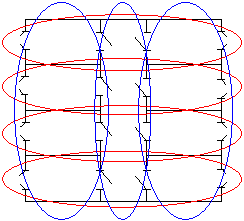
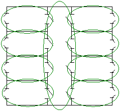
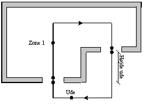
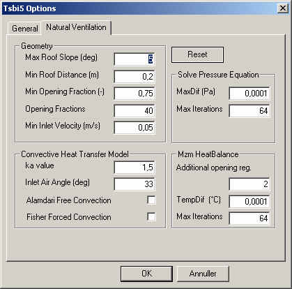

<link rel="stylesheet" href="../style.css">

# Implementering af mzm

I denne del af sektionen beskrives implementeringen af multizone modellen i BSim. Sektionen indledes med et afsnit  om ombygningen af modeller i BSim, der benytter multizone modellen til beregning af naturlig ventilation. Der tages udgangspunkt i enkeltzonemodellen med en forklaring af de væsentligste ting der indgår ved modelopbygning. Derefter præsenteres de nye og ændrede ting der gælder for brug af multizone modellen.

Efter præsentationen af modelopbygningen beskrives opstillingen af ligningssystemet. Herunder generering af det udspændende træ og ringene, samt opstillingen af beregningsmatricerne.

Denne del afsluttes med en beskrivelse af hvordan det opstillede ligningssystem løses.

### **Opbygning af BSim model**

I dette afsnit beskrives den del af opbygningen af en BSim model, der har med mzm at gøre. Beskrivelsen tager udgangspunkt i en beskrivelse af enkeltzonemodellen (ezm) med vægt på de nye ting der er tilføjet med mzm. 

#### **Præsentation enkeltzonemodellen**

De ting der blev indført med enkeltzonemodellen var: 

*   Valg af vindprofil for grunden

*   Valg af termiske zoner

*   Definere åbninger

*   Valg af CP-værdier

*   Regulering af naturlig ventilation

Disse punkter vil kort blive gennemgået i det følgende. 

#### **Valg af vindprofil**

På bygningsniveau vælges et vindprofil der benyttes til at beregne vindhastigheden i andre højder end 10 m - hvor vindhastigheden i vejrdata er målt.

Vindhastigheden beregnes efter (British Standard):

$$ V_h = V_ {10} \cdot k \cdot h^{\alpha} \tag{1} $$

hvor: 

Vh er vindhastigheden i højden h [m/s]   
V10 er den meteorologiske vindhastighed i åbent land i 10 meters højde [m/s]   
*h* er den aktuelle højde over terræn [m]   
*k* er en faktor, afhængig af terræn, Tabel 1 [-]   
*α* er en eksponent, afhængig af terræn, Tabel 1 [-]

| Terræntype                      | k    | α    |
|----------------------------------|------|------|
| Åbent, fladt land                | 0,68 | 0,17 |
| Landskab med spredt bevoksning   | 0,52 | 0,20 |
| Forstadsområder                  | 0,35 | 0,25 |
| Bycentrum                        | 0,21 | 0,33 |
*Tabel 1 Faktorer til karakterisering af forskellige terrænformer*

#### **Valg af termiske zoner**

Ved brug af enkeltzonemodellen er det nødvendigt at overveje hvilke af bygningens rum der skal indgå i de termiske zoner. Ved en normal termisk beregning kan de rum, der har samme termiske egenskaber, med fordel placeres i sammen termiske zone. Dette gælder fx ensartede kontorer med samme orientering, som vist med blå cirkler på figur 1. Ved modellering af tværventilation med enkeltzonemodellen vil rummene imidlertid skulle inddeles i termiske zoner svarende til de røde cirkler.

<figure id="center_img">

<figcaption>Figur 1. Forskellig inddeling af rum i termiske zoner. Blå cirkler svarer 
til inddeling efter termiske hensyn og røde cirkler svarer til inddeling 
efter hensyn til naturlig ventilation med enkeltzonemodellen.</figcaption>
</figure>

#### **Definition på åbninger**

For at kunne beregne luftskifte ved naturlig ventilation skal der defineres nogle åbninger som luften kan strømme igennem. BSim har to typer af åbninger; huller og WinDoors. Huller er huller i konstruktionerne og kan ikke reguleres. Windoors dækker over vinduer og døre, som kan reguleres.

Som standard er huller aktiveret, mens WinDoors ikke er aktiverede. På figur 2 ses dialogerne til angivelse af konstanter og aktivering af WinDoors. Begge typer åbninger modelleres ved hjælp af udløbskoefficientmodellen, og skal derfor tildeles en Cd-værdi.

For WinDoors skal der også angives, hvor stor en del af arealet der kan åbnes, og i hvilken højde det åbne areals centrum ligger. En WinDoor har et endeligt antal åbningsgrader, som kan specificeres af brugeren. Benyttes 10 åbningsgrader kan det aktive areal være 0, 10, 20, … % af det areal der kan åbnes.

Der kan/skal kun defineres åbninger i klimaskærmen, da enkeltzonemodellen regner alle rum i den termiske zone som et stort sammenhængende rum. Det skal derfor overvejes om der er modstand mellem rummene i den termiske zone, da disse ikke medtages i beregningerne. Modstand fra interne åbninger kan medtages ved åbningerne i klimaskærmen.

<figure id="center_img">

<figcaption>Figur 2. Dialoger til aktivering af huller og WinDoors i enkeltzonemodellen.</figcaption>
</figure>

#### **Valg af CP-værdier**

De benyttede CP-værdier stammer fra ([Orme et al. 1998](https://help.bsim.dk/support/kb/articles/A93zbqQ0/litteratur)) og er middelværdier for fladerne. Brugeren kan ikke selv angive CP-værdier. Orme et al. (1998) angiver CP-værdier for kvadratiske bygninger og bygninger med et sideforhold på 1:2. Der er ligeledes angivet CP-værdier for forskellige taghældninger. BSim vælger CP-værdier på baggrund af modellens geometri. *Det er derfor vigtigt at der opbygges tilpas meget af bygningen til at BSim vælger de rigtige CP-værdier.*

CP-værdierne findes for tre forskellige grader af læ fra de omkringliggende bygninger og angives som en egenskab på den udvendige side af åbningen, se figur 3.

<figure id="center_img">

<figcaption>Figur 3. Angivelse af graden af læ fra omkringliggende bygninger.</figcaption>
</figure>

#### **Regulering af naturlig ventilation**

Enkeltzonemodellen aktiveres fra systemet [*Venting*](https://help.bsim.dk/support/kb/articles/gWKDJlmp/venting-system). [*Venting* ](https://help.bsim.dk/support/kb/articles/gWKDJlmp/venting-system)er et kølesystem, og kommer dermed kun i drift hvis temperaturen i den termiske zone, der reguleres efter, overskrider det ønskede setpunkt.

Hvis der er behov for køling, beregner BSim hvor meget luft der er behov for og vælger den åbningsgrad af vinduerne der giver et luftskifte tættest muligt på den krævede luftmængde. Reguleringen virker på samme måde, hvis [*Venting* ](https://help.bsim.dk/support/kb/articles/gWKDJlmp/venting-system)styres efter CO2 niveauet.

#### **Hvad er nyt med multizone modellen?**

I dette afsnit omtales de forhold der har ændret sig i opbygningen af en BSim model, hvor multizone modellen benyttes.

**Termiske zoner**

Med implementeringen af multizone modellen vil inddelingen af de termiske zoner med fordel kunne foretages efter de blå cirkler på figur 1, svarende til hvad der er termisk mest korrekt. Hvis det var muligt at angive CP-værdier på åbningsniveau, ville det være nødvendigt at inddele alle rummene i en termisk zone, som vist på figur 4.

<figure id="center_img">

<figcaption>Figur 4. Inddeling af rum i termiske zoner ved beregning med multizone modellen.</figcaption>
</figure>

#### **Interne åbninger**

Da multizone modellen tager hensyn til de interne åbninger, skal de åbninger der ønskes benyttet til overførsel af luft aktiveres på samme måde som åbninger til omgivelserne.

#### **Hvad er ændret med multizone modellen?**

I dette afsnit beskrives de ændringer der sket i forbindelse med simulering i BSim (tsbi5), hvor multizone modellen benyttes.

#### **Iteration**

Den største ændring, der er sket med indførelsen af multizone modellen, er at tsbi5 skal iterere under simuleringen, hvilket ikke var nødvendigt før.

Det har været nødvendigt at indføre tre iterationer, der knytter sig til:

*   Multizone modellen

*   Samspil mellem multizone modellen og varmebalancen

*   Reguleringen af vinduerne

Indførelsen af iterationer betyder at brugeren kan blive nødt til (bør) forholde sig til konvergenskriterier og det maksimale antal af iterationer der tillades.

På figur 5 er vist en foreløbig dialogboks, hvor det er muligt at kontrollere de tre iterationer. For de to første iterationer skal der angives et konvergenskriterium og et maksimalt antal iterationer, der sikrer at simuleringen ikke strander under uheldige omstændigheder. For den tredje iteration, regulering af vinduerne, skal der angives antallet af åbningsgrader, samt et tillæg til åbningsgraderne der benyttes til at bestemme det maksimale antal iterationer. De tre iterationer er forklaret i detaljer i afsnittet [*Regulering af multizonemodellen*](https://help.bsim.dk/support/kb/articles/7mawyJ9E/regulering-af-multizone-modellen) og [*Modellering af naturlig ventilation og natkøling - ved hjælp af ringmetoden*](https://help.bsim.dk/support/kb/articles/A93zbqQ0/litteratur).

<figure id="center_img">

<figcaption>Figur 5. Dialogboks med indstillingerne for bl.a. de tre iterationer. Dialogen åbnes ved at kikke på "Edit + Options" med tsbi5 aktiveret.</figcaption>
</figure>

#### **Ubalance i mekanisk ventilation**

Multizone modellen tager hensyn til ubalance i den mekaniske ventilation, således at den forskel, der er mellem indblæsning og udsugning fra det mekaniske ventilationssystem, bliver medtaget i multizone modellens massebalance.

Det vil sige at udsugninger fra fx toiletter og køkkener vil kunne medtages, hvis multizone modellen aktiveres for de pågældende termiske zoner. *Ændringen, ved at multizone modellen medregner forskelle i mekanisk ventilation, er at den luft der skal tilføres den enkelte zone ikke behøver at være udeluft. Det vil sige at luften til en termisk zone, hvor der udsuges, kan tilføres en eller flere andre zoner og blive transporteret rundt i bygningen inden den udsuges*.

#### **Tilpasning af programkoden**

Da BSim kun kan regne på zoneniveau (egentlig flader der vender mod samme luftknude) og derfor ikke "kender" til andre zoner i bygningen, har det været nødvendigt at få BSim til at "kende" de andre zoner. Dette har været nødvendigt da mzm har behov for informationer om alle de indgående zoner på samme tid.

## **Opstilling af ringene**

I dette afsnit beskrives opstillingen af ringene. Afsnittet er inddelt i tre hoveddele:

*   Identifikation af knuder og grene

*   Opstilling af det udspændende træ

*   Opstilling af uafhængige ringe

### **Identifikation af knuder og grene**

I dette afsnit beskrives hvordan der oprettes knuder og grene på baggrund af BSim modellen. Formålet med oprettelsen af knuderne og grenene er at kunne forbinde de termiske zoner gennem de åbninger hvor multizone modellen kan aktiveres.

Ved opstillingen af knuder og grene medtages alle åbninger der er aktiverede, dvs. huller samt WinDoors hvor arealet er forskelligt fra 0.

#### **Knuder** 

Der er overordnet to typer af knuder:

*   Zoneknuder

*   Åbnings knuder

Zoneknuderne er knyttet til de termiske zoner og omgivelserne. Der defineres én knude i de termiske zoner der indeholder åbninger der er aktiveret. Knuden placeres i samme højde som *SensorHgt* (figur 6). *SensorHgt* angiver i hvilken højde temperaturen i den termiske zone registreres (reguleres efter). Dette er kun relevant når der regnes med lodret temperaturgradient i den termiske zone. Ved beregning med lodret temperaturgradient benyttes [Kappa-modellen](https://help.bsim.dk/support/kb/articles/yWogRdWD/kappa-modellen-modelbeskrivelse).

<figure id="center_img">

<figcaption>Figur 6. Dialogboks med egenskaber for en termisk zone. SensorHgt angiver i hvilken højde systemerne måler temperaturen.</figcaption>
</figure>

For hver åbning defineres to knuder. En på hver side af åbningen. Knuderne placeres midt i den aktiverede del af åbningen.

#### **Grene** 

Der oprettes grene

*   mellem knuderne for alle åbninger

*   mellem omgivelserne og de eksterne knuder for alle eksterne åbninger

*   mellem zoneknuderne og den interne knude i alle åbninger i zonen

#### **Lister med knuder og grene**

Der oprettes to lister der indeholder hhv. alle knuder og alle grene. Listerne kan ses ved at vælge "chek" fra "[Simulation](https://help.bsim.dk/support/kb/articles/DQ2xjyWV/tsbi5-simulation)" fanebladet i tsbi5. Listerne heder "Nodes" (knuder) og "Arches" (grene).

### **Opstilling af det udspændende træ**

Opstilling af det udspændende træ skal kun inkludere de zoner der, evt. gennem andre zoner, er forbundet med omgivelserne. Det vil sige at der ikke kan regnes på luftudveksling mellem to termiske zoner, hvis disse ikke, evt. gennem andre zoner, er forbundet med omgivelserne, se figur 7.

<figure id="center_img">

<figcaption>Figur 7. BSim model med to interne åbninger og ingen eksterne. Multizone modellen bliver ikke aktiveret.</figcaption>
</figure>

Ved opstilling af det udspændende træ er det valgt altid at starte i knuden for omgivelserne. Træet opstilles ud fra følgende systematik efter ([Savić et al. 1996](https://help.bsim.dk/support/kb/articles/A93zbqQ0/litteratur)) , kaldet ”depth-first-search”. N er antallet af Nodes (knuder) og P er antallet af pipes (grene). Beregningsgangen i opstillingen af det udspændende træ forklares i det følgende:

1.  *Associate label DFI(n) = 0, n = 1,2,…,N, with each node in the base graph* 

2.  *Set j = 1* 

3.  *Initialize a set of arcs within the growing tree At = []* 

4.  *Identify the starting node ns at random or as being the “root” of the base graph* 

5.  *Initialize a set of nodes contained within the growing tree C = [ns], and set DFI(ns) = j* 

6.  *Identify Aa(ns) = [arcs in base graph connected to node ns]* 

7.  *Identify end-points E(ns) of the arch in Aa(ns)* 

8.  *Eligible adjacent nodes to ns are endpoints that are not contained within the growing tree; i.e., A(ns) = E(ns) – [E(ns) ∩ C]* 

9.  *If A(ns) is an empty set, A(ns) = []; i.e., there is no adjacent node that is not yet in the growing tree, then*   

    1.  *DFI(ns) = 0* 

    2.  *j = j - 1* 

    3.  *Find a node ns‘ ⊂ C for which DFI(ns’) = j* 

    4.  *ns = ns‘* 

    5.  *Go to step 6* 

10.  *If A(ns) is a nonempty set, i.e. A(ns) ≠ [], then*   

      1.  *j = j + 1* 

     2.  *Associate DFI(n) = j with each node n ⊂ A(ns)* 

     3.  *Choose one node ns‘ from A(ns) at random* 

       4.  *C = C + [ns‘]* 

       5.  *At = At + [arc whose endpoints are ns and ns‘]* 

       6.  *ns = ns‘* 

11.  *Repeat from step 6 until all nodes have been added to the connected set, i.e., a spanning tree is formed* 

 

Listerne *At* og C gemmes og der laves desuden en liste af grene der ikke er brugt til det udspændende træ, *Act*, et såkaldt ”co-tree”. Denne liste bliver brugt ved opstillingen af ringene.

#### **Forklaring af beregningsgang ved opstilling af det udspændende træ**

Forklaringen af beregningsgang ved opstilling af det udspændende træ bygger på figur 8 fra ([Savić et al. 1996](https://help.bsim.dk/support/kb/articles/A93zbqQ0/litteratur)).

Beregningsgangen er:

1.  Der benyttes listerne ”Nodes” og ”Arches”

2.  Der oprettes to nye lister ”Node list” og ”Arche list”

3.  Udeknude findes (a), Udeknuden tilføjes i ”Node list”

4.  Der vælges en tilfældig naboknude (b), knuden samt grenen der forbinder de to knuder tilføjes til ”Node list” hhv. ”Arche list”. Knuderne og grenene tilføjes i rækkefølge

5.  Fra knude 3 vælges en tilfældig naboknude der ikke allerede findes i ”Node list”, knuden og grene tilføjes de to lister

6.  Punkt 5 gentages indtil der nås en knude, hvor alle naboknuderne allerede er tilføjet ”Node list” (d)

7.  Fokus flyttes nu fra den aktuelle knude til de tidligere knuder i ”Node list” i modsat rækkefølge af hvilken de er tilføjet. Dvs. (d) 2 - 4 - 3 -1. Der stoppes ved den første knude der har en naboknude der ikke er indeholdt i ”Node list”. I dette tilfælde stoppes allerede ved knude 4. Der fortsættes nu med punkt 5, 6 og 7 indtil der ikke er flere knuder der kan tilføjes.

 

<figure id="center_img">

<figcaption>Figur 8. Forklaring af opstilling af det udspændende træ, (Savi? et al. 1996).</figcaption>
</figure>

#### **Rutiner til sikring af korrekt opstilling af det udspændende træ** 

Der laves en reduktion af listerne, så de kun indeholder knuder og grene fra de zoner der er multizoner. De zoneknuder der er benyttet til opstilling af det udspændende træ er multizoner, og de resterende zoner er ikke. Listerne Nodes og Arches reduceres, så de kun indeholder knuder fra multizoner, omgivelserne og grene der knytter sig til åbninger mellem multizoner og mellem multizoner og omgivelserne.

Hvis alle grenene bliver brugt til opstilling af træet, vil modellen ikke indeholde nogen ringe og dermed vil multizone modellen ikke blive aktiveret. Dette svarer til at grenene nr. 1, 3, 6 og 7 mangler på figur 8 og det vil derfor være umuligt at lave en ring.

### **Opstilling af ringene**

Opstilling af ringene sker ud fra følgende systematik efter ([Savić et al. 1996](https://help.bsim.dk/support/kb/articles/A93zbqQ0/litteratur)), kaldet "breath-first-search". Beregningsgangen i opstillingen af ringene forklares i det følgende:

1.  *Associate label BFI(n) = 0, n = 1,2,…,N, with each node in the base graph* 

2.  *Set j = 1* 

3.  *Choose one of the arcs from the co-tree set ai ∈ Act*

4.  *Initialize a set of arcs within the ring L = [ai]* 

5.  *Identify the endpoints ni and ni’ of the co-tree arc ai*

6.  *Initialize a set of nodes contained within a queue Q = [ni], and set BFI(ni) = j* 

7.  *Identify Aa = [arcs in the tree set At connected to nodes in the queue Q]* 

8.  *Identify endpoints E of the arcs in Aa that are not labelled, i.e., BFI(n) = 0 for all n ∈ E* 

9.  *Set Q = []*  

    1.  *Set j = j + 1* 

    2.  *Associate BFI(n) = j with each node n ∈ E* 

    3.  *Set Q = E* 

10.  *Repeat from step 7 until ni’ acquires a label* 

11.  *Retrace back from ni’ to ni (using the tree arcs At) in decreasing order of BFI. The arcs belonging to the ring are stored in L* 

 

Der gemmes en liste med alle ringene, der hver er gemt i variablen L.

#### **Forklaring af beregningsgang ved opstilling af ringene**

Antallet af ringe der skal opstilles er lig med antallet af grene i *Act*. For hver gren i *Act* opstilles en ring der indeholder færrest mulige grene. Ringen opstilles ved udelukkende at bruge grene fra det udspændende træ. Det vil sige at ingen af de andre grene i *Act *indgår.

Måden ringene opstilles på er beskrevet nedenfor. Der tages udgangspunkt i figur 8, (f) og der beskrives opstillingen af ringen for gren nr. 1:

1.  Start med en gren fra *Act* (g1)

2.  Vælg den ene af grenens knuder (k1)

3.  Find alle de grene der er forbundne med knude k1 og som tilhører det udspændende træ (g2). Giv dem et fortløbende nummer (#1)

4.  Gentag punkt 2 og 3 indtil den anden knude af startgrenen er fundet (k2)   

    1.  k3 | g5 | #2

    2.  k4 | g8, g4 | #3

    3.  k2, k6 ⇒ Knude k2 fundet

5.  Ringens grene findes ved at gå baglæns tilbage gennem listerne med grene.   

    1.  Fra knude k2 vælge grene med #3 som hører til knude k2 ⇒ g4

    2.  Fra knude k4 vælge grene med #2 som hører til knude k4 ⇒ g5

    3.  Fra knude k3 vælge grene med #1 som hører til knude k3 ⇒ g2

    4.  Ringen består så af: g1 - g4 - g5 - g2 og k2 - k4 - k3 - k1

 

Da samtlige mulige veje medtages hver gang ved hver knude, vil det altid være den ring med den korteste vej (færrest antal grene) der findes først.

#### **Opstilling af overordnet ring-system**

Ved simuleringsstart gennemføres en initiering der opstiller det overordnede ring-system - det der eksisterer når alle åbninger er åbne, og alle multizoner er aktiverede. Dette system danner udgangspunkt for opstilling af ring-systemer under simuleringen.

#### **Opstilling af ring-system på timeniveau**

Ved starten af hver time opstilles det aktuelle ring-system på baggrund af de zoner og åbninger der er aktiveret for den pågældende time. Opstillingen af ring-system sker på baggrund af det overordnede ring-system bestemt ved initieringen. Det vil sige at der kun behandles de zoner hvor det er muligt at benytte multizone modellen.

#### **Opstilling af ring-system på simuleringsniveau**

På tidsskridtniveau kan vinduerne ændre status fra åben til lukket eller lukket til åben på grund af reguleringen. Hvis nogle af vinduerne skifter fra åben til lukket eller omvendt opstilles ring-systemet på ny.

Der tages hensyn til at de termiske zoner kan skifte kategori, fx at en multizone kan blive en enkeltzone ved at de interne åbninger lukkes.

## **Opstilling af beregningsmatricer**

I dette afsnit beskrives opstillingen af beregningsmatricerne. Beregningsmatricerne opstilles ud fra det aktuelle ring-system, zonerne og åbningernes karakteristika, samt drivtryk fra vind og termik.

Ved opstillingen benyttes en simplificeret version af ringene. De grene der forbinder zoneknuderne med åbningerne giver ingen modstand og er derfor udeladt ved opstillingen af beregningsmatricerne, se evt. figur 9.

Beregningsmatricerne opstilles med luftstrømmen som ubekendt. Det er mest praktisk, da denne bruges ved beregningen af modstanden gennem de enkelte åbninger og indgår ved sikringen af massebevarelse.

### **Overordnede bevarelseskrav**

Ligningssystemet opstilles så der sikres masse- og energibevarelse.

#### **Massebevarelse**

For zonerne gælder kontinuitetsligningen, der siger at den mængde luft (masse) der tilføres skal være lig den mængde luft der fjernes:

$$ \sum \dot m_{ind} - \sum \dot m_{ud} = \dot m_{resulterende,fjernet} $$

og

$$ \dot m_{resulterende,fjernet} = \dot m_{mekanisk, fjernet} - \dot m_{mekanisk, tilført} $$

hvor: 

*mind * er massestrømmen ind i zonen gennem åbningerne [kg/s]   
*mud* er massestrømmen ud fra zonen gennem åbningerne [kg/s]   
*mresulterende,fjernet* er den resulterende massestømmen fjernet ved mekanisk ventilation [kg/s]  
*mmekanisk,fjernet* er massestrømmen ud fra zonen gennem mekanisk ventilation [kg/s]  
*mmekanisk,tilført* er massestrømmen ind i zonen gennem mekanisk ventilation [kg/s]

#### **Energibevarelse**

For ringene gælder energibevarelsesligningen, der siger at energitabet på grund af friktion (modstand) i ringen er lig med den energi der tilføres til ringen, her vind og termik:

$$ p_{Tab, Ring} = \sum \frac{\rho \cdot \dot V_i^2}{2\cdot c_d^2 \cdot A_i^2} $$

hvor:

*ΔPTab,Ring* er tryktabet i ringen fra åbningerne [Pa]  
*ρ* er luftens massefylde [kg/m³]  
*Vi* er volumenstrømmen gennem åbningen [m³/s]  
*Cd *er gennemstrømningskoefficienten [-]  
*Ai *er arealet af åbningen [m²]

og

$$ P_{Tab, Ring} = \Delta P_{Opdrift} \cdot \Delta P_{vind} $$

hvor: 

*ΔPOpdrift* er drivtrykket fra termikken [Pa]  
*ΔPVind* er drivtrykket fra vinden [Pa]

For alle ringene skal der defineres en positiv omløbsretning. Den positive omløbsretning for de enkelte ringe defineres som den retning der giver positivt drivtryk

Der skal ligeledes defineres en positiv strømningsretning for de enkelte grene. Denne defineres som positiv fra grenens knude (0) til knude (1).

Grenene vendes så det sikres at de har samme positive retning som ringen. Sådan at den anden (sidste) knude for hver gren er den første i den næste.

Det samlede ligningssystem består af to dele. En del for ringene der sikrer energibevarelse og en del for knuderne der sikrer kontinuitetsbevarelse. Begge systemer er af typen:

$$ [M_1][V_1] = [V_2] $$

hvor:

M er en matrice  
V er en vektor

### **Eksempel til opstilling af beregningsmatricer**

På figur 9 er vist en skitse af en BSim model med knuder, grene og ringe. Knuder og grene er nummereret fortløbende fra 0, og grenenes numre er understreget. Modellen består af to termiske zoner og fire åbninger. Dette giver to ringe der er vist med hhv. røde og grønne pile.

Som beskrevet tidligere benyttes kun de grene der tilhører en åbning. Det er for figur 9 gren nummer 1, 4, 7 og 10. Strømningen gennem disse grene betegnes efterfølgende med Q og modstanden over åbningerne med c.

Ringene betegnes a og b, hvor den røde ring er benævnt a og den grønne b. Den positive omløbsretning for ringene er vist med pile.

<figure id="center_img">

<figcaption>Figur 9. Skitse af BSim model med knuder, grene og ringe. Knuder og grene er nummereret fortløbende fra 0 og grenenes numre er understreget. De stiplede pile viser den positive omløbsretning for de to ringe.</figcaption>
</figure>

### **Ligningssystem for ringene (energibevarelse)**

Ligningssystemet består af en matrice med modstandene for åbninger i de enkelte ringe, en vektor med strømmen gennem de enkelte åbninger, samt en vektor med drivtrykkene for de enkelte ringe:

<figure id="center_img">

<figcaption></figcaption>
</figure>

Det her opstillede ligningssystem sikrer at voluminet af den luft der strømmer til en zone er lig voluminet af den luft der strømmer fra zonen. Dette sikrer ikke opfyldelse af kontinuitetsbetingelserne, da vægten af luften er forskellig. Derfor skal densiteten af luften ganges på matricen. Densiteten afhænger af strømningsretningen og skal derfor beregnes afhængig af dette. Det vil sige at densiteten fra den zone luften kommer fra benyttes.

Dette gælder for positive værdier af Qn. For negative værdier af Qn skal densiteten tages ved den anden knude. Ovenstående formel kommer under forudsætning om positiv strømning i begge ringe til at se ud som følgende (bemærk at fortegnene er bevaret):

<figure id="center_img">

<figcaption></figcaption>
</figure>

Ligeledes for "differencen i mekanisk ventilation" er det forskellen i udsuget masse, hvilket betyder at densiteten på den indblæste og den udsugede luft skal ganges på volumenstrømmene, inden de subtraheres.

#### **Samlet ligningssystem**

De to ligningssystemer samles til ét, ved at samle de to matricer, vektorerne med drivtrykkene og differencen i den mekaniske udsugning:

<figure id="center_img">

<figcaption></figcaption>
</figure>

#### **Drivtryk fra opdrift**

Drivtrykket fra opdrift kan beregnes på baggrund af forskelle i vægten af luften mellem de åbninger luften strømmer igennem.

I BSim regnes der som standard med fuld opblanding og dermed ensartede lufttemperaturer i de enkelte zoner. Der kan også regnes med en lineær lodret temperaturgradient. Det generelle udtryk for vægten af luft beregnes efter ([Hansen et al. 1997](https://help.bsim.dk/support/kb/articles/A93zbqQ0/litteratur)):

$$ p = \frac{m}{V} = 0,0034837 \cdot \frac{p}{T} - 0,0013169 \cdot \frac{p_d}{T} $$

Hvor: 

*ρ* er massefylden [kg/m³]  
*m* er massen [kg]  
*V* er voluminet [m³]  
*p* er total tryk, partialtryk [Pa]  
*pd* er total tryk, vanddamp [Pa]  
*T* er temperaturen [K]

Densitetsforskellene omregnes til trykforskelle under forudsætning af hydrostatisk trykfordeling, der generelt er givet ved:

$$ \Delta p_{e (\Delta Z_{i,j})} = - \int_{z_i}^{z_j} g \rho_e(z) dz $$

Hvor:  
*Δp* er tryk forskellen [Pa]  
*g* er tyngdeaccelerationen [m/s²]  
*z* er koten [m]

Da luftens massefylde er omvendt proportional med temperaturen giver integrationen forskellige udtryk for zoner med og uden lodret temperaturgradient.

#### **Densitet af fugtig luft uden lodret temperaturgradient**

Ved konstant temperatur giver integrationen af ovenstående følgende:

$$ \Delta p_{e (\Delta Z_{i,j})} = - \rho_e g\Delta z_{i,j} $$

#### **Densitet af fugtig luft ved lineær lodret temperaturgradient**

Ved lineær lodret temperaturgradient giver integrationen af ovenstående følgende:

$$ \Delta p_{e (\Delta Z_{i,j})} = - g \cdot \frac{K_1}{K_2} \left[ \ln(T_j + K_2 z_j) - \ln(T_i + K_2 z_i) \right]  $$

hvor K1  og K2 er givet ved:

$$ K_1 = 0,0034837 \cdot p - 0,013169 \cdot p_d $$

Hvor:  
*p* er total tryk, partialtryk [Pa]  
*pd* er total tryk, vanddamp [Pa]

$$ K_2 = \frac{T_j - T_i}{z_j - z_i} $$

Hvor:  
*z* er koten [m]   
*T* er temperaturen [K]

### **Implementering i BSim**

I dette afsnit beskrives implementeringen af beregningerne af det termiske drivtryk.

#### **Kote-definitioner**

Til beregning af drivtrykkene fra termik skal koterne for åbningerne bruges. Alle åbninger har to knuder, der kan være i vilkårlig kote.

For eksterne åbninger benyttes koten for knuden der vender mod ude. Dette giver i langt de fleste tilfælde den korrekte højde ved beregning af drivtrykkene, se Figur 10 og Figur 11.

For interne åbninger benyttes gennemsnittet af de to knuders koter.

Alle ændringer i temperatur, fugtighed og densitet sker ved knuden for omgivelserne, hvorfor luften i alle åbninger regnes som indeluft. For interne åbninger antages ændringerne at ske midt i åbningen.

<figure id="center_img">

<figcaption>Figur 10. Illustration af åbningernes knuder og definitionen af de brugte koter.</figcaption>
</figure>

 

<figure id="center_img">

<figcaption>Figur 11. Model med to vandrette åbninger. Kote definitionen medfører en fejl i beregningen af højdeforskellen.</figcaption>
</figure>

#### **Beregning**

Der udføres en integration for hver af de zoner der er indeholdt i ringen, og for omgivelserne hvis ringen indeholder knuden for udeluften. For hver zone findes koten for de to åbninger der indgår i ringen, og det termiske drivtryk beregnes efter formel (18.12), hvis [Kappa](https://help.bsim.dk/support/kb/articles/MQvEaomY/baggrund) er lig 1 eller formel (18.13) hvis [Kappa](https://help.bsim.dk/support/kb/articles/MQvEaomY/baggrund) er forskellig fra 1.

### **Drivtryk fra vind**

Overordnet kan en ring enten indeholde den eller ikke indeholde knuden for omgivelserne. Hvis ringen ikke indeholder omgivelserne er det en intern ring, og dermed vil drivtrykket ikke være påvirket af vinden. Indeholder ringen knuden for omgivelserne vil der altid være præcis to bidrag fra vinden. Dette fordi ringen starter ude, derefter skal ind i bygningen og endelig skal ud af bygningen for at slutte ved knuden for omgivelserne. Da der kun er én knude for omgivelserne, vil en ring aldrig passere bygningens klimaskærm mere end to gange, da det vil betyde at knuden for omgivelserne skulle passeres mere end en gang, se evt. Figur 9.

For de ringe der indeholder knuden for omgivelserne bestemmes drivtrykket fra vinden som:

$$ \Delta P_{vind} = \Delta C_P \cdot \frac{\rho \cdot U_{ref}^2}{2} $$

Hvor:  
*ΔCP* er forskellen mellem de to *CP* værdier [-]   
*Uref* er reference vindhastigheden, beregnet ved det højeste punkt på bygningen [m/s]

$$ \Delta C_P = C_{P, første} - C_{P, anden} $$

Den første *CP*-værdi er altid knyttet til den knude i gren nummer 2 i ring-listen, der vender mod ”ude” og den anden *CP*-værdi er altid knyttet til den knude, i den sidste gren i ring-listen, der vender mod ”ude”, hhv. knude 9 og 2 på figur 9.

På punktform ser bestemmelsen af drivtrykket fra vinden sådan ud:

*   Indeholder ringen knuden for omgivelserne?

*   Hvis nej

*   *Δpvind* lig 0  

    *   Hvis ja

*   Find *CP* for den anden gren i listen og den sidste gren i listen (knude nummer 2 og n-1)

*   Beregn *ΔCP* efter formel (18.17) og *ΔPvind* efter formel (18.16)

### **Samlet drivtryk**

Det samlede drivtryk er summen af drivtrykket fra vind og termik:

$$ \Delta P_{Total} = \Delta P_{Termisk} + \Delta P_{Vind} $$

Det samlede drivtryk for en ring er summen af de enkelte bidrag langs ringen regnet med fortegn. Bidragene regnes positivt hvis de virker til at drive luft i den retning der er defineret som positiv for ringen.

$$ \Delta P_{Total} = g \sum - \int_{z_i}^{z_j} \rho_e (z) dz + \Delta C_P \frac{\rho \cdot U_{ref}^2}{2} $$

### **Opstilling af modstande**

Den samlede modstand i en ring afhænger af strømningsmængden. Strømningsmængden vil altid være præcis så stor at modstanden i ringen er lig med drivtrykket, da luften ellers ville blive accelereret.

Der findes mange forskellige udtryk til beregning af modstanden (trykfaldet) gennem en åbning eller over en komponent som funktion af strømningen. Her er kun den klassiske orifice model implementeret:

$$ Q = C_d \cdot A \cdot \sqrt{\frac{2 \Delta P}{\rho}} $$

Hvor:  
*Q* er strømningen [m³/s]   
*Cd* er udløbskoefficienten [-]   
*A* er arealet af åbningen [m²]   
*ΔP* er tryktabet over åbningen [Pa]

eller givet ved trykforskellen:

$$ \Delta P = Q^2 \frac{\rho}{C_d^2 \cdot A^2 \cdot 2} $$

Da det er valgt at benytte LTM ved løsning af ligningssystemet skal tryktabet over åbningerne lineariseres mht. Q:

$$ \Delta P = Q \cdot \frac{Q \cdot \rho}{C_d^2 \cdot A^2 \cdot 2} \Rightarrow \Delta P = Q \cdot C $$

hvor C er lig

$$ C = \frac{Q \cdot \rho}{C_d^2 \cdot A^2 \cdot 2} $$

# **Løsning af ligningssystem**

Det samlede ligningssystem er givet ved (formel (18.9)):

<figure id="center_img">

<figcaption></figcaption>
</figure>

### **Initiering**

Ved starten af en beregning skal ligningssystemet initieres. Ligningssystemet skal løses mht. Q, hvorfor disse er ukendte. Drivtrykkene og evt. ubalance i den mekaniske ventilation er konstante for beregningen. Massefylden af luften (den nederste del af modstansmatricen) er også konstant, men hvis fortegnet for Q ændres skal masseflyderne opdateres idet luften kommer fra nabozonen.

Modstandsmatricens elementer er for den øverste del givet ved, (18.23):

$$ C = \frac{Q \cdot \rho}{C_d^2 \cdot A^2 \cdot 2}  $$

Da modstandende ikke alle må være nul, skal strømningen, Q, være forskellig fra nul. Der gættes på en strømning gennem åbningerne. Ved den første beregning sættes strømningen lig 1. Ved de efterfølgende beregninger benyttes strømningen fra sidste beregning.

#### **Betydning af startgæt for strømningerne, Q**

Da startgættet kun benyttes ganske få gange har det ikke speciel stor indflydelse på beregningshastigheden. Da gættet heller ikke har nævneværdig indflydelse på om ligningssystemet konvergerer, er en værdi på 1 udemærket. Det tages ikke hensyn til massebevarelse ved initieringen (fortegnet af Q), og der vil derfor være zoner der får tilført mere luft end der fjernes.

For de modeller der er undersøgt har ligningssystemet konvergeret i løbet af ca. 14 iterationer med Q lig 1 på trods af, at der ikke har været massebalance.

For de samme modeller konvergerer ligningssystemet i løbet af knap 2 iterationer, når strømningerne fra sidste beregning anvendes.

#### **Løsningsmetode for ligningssystemet**

Til løsning af ligningssystemet benyttes simpel Gauss reduktion. Koden er opbygget med udgangspunkt i ([William et al. 2002](https://help.bsim.dk/support/kb/articles/A93zbqQ0/litteratur)).

#### **Løsningsgang**

Løsningsgangen for ligningssystemet er angivet på punktform nedenfor:

1.  Opstilling af ligningssystem

2.  Initiering af ligningssystem

3.  Løsning af ligningssystemet

4.  Opdatering af modstandsmatrice på baggrund af nye værdier af Q (både modstand og massefylde)

5.  Løsning af ligningssystemet

6.  Kontrol af konvergenskriterier - er ligningssystemet konvergeret?

7.  Punkt 4 til 6 gentages indtil ligningssystemet er konvergeret

#### **Konvergenskriterium** 

Konvergenskriteriet er beregnet efter nedenstående udtryk. Drivtrykket sammenlignes med modstanden over åbningerne beregnet efter (18.21). Den maksimale afvigelse skal være mindre end konvergenskriteriet "MaxDif".

$$ \max \left( |\Delta P_{Total} - \Delta P_{Modstand}| \right) \leq MaxDif $$

Hvor:  
*ΔPTotal* er det samlede drivtryk for den enkelte ring [Pa]  
*ΔPModstand* er modstanden gennem åbningerne [Pa]  
MaxDif er konvergenskriteriet [Pa]

Konvergenskriteriet er som standard sat til 0,01 Pa. Brugeren har mulighed for at angive et andet konvergenskriterium, figur 12.

<figure id="center_img">

<figcaption>Figur 12. Dialogboks, hvor brugeren har mulighed for at angive konvergenskriteriet. Dialogen åbnes ved at klikke på "Edit + Options" når tsbi5 er aktiveret.</figcaption>
</figure>

For at sikre at simuleringen ikke kører fast, må der kun itereres et givent antal gange, svarende til "Max Iterations". Dette antal er som standard 32. Brugeren har, som for konvergenskriteriet, mulighed for at angive et andet antal maksimalt tilladte iterationer, figur 12.

## **Sammenspil mellem BSim og multizone modellen**

I denne del beskrives sammenspillet mellem BSim og multizone modellen. Først beskrives tankerne bag og systematikken i den udviklede regulering. Derefter beskrives implementeringen af den udviklede regulering, og til sidst omtales forslag til fremtidige forbedringer af reguleringen.

Reguleringen af multizonemodellen dækker over hele samspillet mellem multizone modellen og varmebalancen. Regulering af vinduerne kaldes: "Ændring af åbningsgrader", for at undgå at det blandes sammen med den overordnede regulering.

### **Krav til reguleringen**

Det primære krav reguleringen skal opfylde er, at kunne regulere tilpas nøjagtigt under alle tænkelige forhold, på en robust måde og uden indblanding fra brugeren. Herefter kommer krav til hastighed og fleksibilitet.

På baggrund af ovenstående er der opstillet følgende krav til reguleringen:

*   Generel (kunne håndtere "alle" bygningsmodeller)

*   Robust ("altid" kunne finde en optimal eller næsten optimal løsning)

*   Stabil (undgå pendling inden for det enkelte tidsskridt)

*   Minimere antallet af gange hvor en åbning skifter mellem åben og lukket (medfører at ringene skal opstilles igen)

### **Reguleringsstrategi for multizone modellen**

På baggrund af ovenstående er det valgt at lave en regulering efter samme princip som benyttes ved reguleringen af virkelige bygninger, men forbedret, så BSim giver resultater på niveau med en optimalt indreguleret bygning.

#### **Bestemmelse af de maksimale luftmængder**

Hovedtanken er at bestemme det maksimale luftskifte der kan opnås, og derefter mindske åbningsgraden af åbningerne indtil de ønskede setpunkter er opfyldt.

Det er som beskrevet ikke praktisk muligt at beregne det maksimale luftskifte for samtlige zoner i bygningen. Det er derfor valgt at en beregning med alle åbningerne fuldt åbne, svarer rimeligt til de maksimale luftskifter. Dermed bestemmes de maksimale luftskifter med alle åbninger fuldt åbne.

#### **Regulering til de ønskede luftmængder**

Da den ønskede luftmængde som oftest er mindre end den maksimale luftmængde, skal åbningerne reguleres, så de bedst muligt opfylder kravene til luftmængder. For at undgå at reguleringen kommer til at pendle mellem forskellige åbningsgrader, er det mest hensigtsmæssigt at starte med alle åbningerne fuldt åbne, derefter lukke åbningerne et hak i de zoner hvor der kommer for meget luft og siden beregne luftmængderne igen.

Disse to skridt gentages indtil de ønskede luftmængder i de forskellige zoner er opnået. Det tillades at åbningsgraden for åbningerne kan øges igen hvis der bliver behov for dette, grundet ændringer af åbningsgraderne i de zoner der har indflydelse på luftskiftet i den aktuelle zone.

#### **Opfyldelse af setpunkterne**

Multizonemodellen vil aldrig kunne opfylde setpunkterne helt nøjagtigt, dels fordi åbningerne har et endeligt antal åbningsgrader, og dels fordi luftmængden til en zone påvirkes af åbningsgraden i de øvrige zoner.

Reguleringen vil derfor komme til at pendle omkring setpunkterne for de enkelte tidsskridt. Typisk vil reguleringen skifte mellem to sæt af åbningsgrader. Der er derfor lavet et stopkriterium, der afslutter reguleringen hvis åbningsgraden for alle vinduerne vender tilbage til en position de tidligere har haft på samme tid.

#### **Stopkriterier**

Udover det ovenfor beskrevne stopkriterium er der lavet et generelt stopkriterium der sikrer at reguleringen ikke kører fast. Dette stopkriterium bevirker at åbningsgraderne maksimalt kan ændres lige så mange gange (for hvert tidsskridt) som antallet af åbningsgrader, plus et fast ekstra antal specificeret af brugeren.

*   [Regulering af multizone modellen](https://help.bsim.dk/support/kb/articles/7mawyJ9E/regulering-af-multizone-modellen)