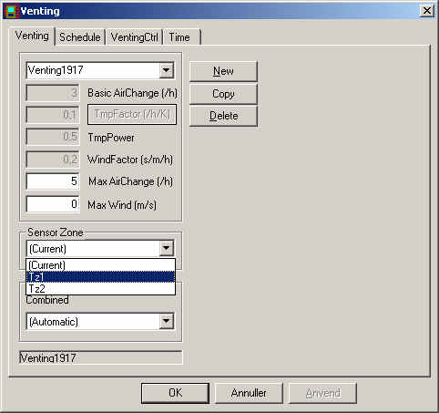

<link rel="stylesheet" href="../style.css">

# Regulering af multizone modellen

Åbningerne der indgår i multizone modellen består som nævnt af to typer. Den første type er vinduer og døre (WinDoor) der kan lukkes og åbnes efter behov. Den anden type er huller, der altid er helt åbne, når de er aktiverede.

Reguleringen omfatter dermed kun vinduer og døre. Formålet med reguleringen er at komme så tæt på de ønskede setpunkter i de enkelte zoner som muligt.

## **Regulering af åbninger**

De regulerbare åbninger kan igen inddeles i to grupper - *eksterne og interne*. De *eksterne* virker mellem en termisk zone og ude, mens de interne virker mellem to termiske zoner.

### **Regulering af eksterne åbninger**

De eksterne åbninger hører pr. definition til den termiske zone, hvor de er placeret rent fysisk. Som for de fleste andre systemer i BSim, er det muligt at regulere åbningerne efter et setpunkt målt i en vilkårlig termisk zone. Angivelsen af hvilken zone åbningerne reguleres efter er vist på figur 1.

<figure id="center_img">

<figcaption>Figur 1. Angivelse af i hvilken termisk zone sensoren skal placeres.</figcaption>
</figure>

### **Regulering af interne åbninger** 

De interne åbninger forbinder to termiske zoner, og det er derfor nødvendigt at have en konvention for hvordan disse reguleres. Det er valgt at åbningerne skal høre til en af zonerne og dermed reguleres af denne. Dette er valgt for at give en så enkel og entydig definition af hvordan åbningerne reguleres.

De termiske zoners rækkefølge i BSim's træstruktur bestemmer deres rækkefølge i beregningsgangen. Det er derfor valgt at rækkefølgen også bruges til at bestemme ejerskabet af de interne åbninger. Den af de to termiske zoner der er øverst i træet regulerer de interne åbninger mellem de to termiske zoner, figur 2.

<figure id="center_img">

<figcaption>Figur 2. Skærmbillede af træstrukturen i BSim. Den termiske zone Tz1 er placeret over Tz2, og Tz1 regulerer dermed den eller de interne åbninger mellem de to zoner.</figcaption>
</figure>

## **Åbningsgrader**

I dette afsnit beskrives hvordan de to typer af åbninger kan reguleres.

### **Åbningsgrad for regulerbare åbninger**

Alle de regulerbare åbninger (vinduer og døre) har et entydigt antal åbningsgrader. Antallet er ens for alle de regulerbare åbninger og er som standard 20. Antallet af åbningsgrader kan ændres under [tsbi5 - Edit - Options](https://help.bsim.dk/support/kb/articles/EWBOvOmr/tsbi5-general-options), figur 3.

<figure id="center_img">

<figcaption>Figur 3. Antallet af åbningsgrader er ens for alle de regulerbare åbninger og kan sættes af brugeren.</figcaption>
</figure>

### **Åbningsgrad for ikke-regulerbare åbninger**

 

Alle ikke-regulerbare åbninger (huller) er pr. definition altid helt åbne. De er dog kun aktive i de perioder hvor [*Venting* ](https://help.bsim.dk/support/kb/articles/gWKDJlmp/venting-system)er aktiveret. Når [*Venting* ](https://help.bsim.dk/support/kb/articles/gWKDJlmp/venting-system)ikke er aktiv regner tsbi5 som om hullerne ikke findes.

## **Beregningsgang ved regulering**

Beregningsgangen ved reguleringen er beskrevet på punktform nedenfor.

*   Fastlæg ønsket luftbehov

    *   Bestem om der er behov for luft (varmebalancen med belastninger, faste systemer)

    *   Bestem luftstrømmenes retninger: Multizone modellen med alle åbninger helt åbne og temperaturer som setpunkter i BSim

    *   Bestem ønskede luftmængder: Varmebalancen med luftretninger fra multizone modelberegningen

*   Tilpas åbningsgraderne til de ønskede luftmængder: Ændring af åbningsgrader og beregning af luftmængder med multizone model med setpunkter fra varmebalancen indtil et af stopkriterierne er opnået

*   Find de eksakte luftmængder og temperatur med de opnåede åbningsgrader: Iteration mellem multizone modellen og varmebalancen indtil et af stopkriterierne er opnået.

### **Eksempel på beregningsgang ved regulering**

På figur 4 er beregningsgang ved reguleringen vist. Der er taget udgangspunkt i en temperaturstyring af [Venting](https://help.bsim.dk/support/kb/articles/gWKDJlmp/venting-system) og at der er tale om et køletilfælde

De tal der er markeret med FED ud for mzm og varmebalancen er de værdier der beregnes og dem der ikke er fede er dem der bruges til beregningen. Alle temperaturer og luftmængder er fiktive. Det eneste der "rigtigt" er ændringens retning (op eller ned).

<figure id="center_img">

<figcaption>Figur 4. Beregningsgang ved regulering.</figcaption>
</figure>