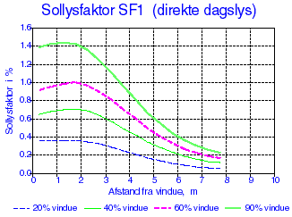
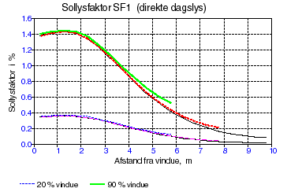
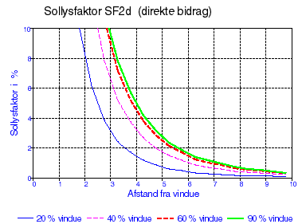
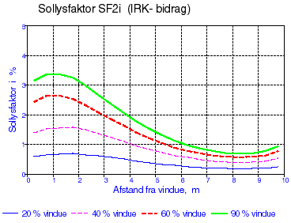
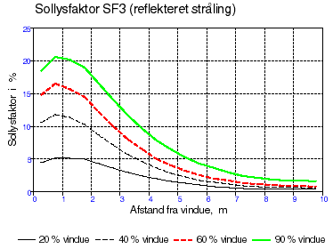
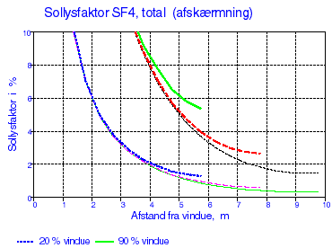

<link rel="stylesheet" href="../style.css">

# Algoritmer til beregning af solstråling og dagslys

*   Solstråling

*   Dagslys

*   Belysningsstyrken i lokalet fra dagslyset

*   Sollysfaktorer

*   Bestemmelse af sollysfaktorerne SF1 - SF4

*   Bestemmelse af sollysfaktorer ud fra eksempel

*   Direkte sollys SF1

*   Himmellys SF2

*   Reflekteret lys SF3

*   Lys fra solafskærmning SF4

*   Maksimum og minimumsværdier for IRK-bidraget

*   Andre korrektioner

Fra vejrdata i referenceåret TRY [3] anvendes værdier for den diffuse himmelstråling på en vandret flade, normalstrålingen, dvs. den direkte solstråling vinkelret på strålingsretningen samt skydækkets størrelse. Ud fra disse værdier er det muligt at beregne solindfaldet på en vilkårlig orienteret flade, når fordelingen af himmelstrålingen er kendt.

Nyere målinger, bl.a. i Danmark, [5] har vist, at strålingen fra himmelhvælvingen afviger fra ovennævnte, og der er således udviklet nye algoritmer for himmelstrålingens fordeling ikke alene for den helt overskyede og skyfri himmel, men også for den delvis overskyede himmel. Der er i BSim mulighed for at vælge en af ovennævnte algoritmer for solstrålingen, nemlig via første faneblad i dialogen for simulering med tsbi5, idet Lund regner med de tidligere algoritmer mens Petersen regner med de nye.

## **Solstråling**

Modellen for beregning af solstråling på udvendige overflader beskrevet nedenfor kaldes *Lund* på [Options fanen af tsbi5](https://help.bsim.dk/support/kb/articles/nmDBKR9y/tsbi5-options). Alle solstrålingsmodeller i BSim er opkaldt efter deres forfatter og er beskrevet i de følgende referencer:

*   Muneer T. (1989). *Algorithms for estimating hourly solar irradiation on slopes*. Journal of Building Services, Enginering, Research and Technology 10(2).

*   Lund H. (1979). *Revised splitting procedure for calculation of direct normal radiation and diffuse radiation*. Thermal Insulation Laboratory (now BYG*DTU), Technical University of Denmark, Lyngby, DENMARK.

*   Perez

*   Petersen E. (1982). *Solstråling og dagslys, -målt og beregnet*. Rapport 34. Lysteknisk Laboratorium, Lyngby, DANMARK.

Det samlede solindfald på en flade opdeles i 3 bidrag, nemlig

*   direkte solstråling (rettet solstråling)

*   stråling fra himmelhvælvingen (diffus himmelstråling)

*   reflekteret stråling fra jordoverfladen

Især den diffuse himmelstråling beskrives forskelligt i de nævnte solalgoritmer. Denne form for stråling kaldes i det følgende blot himmelstrålingen, i modsætning til den direkte solstråling eller rettede stråling.

Himmelstrålingen på en skrå flade Ef kan angives i forhold til himmelstrålingen på vandret Ev med en faktor f:

$$ E_f = f \cdot E_v \tag{f.1} $$

Faktoren f er afhængig af fladens orientering i forhold til solen (indfaldsvinkel *i*) og af, om himlen er overskyet eller skyfri samt af skydækkets tæthed *N*. Skydækkets tæthed (eller størrelse) angives i heltal fra 0 til 8, hvor 0 betegner en skyfri og 8 en helt overskyet himmel.

For en flade med vilkårlig hældning gælder følgende:

$$ E_f = \frac{f_{oc} \cdot 1.5 N + f_{cl} \cdot (8-N)}{0.5 N + 8} \cdot E_v \tag{f.2} $$

Hvor: 

N er skydækket

foc og fcl er faktorer for bidragene fra henholdsvis den overskyede (overcast) og den skyfri (clear) del.

 

For en flade med hældningen γ i forhold til vandret kan disse faktorer beregnes ud fra følgende udtryk, der afhænger af indfaldsvinklen i:

**for cos*i* < 0 er**

$$ f_{oc} = \left( 0{,}42 + 0{,}6 \cdot \cos i \cdot \frac{(8 - N)}{8} \right) \cdot (1 - \cos \gamma) + \cos \gamma \tag{f.3} $$

$$ f_{cl} = \left( 0{,}65 + 0{,}1 \cdot \cos i \right) \cdot (1 - \cos \gamma) + \cos \gamma \tag{f.4} $$

**for cos*i* ≥ 0 er**

$$ f_{oc}= 0{,}42 \cdot (1 - \cos \gamma) + \cos \gamma \tag{f.5} $$

$$ f_{cl} = \left( 0{,}65 + 0{,}2 \cdot \cos i + 0{,}45 \cdot \cos^2 i \right) \cdot (1 - \cos \gamma) + \cos \gamma \tag{f.6} $$

Den reflekterede direkte solstråling og himmelstråling fra jordoverfladen beregnes af:

$$ E_\gamma = 0{,}5 \cdot (1 - \cos \gamma) \cdot \rho \cdot E_g \tag{f.7} $$

Hvor:

ρ er jordfladens reflektans

Eg er den globale bestrålingsstyrke på jordoverfladen (direkte solstråling og himmelstråling).

## **Dagslys**

Solstrålingen kan omsættes til dagslys, når lysudbyttet (lm/W) i strålingen er kendt. Der skelnes mellem de 3 strålinger, som i følge [5] regnes at have følgende gennemsnitlige lysudbytte:

*   Direkte sol KD = 103 lm/W

*   Overskyet himmel Koc= 121 lm/W

*   Skyfri himmel Kcl= 146 lm/W

For den reflekterede stråling regnes der ikke med, at lysudbyttet ændres ved refleksionen. I BSim er standardværdien for reflektansen for sollys for jordoverfladen 0,1 svarende til en græsmark, idet reflektansen i det synlige område normalt er væsentlig mindre end for hele solspektret. I tilfælde med lysere overflader f.eks. sne kan reflektansen ændres.

#### ***Belysningsstyrken i lokalet fra dagslyset***

Belysningsstyrken i et punkt er meget afhængig af punktets placering i lokalet. Normalt betragtes den vandrette belysningsstyrke på et arbejdsplan 0,85 m over gulvet.

Da belysningsstyrken uden for vinduet varierer fra det ene øjeblik til det næste, er det praktisk at angive belysningsstyrken i et punkt inde i rummet som en relativ størrelse i forhold til belysningen i det fri. Normalt anvendes dagslysfaktoren DF til beskrivelse af dette forhold, idet dagslysfaktoren i et givet plan er forholdet mellem belysningen i punktet i planet og den samtidige belysning udendørs på et vandret plan, belyst med en fuld himmelhalvkugle. Himlens luminansfordeling kan enten være givet som en CIE-himmel eller have en ensartet jævn luminansfordeling. Der ses bort fra direkte sollys.

Af definitionen ses det, at dagslysindfaldet således bliver uafhængigt af vinduesfladens kompasorientering. Denne dagslysfaktor anvendes derfor til bestemmelse af minimumsværdier, som indtræffer på overskyede dage, mens den ikke er velegnet til energiberegninger og styring af den kunstige belysning.

Den relative belysningsstyrke i lokalet må derfor angives i forhold til det aktuelle lysindfald på vinduet. For ikke at sammenblande begreberne kaldes denne faktor for sollysfaktoren SF.

#### ***Sollysfaktorer***

Sollysfaktoren SF i et punkt i et givet plan er defineret som forholdet mellem belysningsstyrken i punktet i planet og den samtidige belysningsstyrke udendørs på facadens plan uden skygger fra omgivelserne. Belysningsstyrken i et punkt kan ikke beskrives med en enkelt værdi af sollysfaktoren, men må opdeles i forskellige bidrag idet:

*   SF1 er sollysfaktoren for direkte sollys (rettet lys)

*   SF2 er sollysfaktoren for himmellys (diffust lys fra himmelhvælvingen)

*   SF3 er sollysfaktoren for reflekteret lys

*   SF4 er sollysfaktoren for vinduet, når det er forsynet med en afskærmning.

I BSim vil der ved valg af vinduesglas samtidig indgå en faktor for reduktion af henholdsvis solstråling og dagslys. Der skal derfor anvendes beregnede sollysfaktorer for en 'rude' med en transmissionsfaktor på 1,0.

*SF1*

Den direkte sol vil give en lysende plet et sted i lokalet og det reflekterede lys fra pletten vil virke som en lyskilde. Da plettens placering i lokalet er meget afhængig af solens højde og azimut, vil SF1 i et punkt langt fra være konstant. I beregningerne vil man dog stræbe efter en enkelt værdi, der er repræsentativ for SF1. I punktet, som rammes af den direkte stråling, vil der være en meget høj belysningsstyrke, som der dog ses bort fra ved beregningen af SF1, idet der kun medtages den interreflekterede komponent. Bestemmelsen af SF1 for det uafskærmede vindue er normalt ikke kritisk i forbindelse med styringen af den kunstige belysning, fordi de øvrige dagslysbidrag i denne situation giver så høj en belysningsstyrke, at det ikke er nødvendigt med kunstig belysning. I en arbejdssituation vil direkte sol i lokalet ofte resultere i, at solafskærmningen trækkes for ét eller flere vinduer.

*SF2*

SF2 giver normalt det største bidrag til belysningsstyrken i et punkt, der kan 'se' himlen. Ved beregningerne antages, at uanset himlens tilstand (skyet eller skyfri), er luminansfordelingen som en CIE-overskyet himmel eller ensartet overskyet, og SF2 beregnes svarende til en af disse to tilstande. Størrelsen af lysindfaldet beregnes efter de tidligere nævnte algoritmer [5].

*SF3*

SF3 bestemmer bidraget fra det reflekterede sollys fra jordoverfladen og heri indgår både bidrag fra diffust himmellys og fra direkte sollys. Der regnes med en diffus refleksion fra jordoverfladen. Det reflekterede bidrag er karakteriseret ved, at lyset først skal ramme andre flader i lokalet især loftet, inden det når punktet.

*SF4*

Når der anvendes en solafskærmning og lyset 'diffuseres' efter passagen af afskærmningen anvendes SF4 for afskærmningen. SF4 angives som de øvrige sollysfaktorer for et vindue med transmittansen 1, da transmissionsfaktorer er indeholdt i data for vindue og afskærmning.

#### ***Bestemmelse af sollysfaktorerne SF1 - SF4***

Lyset som rammer et punkt består af 2 bidrag nemlig

1.  Den direkte komponent, der udgør den del af lyset, som kommer direkte til punktet fra lysgiveren f.eks. himlen eller afskærmningen.

2.  Den interreflekterede komponent IRK, der udgør den del af lyset, som først én eller flere gange reflekteres fra andre flader, inden det rammer punktet.

Sollysfaktorerne kan i et givet tilfælde beregnes ved hjælp af edb eller bestemmes med mere eller mindre nøjagtige metoder eller eventuelt ved måling i eksisterende bygninger. I håndberegningsmetoder for dagslysfaktorer indgår kun bidrag fra diffus himmel og reflekteret lys.

Den mest anvendte metode til bestemmelse af det direkte bidrag er BRS skabeloner [16].

Det interreflekterede bidrag (IRK) beregnes normalt ved hjælp af BRE split flux metoden [17]. Denne angiver et beregningsudtryk for middelværdien af det interreflekterede bidrag på arbejdsfladen. Værdien vil være større ved vindueszonen og mindre bag i lokalet, og korrektioner til bestemmelse af maximum- og minimumsværdier kan beregnes ud fra middelværdien ved at multiplicere denne med en faktor, som angivet i tabel f.13.

Med normalt anvendte vinduesstørrelser og lokaledimensioner, kan der gives generelle, retningsgivende værdier for sollysfaktorerne, men ved specielle facadeudformninger, bliver bestemmelsen ofte behæftet med for stor usikkerhed, og sollysfaktorerne må da beregnes på anden måde.

#### ***Bestemmelse af sollysfaktorer ud fra eksempel***

I det følgende angives formler for beregning af sollysfaktorerne for de interreflekterede bidrag til SF1-SF4, og der vises kurver både for de direkte bidrag, for de interreflekterede bidrag samt for de totale faktorer, hvoraf retningsgivende værdier for de fire sollysfaktorer kan bestemmes.

Som eksempel er valgt et lokale med en facade på 4 m · 2,8 m og et vindue med et glasareal på henholdsvis 20 %, 40 %, 60 % og 90 % af det indvendige facadeareal. Rumdybden er henholdsvis 6 m, 8 m og 10 m. Reflektanserne på loft, vægge og gulv er henholdsvis 0,7, 0,4 og 0,1. Sollysfaktorerne er beregnet i et punkt på et vandret plan 0,85 m over gulv og i lokalets midterlinie, vinkelret på facaden.

Forudsætningen for at anvende kurverne er primært, at de vinduer, som der angives sollysfaktorer for i BSim, er nogenlunde jævnt fordelt på lokalets facade(r). Hvis der er flere vinduer i samme facade, må det derfor vælges, om sollysfaktorerne for ét vindue skal (eller kan) repræsentere alle vinduer i facaden eller, om der skal angives faktorer for de enkelte vinduer.

#### ***Direkte sollys SF1***

Middelværdien af det interreflekterede bidrag til SF1 kan beregnes af følgende:

$$ SFI = \frac{0{,}72 \cdot G \cdot R_f}{A(1-R)} \tag{f.8} $$

Hvor:

G er glasarealet

Rf er reflektansen af fladen, som den direkte sol rammer (gulvet)

A er arealet af lokalets begrænsningsflader

R er middelreflektansen for lokalets overflader, vægtet efter arealer

 

Variationen af SF1 i lokalet vil være meget afhængig af lysplettens placering. I eksemplet er der regnet med en indfaldsvinkel på 45° i et lodret plan vinkelret på vinduet. Variationen af SF1 ser principielt ud som vist på figur f.1, idet det bemærkes at kun den interreflekterede del af den direkte, rettede stråling medtages.

<figure id="center_img">

<figcaption>Figur f.1. Variationen i sollysfaktoren, SF1, for den direkte strålings bidrag til dagslyset i et 10 m dybt lokale ved forskellige vinduesstørrelser.</figcaption>
</figure>

Variationen af SF1 som funktion af lokalets dybde er vist i 1 for vinduesarealer, der udgør 20 % (nederste kurver), henholdsvis 90 % af facaden (øverste kurver). Det ses, at faktoren SF1 øges lidt ved mindre rum, men at variation er forholdsvis lille.

Det skal bemærkes, at den direkte himmelstråling i beregningerne antages at ramme gulvet. Under denne forudsætning er sollysfaktoren direkte proportional med gulvets reflektans, som i beregningerne er sat til 0,1. Ved højere reflektanser kan SF1 således direkte beregnes ved at gange med forholdet mellem den faktiske reflektans og 0,1.

<figure id="center_img">

<figcaption>Figur f.2. Variationen i sollysfaktorerne for den direkte stråling, SF1, i et 6, 8 og 10 m dybt lokale ved vinduesstørrelser 20 og 90 %.</figcaption>
</figure>

#### ***Himmellys SF2***

I følge definitionen af sollysfaktoren er der følgende sammenhæng mellem SF og dagslysfaktoren DF:

$$ SF = \frac{E_v}{E_f} \cdot DF \tag{f.9} $$

Hvor: 

Ev er belysningsstyrken på vandret

Ef er belysningsstyrken på vinduesfladen

 

I BSim regnes transmittansen for vinduet lig med 1,0 i SF- og DF-værdierne.

Hvis dagslysfaktoren for himmelstrålingen, DF2 er kendt, kan SF2 for den CIE-overskyede himmel beregnes af:

$$ SF2 = DF \frac{2}{0{,}42 (1- \cos \gamma)+\cos \gamma} \tag{f.10} $$

mens den for den jævnt overskyede himmel bestemmes af:

$$ SF2 = DF \frac{2}{0{,}50 (1- \cos \gamma)+\cos \gamma} \tag{f.11} $$

Hvis dagslysfaktoren DF2 ikke er kendt, kan SF2 eventuelt bestemmes som summen af det direkte bidrag og det interreflekterede bidrag:

$$ SF2 = SF_{2d} + SF_{2i} \tag{f.12} $$

Det direkte bidrag SF2d  varierer meget med afstanden fra vinduet, som vist på figur f.3. og f.4. Sollysfaktoren for det direkte bidrag af himmelstrålingen, SF2d, bliver meget høj nær ved vinduet, og udgør det største bidrag til dagslyset her. Figurerne viser de samme kurver, idet skalaen på figur f.4 er ændret, således at dagslysfaktoren dybere inde i rummet bedre kan bestemmes.

<figure id="center_img">

<figcaption>Figur f.3. Variationen i sollysfaktorerne for det direkte bidrag af himmelstrålingen, SF2d, i et 10 m dybt lokale ved forskellige vinduesstørrelser.</figcaption>
</figure>

<figure id="center_img">

<figcaption>Figur f.4. Variationen i sollysfaktorerne for det direkte bidrag af himmelstrålingen, SF2d, i et 10 m dybt lokale ved forskellige vinduesstørrelser.</figcaption>
</figure>

Det ses, at forskellen i sollysfaktorerne ved 60 % og 90 % er minimal, hvilket skyldes at det forøgede vinduesareal ligger under arbejdsplanets niveau.

Middelværdien for det interreflekterede bidrag SF2i kan bestemmes af:

$$ SF_{2i} = \frac{0{,}9 \cdot G \cdot R_N}{A(1-R)} \tag{f.13} $$

Hvor:

G er glasarealet

RN er middelreflektansen af lokalets flader, som ligger under et plan gennem vinduets midte (undtagen vinduesvæggen)

A er arealet af lokalets begrænsningsflader

R er middelreflektansen for lokalets overflader, vægtet efter arealer

 

Minimumsværdien for SF2i kan beregnes med korrektionsfaktorerne i tabel f.13.

For det valgte eksempel er variationen af SF2i vist i figur f.5.

<figure id="center_img">

<figcaption>Figur f.5. Variationen i sollysfaktorerne for det interreflekterede bidrag af himmelstrålingen, SF2i , i et 10 m dybt lokale.</figcaption>
</figure>

*Samlet bidrag til SF2*

Sollysfaktorerne for himmellys, SF2, for summen af det direkte bidrag og det interreflekterede bidrag er vist i figur f.6 som funktion af vinduesarealet og som for rumdybderne 6, 8 og 10 meter.

Den øverste kurveskare i figuren viser sollysfaktoren SF2 for et lokale med 90 % vinduesareal af facaden, mens den nederste skare viser SF2 for lokalet med 20 % vinduesareal. Kurverne for de 3 rumdybder slutter ved afstande fra vinduet på henholdsvis 5,75 m, 7,75 m og 9,75 m. Det bemærkes, at sollysfaktorerne bliver noget højere ved mindre rumdybder, især bagest i rummet. Dette skyldes, at det interreflekterede lys bliver mere 'koncentreret' her, eller fordeles over et mindre samlet areal af overflader.

Sollysfaktorerne er i alle tilfælde beregnet i et punkt på et vandret plan 0,85 m over gulvet og i lokalets midterakse, vinkelret på vinduesfacaden. Reflektanserne af lokalets overflader er 0,7 for loftet, 0,4 for væggene og 0,1 for gulvet.

<figure id="center_img">

<figcaption>Figur f.6. Variationen i sollysfaktorerne for den diffuse himmelstråling, SF2, i et 6, 8 og 10 m dybt lokale ved vinduesstørrelser 20 og 90 %.</figcaption>
</figure>

#### ***Reflekteret lys SF3***

Da der normalt kun regnes med refleksion af stråling fra jordoverfladen (eller vandret flade uden for vinduerne), indeholder dette bidrag kun det interreflekterede bidrag. Middelværdien for dette bidrag SF3 kan bestemmes af

$$ SF3 = \frac{1{,}5 \cdot G \cdot R_ø}{A (1-R)} \tag{f.14} $$

G er glasarealet

RØ er middelreflektansen vægtet efter arealer af lokalets flader, som ligger over et plan gennem vinduets midte (undtagen vinduesvæggen)

A er arealet af lokalets begrænsningsflader

R er middelreflektansen for lokalets overflader, vægtet efter arealer

 

Ønskes minimumsværdien for SF3, korrigeres middelværdien for det interreflekterede bidrag ved hjælp af reduktionsfaktoren angivet i tabel f.13.

Variationen af SF3 med lokaledybde og vinduesstørrelse er vist i figur f.7 og f.8.

<figure id="center_img">

<figcaption>Figur f.7. Variationen i sollysfaktorerne for den reflekterede stråling, SF3, i et 10 m dybt lokale ved forskellige vinduesstørrelser.</figcaption>
</figure>

<figure id="center_img">

<figcaption>Figur f.8. Variationen i sollysfaktorerne for den reflekterede stråling, SF3, i et 6, 8 eller 10 m dybt lokale ved vinduesstørrelser på 20 og 90 %.</figcaption>
</figure>

#### ***Lys fra solafskærmning SF4***

Lyset fra solafskærmningen giver et direkte bidrag og et interreflekteret bidrag.

$$ SF4 = SF{4d} + SF_{4i} \tag{f.15} $$

Det direkte bidrag SF4d varierer meget med afstanden fra vinduet som vist på figur f.9.

<figure id="center_img">

<figcaption>Figur f.9. Variationen i sollysfaktorerne, SF4d, for stråling, der diffuseres af afskærmningen direkte til punktet (10 m dybt lokale).</figcaption>
</figure>

Middelværdien for det interreflekterede bidrag SF4i kan bestemmes af

$$ SF_{4i} = \frac{1{,}35 \cdot G \cdot R}{A (1-R)} \tag{f.16} $$

G er glasarealet

A er arealet af lokalets begrænsningsflader

R er middelreflektansen for lokalets overflader, vægtet efter arealer

 

Ønskes minimumsværdien for SF4i og dermed SF4, korrigeres middelværdien for det interreflekterede bidrag ved hjælp af korrektionsfaktoren angivet i tabel f.13.

For et 10 m dybt lokale er variationen i SF4i vist i figur f.10.

<figure id="center_img">

<figcaption>Figur f.10. Variationen i sollysfaktorerne, SF4i, for stråling, der når punktet efter interrefleksion i rummet (10 m dybt lokale).</figcaption>
</figure>

*Samlet bidrag til SF4*

Det samlede bidrag til dagslyset fra en diffuserende solafskærmning er vist i figur f.11 for et 10 m dybt lokale og i figur f.11 for varierende lokaledybde og vinduesarealerne 20 % og 90 % af facadearealet.

<figure id="center_img">

<figcaption>Figur f.11. Variationen i sollysfaktorerne for stråling, der diffuseres fra en afskærmning, SF4, ved forskellige vinduesstørrelser (10 m dybt lokale).</figcaption>
</figure>

<figure id="center_img">

<figcaption>Figur f.12. Variationen i sollysfaktorerne for stråling, der diffuseres fra en afskærmning, SF4, i et 6, 8 eller 10 m dybt lokale ved 20 % og 90 % vinduer.</figcaption>
</figure>

#### ***Maximum- og minimumværdier for IRK-bidraget***

I nedenstående tabel f.13 er angivet nogle retningsgivende faktorer som middelværdien af IRK skal multipliceres med for af give maximumsværdien i vindueszonen og minimumsværdien i zonen ved bagvæggen som funktion af rumdybden.

<table class="tg" style="margin-left: auto; margin-right: auto;">
<thead>
<tr>
<th class="tg-gvcd" colspan="7"><strong>Faktorer for beregning af maksimum- og minimumværdier af IRK-bidrag til SF-faktorer</strong></th>
</tr>
</thead>
<tbody>
<tr>
<td class="tg-gvcd"><strong>Rumdybde</strong></td>
<td class="tg-gvcd" colspan="2">6 m</td>
<td class="tg-gvcd" colspan="2">8 m</td>
<td class="tg-gvcd" colspan="2">10 m</td>
</tr>
<tr>
<td class="tg-gvcd"><strong>Sollysfaktor</strong></td>
<td class="tg-gvcd">max</td>
<td class="tg-gvcd">min</td>
<td class="tg-gvcd">max</td>
<td class="tg-gvcd">min</td>
<td class="tg-gvcd">max</td>
<td class="tg-gvcd">min</td>
</tr>
<tr>
<td class="tg-gvcd">

*SF1*

*SF2*

*SF3*

*SF4*

</td>
<td class="tg-gvcd">

1,4

1,5

1,8

1,5

</td>
<td class="tg-gvcd">

0,50

0,75

0,40

0,50

</td>
<td class="tg-gvcd">

1,7

1,8

2,3

2,0

</td>
<td class="tg-gvcd">

0,27

0,50

0,25

0,33

</td>
<td class="tg-gvcd">

2,1

2,1

2,5

2,5

</td>
<td class="tg-gvcd">

0,13

0,35

0,17

0,22

</td>
</tr>
</tbody>
</table>

*Tabel f.13. Retningsgivende faktorer for bestemmelse af maksimum- og minimumærdier af det interreflekterede bidrag til de fire sollysfaktorer.*

#### ***Andre korrektioner***

I tsbi5 korrigeres der automatisk for transmissionstabet i glasset og en evt. reduktion af solindfaldet på grund af skygger fra omgivelserne eller bygningen udhæng og lignende.

Sprosser og andre genstande, som der ikke tages hensyn til ved angivelse af glasarealets størrelse, skal der imidlertid yderligere korrigeres for.

Ligeledes bør der korrigeres for snavs på vinduet, som reducerer lysindfaldet. Reduktionsfaktoren er afhængig af omgivelserne (på landet eller i industriby) og arbejdets art i lokalet. Normalt anvendes følgende reduktionsfaktorer:

<table class="tg" style="margin-left: auto; margin-right: auto;">
<thead>
<tr>
<th class="tg-gvcd"><strong>Lokalets beliggenhed</strong></th>
<th class="tg-0lax"><strong>Arbejdets art</strong></th>
<th class="tg-0lax"><strong>Korrektionsfaktor</strong></th>
</tr>
</thead>
<tbody>
<tr>
<td class="tg-0lax">

Landområder

Ydre forstader

</td>
<td class="tg-0lax">

Rent

Snavset

</td>
<td class="tg-0lax">

0,9

0,7

</td>
</tr>
<tr>
<td class="tg-0lax">Beboelseskvarterer</td>
<td class="tg-0lax">

Rent

Snavset

</td>
<td class="tg-0lax">

0,8

0,6

</td>
</tr>
<tr>
<td class="tg-0lax">Industrikvarterer</td>
<td class="tg-0lax">

Rent

Snavset

</td>
<td class="tg-0lax">

0,7

0,5

</td>
</tr>
</tbody>
</table>

*Tabel f.14. Reduktionsfaktorer for dagslyset bestemt ud fra de fire sollysfaktorer.*
