<link rel="stylesheet" href="../style.css">

# Gulvvarme, matematisk grundlag

<strong>RADIANT HEATING/COOLING MODULE FOR BSim</strong>    
<strong>Theoretical reference</strong>  
<strong>By Massimiliano Scarpa</strong>

## **Context**  
1. MAIN CONCEPTS   
2. 2D SIMPLIFICATION   
          2.1. Status of the art before the current research  
          2.2. The contribution of the current research  
          2.2.1. Method

3. THE ε-NTU METHOD FOR THE DESCRIPTION OF THE VARIATION OF THE WATER TEMPERATURE ALONG THE      CIRCUIT   
          3.1. Grounds of the ε-NTU method  
          3.2. The ε-NTU method in the developed model  
          3.3 The calculation of thermal resistances Rw, Rp and Rx  
          3.3.1 The calculation of thermal resistance Rw  
          3.3.2 The calculation of thermal resistance Rp  
          3.3.3 The calculation of thermal resistance Rx   
          3.4. The calculation U

4. GLOBAL VIEW OF THE WHOLE MODULE   
5. BIBLIOGRAPHY   
6. APPENDIX A

 

## **1. MAIN CONCEPTS**

Hydronic radiant systems embedded in building structures imply 2D thermal fields, due to the presence of the pipes. As a consequence, the description of radiant heating/cooling systems should involve the calculation of 2D heat flows, so that long calculation times would be required. Moreover, the thermal field varies along the flow direction, since the water decreases/increases its own temperature and consequently the heat transfer to the rest of the slab decreases.

To sum up, in order to decrease the calculation time and maintain good accuracy, appropriate simplifications must be conceived.

The most important simplifications performed in the development of the current module are summarized in the following:

1. 2D simplification. The effects of the 2D thermal field due to the presence of the pipes are described by means of a thermal resistance coupling the pipe external surface with the pipe level in the slab. In a few words, this makes it possible to shift from a 2D calculation domain to a 1D one.

2. The e-NTU method for the description of the variation of the water temperature along the circuit. The variation of the water temperature along the pipes is described by means of e-NTU theory, widely used in the calculation of performances for heat exchangers.

 

## **2. 2D SIMPLIFICATION**

### **2.1. Status of the art before the current research**

The main concept regarding the degeneration of the 2D thermal field into a 1D one is here explained.

Starting from previous studies of Glück[1, 2], Dorer, Koschenz and Lehmann [3, 4, 5] reached a simple model for the accurate description of the thermal behavior of thermally activated building systems in steady state conditions. Such a model is frequently called "Resistance Method" and describes the relation between the supply water temperature and the average temperature at the pipes level in terms of a series of thermal resistances. The involved resistances describe the following phenomena:

*   Decrease/increase in water temperature due to the flow of water along the circuit (thermal resistance Rz). In a few words, this thermal resistance connects the supply water temperature with the logarithmic mean water temperature along the pipe circuit. Hence, the logarithmic mean water temperature may be assumed as a reference for the estimation of the heat exchange between the water and the inner surface of the pipe.

*   Temperature gradient from the logarithmic mean temperature of the water to the mean temperature of the inner surface of the pipe. It is basically due to the convection heat transfer (thermal resistance Rw).

*   Temperature gradient from the mean temperature of the inner surface of the pipe to the mean temperature of the outer surface of the pipe (thermal resistance Rp). It is due to conduction heat transfer through the pipe wall.

*   Temperature gradient from the mean temperature of the outer surface of the pipe to the mean temperature at the pipe level (thermal resistance Rx).

The significance of such a simplification is summarized by means of the following figure.

<figure id="center_img">
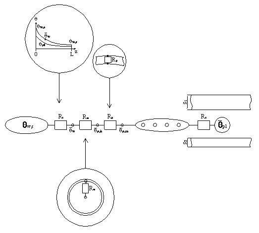
<figcaption>Figure 1 - Background concept of the "Resistance Method".</figcaption>
</figure>

Rx is the most interesting part of the model. In fact, it is shown that, in certain conditions, the relation between the pipe and the pipe level can be described via a formula derived from the analytical solution of the 2D thermal domain shown in Figure 2:

<figure id="center_img">
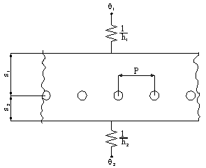
<figcaption>Figure 2 - Reference model and generic temperature profile along the pipes level.</figcaption>
</figure>

The analytical solution was obtained by Glück. That consists in the formula:

$$ \theta(x, y) = \theta_1 + \frac{\frac{1}{h_1} + \frac{s_1 - y}{\lambda_s}}{\frac{1}{U_1} + \frac{1}{U_2}} \cdot (\theta_2 - \theta_1) - \Gamma \cdot \left[ \theta_3 - \theta_1 - \frac{U_2}{U_1 + U_2} (\theta_2 - \theta_1) \right] \cdot $$

$$ \cdot \left\{ \frac{\pi}{P} \left( \frac{U_1 - U_2}{U_1 + U_2} y - \frac{2 \lambda_s}{U_1 + U_2} + |y| \right)   
- \sum_{n=1}^{\infty} \frac{1}{n} \left[ e^{\frac{-2 \cdot \pi \cdot n}{P} \cdot |y|} + g_1(n) \cdot e^{\frac{-2 \cdot \pi \cdot n}{P} \cdot y} + g_2(n) \cdot e^{\frac{2 \cdot \pi \cdot n}{P} \cdot y} \right] \cdot \cos\left( \frac{2 \cdot \pi \cdot n}{P} \cdot x \right) \right\} $$

 

$$ \Gamma = \left[  \ln \left( \frac{P}{\pi \cdot d_p} \right) + \frac{2 \cdot \pi \cdot \lambda_s}{P \cdot (U_1 + U_2)} + \sum_{n=1}^{\infty} \frac{g_1(n) + g_2(n)}{n}  \right]^{-1} $$

 

$$ U_1 = \left( \frac{1}{h_1} + \frac{s_1}{\lambda_s} \right)^{-1} $$

 

$$ U_2 = \left( \frac{1}{h_2} + \frac{s_2}{\lambda_s} \right)^{-1} $$

 and

$$ g_1(n) = \frac{\frac{\frac{h_1}{\lambda_s} \cdot P + 2 \cdot \pi \cdot n}{\frac{h_1}{\lambda_s} \cdot P - 2 \cdot \pi \cdot n}\cdot e^{\frac{-4\cdot \pi \cdot n}{P} \cdot s_2} - e^{ \frac{-4\cdot \pi \cdot n}{P} \cdot (s_1+ s_2)}}{e^{ \frac{-4\cdot \pi \cdot n}{P} \cdot (s_1+ s_2)} - \frac{\frac{h_1}{\lambda_s} \cdot P + 2 \cdot \pi \cdot n}{\frac{h_1}{\lambda_s} \cdot P - 2 \cdot \pi \cdot n}\cdot\frac{\frac{h_2}{\lambda_s} \cdot P + 2 \cdot \pi \cdot n}{\frac{h_2}{\lambda_s} \cdot P - 2 \cdot \pi \cdot n}} $$

 

$$ g_2(n) = \frac{\frac{\frac{h_2}{\lambda_s} \cdot P + 2 \cdot \pi \cdot n}{\frac{h_2}{\lambda_s} \cdot P - 2 \cdot \pi \cdot n}\cdot e^{\frac{-4\cdot \pi \cdot n}{P} \cdot s_1} - e^{ \frac{-4\cdot \pi \cdot n}{P} \cdot (s_1 + s_2)}}{e^{ \frac{-4\cdot \pi \cdot n}{P} \cdot (s_1+ s_2)} - \frac{\frac{h_1}{\lambda_s} \cdot P + 2 \cdot \pi \cdot n}{\frac{h_1}{\lambda_s} \cdot P - 2 \cdot \pi \cdot n}\cdot\frac{\frac{h_2}{\lambda_s} \cdot P + 2 \cdot \pi \cdot n}{\frac{h_2}{\lambda_s} \cdot P - 2 \cdot \pi \cdot n}} $$

 

Dorer, Koschenz and Lehmann demonstrated that, in the case of conductive materials (such as concrete), under conditions:

$$ \begin{cases}  
\frac{s_1}{P} > 0.3 \\  
\frac{s_2}{P} > 0.3 \\  
\frac{d_p}{P} < 0.2  
\end{cases}  $$

The formula by Glück can be simplified with low effect on accuracy and the following equation is obtained:

$$ R_x = \frac{P \cdot \ln \left( \frac{P}{\pi \cdot d_p} \right)}{2 \cdot \pi \cdot \lambda_s} $$

Unfortunately, such a method was derived assuming the condition of steady state thermal conditions. Following research (De Carli, Koschenz, Olesen and Scarpa[6]) was performed in order to check the accuracy of such a model even in the description of unsteady state thermal behavior of thermally activated building systems. The research showed that such a model can be extended to unsteady state conditions with negligible loss in accuracy. In fact, the time constant of the material region around the pipes is low, so that unsteady state behavior takes a short time and the steady state solution may be acquired as a good approximation, especially if the whole running period is considered.

### **2.2. The contribution of the current research**

#### **2.2.1. Method**  
Even the further development of the "Resistance Method" was still bound to the limitations imposed by the analytical solution by Glück (i.e. the presence of homogeneous material around the pipe) and the ones assumed in order to simplify Glück's solution into

$$ R_x = \frac{P \cdot \ln \left( \frac{P}{\pi \cdot d_p} \right)}{2 \cdot \pi \cdot \lambda_s} $$

Such limitations were defined in order to obtain an easy-to-use formula, but, basing on these limitations, the model can be used only for the description of thermally activated building systems, with pipes deeply embedded in a thick concrete layer. Even limitations in pipe spacing and water mass flow rate are present. But the aim of the current research is to describe the thermal behavior of any kind of radiant heating/cooling system. However, the main concept was really appreciable, so the first part of the current research was dedicated to test the possibility to extend such a model to more complex conditions.

For that purpose, the thermal behaviors of various kinds of slabs were examined via a 2D calculation tool and via a 1D model connected to the water temperature via a proper thermal resistance, under unsteady state conditions.

The radiant systems called "Type A", "Type E", "Type X1" and "Type G" were considered.

<table class="tg"><thead>
  <tr>
    <th class="tg-7btt">Type A </th>
    <th class="tg-7btt">Type E </th>
  </tr></thead>
<tbody>
  <tr>
    <td class="tg-7btt">Type X1 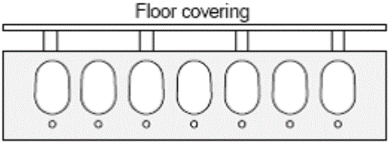</td>
    <td class="tg-7btt">Type G 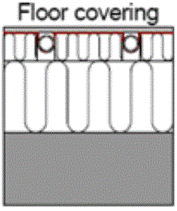</td>
  </tr>
</tbody>
</table>

<em>Figure 3 - Kinds of radiant systems considered in the analysis.</em>

The simulations were aimed at the study of the thermal behavior of the entire deck, from the floor and ceiling surfaces to the external surface of the pipe, thus neglecting the rest of the pipe. In fact, the rest of the pipe can be modeled as a mere thermal resistance, since its "memory effect" due to thermal inertia is assumed to be negligible.

As a general rule, in all types, the air cavities were not considered as conductive regions, thus their edges were considered adiabatic.

In the following figure the analyzed geometries are shown. They have been analyzed via fine anc coarse meshes.

<table class="tg">
<thead>
<tr>
<th class="tg-gvcd">

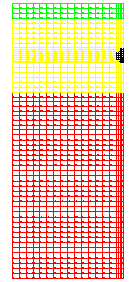

*1.1 Real geometry*   
*and fine mesh.*

</th>
<th class="tg-gvcd">

<strong> 1. Type A </strong>

Material 1:   
s=0.02, λ=0.170 W/(mK), ρ=600 kg/m³, cp=2500 J/(kg K)

Material 2:  
s=0.10, λ=1.600 W/(mK), ρ=2300 kg/m³, cp=900 J/(kg K)

Material 3:  
s=0.25, λ=0.039 W/(mK), ρ=50 kg/m³, cp=850 J/(kg K)

Pipe: de = 0.02 m

Pipe spacing: P = 0.3 m

</th>
<th class="tg-gvcd">

*1.2 Simplified geometry*   
*and rough mesh.*

</th>
</tr>
</thead>
<tbody>
<tr>
<td class="tg-gvcd">

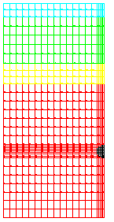

*2.1 . Real geometry*   
*and fine mesh*

</td>
<td class="tg-gvcd">

<strong> 2. Type E </strong>

Material 1:  
s=0.02, λ=0.170 W/(mK), ρ=600 kg/m³, cp=2500 J/(kg K)

Material 2:   
s=0.07, λ=1.200 W/(mK), ρ=2000 kg/m³, cp=900 J/(kg K)

Material 3:  
s=0.03, λ=0.040 W/(mK), ρ=100 kg/m³, cp=850 J/(kg K)

Material 4:  
s=0.20, λ=1.600 W/(mK), ρ=2300 kg/m³, cp=900 J/(kg K)

Pipe: de = 0.02 m

Pipe spacing: P = 0.3 m

</td>
<td class="tg-gvcd">

*2.2 Simplified geometry*  
*and rough mesh*

</td>
</tr>
<tr>
<td class="tg-gvcd">

*3.1 Real geometry and*   
*fine mesh.*

</td>
<td class="tg-gvcd">

<strong> 3. Type X1 </strong>

Material 1:   
s=0.06, λ=0.200 W/(mK), ρ=300 kg/m³, cp=2500 J/(kg K)

Material 2:   
s=0.05, λ=0.040 W/(mK), ρ=100 kg/m³, cp=850 J/(kg K)

Material 3:   
s=0.30, λ=1.600 W/(mK), ρ=2300 kg/m³, cp=900 J/(kg K)

Pipe: de = 0.02 m

Pipe spacing: P = 0.3 m

 

</td>
<td class="tg-gvcd">

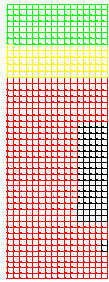

*3.2. Simplified geometry*   
*and rough mesh*

</td>
</tr>
<tr>
<td class="tg-gvcd">

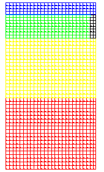

*4.1. Simplified geometry*  
*and simplified mesh.*

</td>
<td class="tg-gvcd">

<strong> 4. Type G </strong>

Material 1:  
s=0.02, λ=0.170 W/(mK), ρ=600 kg/m³, cp=2500 J/(kg K)

Material 2:   
s=0.04, λ=0.200 W/(mK), ρ=300 kg/m³, cp=2500 J/(kg K)

Material 3:   
s=0.10, λ=0.039 W/(mK), ρ=50 kg/m³, cp=850 J/(kg K)

Material 4:   
s=0.12, λ=1.600 W/(mK), ρ=2300 kg/m³, cp=900 J/(kg K)

Plate:   
s=0.0005, λ=200 W/(mK), ρ=2700 kg/m³, cp=900 J/(kg K)

Pipe: de = 0.02 m

Pipe spacing: P = 0.3 m

 

</td>
<td class="tg-gvcd">

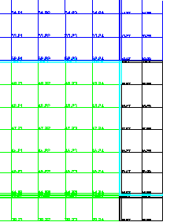

*4.2. Detail of the mesh next*   
*to the part of the plate*   
*surrounding the pipe.*

</td>
</tr>
</tbody>
</table>

<em>Figure 4 - Real and simplified 2D geometries, together with meshes.</em>

The 2D calculations and the 1D model have been contrasted by comparing the corresponding thermal behaviors along a period with imposed temperatures at the surfaces of the floor, ceiling and pipe. In Figure 5, an example of temperature profiles used in the comparison is shown:

<figure id="center_img">
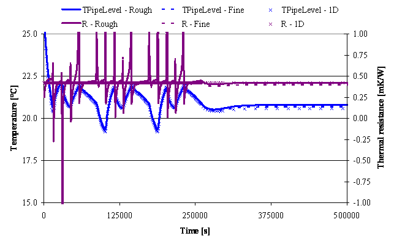
<figcaption>Figure 5 - Boundary conditions.</figcaption>
</figure>

The first part of the simulation period shows the difference in the thermal dynamic behavior. Such a comparison is performed in terms of heat flows (through the floor, ceiling and pipe surfaces), temperatures (mean temperature at the pipe level, that is along the pipe spacing, but the diameter of the pipe), and perceived thermal resistance (between the temperature at the external side of the pipe and the mean temperature at the pipe level).

In the end of each simulation, constant boundary conditions were imposed, in order to reach the steady state behavior.

In order to summarize the 2D thermal domain by means of a 1D model, the thermal resistance derived from the 2D simulation (acquired under steady state conditions) was used as a constant thermal resistance in the 1D model, placed at the pipe level and acting during the all simulation period. Thus, the same boundary conditions as in 2D simulations are imposed and the heat flows and temperatures of the 1D model are compared with the 2D ones. If they approach each other, then the 2D model can be substituted by a 1D model where the thermal resistance acting between the pipe level and the external surface of the pipe is derived from a 2D model running under steady state conditions.

After materials, geometries and boundary conditions were inputted, the 2D program starts the simulation. The focus in the analysis of results was on the mean temperature at the pipe level, the perceived thermal resistance between the external surface of the pipe and the pipe level, and the heat flows passing through the floor, the ceiling and the pipe. These results were used in the comparisons and in the calculation of the thermal resistance to be applied in the 1D model as well. In fact, the thermal resistance perceived by the deck between the external surface of the pipe and the pipe level can be expressed by the following equation:

$$ R_{1D} = \frac{\theta_{PipeLevel} - \theta_{Pipe}}{P \cdot \dot Q_{Pipe}} $$

Obviously, such a value varies during the simulation period, since it is derived from time-dependent variables. Anyway, for us, the reference value will be the one acquired under steady state conditions, assuming it is a good approximation for the description of the thermal behavior of the zone embedding the pipes in unsteady state conditions as well. Such a hypothesis can be justified also looking at the diagrams in APPENDIX A showing the variation of the thermal resistance during the simulation period. In fact, such value varies, but remains close to the one acquired under steady state conditions.

In the end, an obvious remark: in the case of "Type G", the pipe level is placed in the position corresponding to the plate, since it is the horizontal plane that is connected to the pipe by means of the smallest thermal resistance.

The 1D model used for the simulations is based on finite control volumes. It has the same boundary conditions as the previously examined 2D model. The only difference regards the imposition of the temperature on the external side of the pipe. In fact, in the 1D model it is not possible to distinguish the external side of the pipe from the rest of the deck. Thus, it is substituted by a thermal resistance that is derived from the 2D calculations, as explained a few lines above.

In the end, heat flows and temperatures are calculated via the 1D model and compared with the results obtained by means of the 2D simulation code.

 

## **3. THE e-NTU METHOD FOR THE DESCRIPTION OF THE VARIATION OF THE WATER TEMPERATURE ALONG THE CIRCUIT**

The Efficiency-NTU (Number of Transfer Units) method has been used for the description of the heat exchange between the water supply temperature and the average temperature at the pipe level. At this point, the module developed for BSim is deviating from the "Resistance Method". In fact, the "Resistance Method" uses the thermal resistance Rz in order to describe the variation of the water temperature along the circuit.

In the model developed for this calculation module, the e-NTU method was applied by considering the pipe level at constant temperature along the circuit. That is a consistent with BSim approach, since BSim considers constant temperatures for the whole surface.

### **3.1. Grounds of the e-NTU method**

For the following treatment, we may refer to the following figure.

<figure id="center_img">

<figcaption>Figure 6 - Temperature variations in fluids in parallel and counter flow ideal heat exchangers.</figcaption>
</figure>

The ε-NTU method is mainly based on two definitions:

*   Efficiency

$$ \varepsilon = \frac{\text{Actual heat transfer}}{\text{Theoretical max heat transfer}} = \frac{\dot Q}{\dot Q_{max}} $$

*   Number of Transfer Units:

$$ \text{NTU} = \frac{U \cdot A}{(\dot m \cdot c_p)_{min}} $$

Where $ (\dot m \cdot c_p)_{min} $ is the minimum thermal capacity between the two flows.

In other words, it refers to the flow that is expected to sustain the maximum variation in temperature, since:

$$ \dot Q = (\dot m \cdot c_p)_{H} \cdot (\theta_{H,In} - \theta_{H,Out}) = (\dot m \cdot c_p)_{C} \cdot (\theta_{C,Out} - \theta_{C,In}) $$

where the previous subscripts have the following meanings:   
   H = Hot fluid   
   C = Cold fluid   
   In = Supply side   
   Out = Return side

From the previous distinction between the two fluids, we may even derive the value 

$ R = \frac{(\dot m \cdot c_p)_{Min}}{(\dot m \cdot c_p)_{Max}} $ that may be equal to $ R = \frac{(\dot m \cdot c_p)_{H}}{(\dot m \cdot c_p)_{C}} $ or $ R = \frac{(\dot m \cdot c_p)_{C}}{(\dot m \cdot c_p)_{H}} $ , depending on the thermal capacities of the 2 flows.

The temperatures of the fluids vary along the heat exchanger, so even the temperature difference between the fluids varies along the heat exchanger. In order to have a temperature difference that makes it possible to sum up the temperature differences along the whole length of the exchanger, the logarithmic mean temperature difference is defined (LMTD):

$$ \text{LMTD} = \frac{\Delta \theta_2 - \Delta \theta_1}{\ln \left(\frac{\Delta \theta_2}{\Delta \theta_1}\right)} $$

so that

$$ \dot{Q} = (\dot{m} \cdot c_p)_{H} \cdot (\theta_{H,\text{In}} - \theta_{H,\text{Out}}) = (\dot{m} \cdot c_p)_{C} \cdot (\theta_{C,\text{Out}} - \theta_{C,\text{In}}) = U \cdot A \cdot \text{LMTD} $$

At this point, it is necessary to split the treatment in (at least) two parts. In fact, depending on the kind of relative fluid flows (pure counter flow, pure parallel flow, pure cross flow, and consequent combinations), LMTD, Q and Qmax must be expressed in different ways. For our purposes, the treatment is limited to the cases of counter flow and parallel flow:

 

<table class="tg">
<thead>
<tr>
<th class="tg-gvcd" style="text-align: center;"><strong>Fluids of pure counter flow</strong></th>
<th class="tg-gvcd" style="text-align: center;"><strong>Fluids in pure parallel flow</strong></th>
</tr>
</thead>
<tbody>
<tr>
<td class="tg-gvcd" style="text-align: center;">

Definition of maximum heat flow deliverable between the fluids:

$$ \dot Q_{Max} = (\dot m \cdot c_p)_{Min} \cdot (\theta_{H,In} - \theta_{C,In}) $$

As a consequence,

$$ \varepsilon = \frac{(\dot m \cdot c_p)_{H} \cdot (\theta_{H,In} - \theta_{H,Out})}{(\dot m \cdot c_p)_{Min} \cdot (\theta_{H,In} - \theta_{C,In})} = \frac{(\dot m \cdot c_p)_{C} \cdot (\theta_{C,In} - \theta_{C,Out})}{(\dot m \cdot c_p)_{Min} \cdot (\theta_{H,In} - \theta_{C,In})} $$

Moreover,

$$ \text{LMTD} = \frac{(\theta_{H,Out} - \theta_{C,In}) - (\theta_{H,In} - \theta_{C,Out})}{\ln \left( \frac{(\theta_{H,Out} - \theta_{C,In})}{(\theta_{H,In} - \theta_{C,Out})} \right)}  $$

$$ \varepsilon = \frac{1 - e^{[-NTU(1 - R)]}}{1 - R \cdot e^{[-NTU(1 - R)]}} $$

</td>
<td class="tg-gvcd" style="text-align: left;">

Definition of maximum heat flow deliverable between the fluids:

$$ \dot Q_{Max} = (\dot m \cdot c_p)_{Min} \cdot (\theta_{H,In} - \theta_{C,Out}) $$

As a consequence,

$$ \varepsilon = \frac{(\dot m \cdot c_p)_{H} \cdot (\theta_{H,In} - \theta_{H,Out})}{(\dot m \cdot c_p)_{Min} \cdot (\theta_{H,In} - \theta_{C,In})} = \frac{(\dot m \cdot c_p)_{C} \cdot (\theta_{C,In} - \theta_{C,Out})}{(\dot m \cdot c_p)_{Min} \cdot (\theta_{H,In} - \theta_{C,In})} $$

Moreover,

$$ \text{LMTD} = \frac{(\theta_{H,Out} - \theta_{C,Out}) - (\theta_{H,In} - \theta_{C,In})}{\ln \left( \frac{(\theta_{H,Out} - \theta_{C,Out})}{(\theta_{H,In} - \theta_{C,In})} \right)} $$

$$ \varepsilon = \frac{1 - e^{[-NTU (1 + R)]}}{1 + R} $$

</td>
</tr>
</tbody>
</table>

 

### **3.2. The e-NTU method in the developed model**

At this point, the two argumentations are joined together. In the present case, in fact, by assuming the pipe level has a uniform temperature,

$$ (\dot m \cdot c_p)_{Max} \rightarrow \infty \Rightarrow R \rightarrow 0 \Rightarrow \varepsilon \equiv 1 - e^{-NTU} = 1 - e ^{- \frac{U \cdot A}{(\dot m \cdot c_p)_{Min}}} $$

Then, for radiant heating/cooling systems, the efficiency assumes the following shape:

$$ \varepsilon \equiv 1- e^{ - \frac{A_{Floor}}{(R_w + R_r + R_x) \cdot (\dot m \cdot c_p)_{Water}}} $$

It makes it possible to calculate the heat flow from/to the water to/from the pipe level of the slab, in an easy way. In fact, it is given by:

$$ \dot Q = \varepsilon \cdot (\dot m \cdot c_p)_{Water} \cdot (\theta_{Water, in} - \theta_{PipeLevel}) $$

 

### **3.3. The calculation of thermal resistances Rw, Rp and Rx**

#### **3.3.1. The calculation of thermal resistance Rw**

Heat transfer coefficient corresponding to the convection heat transfer, referred to 1 m² of internal surface of the pipe:

$$ h_{WaterConv} = \frac{2040. \cdot \left( 1. + 0.015 \cdot \theta_{Water} \right) \cdot v_{Water}^{0.87}}{d_{PipeInt}^{0.13}} $$

Then, considering that

$$ \frac{1m_{PipeSurface}^2}{1m_{FloorSurface}^2} = \frac{\pi \cdot d_{PipeInt}}{T_{Pipe}} $$

the value of Rw can be calculated, referring to 1m² of floor:

$$ h_{WaterConv, Floor} = h_{WaterConv} \cdot \frac{\pi \cdot d_{PipeInt}}{T_{Pipe}} =  \frac{2040. \cdot \left( 1. + 0.015 \cdot \theta_{Water} \right) \cdot v_{Water}^{0.87}}{d_{PipeInt}^{0.13}} \cdot  \frac{\pi \cdot d_{PipeInt}}{T_{Pipe}} \Rightarrow $$

$$ \Rightarrow R_W = \frac{d_{PipeInt}^{0.13}}{2040. \cdot \left( 1. + 0.015 \cdot \theta_{Water} \right) \cdot v_{Water}^{0.87}} \cdot \frac{T_{Pipe}}{\pi \cdot d_{PipeInt}} $$

 

#### **3.3.2. The calculation of thermal resistance Rp**  
Heat transfer coefficient corresponding to the conduction heat transfer through the pipe wall, referred to 1 m² of internal surface of the pipe:

$$ h_{PipeWall} = \frac{2 \cdot \lambda_{PipeWall}}{d_{PipeInt} \cdot \ln \left( \frac{d_{PipeExt}}{d_{PipeInt}} \right)} $$

Then, the value of Rp can be calculated, referring to 1 m² of floor:

$$ R_{PipeWall, Floor} = \frac{T_{Pipe}}{\pi} \cdot \frac{\ln \left( \frac{d_{PipeExt}}{d_{PipeInd}} \right)}{2 \cdot \lambda_{PipeWall}} $$

#### **3.3.3. The calculation of thermal resistance Rx**

Thermal resistance Rx corresponding to the fictitious conduction heat transfer:

$$ R_{Pipe \rightarrow PipeLevel, Floor} = \frac{\frac{T}{2} \cdot \left( \theta_{Pipe} - \theta_{PipeLevel} \right)}{Q_{Pipe}} $$

### **3.4. The calculation U**

The previous resistances allow us to calculate heat transfer coefficient U needed by ε-NTU method:

$$ U = \frac{1}{R_{Pipe \rightarrow PipeLevel, Floor} + R_{PipeWall, Floor} + R_{WaterConv, Floor}} $$

That is the connection between the water and the average (and uniform) temperature of the slab at the pipe level and is considered to be constant along the water flow.

Finally, the heat flowing from/to the water to/from the pipe level along the whole circuit may be calculated through the following equation:

$$ \dot Q = \varepsilon \cdot (\dot m \cdot c_p)_{Water} \cdot \left( \theta_{Water, In} - \theta_{PipeLevel} \right) $$

## **4. GLOBAL VIEW OF THE WHOLE MODULE**

To sum up, the calculation process performed by the present module acts as follows:

* The module receives by BSim the values of geometrical and material data. In a few words, the values stored in the window dialog of Figure 7 are acquired and processed.

*  The 2D shape given through the above-mentioned data is collected and temperatures are imposed on the surfaces of the pipe, floor and ceiling.

*   The heat flows due to the imposed boundary conditions are calculated, through the 2D simulation engine.

*   The fictitious thermal resistance Rx describing the conduction heat transfer between the pipe and the pipe level is calculated.

*   The thermal resistance due to conduction heat transfer through the pipe wall Rp is calculated and added to the previously calculated Rx. A new instance of the 2D engine is called. Now it is used in order to prepare the thermal domain to be used at each time step of the simulation.

*   At each time step, the module receives inputs regarding heat loads and control strategy and parameters from BSim.

*   The water flow and temperature are defined by the module and fed as boundary conditions to the 2D engine, together with the heat flows acting on the floor and on the ceiling.

*   The 2D engine calculates the temperatures and heat flows through the slab. It gives back to BSim the main results of the calculation, in particular the temperature and flow rate of the water, together with the specific heat flow transferred from the pipe to the pipe level.

*   The action goes back to BSim and the 2D engine prepares to a new time step.

<figure id="center_img">
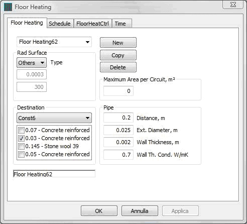
<figcaption>Figure 7 - Input data for geometry and materials.</figcaption>
</figure>

In APPENDIX A, the results obtained from the simulations are compared. In these diagrams, the results pertaining to the real geometry with a fine mesh are shown by dotted lines, whereas the ones referring to the simplified geometry with rough mesh are characterized by continuous lines. In the end, the results given by the 1D model are distinguished by means of "X" markers.

It is easy to see that the three cases are really close each-other. In particular, the accuracy in heat flow prediction is always perfect, even in the most particular cases ("Type X1" and "Type G"). Instead, the mean temperature at the pipe level can go further from the fine mesh results, but it still remains within accuracy ranges to be considered absolutely acceptable ("Type X1" and "Type G").

The accuracy of the 1D -> 2D simplification was checked varying both the temperature at the external surface of the pipe and the ones of floor and ceiling. This is a critic situation, since the application of a variable temperature profile on the pipe makes the effects in the pipe level are stronger than varying only the floor and ceiling temperatures. In fact, if only floor and ceiling temperatures are varied, the effects at the pipe level are softened by the thermal inertia and resistance of the whole deck, whereas in this case the influence of the temperature variation is acted really close to the pipe level.

In the end, as regards the calculation time, it must be considered that, in order to calculate the thermal resistance to be applied in the 1D model, the 2D model must be executed only once (with a length of the time step equal to some millions of seconds, for instance, thus the terms depending on time are reduced to zero and the steady-state behavior can be predicted at once). From the diagrams, it is also clear that the 2D simulations (now used only for calculating the thermal resistance to be imposed at the pipe level of the 1D model) can be performed using the simplified geometry with coarse mesh. In a few words, the time needed for the calculation pre-processing (necessary in order to define the 1D thermal resistance) will be really short (maximum one or two seconds).

## **5. BIBLIOGRAPHY**

1. B. Glück. 1982. Strahlungsheizung - Theorie und Praxis. Verlag C.F. Müller. Karlsruhe.

2. B. Glück. 1989. Wärmeübertragung, Wärmeabgabe von Raumheizflächen und Rohren. VEB Verlag für Bauwesen.  Berlin.

3. M. Koschenz and B. Lehmann. 2000. Thermoaktive Bauteilsysteme. EMPA. Dübendorf.

4. B. Lehmann, V. Dorer and M. Koschenz. 2007. Application range of thermally activated building systems tabs. Energy and Buildings, Volume 39, Issue 5, May 2007, Pages 593-598.

5. M. Koschenz and V Dorer. Interaction of an air system with concrete core conditioning. Energy and Buildings, Volume 30, Issue 2, June 1999, Pages 139-145.

6. M. De Carli, M. Koschenz, B. W. Olesen, M. Scarpa. Dynamic evaluation of the cooling capacity of Thermo-Active Building Systems. ASHRAE 2006. Chicago.

## **6. APPENDIX A**

#### **TYPE A**

<figure id="center_img">
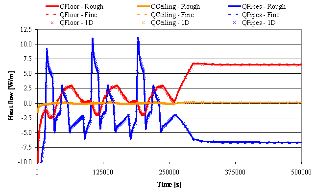
<figcaption></figcaption>
</figure>

<figure id="center_img">

<figcaption></figcaption>
</figure>

#### **TYPE E**

<figure id="center_img">

<figcaption></figcaption>
</figure>

<figure id="center_img">

<figcaption></figcaption>
</figure>

#### **TYPE X1**

<figure id="center_img">

<figcaption></figcaption>
</figure>

<figure id="center_img">
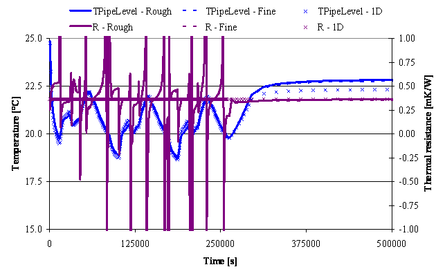
<figcaption></figcaption>
</figure>

**TYPE G**

<figure id="center_img">
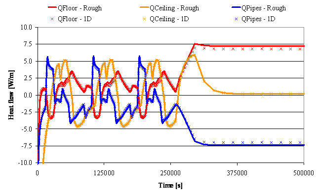
<figcaption></figcaption>
</figure>

<figure id="center_img">

<figcaption></figcaption>
</figure>

It is important to note that the sudden variation of R in 2D simulations is caused by the sudden inversion of heat flow direction. Even with so high variations in R, the simulations performed by means of the 1D model show a great accuracy as well.
