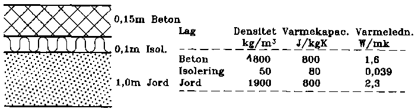

<link rel="stylesheet" href="../style.css">

# Indlæringseksempler

I dette afsnit gives eksempler på den praktiske anvendelse af BSim lige fra vejledning i, hvorledes programmet startes, til hvordan data skal indtastes i de enkelte felter.

Gennem 3 eksempler beskrives modelopbygning samt simulering og resultatbehandling som en fortløbende proces for den samme bygningsmodel, således at de fleste aspekter af programanvendelsen forklares trin for trin.

En mere overordtnet gennemgang af de enkelte trin ved [opbygning af en model](https://bsim.outseta.com/support/kb/articles/y9q8azQA/opbygning-af-model) findes som en ordnet række af links til sider i brugervejledningen som beskriver det enkelte trin i opbygning af en model til simulering og resultatbehandling.

For at give brugeren mulighed for hurtigt at sætte sig ind i programmets vigtigste funktioner, anvendes der som eksempel en meget simpel bygning, for hvilken der gradvist opbygges en BSim-model. Dette betyder, at ikke alle detaljer af programmet beskrives gennem eksemplerne. For en beskrivelse af emner, som ikke behandles her, samt en uddybende forklaring til de enkelte dele af bygningsmodellen, henvises til beskrivelsen af de enkelte dialoger og til [Det matematiske grundlag](https://bsim.outseta.com/support/kb/articles/BWzd4NQE/det-matematiske-grundlag).
  

#### **Tre eksempler**

Eksemplerne beskriver, hvorledes bygningsmodellen gradvist opbygges, hvordan modellen kontrolleres, hvorledes simuleringer forberedes og gennemføres samt, hvordan resultaterne kan analyseres.

[EKS1](https://bsim.outseta.com/support/kb/articles/ZmNrg7m2/eksempel-1)   Start af BSim, indlæsning af bygninger med rum og flader, konstruktioner og vinduer, kopiering af data samt gem modellen.

[EKS2](https://bsim.outseta.com/support/kb/articles/7mawgK9E/eksempel-2)   Åbning af eksisterende model, indlæsning af systemer og tidsplaner samt gennemførsel af de første simuleringer og behandling af resultaterne herfra.

[EKS3](https://bsim.outseta.com/support/kb/articles/4966l79X/eksempel-3)   Detaljering af bygningsmodellen, tilføjelser af skyggegivere, ændring af rudetype samt tilføjelse af solafskærmning og ventilationsanlæg. Ny simulering, resultatanalyse og sammenligning med tidligere resultater, oprettelse af parameterlister, udskrift i tabeller og grafik.

Ved gennemgangen af eksemplerne forudsættes det, at brugeren har læst afsnittene om programmets [centrale brugergrænsflade (SimView)](https://bsim.outseta.com/support/kb/articles/wQXx2xQK/simview) og er fortrolig med [håndtering af mus](https://bsim.outseta.com/support/kb/articles/DQ2xp4WV/operationer-med-musen-i-simview) og tastatur i BSim samt har kendskab til brug af programmer under MS-Windows.

#### **Beskrivelse af bygningen**

Den 'fysiske' bygning, der sættes en model op for, er meget enkel, idet den grundlæggende blot er en kasseformet bygning, begrænset af 4 vægge orienteret mod de fire verdenshjørner, med 2 vinduer i sydvæggen samt et fladt tag og terrændæk. Nedenstående figur viser en skitse af bygningens udformning.

<figure id="center_img">
 
<figcaption>Skitse af den simple bygning, der sættes en model op for i kapitlets eksempler.</figcaption>
</figure>

Selv om der er to rum i bygningen, regnes den i dette eksempel som én termisk zone, idet der skønnes ikke at være forskel på forholdene i de to rum. Bygningen består således af én termisk zone med indvendige mål 6 m x 8 m, med den ene korte side vendende mod syd, jf. *plantegningen*. Den indvendige højde af rummene er 2,7 m.

<figure id="center_img">
 
<figcaption>Plantegning af bygningen for eksemplerne.</figcaption>
</figure>

**Randbetingelser**

Som udeklima benyttes data fra det [danske design referenceår](https://bsim.outseta.com/support/kb/articles/A93zbqQ0/litteratur), DRY, hvorfra de nødvendige vejrparametre findes på BSim format som filen CPH.DRY. For alle udvendige vægge samt taget vender den ene side mod udeluften. Gulvet er i termisk kontakt med en fiktiv zone (jorden) med en fast temperatur på 10 °C. Refleksionen af solstråling fra omgivelserne er 20 %. De udvendige overflader har en absorptionskoefficient for solstråling på 0,7.

 

**Overgangsisolanser**

Overgangsisolansen sættes på flader defineres jf. [DS 418](https://bsim.outseta.com/support/kb/articles/A93zbqQ0/litteratur) som angivet i standardværdier.

 

**Ydervægge**

Alle ydervægge er opbygget ens, med en lagdeling som beskrevet i nedenstående figur. Ved beskrivelsen af lagdelingen i konstruktionerne, er det vigtigt at bemærke, at lagene beskrives således, at det første lag vender mod side 1 og det sidste lag mod side 2.

<figure id="center_img">
 
<figcaption>Beskrivelse af konstruktioner i alle ydervægge.</figcaption>
</figure>

Sammen med BSim programmet leveres der en database, SbiData, med konstruktioner, materialer, ruder m.m., hvorfra det ofte vil være muligt at hente komponenter og bygningsdele til et aktuelt eksempel. Med BSim version 2002 leveres databasen *MoistDat.mdb*, som også indeholder information om bygningsmaterialernes fugttekniske egenskaber.

I dette tilfælde findes der i databasen ikke en konstruktion, der er identisk med den aktuelle, og det vil derfor være nødvendigt at opbygge konstruktionen selv i en kopi af databasen. Opbygningen af den ønskede konstruktion beskrives i eksempel 1.

 

**Indvendige vægge**

På langs i bygningen (nord-syd) er i midten placeret en væg i hele rummets længde, dvs. 8 m. I praksis er bygningen altså delt i to rum, men det skønnes, at de to rum vil være så ens i termisk henseende, at de kan regnes som én termisk zone.

Væggen er en 1-stens teglmur, med tykkelsen 0,108 m og ét lag af materialet '*Tegl indv. 1400*' som kan findes i databasen SbiData.

 

**Gulvkonstruktion**

Gulvet, som er vist i den følgende figur, består af 150 mm beton oven på 100 mm mineraluld, klasse 39. Der ønskes i dette eksempel en simpel beregning af varmetabet til jord, som blot antages at have en fast temperatur på 10 °C hele året. Til selve gulvkonstruktionen medregnes et jordlag på 1,0 m, og som overgangsisolans til dybereliggende jordlag regnes med en værdi på 1,0 m² K/W.

<figure id="center_img" style="overflow-x:auto;">
  
  <figcaption>Beskrivelse af konstruktioner i alle ydervægge.</figcaption>
</figure>

**Loftkonstruktion**

Taget er en kassettekonstruktion, der indvendig består af 22 mm fyrretræslister med 150 mm isolering klasse 39 og udvendig 22 mm træ med tagpap. Der vælges i dette tilfælde at se bort fra det yderste tynde lag, således at konstruktionen kun har to lag. Den beskrevne konstruktion findes som en konstruktionstype i databasen som en tagkonstruktion, der normalt vil svare til et udluftet loft/tag med træ-spærfag.

 

**Vinduer**

I sydvæggen findes 2 ens vinduer, placeret som vist i nedenstående figur. Ruden er en 2-lags lavenergirude med luftfyldning med en center U-værdi på 1,6 W/m²K. Karmen regnes som 100 mm trækarm hele vejen rundt.

Vinduet er trukket lidt tilbage fra facaden, således at rudens plan ligger 0,1 m dybere end facaden. Dette beskrives for programmet i fremspring i meuen for vinduer.

<figure id="center_img" style="overflow-x:auto;">
  
  <figcaption>Placering af vinduer i sydvæggen.</figcaption>
</figure>

#### **Øvrige data for eksemplet**

Ud fra ovenstående beskrivelse skal den bygningsmæssige del af modellen indlæses i BSim. Øvrige data for systemer, solafskærmninger, skygger mv. beskrives i [eksempel 2](https://bsim.outseta.com/support/kb/articles/7mawgK9E/eksempel-2).

