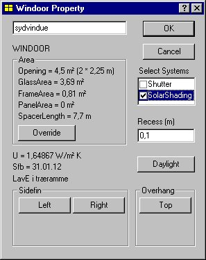
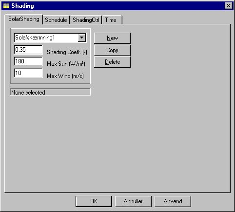
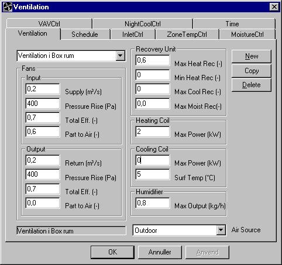
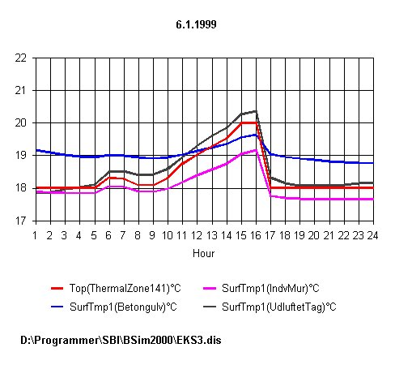
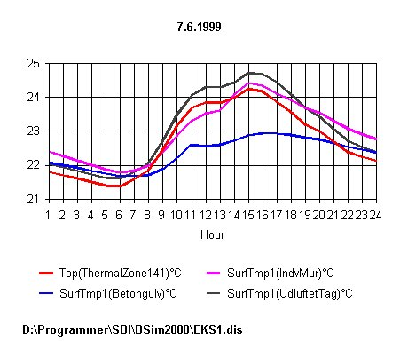
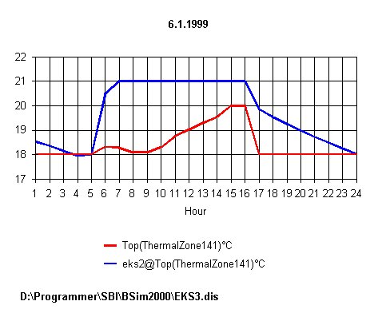

<link rel="stylesheet" href="../style.css">

# Eksempel 3

#### **Modificering af bygningsmodel**

Eksemplet bygger videre på bygningsbeskrivelse og -datamodel beskrevet i eksemplerne [EKS1](https://bsim.outseta.com/support/kb/articles/ZmNrg7m2/eksempel-1) og [EKS2](https://bsim.outseta.com/support/kb/articles/7mawgK9E/eksempel-2), og data forudsættes indlæst som grundlag for denne fortsættelse. Her kompletteres bygningsmodellen med data for følgende forhold:

*   skygger fra omgivelser

*   udskiftning af rudetypen

*   solafskærmninger til vinduerne

*   ventilationsanlæg

På grundlag af den endelige bygningsmodel gennemføres et års simulering, og energi- og indeklimaforhold sammenlignes med resultaterne fra [eksempel 2](https://bsim.outseta.com/support/kb/articles/7mawgK9E/eksempel-2).

**Hent eksisterende model og kopier over i nyt navn**

Bygningsmodellen [EKS2](https://bsim.outseta.com/support/kb/articles/7mawgK9E/eksempel-2) hentes ind i BSim og gemmes under navnet 'EKS3' som beskrevet i [eksempel 2](https://bsim.outseta.com/support/kb/articles/7mawgK9E/eksempel-2). Den nye model (filen EKS3.DIS) benyttes herefter til den videre udbygning af bygningsmodellen.

####  

#### **Beskrivelse af skygge og indlæsning af data**

Vinduerne i den aktuelle bygning ligger delvist i skygge af en anden bygning, som er beliggende mod syd. Den skyggende bygnings nærmeste hjørnepunkt ligger 8 meter fra modellens syd-facade, er 8 meter høj, har en udstrækning på 16 meter og er drejet 30° i forhold til den øst-vest gående akse (x-aksen), som vist i nedenstående figur.

<figure id="center_img">

<figcaption>Placering af skyggende genstande i forhold til den aktuelle bygning.</figcaption>
</figure>

**Indlæsning af data for skygge**

Skyggen beskrives ved at indsætte en ny bygning i modellen. Dette kan ske enten som et eksisternde projekt eller ved oprettelse af en ny bygning - som benyttes i dette eksempel. Dobbelt-klik i plantegningen (markeres som et kryds) for at vælge et referencepunkt hvor den nye bygning skal afsættes ud fra og vælg *Add Building* fra SimView menuen. Referencepunktet kan også vælges ved shift+venstre klik. Hvis referencepunktet ikke er placeret helt korrekt kan de rigtige koordinater indtastes:

<figure id="center_img">

<figcaption>Indtastning af en ny bygnings størrelse og roration.</figcaption>
</figure>

Herved oprettes en ny bygning i modellen som vil skygge på den bygning som simuleres med tsbi5.

<figure id="center_img">

<figcaption>Skyggende bygning i modellen EKS3.</figcaption>
</figure>

#### **Valg af anden rudetype**

For at undersøge betydningen af rudernes isoleringsevne for det samlede varmebehov, ønskes rudetypen erstattet med en super lavenergirude med krypton fyldning. [Databasen](https://bsim.outseta.com/support/kb/articles/y9q842QA/databasen-simdb) åbnes (ved tryk på database-knappen i joblisten eller ved tryk på SimDB ikonet i SimView [værktøjsbjælken](https://help.bsim.dk/support/kb/articles/E9Lw5nQw/simview---varktojsbjalken)) og indgangen *External windoors* vælges i *BuildingElement* delen af databasen. Indgangen "*SuperLavE-Kr i træramme*" vælges. SfB-nummeret vælges og trækkes til de vinduer som skal tilknyttes hvor det slippes. Det er også muligt at benytte SimView menuindgangen *Defaults* som beskrevet i [eksempel 2](https://bsim.outseta.com/support/kb/articles/7mawgK9E/eksempel-2).

 

#### **Solafskærmning for vinduerne**

For at reducere solindfaldet og begrænse overophedningen af bygningen om sommeren, sættes der en solafskærmning på begge vinduer. Ved at højre-klikke på det enkelte vindue i træstrukturen fås vinduesdialogen:

<figure id="center_img">

<figcaption>Dialog (Windoor Property) for ændring af vinduets lokale geometri og tilknytning af systemer til vinduet.</figcaption>
</figure>

Ved at sætte "hak" ud for *SolarShading* tilføjes systemet solafskærmning til vinduet. I træstrukturen højre-klikkes nu på *SolarShading* for det aktuelle vindue hvorved den tilhørende dialog kaldes frem:

<figure id="center_img">

<figcaption>Dialog (Shading) til definition af solafskærmning.</figcaption>
</figure>

For afskærmningsfaktoren *Shading Coeff*. indtastes værdien 0,35, fx svarende til et indvendigt lyst gardin. Det bemærkes, at 'afskærmningsfaktor' er en alment vedtaget betegnelse, der er defineret som forholdet mellem solindfaldet gennem ruden med afskærmningen og solindfaldet gennem ruden uden afskærmning (mellem 0 og 1). Betegnelsen er således noget misvisende, idet den udtrykker, hvor meget sol der passerer afskærmningen (og ikke, hvor meget der afskærmes), således at et lille tal er udtryk for en effektiv afskærmning.

Den anden parameter, der skal indlæses for afskærmningen er *Max Sun*, der angiver en grænse for solindfaldet pr. m² af det aktuelle vindue, hvorover solafskærmningen aktiveres. Værdien af denne parameter må vælges under hensyn til det samlede vinduesareal, solafskærmningen for øvrige vinduer i zonen samt geometrien af zonen og placeringen af arbejdspladser i forhold til vinduerne.

Direkte solstråling, som rammer personer i rummet, opfattes normalt som ubehageligt. transmitteret diffus solstråling fra himlen og reflekteret fra omgivelserne vil sjældent overstige 150 W/m², og det kan antages, at solgrænsen (*Max Sun*) vil ligge mellem 100 og 200 W/m². I dette tilfælde indtastes 180 W/m².

Feltet *Max Wind* angiver over hvilken vindhastighed det ikke tillades at solafskærmningen er i brug. Det kan fx være markiser som ikke tåler vindhastigheder større end 10 m/s.

På fanebladet *ShadingCtrl* findes reguleringen af solafskærmningen:

<figure id="center_img">

<figcaption>Regulering af solafskærmningen i dialogen SolarShading | ShadingCtrl.</figcaption>
</figure>

**Regulering af solafskærmning**

Tidsplanen for solafskærmningen giver mulighed for at definere flere forskellige former for regulering. Den i afskærmningsfanebladet definerede afskærmningsfaktor vil normalt udtrykke, hvor effektiv solafskærmningen er, når den er trukket helt for vinduet. I reguleringsfanebladet giver det første felt *Factor* mulighed for at angive, at afskærmningen inden for den tilhørende tidsangivelse ikke trækkes helt for.

Værdierne af de to næste parametre *Sun Limit* og *Temp*. *Max* definerer tilsammen en strategi for aktivering af solafskærmningen, når der bliver for varmt i zonen. *Temp. Max* angiver en øvre grænse for hvor høj en temperatur, der kan accepteres, før solafskærmningen trækkes for. *Sun Limit* angiver et mindste totalt solindfald gennem alle vinduer, som skal tilføres zonen, før solafskærmningen overhovedet vil blive benyttet med henblik på at reducere temperaturen. Denne grænse indsættes for at undgå unødvendig (eller meningsløs) regulering af afskærmningen på tidspunkter (fx om natten), hvor solindfaldet er meget lille, og hvor en regulering derfor ikke kan reducere indetemperaturen.

I dette tilfælde indtastes værdien 0,8 (kW). Det samlede rudeareal for de to vinduer er ca. 7,4 m² (2 x 1,8 x 2,05) og solgrænsen svarer derfor til en solindfald på ca. 108 W/m². For temperaturgrænsen *Temp. Max* indtastes værdien 24,5 (°C).

Det vil sige: Det checkes først om solintensiteten på indersiden af ruden overskrider 180 W/m². Er dette tilfældet trækkes solafskærmningen for afhængigt af den reguleringsform som er valgt på fanebladet *ShadingCtrl*. Dernæst checkes om den operative temperatur i zonen er over 24,5 °C og om det samlede solindfald gennem alle zonens vinduer overskrider 800 W. Er dette tilfældet trækkes solafskærmningen for afhængigt af reguleringsformen, i dette tilfælde netop så meget (fordi der er valgt kontinuert regulering) at grænsen for den operative temperatur - hvis muligt - kan overholdes.

Det sidste indtastningsfelt *SF4 shading* definerer sollysfaktoren for vinduet, når afskærmningen er trukket helt for. Sollysfaktoren er knyttet til ét bestemt punkt i et givet plan i rummet, og er defineret som forholdet mellem belysningsstyrken i punktet i planet og den samtidige belysningsstyrke udendørs på den facadens plan, jf. [Algoritmer til beregning af solstråling og dagslys](https://help.bsim.dk/support/kb/articles/BWzdaPQE/algoritmer-til-beregning-af-solstraling-og-dagslys).

For uafskærmede vinduer vil sollysfaktoren normalt variere meget igennem rummet, fra i størrelsesorden 0,20 - 0,15 nær ved vinduet til i størrelsesorden 0,02-0,005 bagest i rummet. Sollysfaktoren [SF4](https://help.bsim.dk/support/kb/articles/BWzdaPQE/algoritmer-til-beregning-af-solstraling-og-dagslys) for afskærmet vindue er defineret for et 'vindue' med transmittansen 1, idet reduktionen i lystransmittansen for rude og solafskærmning er indeholdt i data for henholdsvis rude og afskærmning.

Det bemærkes, at mens belysningsstyrken i ethvert punkt i rummet reduceres proportionalt med lystransmissionstallet for vinduet og med (1 - afskærmningsfaktoren) for vinduet, udtrykker sollysfaktoren i et givet punkt af rummet, hvor meget belysningsstyrken i netop dette punkt ændrer sig ved anvendelse af solafskærmningen. Den gennemsnitlige belysningsstyrke i rummet vil altid falde, når afskærmningen er trukket for, men der findes afskærmningstyper (fx reflekterende persienner), som udjævner lysvariationen ind gennem rummet, således at belysningsstyrken bagest i rummet øges, når afskærmningen benyttes. Formålet med sådanne afskærmninger er at reducere luminansforskelle (som kan give blændingsubehag) ved vinduet, for samtidigt at forbedre dagslysudbyttet bagest i rummet, således at behovet for kunstlys reduceres.

Når afskærmningen er trukket delvist for vinduet, beregnes belysningsstyrken i et punkt som en vægtet værdi af belysningsstyrken for 'vinduesdelen' med afskærmning og belysningsstyrken for den anden del af vinduet uden afskærmning.

I det aktuelle eksempel er det valgt at lade lyset regulere efter solindfaldet gennem vinduerne (jf. [eksempel 2](https://bsim.outseta.com/support/kb/articles/7mawgK9E/eksempel-2)), og værdien af sollysfaktoren [SF4](https://bsim.outseta.com/support/kb/articles/49EdwkQ7/sollysfaktorer-for-windoors) vil derfor ikke blive benyttet. Det generelle princip er imidlertid, at alle parametre for komponenter og systemer, som benyttes, skal tildeles en værdi, og her indtastes værdien 0.

 

**Reguleringsform**

Det sidste felt på fanebladet for afskærmningsregulering er indgang til en valgmenu, hvori det skal defineres, hvordan afskærmningen benyttes. For alle tre reguleringsformer antages det, at afskærmningen trækkes så meget for, at solindfaldet bringes ned på eller under grænsen Max sol defineret i afskærmningsfanebladet og så meget, at temperaturen kommer under grænsen Temp. max defineret på fanebladet for afskærmningsregulering. I begge tilfælde dog kun såfremt disse maxværdier kan holdes ved den definerede afskærmningsfaktor. Afskærmningen trækkes netop så meget for, som det er nødvendigt for at overholde begge grænseværdier.

Ved 'trinløs' (*Continuos*) regulering antages det, at afskærmningen trækkes lige akkurat så meget for, som nødvendigt for at overholde begge grænser. Ved 'on/off' trækkes afskærmningen (helt) for, såfremt én af grænseværdier overskrides. Ved '0 - ½ - 1' reguleringen trækkes afskærmningen halvt for, hvis dette er tilstrækkeligt for at forhindre overskridelse af grænseværdierne, men hvis dette ikke er tilstrækkeligt, trækkes den helt for.

Det definerede system for vinduet kan kopieres til vinduet i det andet rum ved at trække (med Ctrl-knappen og venstre muse-knap holdt nede) fra vinduet i 'Box rum 1' til vinduet i 'Box rum 2' og slippe det her.

 

#### **Indlæsning af data for ventilationsanlæg**

Som den sidste udbygning af eksemplet forsynes bygningen med et ventilationsanlæg, der indblæser og udsuger 0,1 m³/s eller 360 m³/h i 'arbejdstiden', dvs. time 9-16 på hverdage. Anlægget indeholder en varmegenvinder med en temperaturvirkningsgrad på 0,6, samt en varmeflade med en maksimaleffekt på 1 kW, hvori luften kan opvarmes til minimum 17 °C før indblæsning.

I træstrukturen højre-klikkes på den termiske zone hvor ventilationssystemet skal tilknyttes, hvorved der fremkommer en ventilationsdialog, som definerer forhold vedrørende luften i det aktuelle anlæg:

<figure id="center_img">

<figcaption>Første faneblad i ventilationsdialogen viser ventilationskomponenterne.</figcaption>
</figure>

####  

#### **Ventilationskomponenter**

Ventilationsfanebladet viser de komponenter, som kan specificeres for anlægget. Her skal specificeres data for ventilator, genvinder, varme- og køleflade samt befugter, og desuden skal der tilknyttes en tidsplan til anlægget. Data for eksemplet indtastes som vist i ovenstående figur.

 

**Ventilator**

Under indgangen for ventilator defineres indblæsnings- og udsugningsventilatoren ved luftmængder, trykstigning samt total virkningsgrad. Trykstigning og virkningsgrad benyttes til beregning af summen af effektbehovet til de to ventilatorer efter formlen:

$$  
P = \frac{q_v \cdot \Delta p_t}{\eta_{\text{tot}}} \tag{1}  
$$

*P* er den optagne effekt, W   
qv er volumenstrømmen, m³/s   
Δpt er trykstigningen over ventilatoren, Pa   
ηtot er den totale virkningsgrad for ventilator, motor og kraftoverføring, -

 

**Genvinder**

For genvinderen indtastes temperaturvirkningsgraden som 0,6 i feltet *Max Heat Rec.* I de øvrige felter indtastes værdien 0. Forudsætningen for at sætte parameteren *Min Heat Rec.* til 0 er, at systemet kan reguleres, så der ikke overføres varme fra udsugnings- til indblæsningsluft, når dette er uønsket (fx om sommeren).

Ved 'kølegenvinding' (*Max Cool Rec.*) sker der nedkøling af indblæsningsluften, idet denne afgiver varme til udsugningsluften (fra zonen). Denne funktion vil normalt kun være aktuel i bygninger med mekanisk køling og forudsætter, at systemet har en regulering, der i tilfælde af kølebehov kontrollerer at udsugningstemperaturen er så meget lavere end udeluften, at den ønskede varmeoverførsel kan finde sted.

Den sidste parameter 'fugtgenvinding' (*Max Moist Rec.*) angiver om der overføres fugt i genvindingskomponenten, som det er tilfældet ved regenerativ genvinding (fx roterende vekslere) i modsætning til rekuperativ genvinding (fx pladevekslere).

 

**Varmeflade**

Modellen for varmefladen (*Heating Coil*) er meget enkel, og beskrives ved blot én parameter, nemlig den maksimale effekt, *Max.Power*, der kan afgives til luften. Her indtastes værdien 2.

Hver af komponenterne i et ventilationsanlæg er at betragte som komponenter i et firmakatalog, der kan benyttes i flere forskellige anlæg.

Det bemærkes, at i en simpel model med kun ét ventilationsanlæg kan de automatiske tildelte navne for komponenter mv. benyttes uden problemer.

Det sidste felt i dialogen *Air Source* angiver, hvorfra det aktuelle anlæg får sin luft. Feltet er indgang til en valgmenu, som indeholder alle fiktive zoner, egentlige zoner. Luften kan altså tages fra enhver af disse zoner, og som standard antages det, at ventilationsluften kommer fra den fiktive zone '*Outdoor*', hvilket også er tilfældet her.

 

**Tidsplan og regulering for ventilationsanlæg**

I tidsplanen er der mulighed for at specificere 5 forskellige former for regulering ved valg af hver sit faneblad:

 | Reguleringstype                | Beskrivelse                                                                                                                                                                                                                                                                                                                                                                                                                                                                                           |
|-------------------------------|-------------------------------------------------------------------------------------------------------------------------------------------------------------------------------------------------------------------------------------------------------------------------------------------------------------------------------------------------------------------------------------------------------------------------------------------------------------------------------------------------------|
| Indblæsning (*InletCtrl*)      | er en styring, hvor indblæsningstemperaturen kan defineres som funktion af udetemperaturen.                                                                                                                                                                                                                                                                                                                                                                   |
| Rumtemp (*ZoneTempCtrl*)       | hvor indblæsningstemperaturen søges tilpasset (inden for valgte min og maxværdier) således, at det valgte rumfølerens setpunkt opretholdes.                                                                                                                                                                                                                                                                                                                  |
| Fugtregulering (*MoistureCtrl*)| der primært benyttes i forbindelse med affugtning af rumluften. Indblæsningsluften affugtes i kølefalden, når rumluftens relative fugtighed overstiger rumhygrostatens setpunkt. Reguleringen kan kombineres med opvarmning til et ønsket temperatur setpunkt samt med befugtning af indblæsningsluften.                                                                                                                     |
| VAV (*VAVCtrl*)                | hvor indblæsningsluftmængden kan forøges ud over den nominelle (Variabel Air Volume) med henblik på at holde temperaturen (nede) på et ønsket setpunkt. Denne regulering af luften sker kun i tilfælde af kølebehov.                                                                                                                                                                                                 |
| Natkøling (*NightCoolCtrl*)    | kombineres ofte med en af de øvrige (forskellige reguleringer inden for forskellige tidsangivelser). Ved denne regulering startes ventilationen (on/off) når indetemperaturen overskrider setpunktet med en vis differens (bestemt af brugeren), dog kun såfremt indetemperaturen samtidig overskrider udetemperaturen med en vis differens (ligeledes bestemt af brugeren), således at rumtemperaturen virkelig vil blive reduceret ved hjælp af natkølingen. Denne reguleringsform er speciel derved, at der via en indgang i reguleringsmenuen skal angives, hvilke komponenter, som er aktive ved natkølingen, således at det fx kan antages, at kølefladen (køleanlægget) ikke er i drift under natkølingen. |

I princippet kan der benyttes forskellige reguleringsformer inden for forskellige tidsangivelser, idet en ny reguleringsform vælges ved først at oprette en ny tidsplan i *Schedule*, og derpå at klikke på *Anvend*.

 

**Data for regulering i eksemplet**

Reguleringen for ventilationsanlægget specificeres via fanebladet *Schedule* i dialogen Ventilation. Via et af reguleringsfanebladene er det muligt at få en oversigt over de forskellige reguleringer, der kan tilknyttes anlægget. I det aktuelle eksempel vælges typen 'Indblæsning' *InletCtrl*. Denne reguleringsform er en ren 'styring', dvs. uden tilbageføringssignal af tilstanden ved føleren til dét, der reguleres på, nemlig ventilationskomponenter, ventiler m.m. i systemet.

<figure id="center_img">

</figure>

I det første felt på fanebladet *Part of nom*. *flow* kan angives, at der inden for den tilknyttede tidsangivelse kun opereres med en vis andel af den 'nominelle', som er defineret under ventilator. Dette vil fx være en enkel måde at definere reguleringen for et anlæg, som kører med reduceret luftmængde om natten. Gennem de følgende 6 parametre på fanebladet beskrives reguleringskurven for indblæsningstemperaturen som er skitseret på fanebladet.

I dette tilfælde reguleres indblæsningstemperaturen således, at den er 22 °C ved udetemperaturen -12 °C, faldende lineært med stigende udetemperatur til 17 °C ved en udetemperatur på 20 °C. Når udetemperaturen er under -12 °C eller over 20 °C, er indblæsningstemperaturen konstant, henholdsvis 22 °C og 17 °C (hældning af linien for styringskurven uden for disse værdier er 0).

Den sidste parameter på fanebladet *Air Hum*. har kun betydning for anlæg som indeholder en befugter. Da feltet ikke må være tomt, indtastes blot en værdi for det absolutte fugtindhold i luften, fx 0,007 (kg vanddamp/kg tør luft).

Den definerede reguleringsform vælges ved at klikke på knappen *Anvend*.

En beskrivelse af de forskellige reguleringstyper er givet i afsnittet [Ventilationsanlæg](https://bsim.outseta.com/support/kb/articles/OW4N5AQg/ventilation-system).
 

#### **Gem bygningsmodel**

Alle data for bygningen er nu indlæst, og modellen ønskes derfor gemt. Før dette gøres, bør der foretages en kontrol af at modellen er komplet ved at trykke på [*ModelList*](https://help.bsim.dk/support/kb/articles/ZmNr2Em2/simview---udskrift-af-model). Såfremt der findes fejl eller mangler i data, giver programmet oplysning herom, og i modsat fald er alle data (formelt) i orden. Ved starten af eksemplet blev navnet for modellen defineret som 'EKS3' og modellen gemmes nu igen under dette navn ved at klikke på feltet *Save* i menuen *File*. Den gamle model bliver ikke overskrevet, men bevares som filen EKS3.dbk som en "back-up" fil.

 

#### **Simulering**

Der ønskes nu foretaget en simulering for at sammenligne indeklima og energiforbrug for den nye model ([EKS3](https://bsim.outseta.com/support/kb/articles/4966l79X/eksempel-3)) med den gamle model ([EKS2](https://bsim.outseta.com/support/kb/articles/7mawgK9E/eksempel-2)).

 

**Valg af parametre i 'time-log'**

Ved kopiering af modellen fra EKS2 over i EKS3 (i starten af eksempel 3) kopieredes kun data for selve bygningsmodellen og parameterlisten (filen EKS3.DIS) det perioden for simulering og oplysninger (data) vedrørende time-log gemmes på den anvendte pc, kan simuleringen startes ved at skifte til fanebladet *Simulation* og klikke på knappen *Start*.

 

#### **Resultater**

Det bedste overblik over beregningsresultaterne fås normalt ved at analysere varmebalancen (*HeatBalance*) for bygningen eller for de termiske zoner.

<figure id="center_img">

<figcaption>Varmebalancen efter simulering med tsbi5.</figcaption>
</figure>

Via indgangen 'Tidsskala' (den første valgmenu regnet fra venstre) vælges '*year*' for at få balancen for hele simuleringsperioden, i dette tilfælde hele året. Der vises en energibalance, hvori alle bidrag til balancen er angivet for den valgte periode. I energibalancen vises også, hvor mange timer af året den operative temperatur underskrider 20 °C, og hvor mange timer den overskrider 21, 24, henholdsvis 26 °C (standardværdier for temperaturgrænserne).

Et samlet overblik over indetemperaturforløbet kan fås ved at vælge 'grafisk' - udskrift af den operative temperatur OpTmp via fanabledet *Tables*.

 

**Analyse af temperaturforløb over døgnet**

En nærmere analyse af temperaturforløbet over døgnet er vist i nedenstående skærmudskrifter for en dag i uge 1 og en i uge 23. Her er både den operative temperatur og overfladetemperaturerne af den indvendige væg, loftet samt gulvet udskrevet.

<figure id="center_img">

<figcaption>Grafisk udskrift for en vinterdag af den operative temperatur samt overfladetemperaturer for udvalgte konstruktioner.</figcaption>
</figure>

<figure id="center_img">

<figcaption>Grafisk udskrift for en sommerdag af den operative temperatur samt overfladetemperaturer for udvalgte konstruktioner.</figcaption>
</figure>

**Sammenligning af EKS2 og EKS3**

Der er mulighed for at danne parameterlister med parametre fra forskellige modeller, således at det fx er muligt at sammenligne alternative projektløsninger. I dette tilfælde sammenlignes det termiske indeklima i EKS2 og EKS3.

Der dannes en ny paramterliste ved at klikke på *New* mens parameterfanebladet er på skærmen. I det viste tilfælde er der indlæst navnet 'TempSammenlign' for listen. Ved at klikke med musen i grupperne (over venstre vindue) fremkaldes på normal måde en oversigt over parametergrupper, hvorfra der kan vælges parametre for den aktuelle model (EKS3). Her vælges gruppen 'Indeklima', hvorfra der vælges den operative temperatur, parameteren OpTmp.

Der ønskes foretaget en sammenligning af forløbet af den operative temperatur i EKS3 og i EKS2. For at vælge resultatparametre fra EKS2, klikkes på knappen *Open New Model*, hvorved der fås en oversigt over modeller i det aktuelle kartotek, for hvilke der findes en resultatfil (af typen .G97). Der kan kun vælges modeller som ligger i samme kartotek (mappe) som den aktuelle model.

Ved at klikke på modelnavnet 'EKS2' vælges denne model, og herfra kan der vælges parametre som normalt. I det viste tilfælde er der valgt parameteren OpTmp fra EKS2. Der er således dannet en simpel parameterliste med parametre fra de to modeller, og der kan foretages tabel- og grafikudskrift på sædvanlig måde af timeværdierne. Parameternavne fra den "fremmede" model er angivet i parametrelisten med et foranstillet modelnavn og et "@" inden parameternavnet.

<figure id="center_img">

<figcaption>Oprettelse af parameterliste for sammenligning af resultater fra 2 eller flere modeller.</figcaption>
</figure>

I det følgende er vist udskrifter for en sommerdag og en vinterdag af forløbet af den operative temperatur for de to eksempler.

Den valgte vinterdag er en dag med stort solindfald, og det ses, at i EKS3 stiger temperaturen, som ikke kan holdes på setpunktet på 21 °C, fordi der ikke er skygge fra nabobygningen, og der er solafskærmning for vinduerne. For den valgte sommerdag er temperaturen i EKS2 3 °C højere end i EKS3, fordi der er defineret solafskærmning, udluftning og ventilation i det sidste eksempel.

<figure id="center_img">

<figcaption>Grafisk udskrift for en sommerdag af den operative temperatur samt overfladetemperaturer for udvalgte konstruktioner.</figcaption>
</figure>

<figure id="center_img">

<figcaption>Grafisk udskrift for en sommerdag af den operative temperatur samt overfladetemperaturer for udvalgte konstruktioner.</figcaption>
</figure>

 
