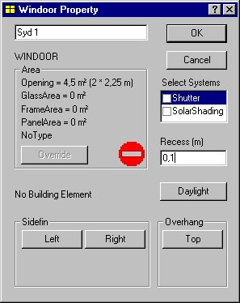
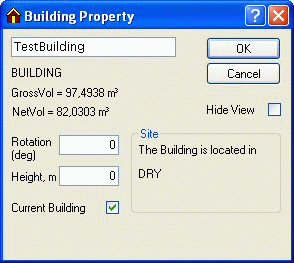

<link rel="stylesheet" href="../style.css">

# Eksempel 1

#### **Start**

Programmet startes ved at klikke på BSim via menuen *Start* | *Programmer* | *BSim* | *BSim*.

Herved fremkommer programmets hovedvindue ([SimView](https://bsim.outseta.com/support/kb/articles/wQXx2xQK/simview)). Hovedvinduet er delt op i to felter, som foreløbig er tomme. I feltet til venstre vil den aktuelle bygning senere blive vist som en træstruktur. Feltet til højre er yderligere underopdelt i fire felter, hvor den aktuelle bygning senere vil blive vist grafisk. Det foreløbige navn for bygningsmodellen er standardnavnet 'Untitled', som vises i titelbjælken af SimView.

Inden arbejdet med opbygning af modellen er det en god ide at sætte parametrene for automatisk gemning af *Undo*-niveauer for ændringer i geometrien. Dette gøres ved at højreklikke i den grafiske visning og vælge indgangen [*Options*](https://help.bsim.dk/support/kb/articles/LmJv8EmP/simview---options). Vær opmærksom på at en ændring i antallet af *Undo*-niveauer først træder i kraft næste gang programmet startes.

Når der skal opbygges en ny model, flyttes markøren til menuen *File* | *New*, hvorpå der klikkes med musen (venstre tast). Der kan også trykkes på ikonet for et nyt projekt (længst til venstre i [værktøjsbjælken](https://help.bsim.dk/support/kb/articles/E9Lw5nQw/simview---varktojsbjalken)) eller alternativt trykkes *Ctrl+n* som en [genvej](https://bsim.outseta.com/support/kb/articles/vWyPMJ9b/genvejstaster).

<figure id="center_img">

<figcaption>Første dialog til oprettelse af en ny model.</figcaption>
</figure>

Herved fremkommer en "[wizard](https://help.bsim.dk/support/kb/articles/yWogPPWD/model-wizard---oprette-en-ny-model)" for oprettelse af en ny model. Navnet (øverste linje) og stien (nederste linje) til den aktuelle model skal indtastes i den første dialog. Det ønskede navn kan nu indtastes i navnefeltet, i dette tilfælde 'EKS1'. I stifeltet kan fx indtastes:

C:\Programmer\Statens Byggeforskningsinstitut\BSim\Modeller

Såfremt den undermappe (folder), der nu er specificeret som *C:\Programmer\Statens Byggeforskningsinstitut\BSim\Modeller*, ikke allerede eksisterer, vil programmet oprette en ny mappe med det givne navn, som kan benyttes til at gemme de forskellige eksempler, som beskrives i dette kapitel. Det er også muligt at søge frem gennem pc'ens filsystem efter den placering som ønskes benyttet til modellen. Dette sker ved tryk på knappen med dette ikon:

<figure id="center_img">

</figure>

Wizard'en opretter en kopi af den database, som vælges i den anden dialog. Kopien kan fx dannes fra standarddatabasen (SbiData.mdb) og får samme navn som modellen. Kopien vil, i modsætning til standarddatabasen, ikke være skrivebeskyttet.

Ud over at oprette en database for modellen er det muligt i den tredje dialog at vælge hvilken bygningstype (*Office* eller *Dwelling*), der ønskes simuleret. Ved dette valg oprettes en række typiske tids- og belastningsprofiler som senere kan benyttes ved definition af modellens systemer.

 

#### **Bygningen og dens rum**

Der er nu gjort klar til at beskrive bygningen og dens rumopdeling. Der højre-klikkes derfor i den grafiske visning og vælges *Add Building* (eller Alt+b), hvorved bygningsdialogen fremkommer. Ved indlæsning af en ny model vil det være mest naturligt at starte med at definere de rum, som man har valgt at simulere for bygningen, og herefter trinvis beskrive detaljerne: konstruktionstyper, lag i konstruktionerne samt materialer i lagene.

<figure id="center_img">

<figcaption>Dialog for indsættelse af en ny bygning.</figcaption>
</figure>

**Automatisk tildeling af navne**

Alle objekter, der oprettes i en model, får automatisk tildelt et navn. Navnene anvendes udelukkende til at identificere et objekt overfor brugeren. Ved redigering i data for modellen kan navnene til enhver tid ændres, og for at få et bedre overblik er det tilrådeligt, at de automatiske navne overskrives med mere beskrivende navne.

 

**Talværdier for zone i eksempel 1**

Ud fra bygningsbeskrivelsen kan de viste talværdier bestemmes og indtastes i bygningsdialogen. Som nyt navn for bygningen skrives EKS1 og for det første rum "Box-rum 1", og data for rummets udbredelse (systemlinjerne) i X-, Y- og Z-retningen indtastes (3,358; 8,616; 4,32). X, Y og Z værdierne svarer til rummets størrelse plus konstruktionernes tykkelse. Desuden kan bygningens placering i tegningens koordinatsystem (X, Y og Z origin) angives samt en eventuel rotation i forhold til sand nord indtastes (positiv imod øst). Koordinatsystemets nulpunkt placeres i (0; 0; -1) hvorved undersiden af gulvkonstruktionen får kote 0.

**NB**: Tykkelsen af udvendige vægge afsættes fra systemlinjerne og indefter. Indvendige vægge afsættes symmetrisk omkring systemlinjerne.

Udfyldningen af data i bygningsdialogen er nu færdig, og den forlades ved at trykke *OK*.

<figure id="center_img">

<figcaption>Hovedvindue efter oprettelse af bygningen.</figcaption>
</figure>

I det højre felt af hovedvinduet vises bygningen grafisk på fire måder. Nederst til venstre vises en plantegning (xy), for oven vises opstalter, til venstre set mod y-retningen (xz) og til højre set i x-retningen (yz). I det nederste felt til højre ses en rumlig afbildning.

Tegningerne kan forstørres/formindskes ved klik på lup-ikonerne i værktøjsbjælken eller med + og - tasterne. Den rumlige visning kan ændres ved klik på pil-symbolerne i værktøjsbjælken eller ved brug af piletasterne.

I den rumlige visning kan der ctrl-klikkes (ctrl-tasten holdt nede mens der venstreklikkes med musen) på en kant af en flade. Herved vælges en af fladerne, kanten indgår i, og markeres med rødt, fladens hjørnepunkter markeres med sorte firkanter, og fladen lokaliseres i træstrukturen. Gentages ctrl-klik på kanten, vælges den næste flade, som kanten indgår i.

 

**Indlæsning af data for vinduer**

Vælg den flade (Ctrl+venstre-klik) som vender mod syd (omdøb den eventuelt til 'Sydvæg'). Definer et lokalt koordinatsystem i den flade, vinduet ønskes indsat i. Det gøres ved at vælge et nulpunkt (dobbelt venstre-klik eller Shift+venstre-klik på et af hjørnepunkterne) for koordinatsystemet og vælge en akse (dobbelt venstre-klik eller Shift+venstre-klik på en kant) i det lokale koordinatsystem. Kald [SimView-menuen](https://help.bsim.dk/support/kb/articles/49EdrJQ7/simview---menu) frem og vælg indgangen *Add WinDoor* for at definere vinduets geometri og placering i forhold til det lokale koordinatsystem.

<figure id="center_img">

<figcaption>Dialog til indsættelse af vinduer og døre i en flade. Illustrationen nederst til højre i dialogen viser en skitse af det lokale koordinatsystem og hvordan et vindue afsættes i dette.</figcaption>
</figure>

For hul-bredden indtastes 2,0 m og for hul-højden 2,25 m. For vinduets afstand fra gulvet (*Offset*) indtastes som 1,55 m (gulvet + 30 cm afstand fra gulvet) og for afstanden fra væggen (*Dist.*) indtastes 0,808 m (ydervæggens tykkelse + afstanden fra ydervæggen). Standardværdien 1 for antal og 0,2 for afstand imellem ens vinduer ændres ikke.

For at definere geometrien omkring vinduet nærmere højre-klikkes på feltet vinduet i træstrukturen, hvorved der fremkommer en dialog for valg af lokal geometri omkring vinduet, systemer tilknyttet vinduet samt definition af sollysfaktorer for vinduet. Heri indtastes 0,1 for glassets placering i forhold til facaden. Dialogen forladens ved at trykke på OK-knappen

<figure id="center_img">

<figcaption>Dialog (Windoor Property) for definitions af lokal geometri, systemer og sollysfaktorer for et vindue. Der vil optræde et stop-skilt i dialogen så længe der ikke er tilknyttet en konstruktion til vindueshullet.</figcaption>
</figure>

Nu kan modellens andet rum oprettes som en kopi af "Box rum 1". Det nye rum kan oprettes ved at vælge den flade i rummet, som det nye rum skal have fælles med det eksisterende rum, og tilføje rummet hertil ved at vælge indgangen *Add Room* fra [SimView-menuen](https://help.bsim.dk/support/kb/articles/49EdrJQ7/simview---menu). Det nye rums udbredelse og/eller standard geometri kan vælges i den herved fremkomne dialog.

<figure id="center_img">

<figcaption>Tilføj et rum (Box rum 2) til modellen.</figcaption>
</figure>

Det nye rum oprettes som en kopi af det aktuelle rum. Herved kopieres hele rummets geometri (inkl. vinduer og eventuelle åbninger) samt de konstruktionstyper som måtte være defineret.

 

#### **Konstruktioner og konstruktionstyper**

Det er ikke alle de i eksemplet beskrevne konstruktioner som findes i standarddatabasen, og det er derfor nødvendigt at oprette nogle nye elementer i modellens database.

Åben databasen ved at klikke på DB-ikonet i [værktøjsbjælken](https://help.bsim.dk/support/kb/articles/E9Lw5nQw/simview---varktojsbjalken).

 

**Tilknytning af nye konstruktioner til modellens database**

Af [bygningsbeskrivelsen](https://help.bsim.dk/support/kb/articles/BWzd7LQE/indlaringseksempler) fremgår det, at vægkonstruktionen indefra består af letbeton, isolering samt tegl. Denne konstruktionstype findes ikke i standardbiblioteket, men der findes en type, hvor blot ét af lagene skal ændres. I dette tilfælde trækkes markøren ned til typen med navnet 'Br 39I100 Br', som er en dobbelt teglvæg med 100 mm isolering i hulrummet. Konstruktionstypen, der er brug for, består imidlertid indvendig af letbeton i stedet for tegl, og det er derfor nødvendigt at ændre på lagdelingen.

 

**Kopiering af databaseelementer**

Det anbefales at der laves en kopi af det element, som ønskes ændret, i dette tilfælde konstruktionstypen 'Br 39I100 Br'. Ved at trykke på funktionstasten *Copy*, fås det viste skærmbillede.

<figure id="center_img">

<figcaption>Dialog (Copy BuildingElement) for tildeling af unikt SfB-nummer til en kopi af et bygningselement.</figcaption>
</figure>

Når det nye bygningselement har fået et [SfB-nummer](https://bsim.outseta.com/support/kb/articles/DQ2xwBWV/sfb-i-bsim) åbnes databasens *Edit BuildingElement* dialog. På første faneblad (*BuildingElement*) ændres konstruktionens navn så det afspejler lagene i den nye konstruktion og der skiftes til andet faneblad (*ConstructionLayer*). For en beskrivelse af felterne i [*BuildingElement*](https://help.bsim.dk/support/kb/articles/dQG2dzm4/simdb---buildingelement), [*ConstructionLayer* ](https://help.bsim.dk/support/kb/articles/OW4NdAQg/simdb---buildingelement-constructionlayer)og [*MaterialAmount* ](https://help.bsim.dk/support/kb/articles/Rm8JaZ94/simdb---buildingelement-materialamount)henvises til beskrivelsen af databasen [SimDB](https://bsim.outseta.com/support/kb/articles/y9q842QA/databasen-simdb).

<figure id="center_img">

<figcaption>På andet faneblad (ConstructionLayer) i dialogen Edit BuildingElement kan lagdelingen for en konstruktion ændres.</figcaption>
</figure>

Letbeton kan findes i databasens materialedel som der er adgang til via andet faneblad. Der klikkes på tredje materialelag (*Brick ext 1800*) for at vælge dette. I indgangen *Type* vælges gruppe f. Precast elements, hvorefter der, via indgangen *ConstructionMaterial* vælges et materiale som passer til [beskrivelsen af konstruktionerne](https://help.bsim.dk/support/kb/articles/BWzd7LQE/indlaringseksempler).

Når der er valgt et nyt materiale i stedet for den indvendige teglvange, skal tykkelsen af laget ændres til 0,1 m. Dette gøres ved at vælge laget (klik med musen) og ændre værdien i andet felt, umiddelbart under valgmenuen for *ConstructionMaterial*. Den ny tykkelse vil optræde i kolonnen *Thickness* ud for navnet for det nye materiale.

Lagenes rækkefølge er angivet som parameteren (0 -> n) i den sidste kolonne, hvor 0 angiver laget ved side 1 (ind mod rummet) af konstruktionen og n, laget ved side 2 af konstruktionen.

Parameteren *resistance* angiver den termiske modstand i m²K/W af eventuelle luftfyldte hulrum i konstruktionen. Den termiske modstand for et hulrum angives på det materialelag som er beliggende umiddelbart inden for hulrummet.

 

**Konstruktioner i gulv og loft**

Den [beskrevne](https://help.bsim.dk/support/kb/articles/BWzd7LQE/indlaringseksempler) gulvkonstruktion findes ikke umiddelbart i standarddatabasen, men den ligner konstruktionen 'C150 39I100', dog med den modifikation, at der tillægges et jordlag på 1 m som et ekstra lag yderst i konstruktionen. Med markøren på den ønskede konstruktion trykkes *Copy* for at lave en lokal kopi af standardkonstruktionen.

Som beskrevet for de udvendige vægge dannes der herved en kopi som kan ændres. På *ConstructionLayer* fanebladet flyttes markøren til det andet lag, 'Min. wool 39', hvorpå der trykkes på knappen *New Layer*. Herved oprettes et nyt materialelag med navnet ? og samme procedure som beskrevet ovenfor anvendes til at definere materialelaget jord. Jord (*Soil(humid)*) findes i materialegruppe k. *Soil Materials*.

 

**Loftkonstruktion**

Som konstruktion for loftet benyttes typen '*Roof constr.*' fra databasen

 

**Indvendige vægge og varmekapacitet**

Væggen har betydning for den samlede varmekapacitet af zonen, og dermed for temperaturforløbet, udnyttelse af overskudsvarme samt for energiforbruget. For lette rum, hvor konstruktionerne har lille varmekapacitet, kan møbler, inventar m.m. have betydning for rummets samlede varmekapacitet, og det vil da være nødvendigt at medregne sådanne interne kapaciteter.

 

**Vinduer**

Der i bygningsbeskrivelsen angivet, at vinduets U-værdi er 1,6 W/(m² K), men ikke er oplyst noget om karmtypen. Fra databasen kan vælges rudetypen '*LavE i træramme*'.

 

#### **Tilknytning af konstruktioner til modellens flader**

Det fremgår af træstrukturen, at der endnu ikke er defineret konstruktioner eller Windoor, idet der i disse felter står '*No Type*' ved de respektive objekter. For at definere, hvorledes de enkelte flader, fx nordvæggen, er opbygget, kaldes SimView-menuen frem (højre-klik med musen i den grafiske afbildning) og vælges indgangen *Defaults*. Herved kaldes dialogen for definition af [standardkonstruktioner](https://bsim.outseta.com/support/kb/articles/y9gBKGQM/standardkonstruktioner) frem.

<figure id="center_img">

<figcaption>Dobbelt dialog for valg af standardkonstruktioner og Windoor til alle modellens flader.</figcaption>
</figure>

Den ønskede konstruktion tilknyttes modellens konstruktioner ved at venstre-klikke på SfB-nummeret for den ønskede konstruktion og trække (med venstre muse-knap holdt nede) til den ønskede placering i *Defaults* dialogen.

De ønskede konstruktionstyper kan vælges fra forskellige grupper af data i [databasen](https://bsim.outseta.com/support/kb/articles/y9q842QA/databasen-simdb).

<figure id="center_img">

<figcaption>Databasens konstruktioner (BuildingElements) er inddelt i forskellige typer, fx ydervægge, indvendige vægge, gulve osv.</figcaption>
</figure>

Når de ønskede standardkonstruktioner er tilknyttet, trykkes på knappen *Anvend* eller *OK* i vinduet *Defaults*. Ændringerne træder først i kraft, når der højre-klikkes på bygningen i træ-oversigten og trykkes på knappen *Insert Defaults* i den dialog, der fremkommer.

<figure id="center_img">

<figcaption>Egenskaber for bygningen (Building Property). Dialogen kaldes frem ved højre-klik på bygningen i træ-oversigten. Standardkonstruktioner tilknyttes de aktuelt oprettede konstruktioner ved tryk på knappen Insert Defaults.</figcaption>
</figure>

__________________________________________________________

<figure id="center_img">

<figcaption>Princip for ventilationsanlæg med recirkulation.</figcaption>
</figure>
___________________________________________________________

Når konstruktionerne er påtrykt en type, vil de blive optegnet i den grafiske visning med deres virkelige tykkelse.

 

#### **Klimadata og fiktive zoner**

I eksemplet vender gulvet mod jord, som i dette tilfælde ønskes defineret som en fiktiv zone. Dette gøres ved at højre-klikke på bygningen i træstrukturen. Herved fremkommer der en dialog (*Building Property*), som viser information om bygningen. Tryk på knappen *Site* for at åbne en dialog til definition af klimadata og fiktive zoner.

<figure id="center_img">

<figcaption>Dialog (Site) for valg af klimadata og definition af den fiktive zone jord.</figcaption>
</figure>

For at definere en (ny) placering (*Site*) af modellen trykkes på knappen New. Herved oprettes en ny *Site* og det er muligt at vælge et klimadatasæt ved at trykke på knappen *Browse*. Søg og vælg klimadatafilen *cph.dry*.

Tryk herefter på knappen *Ground* og knappen *New* i *Ground* dialogen for at oprette den [fiktive zone jord](https://bsim.outseta.com/support/kb/articles/vWyP8M9b/klimadata) med en konstant temperatur på 10 °C gennem hele året.

<figure id="center_img">

<figcaption>Dialog (Ground) for definition af den fiktive zone jords temperaturvariation over året.</figcaption>
</figure>

I reguleringen for den fiktive zone jord angives en temperaturvariation over året som en sinuskurve bestemt ved maksimumværdi og minimumsværdi samt datoen for temperaturmaksimum. Den tilsvarende svingning anvendes for fugtvariationen i jorden. Der anvendes værdierne 10,0 for maksimumtemperatur og 10,0 for minimumstemperatur, svarende til en konstant temperatur over året. Ved brug af den samme værdi for maksimum- og minimumtemperatur bliver informationen i datofeltet ligegyldig. Standardværdien 0,0058 (kg/kg) anvendes for luften i den fiktive zone jords absolutte fugtindhold (i dette tilfælde uden betydning). Til en enkel og hurtig beregning, eller i tilfælde hvor varmetabet til jorden er ubetydeligt, kan der blot regnes med en konstant 'jordtemperatur.

Det bemærkes, at der stort set ikke er restriktioner på, hvilke navne de enkelte elementer i modellen kan tildeles, fx kan navnet for jordzonen skrives som 'Jordtemp. 10 °C', hvor gradtegnet kan indtastes som Alt+248 (ASCII-karakter 248).

I dette eksempel vender gulvet mod jorden, og for at indlæse dette i modellen højre-klikkes på *Finish* nr. 2 for gulvet i træstrukturen og vælge at gulvets flade nr. 2 vender imod den nyoprettede zone jord via valg-feltet *Facing*.

<figure id="center_img">

<figcaption>Dialog (Finish Property) for valg af hvad en flade vender imod. Det er kun muligt at ændre denne parameter for side 2 af en konstruktion.</figcaption>
</figure>

I *Finish Property* dialogen findes et felt med information om overgangsiolansen (*Rcomb*) for den pågældende side af fladen. Standardværdien for *Rcomb* er 0, hvilket betyder at programmet selv finder ud af om det er en indvendig eller en udvendig overflade og påtrykker værdien 0,13 eller 0,04 m²K/W for en indvendig hhv. udvendig overflade. Hvis standardværdien ændres er programmet ikke længere i stand til at ændre værdien hvis overfladen skifter fra at være udvendig til at være indvendig, fx ved tilføjelse af et atrium til modellen.

 

**Fiktiv zone som 'Rum' eller 'Som zone'**

En fiktiv zone kan også oprettes som et nyt rum som har forbindelse til den termiske zone som den ønskes tilknyttet. Rum uden for termiske behøver ikke at have defineret konstruktioner for alle flader. Et rum kan påtrykkes en temperatur- og fugtvariation over året - lige som jorden - og kan tillige have en variation over det enkelte døgn.

I stedet for at tilknytte et rum som en fiktiv zone, er der mulighed for at definere, at temperatur- og fugtforholdene på den anden side (side 2) af væggen er den samme som den termiske zone som ligger ved side 1. Dette kan specificeres ved at højre-klikke på den pågældende flades *Finish* for side 2 og vælge at denne side skal vende (*Facing*) imod den termiske zone. En nærmere beskrivelse heraf er givet under beskrivelsen af [fiktive zoner](SimView%20- fiktive zoner).

 

**Nøjagtigere beregning af varmetab til jord**

For en mere nøjagtig beregning kan i princippet benyttes reglerne i [DS 418](https://bsim.outseta.com/support/kb/articles/A93zbqQ0/litteratur) for bestemmelse af jordens isolans, eventuelt forenklet således, at varmetabet fra kældervægge under terræn samt terrændækrandfeltet, 0-1 m fra indvendig side af ydervæg, regnes at ske til udeluften gennem et jordlag med isolansen 1,0 m² K/W, mens varmetabet fra kældergulve samt terrændækmidterfeltet, over 1 m fra indvendig side af ydervæg, sker til jorden gennem en jordisolans på 2,0 m² K/W. Temperaturen under opvarmede bygninger (20 °C) afhænger især af gulvets isolering og af bygningens størrelse. Normalt kan den antages at variere 'Sinusformet' med laveste temperatur (10-12 °C) i slutningen af vinteren (februar-marts) og højeste temperatur (14-16 °C) i slutningen af sommeren (august-september).

 

**Kontrol af indlæste data**

Der er nu indlæst data for en simpel bygningsmodel bestående af én zone, som begrænses af 6 flader, og det vil nu være fornuftigt at gemme modellen. Inden modellen gemmes, bør det dog kontrolleres, at der ikke er fejl eller mangler i de indtastede data. Der klikkes derfor med musen (venstre tast) på knappen [*ModelList* ](https://help.bsim.dk/support/kb/articles/ZmNr2Em2/simview---udskrift-af-model)i [værktøjsbjælken](https://help.bsim.dk/support/kb/articles/E9Lw5nQw/simview---varktojsbjalken). Såfremt der mangler data, vil programmet give en fejlmeddelelse vedrørende manglende data i form af stop-skilet ud for det objekt som er fejlbehæftet i listen med dokumentation for modellen. Det er muligt at hoppe direkte til et objekt med fejl ved at dobbelt-klikke på stop-skiltet i listen. Listen kan fjernes ved at klikke med musen på **x**'et i øverste højre hjørne af vinduet med listen.

 

#### **Oprette en termisk zone**

Det er endnu ikke muligt at gennemføre en simulering med tsbi5. For at gøre dette kræves det at der oprettes mindst en [termisk zone](https://help.bsim.dk/support/kb/articles/rm0x8ZmX/termisk-zone---egenskaber) som indeholder et eller flere rum.

Ved at højre-klikke på bygningen i træstrukturen fremkommer en dialog som giver mulighed for at tilføje termiske zoner til modellen. For hvert tryk på knappen *Insert ThermalZone* tilføjes en termisk zone til modellen. I dette eksempel skal der bruges en termisk zone.

<figure id="center_img">

<figcaption>Dialog (Building Property) til indsættelse af termiske zoner, klimadata og standardværdier for konstruktioner, samt angivelse af bygningsrotation og hvilken bygning der skal bruges i simuleringen med tsbi5.</figcaption>
</figure>

Det er muligt at opererer med flere bygninger i den samme model, fx som skyggegivende objekter, men tsbi5 kan kun simulere en bygning ad gangen (*Current Building*). Derfor skal der sættes et "hak" ud for markeringen *Current Building*.

I træstrukturen ses nu en ikon for en termisk zone

</img>
, men den indeholder stadig ingen rum. Hvert af de to rum trækkes nu (med venstre knap på musen holdt nede) op på den termiske zone og slippes her en ad gangen. Herved er der tilknyttet to rum til den termiske zone, og der kan nu gennemføres en simulering med tsbi5.

 

#### **Gem model**

Under opbygningen af større modeller, er det tilrådeligt en gang imellem at gemme de indtastede data. Dette gøres via menuen *File* i feltet *Save* (genvej: Ctrl+s) eller *Save as* som gemmer under et nyt navn. Det bemærkes, at der automatisk gemmes en backup hver gang en af disse funktioner benyttes.

 

#### **Afslut BSim**

Beskrivelsen af dataindlæsning for systemer beskrives i [Eksempel 2](https://bsim.outseta.com/support/kb/articles/7mawgK9E/eksempel-2), hvor der kan fortsættes direkte. Såfremt dataindlæsningen ønskes afsluttet her, klikkes med musen i menuen *File* på feltet *Exit* eller der klikke med musen på **x**'et i øverste højre hjørne af programvinduet.

 

Se også:

*   [Eksempel 2 - Bygningens systemer](https://bsim.outseta.com/support/kb/articles/7mawgK9E/eksempel-2)

*   [Eksempel 3 - Modificering af bygningsmodel](https://bsim.outseta.com/support/kb/articles/4966l79X/eksempel-3)

