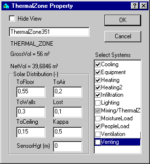

<link rel="stylesheet" href="../style.css">

# Eksempel 2

#### **Bygningens systemer**

Eksemplet bygger videre på beskrivelser og dataindlæsningen i [eksempel 1](https://bsim.outseta.com/support/kb/articles/ZmNrg7m2/eksempel-1). Her beskrives, hvorledes en eksisterende bygningsmodel hentes ind i programmet, og hvordan den gemmes som en fil med et nyt navn. Dernæst forklares det, hvordan data for bygningens systemer og de tilhørende reguleringer tilføjes.

 

#### **Hent eksisterende model**

Programmet startes som beskrevet i [eksempel 1](https://bsim.outseta.com/support/kb/articles/ZmNrg7m2/eksempel-1) ved at at klikke på BSim via menuen *Start* | *Programmer* | *BSim* | *BSim*. I SimView vælges indgangen *Open* fra menuen *File* eller der trykkes på knappen *Open* i [værktøjsbjælken](https://help.bsim.dk/support/kb/articles/E9Lw5nQw/simview---varktojsbjalken), hvorved der fremkommer en dialog, som viser den aktuelle sti. Stien til [eksempel 1](https://bsim.outseta.com/support/kb/articles/ZmNrg7m2/eksempel-1) findes, fx C:\Programmer\Statens Byggeforskningsinstitut\BSim\Modeller, hvorved programmet viser en oversigt over bygningsmodeller i den beskrevne sti. Her vælges modellen EKS1. Herved henter programmet data for den tidligere indlæste bygningsmodel EKS1 ind i BSim.

 

#### **Gem model under nyt navn**

For at bevare den eksisterende model og alligevel kunne ændre data eller bygge videre på denne, gemmes en kopi af modellen under et nyt navn ved først at klikke på feltet *Save as* i menuen *File*. Herved kommer en dialog der viser den aktuelle sti samt modelnavnet EKS1. Her flyttes markøren nu til navnefeltet, som overskrives med det nye navn EKS2. Modellen gemmes under det nye navn ved at trykke *OK*.

De fleste systemer i BSim er tilknyttet termiske zoner - undtagelsen er systemer knyttet til en Windoor, nemlig solafskærmning og skodde. Det betyder at alle rum i en termisk zone vil få beregnet samme temperatur.

Alle former for varme- og fugtbelastninger, installationer, systemer, anlæg etc. betegnes i BSim for 'systemer', idet der skelnes mellem følgende typer: Personlast, udstyr, fugt og infiltration, for hvilke brugeren fastlægger den tidsmæssige variation samt belysning, udluftning, mixing, opvarmning, køling og ventilation, for hvilke der kan beskrives en regulering, som sigter på at opretholde visse indeklimakrav. Systemerne for de bygningsmodeller, der kan opbygges i BSim, må altså defineres i overensstemmelse med denne inddeling.

For den simple bygning, der er indlæst data for i [eksempel 1](https://bsim.outseta.com/support/kb/articles/ZmNrg7m2/eksempel-1), beskrives de aktuelle 'systemer' i nedenstående skema:

 
| **System**      | **Beskrivelse**                                               | **Regulering**                                   | **Tidsangivelse**                |
|-----------------|--------------------------------------------------------------|--------------------------------------------------|-----------------------------------|
| Personlast      | 2 personer inden for arbejdstiden (kl. 8-16), middelaktivitet | dog kun 1 person torsdag-fredag                  | hverdage time 9-16                |
| Udstyr          | 2 pc og en printer, i alt 185 W                              | dag 1-3: 6 timer dag 4-5: 70 % tændt i 5 timer   | hverdage time 9-16                |
| Fugt            | dag 2 og 7 rengøring, svarende til 0,45 kg vand i én time    | regnes ens hele året                             | dag 2 og 7 time 7                 |
| Infiltration    | luftskifte på 0,5 gange i timen inden for arbejdstiden       | kun 0,2 h⁻¹ uden for arbejdstiden                | hverdage time 9-16                |
| Belysning       | arbejdslys: 60 W i arb.tid almenlys 180 W, efter behov       | almenlys tændt ved solindfald < 150 W            | hverdage time 9-16                |
| Udluftning      | grundluftskifte 2,0 h⁻¹ luftskifte uafhængigt af temperatur og vindforhold | udluftning, når indetemperaturen større end 25 °C | hverdage time 9-16                |
| Opvarmning      | radiator på 4 kW for at holde 21 °C fremløbsregulering og natsænkning | minimum effekt 2,0 kW ved en udetemperatur på 15 °C, nattemperatur 17 °C | hverdage time 9-16 sænkning uden for arbejdstid |
| Køling          | Ingen                                                        | -                                                | -                                 |
| Ventilation     | Ingen (i eksempel 2)                                         | -                                                | -                                 |
| Mixing          | Ingen                                                        | -                                                | -                                 |

#### **Indlæsning af data for systemer**

For at definere systemerne højre-klikkes på den termiske zone i træoversigten. Herved fremkommer en dialog der viser de mulige systemer, der kan beskrives. De systemer, som ønskes benyttet i modellen, vælges ved at sætte et "hak" ud for det enkelte system. Klikkes der en gang til på "hakket", får det en grå baggrund, hvilket betyder, at systemet oprettes, men er inaktivt. Mere uddybende forklaringer vedrørende systemerne gives i afsnittet om [systemer](https://help.bsim.dk/support/kb/articles/amRGrOQJ/simview---systemer).

<figure id="center_img">

<figcaption>Dialog (ThermalZone Property) for til- eller fravælgelse af systemer i en termisk zone.</figcaption>
</figure>

Når dialogen forlades, ved tryk på knappen *OK*, tilføjes de valgte systemer til træstrukturen undre den aktuelle termiske zone.

**Personlast**

Ved at højre-klikke på ikonet for personlast ([*PeopleLoad*](https://bsim.outseta.com/support/kb/articles/XQYdjgmP/persons-system)) fås en dialog til at definere personlasten og dens tilhørende regulering. Tryk på *New* for at oprette en ny personbelastning, hvori der skal indtastes en værdi for 'Antal' (*Number of Persons*). Det automatiske navn ændres til '2 personer', og i feltet *Number of Persons* indtastes 2. Varme- og fugtbelastningen fra de to personer defineres via indgangen *People Type*. Der kan vælges en persontype via den øverste valgmenu i *People Type* eller oprettes en ny ved at klikke på knappen *New*. I dette tilfælde vælges typen *Standard*.

<figure id="center_img">

<figcaption>Dialog (People Load) for definition af varmebelastningen fra personer.</figcaption>
</figure>

**Tidsplan**

For alle typer af 'systemer' skal der tilknyttes en tidsplan ([*Schedule*](https://bsim.outseta.com/support/kb/articles/79O3DZ9E/schedule-system)), som beskriver, hvorledes systemets drift, regulering og belastning varierer med tiden. En tidsplan er en samling af sammenhængende par af reguleringer (tredje faneblad) og [tidsangivelser](https://bsim.outseta.com/support/kb/articles/VmAOwo9a/time-system) (sidste faneblad) som definerer hvordan og hvornår et system reguleres. Tidsplanen findes på andet faneblad i dialogen.

For den definerede personlast skal der angives en tidsplan, som udtrykker at inden for arbejdstiden er der to personer til stede mandag-onsdag, mens der kun er én person torsdag-fredag.

Da der findes (oprettet med [wizard'en](https://help.bsim.dk/support/kb/articles/yWogPPWD/model-wizard---oprette-en-ny-model) da modellen blev startet) data både for døgnprofiler (som er den aktuelle reguleringstype) og for tidsangivelser, vil programmet ved valg af 'Regulering', henholdsvis 'Tidsangivelse' vise en oversigt over mulige objekter, der kan vælges fra i valgmenuerne øverst på de to faneblade.

En mere detaljeret beskrivelse af [døgnprofiler](https://bsim.outseta.com/support/kb/articles/L9PwDAQJ/dayprofile-system) og [tidsangivelser](https://bsim.outseta.com/support/kb/articles/VmAOwo9a/time-system) findes i afsnittet [Systemer](https://help.bsim.dk/support/kb/articles/amRGrOQJ/simview---systemer). Det valgte døgnprofil definerer, at hele (100 %) den i systemet angivne effekt (varmelast og fugtlast) afgives inden for den tilhørende tidsangivelse. I det aktuelle tilfælde er dette døgnprofil gældende i arbejdstiden mandag til onsdag. Døgnprofilet tilknyttes den valgte tidsplan ved at trykke på knappen *Anvend* (Apply) nederst på fanebladet.

Da der ikke på forhånd findes en tidsangivelse svarende hertil, må den oprettes som en ny tidsangivelse i modellen. Dette kan fx gøres ved at kopiere tiden 'hverdage 9-16' og heri ændre dagsangivelse fra dag 1-5 til dag 1-3 og samtidig ændre navnet til 'mandag-onsdag 9-16'.

 

**Flere reguleringer i tidsplanen**

For at beskrive belastningen på dagene torsdag-fredag må der defineres en anden regulering med tilhørende tidsangivelse. Dette gøres ved at trykke på *New* på *Schedule* fanebladet, hvorved programmet opretter en ny tidsplan med udefineret regulering og tidsangivelse.

Som regulering vælges døgnprofilen '*HalfLoad*', mens tidsangivelsen defineres (lokalt) som 'tor-fre 9-16'. Det er vigtigt, at de definerede tidsangivelser gives navne, der er umiddelbart forståelige.

Tidsplandialogen forlades ved at klikke på 'ok'. Af oversigten over systemer i træstrukturen fremgår det nu, at der er defineret en tidsplan. Det bemærkes, at den således definerede personbelastning først vælges, idet der klikkes på knappen *Anvend* eller 'ok'.

 

**Udstyr**

 

Data for udstyret (Equipment) indtastes i hosstående dialog.

<figure id="center_img">

<figcaption>Dialog (Equipment) for definition af varmeafgivelsen fra udstyr.</figcaption>
</figure>

Varmelasten (*Heat Load*) indtastes som 0,185 kW og den konvektive del af varmeafgivelsen (til luft) sættes til 0,8, da hovedparten af varmen, der udvikles i pc'erne blæses ud i rumluften ved hjælp af en ventilator. Tidsplanen defineres ved følgende reguleringer og tidsangivelser:

| døgnprofil: | 100 % |   | uge | dag | time |
|-------------|-------|---|-----|-----|------|
|             | 1-24  | tidsangivelse: | 1-53 | 1-3 | 9-12  15-16 |

| døgnprofil: | 70 % |   | uge | dag | time |
|-------------|------|---|-----|-----|------|
|             | 1-24 | tidsangivelse: | 1-53 | 4-5 | 9-12  15 |
 
 

**Fugt**

Ud over fugtafgivelsen fra personerne regnes der i dette eksempel med fugtafgivelse i forbindelse med rengøring to gange om ugen. Data for fugtbelastning og tidsangivelse indlæses som vist i dialogen. Som regulering kan vælges typen '*FullLoad*'.

<figure id="center_img">

<figcaption>Dialog (MoistureLoad) for definition af fugtbelastningen fra andre kilder end personer.</figcaption>
</figure>

**Infiltration**

Via systemet Infiltration fås en dialog med data for beskrivelse af, hvorledes infiltrationen kan antages at variere med forskellen mellem inde- og udetemperatur samt med vindhastigheden. En nærmere forklaring på data i denne dialog er givet under beskrivelsen i afsnittet [Infiltration](https://bsim.outseta.com/support/kb/articles/Rm8JRZ94/infiltration-system).

<figure id="center_img">

<figcaption>Dialog (Infiltration) for definition af infiltration.</figcaption>
</figure>

I det aktuelle tilfælde antages der at være et konstant luftskifte på 0,5 h-1 inden for arbejdstiden og 0,2 h-1 uden for arbejdstiden. Dialogen indeholder en række standardværdier, som lades uændrede, mens der for grundluftskiftet indtastes 0,5. Som et mere beskrivende navn indtastes 'Infilt 0,5 - 0,2'.

 

**Tidsplan**

Inden for arbejdstiden kan tidsplanen beskrives ved reguleringen (døgnprofil) '*FullLoad*' samt tidsangivelsen 'WeekDays 9-16':

| Døgnprofil | 100 % | Uge | Dag | Time |
|------------|--------|-----|-----|------|
|  | 1–24 (tidsangivelse) | 1–53 | 1–5 | 9–16 |

Tiden uden for arbejdstiden kan ikke beskrives ved en enkelt tidsangivelse. Derfor udnyttes det, at programmet under simuleringen altid gennemløber tidsplaner, og dermed tidsangivelserne, i den rækkefølge, de optræder i dialogen på *Schedule* fanebladet. Dette betyder nemlig, at ved til en given regulering at knytte tiden 'Always', vil denne regulering være i funktion for alle timer, som ikke indgår i en foranstående tidsangivelse. For den aktuelle infiltration kan tidsplanen derfor se ud som vist i nedenstående dialog. I tiden uden for arbejdstiden antages luftskiftet at være 0,2 h-1 svarende til 40 % af luftskiftet inden for arbejdstiden.

<figure id="center_img">

<figcaption>Dialog (Infilatration) for definition af tidsplanen for infiltrationen i eksempel 2.</figcaption>
</figure>

**Belysning**

De opgivne data for belysningen indtastes som vist i hosstående dialog. Også her benyttes et navn, som direkte udtrykker effekten i det aktuelle system. Typen af lys, som defineres via en valgmenu, har betydning i forbindelse med regulering efter belysningsniveau, angivet ved parameteren *General Lighting* (lux). Dette er ikke aktuelt her, idet der ifølge de opgivne data reguleres efter solindfaldet.

<figure id="center_img">

<figcaption>Dialog (Lighting) for definition af varmebelastningen fra belysning i den termiske zone.</figcaption>
</figure>

Parameteren *Daylight Limit*, der indtastes som 0,15 (kW), angiver den grænse for det samlede solindfald i zoner, hvorover almenlyset slukkes. Parameteren *Exhaust Part* angiver, hvor stor en del af den i almenlyset udviklede varme, der suges bort med ventilationsanlæggets udsugningsluft. For integrerede lysarmaturer, hvor der udsuges direkte gennem armaturerne, kan denne andel være op imod 0,7 - 0,8, og for armaturer som er indbygget i et nedhængt loft, hvorover der udsuges, kan størrelsen være op imod 0,5.

 

**Tidsplan**

Den ønskede reguleringstype skal defineres, og det sker ved at vælge et af de (i dette tilfælde) to faneblade for regulering (ctrl). Reguleringstyperne er nærmere beskrevet i afsnittet Belysning. I dette tilfælde vælges reguleringstypen *LightCtrl* (faneblad 3) der kan give en simpel regulering af almenlyset efter det samlede solindfald i zonen.

<figure id="center_img">

</figure>

I dialogen for den aktuelle regulering kan via parameteren *Factor* angives, om almenlyset inden for en tilhørende tidsangivelse skal tænde med en mindre effekt. De to øvrige parametre giver mulighed for at angive, at lyset slukkes for at undgå at der bliver for varmt i zonen. Kriteriet for at lyset vil blive slukket er, at der mindst er et solindfald på *Sun Limit*, samt at indetemperaturen ved tændt lys vil komme over niveauet angivet ved *Temp. Max*. I det aktuelle tilfælde ønskes denne reguleringsfunktion ikke, og der indtastes derfor de viste høje værdier for begge parametre.

Tidsangivelsen i belysningens tidsplan er '*WorkDays 9-16*'.

 

**Udluftning**

Det antages, at åbning af vinduerne vil blive brugt som foranstaltning til at undgå at indetemperaturen stiger for højt i sommermånedere. Hvis temperaturen vil stige over 25 °C åbnes vinduerne så meget, som det er nødvendigt for at holde temperaturen nede på dette niveau. Det antages, at der ved fuld åbning af vinduerne kan opnås et 'grundluftskifte' på 2,0 h-1, hvortil der regnes med et tillæg, som afhænger af forskellen mellem inde- og udetemperatur samt af vindhastigheden. Beregningen af det mulige luftskifte ved udluftning sker efter:

$$  
n_{\text{out,air}} = n_0 + c_t (t_i - t_0)^{tp} + c_w \cdot w \tag{1}  
$$

*   n0 er grundluftskiftet, h-1

*   *ti* og *tu* er indetemperaturen, henholdsvis udetemperaturen, °C

*   *ct* er en konstant, der især afhænger af åbningernes størrelse samt højdeforskellen mellem åbningerne

*   *cv* er en konstant, der især afhænger af bygningens tæthed og geometri samt dens beliggenhed i forhold til andre bygninger og terrænets topografi / ruhed

*   *v* er vindhastigheden, m/s

Udluftning er nærmere beskrevet i afsnittet om udluftning.

I det aktuelle tilfælde antages der værdier for formlens konstanter som vist i hosstående dialogbillede. Konstanterne i ovenstående formel kan være vanskelige at fastsætte, idet de i høj grad afhænger af bygningens form, tæthed samt beliggenhed.

<figure id="center_img">

<figcaption>Dialog (Venting) for definition af udluftning.</figcaption>
</figure>

I udluftningsdialogen er der indgang (trykknap) til en underdialog for beregning af temperaturfaktoren *TmpFactor*.

I temperaturfaktordialogen kan indlæses arealerne af åbningerne, hvor luften antages at strømme ind i rummet, henholdsvis ud af rummet, samt højdeforskellen mellem disse 'åbninger'. For et rum, hvor udluftningen sker via et (eller flere) vindue(r) kan disse arealer kun skønnes. Her skønnes det, at de to åbninger hver er på 0,2 m², og det antages at luften strømmer ud foroven i vinduesåbningen, mens den strømmer ind forneden i vinduesåbningen.

<figure id="center_img">

<figcaption>Underdialog for bestemmelse af faktoren TmpFactor i Venting dialogen.</figcaption>
</figure>

I temperaturfaktordialogen skal ogå indtastes en værdi for effektiviteten af udluftningen, 'epsilon', som udtrykker, i hvor høj grad den indstrømmende luft opblandes med rumluften, før den forlader rummet igen. Også denne faktor er vanskelig at fastsætte, men ved udluftning gennem ét vindue, vil der uundgåeligt være en vis 'kortslutning' mellem luftindtaget og luftafkastet, og derfor sættes 'epsilon' her til 0,6.

 

**Tidsplan**

Udluftning antages kun at kunne foretages inden for arbejdstiden, og tidsangivelsen vil derfor være '*WorkDays 9-16*', dvs: uge 1-53, dag 1-5, time 9-16.

Reguleringen beskrives i en simpel dialog, hvor temperatursetpunktet (*Set Point*) 25 indtastes. Den anden parameter Factor (mellem 0 og 1) benyttes som i flere andre reguleringer til at angive, at der inden for den tilhørende tidsangivelse kun er en andel af den 'nominelle' kapacitet (her udtrykt ved luftskiftet) til rådighed.

 

**Opvarmning**

Den termiske zone er forsynet med en termostatreguleret radiator med en maksimal effekt på 2 kW, som er til rådighed ved den dimensionerende udetemperatur på -12 °C. Varmesystemet antages at have en 'fremløbstemperatur', der reguleres efter udetemperaturen, således at den til rådighed værende effekt nedreguleres med stigende udetemperatur indtil udetemperaturen er 15 °C, hvor effekten er 0,5 kW. Ved højere udetemperaturer er effekten 0, svarende til at der er lukket for varmeanlægget.

I dialogen for '*Heating*' indtastes maksimaleffekten (*MaxPower*) på 2 (kW). Desuden angives i feltet *Fixed Part*, hvor stor en del af den til rådighed værende varmeefekt, der er uregulérbar, fx varmeafgivelse ved rørtab. Denne sættes her til 0. Den tredie parameter i dialogen *Part To Air* angiver, hvor stor en del af radiatorens varme, der afgives konvektivt til rumluften. Konvektionsdelen af varmeafgivelserne fra udstyr og opvarmning bør sjældent sættes lavere end 0,5, og i dette tilfælde anvendes værdien 0,7.

<figure id="center_img">

<figcaption>Dialog (Heating) for definition af radiatorens mulige effektafgivelse.</figcaption>
</figure>

**Tidsplan**

Reguleringsdelen i radiatorens tidsplan definerer termostatens setpunkt og reguleringskurven for den til rådighed værende varme. Ved at klikke på regulering i tidsplanen fås dialogbilledet vist nedenfor.

Typen af regulering kaldes 'Varme/køleregulering', og det tildelte navn '*HeatCoolCtrl..*.' er her overskrevet med navnet 'Rad-reg 21°C'. Parameteren faktor kan benyttes for angivelse af en fast, årstidsbestemt regulering af radiatoren, fx en manuelt betjent shuntventil, som antages reguleret efter måneder eller uger i fyringssæsonen. Parametrene i de øvrige felter definerer den ovenfor beskrevne 'fremløbsregulering'.

<figure id="center_img">

</figure>

Tidsangivelsen, der definerer hvornår den viste regulering skal fungere, indtastes her som uge 40-14. Da der er sænkning af temperaturen uden for arbejdstiden sættes dag til 1-5 og time til 7-16. Ved at starte opvarmningen nogle timer før arbejdstiden (time 7) søges det sikret, at temperaturen har nået det ønskede setpunkt, 21 °C, ved arbejdstidens start (time 9).

 

**Nat- og weekend-sænkning af temperaturen**

For at definere sænkningen af indetemperaturen uden for arbejdstiden, må der defineres en ny tidsplan ved at trykke på knappen *New* på *Scehdule* fanebladet. Den nye tidsplan skal indeholde en regulering for den resterende del af fyringssæsonen. Da programmet altid gennemløber tidsplaner og tidsangivelser i den rækkefølge, de optræder i dialogen, kan tidsangivelse defineres som: uge 1-14 40-53, dag 1-7 og time 1-24. Reguleringen kan defineres ved at kopiere den allerede indlæste regulering, og derpå i den nye ændre setpunktet til 17 (°C).

I dette eksempel benyttes de tre sidste systemtyper: 'Mixing', 'køling' og 'ventilation', ikke, og indlæsningen af data for bygningens systemer er derfor færdig.

 

#### **Dokumentation af indlæste data**

Inden data gemmes og inden der afsluttes eller foretages en simulering, kan det kontrolleres, at der ikke er fejl eller mangler i bygningsmodellen. Derfor trykkes først på *ModelList* i værktøjsbjælken for at kontrollere de indlæste data. Såfremt der gives meddelelse om fejl om manglende data, må disse indlæses. Der kan hoppes direkte til det fejlbehæftede objekt i træstrukturen ved at dobbelt-klikke på stop-skiltet.

 

**Gem model**

Modellen gemmes ved at klikke på feltet *Save* i menuen *File*.

 

#### **Simulering**

Simulering af bygningen, beskrevet i eksempel 2, kan foretages inden programmet forlades eller senere, når bygningsmodellen hentes ind i BSim igen. For at foretage simuleringen vælges indgangen *tsbi5* i menuen *View* eller der trykkes på tsbi5 ikoen i [værktøjsbjælken](https://help.bsim.dk/support/kb/articles/E9Lw5nQw/simview---varktojsbjalken), hvorved simuleringsdialogen fremkommer.

<figure id="center_img">

<figcaption>Dialog (tsbi5 | Options) for valg af simuleringsparametre i tsbi5.</figcaption>
</figure>

**Options**

Inden simuleringen kan startes, skal der defineres en simuleringsperiode. Via indgangene *First Day* og *Last Day* fås en kalender, hvor startdato og slutdato for simuleringen vælges. Den anden gruppe af data på [optionsfanebladet](https://help.bsim.dk/support/kb/articles/nmDBKR9y/tsbi5---options) giver mulighed for valg af forskellige forhold, som har betydning for simuleringstiden og beregningernes nøjagtighed. I gruppen *Stat, hour* vælges grænser for summering af en statistik over indetemperatur, som beregnes under simuleringen. I dette tilfælde vælges data som vist i hosstående dialog.

 

**Timelog og parametervalg**

*Save in Log* er betegnelsen for den 'log' (liste eller fortegnelse) af timeværdier, som løbende registreres mens simuleringen foregår. Da der under simuleringen beregnes et meget stort antal parametre time for time, er det vigtigt at specificere, hvilke af disse grupper som ønskes gemt for senere analyse.

Den første gruppe i listen er 'Udeklima' (*Weather*), som indeholder alle de anvendte udeklimadata samt beregnede værdier af solazimuth og solhøjde. Ved at sætte "hak" ud for gruppen gemmes disse data på timebasis. I et afsnit under tsbi5 findes en oversigt over alle [parameternavnene og deres betydning](https://bsim.outseta.com/support/kb/articles/vW5a6gW4/parametre-i-resultatloggen).

I gruppen af indeklimadata (*ThermalZones*) findes data for de termiske zoners indeklima som fx lufttemparatur, operativ temperatur, luftskifte osv.

 

**Start simulering**

Simuleringen startes ved at skifte til næste faneblad (*Simulation*) og klikke på knappen *Start*. Inden selve simleringen påbegyndes, kontrollerer programmet, om der er mangler eller fejl i bygningsmodellens data, og hvis dette er tilfældet, fås en oversigt over fejl. Ligesom i 'Model List' kan der dobbeltklikkes på en linie for at lokalisere fejlkilden i træstrukturen.

Når modellen er komplet, starter simuleringen med, at BSim beregner det anbefalede antal tidsstep pr. time, hvilket normalt vil være bestemt af et tyndt lag med lille masse eller et lag med høj varmeledningsevne i en af modellens konstruktionstyper. Hvis det beregnede antal tidsstep er større end det aktuelle, spørges der, om det beregnede antal stepps skal anvendes. Er det anbefalde antal tidsskridt større end 6-10, bør det overvejes, om det pågældende lag kan udelades eller blot defineres som en ekstra isolans i konstruktionen.

Simuleringen starter med den først angivne dag i simuleringsperioden, idet det første døgn i denne periode gennemregnes et antal gange, indtil der er en opnået en tilfredsstillende stabilitet, udtrykt ved at forskellen i indetemperaturen (i time 15, i hver zone) ved to successive gennemregninger ikke afviger mere end 0,1 °C.

Under simuleringen vises en graf med udetemperaturen og den operative temperatur for op til fire termiske zoner i modellen.

 

**Afbrydelse af simulering**

Simuleringen kan afbrydes ved at trykke på knappen *Stop*, idet programmet da midlertidigt vil afbryde beregningerne, for at få bekræftet, om simuleringen ønskes stoppet eller genoptaget.

 

#### **Resultater**

Efter simuleringen kan beregningsresultaterne analyseres på forskellig måde via fanebladene [*HeatBalanace*](tsbi5%20- HeatBalance), [*Parametres* ](tsbi5%20- Parameters)og [*Tables*](https://help.bsim.dk/support/kb/articles/BWzdLlQE/tsbi5---tables).

 

#### **Varmebalance for termiske zoner**

Ved at klikke på fanebladet *HeatBalanace* fås en oversigt over hele bygningens eller de enkelte termiske zoners energibalancer uge for uge, måned for måned eller for den totale simuleringsperiode, afhængigt af, hvad der er valgt via første (længst til venstre) valgmenu. Energibalancerne beregnes ud fra døgnsumværdier, som altid gemmes under simuleringen.

I dette tilfælde er der valgt 'måned' for 'Tidsskala', og energibalancen beregnes derfor månedsvis.

Betydningen af forkortelserne for bidragene til energibalancen qHeating, qCooling, qInfiltration etc. (opvarmning, køling, infiltration etc.) er givet i [oversigten](https://bsim.outseta.com/support/kb/articles/vW5a6gW4/parametre-i-resultatloggen) over parametre. Tallene udtrykker summen af døgnbidrag for hvert led til den samlede balance inden for hver periode (uge, måned eller hele simuleringsperioden). I flere af leddene (infiltration, transmission, mixing og ventilation) kan der således både indgå positive og negative bidrag i summationen.

 

**Simpel statistik for temperaturer og luftskifte**

Sammen med de enkelte led i energibalancen beregnes (under simuleringen) og udskrives for hver zone, antallet af timer, som den operative temperatur ligger over, henholdsvis under, fire på forhånd fastlagte værdier (se *Stat, hour*) på fanebladet *Options*. Endvidere beregnes middelværdier af udetemperaturen samt for den operative temperatur og luftskiftet i hver zone.

Som temperaturgrænser benyttes som standard: 20 for nedre grænse (optælling af timer der underskrider 20 °C) samt 21, 24 og 26 for øvre grænser (optælling af timer, der overskrider 21, 24 og 26 °C). Temperaturgrænserne kan ændres af brugeren via fanebladet *Options*, men skal altså defineres inden simuleringen påbegyndes.

 

**Energiforbrug i ventilationsanlæg**

Energibalancen (netto-)energiforbruget til opvarmning, køling, udstyr og belysning. Bidraget *qVentilation* udtrykker endvidere, hvordan den fra et eventuelt ventilationsanlæg indblæste luft påvirker energibalancen. Balancen viser derimod ikke, hvilket energiforbrug, der er medgået til behandlingen og transporten af ventilationsluften, og derfor indeholder zonestatistikken også energioverførslerne i de enkelte dele af anlægget: *FanPow* = ventilatoreffekt, *HtRec* = varmegenvinding, *ClRec* = kølegenvinding etc. Sammen med energibalancen udtrykker tallene for disse energioverførsler den samlede energibalance for hver zone. Da der i dette tilfælde ikke er defineret et ventilationsanlæg, er alle energiforbrug her 0.

 

#### **Varmebalance for bygningen**

Via terdje valg-menu er det muligt at vælge at se varmebalancen for hele bygningen eller for den enkelte termiaks zone for den valgte tidsskala: Uge, måned eller år. Vælges 'Year' som tidsskala, fås den viste årsenergibalance (det forudsætter dog, at der er simuleret et helt år). I dette tilfælde er bygningens varmebalance lig med den termiske zones varmebalance, da der kun er defineret en termisk zone.

 

#### **Parametre**

Gennem *Parameters*-fanebladets indgang defineres hvilke parametre, der skal analyseres, hvilken del af beregningsperioden der skal analyseres samt, om resultaterne skal være på tabelform eller på grafisk form.

På fanebladet *Parameters* findes ingen parameterlister, hvilket betyder, at det endnu ikke er defineret, hvilke parametre, som ønskes analyseret. Vælges knappen *New*, oprettes en nu parameterliste, hvori der kan defineres hvilke parametre der ønskes analyseret. De automatiske navne for parameterlister er Param.., etc. Såfremt der endnu ikke er defineret nogle lister, vil programmet forberede definitionen af den første liste ved at skrive navnet Param... i oversigtsmenuen. Ved at klikke i valg-menuen øverst på fanebladet kan der veksles mellem hvilke grupper af data der ønskes valgt data for. Ved at sætte "hak" ud for de ønskede parametre i ruden nedenunder overføres den ønskede parameter til parameterlisten. I dette tilfælde klikkes først på gruppen for den termiske zone og i valgmenuen umiddelbart under gruppe vælg-menuen vælges *IndoorClimate*. I nederste rude vælges parameteren *Top* ved at sætte "hak" ud for denne. Da der normalt vil være flere termiske zoner i bygningsmodellen, er parameteren både bestemt ved sit navn og ved navnet på den termiske zone, den er tilknyttet, 'Box-rum'.

<figure id="center_img">

<figcaption>Dialog (tsbi5 | Parametres) for valg af parametre til resultatanalyse på timebasis.</figcaption>
</figure>

Dernæst klikkes på parametergruppen '*Outdoor*', hvorfra der vælges parameteren *ExtTmp*, altså udetemperaturen. Endelig overskrives navnet på parameterlisten med navnet 'Temperaturer'. Timeværdierne for de valgte parametre kan ses i tabelform og grafisk på fanebladet [*Tables*](https://help.bsim.dk/support/kb/articles/BWzdLlQE/tsbi5---tables).

 

**Parametre fra flere bygningsmodeller**

Den definerede parameterliste 'Temperaturer' indeholder nu to parametre, nemlig den operative temperatur i zonen 'Box-rum' samt udetemperaturen fra udeklimadata, eller den fiktive zone 'Udeluft'.

Det er muligt at definere parameterlister med parametre fra forskellige modeller, for hvilke der er foretaget simuleringer. Ved at klikke på knappen *Open New Model* fås en dialog for valg af modeller (kun i den aktuelle sti) med resultatfiler, hvorfra der kan vælges parametre. Dette vil ofte være af interesse, når der ønskes foretaget sammenligninger mellem temperatur- eller energiforhold ved to alternative udformninger af en planlagt bygning.

Normalt defineres der flere parameterlister for hver bygningsmodel, med valg af parametre som afhænger af, hvad der har særlig interesse i det aktuelle tilfælde. Ofte vil en liste med alle led i varmebalancen samt eventuelt indetemperaturerne kunne give vigtige oplysninger om, hvilke forhold der har størst indflydelse på de dimensionerende tilstande. I dette eksempel defineres en anden parameterliste med navnet 'Varmebalance', der indeholder i alt 9 parametre:

 |      |                                                         |
|------------------|-----------------------------------------------------------------------|
| *qHeating*       | Effekt- eller energitilskud fra opvarmning (radiatorer)              |
| *qInfilt*        | Effekt- eller energitab ved infiltration                             |
| *qVenting*       | Effekt- eller energitab ved udluftning                               |
| *qSunRad*        | Effekt- eller energitilskud på grund af solstråling gennem vinduer   |
| *qPeople*        | Effekt- eller energitilskud fra personer                             |
| *qEquipment*     | Effekt- eller energitilskud fra udstyr, maskiner m.m.                |
| *qLighting*      | Effekt- eller energitilskud fra belysning                            |
| *qTransmis*      | Effekt- eller energitab ved transmission gennem bygningsdele         |
| *Ti*             | Indetemperaturen i zonen                                             |

<strong style="letter-spacing: -0.01em;">Periode**</strong>

I tabelvisningen på fanebladet *Tables* findes en række valgmenuer og trykknapper øverst. Funktionen af knapperne er beskrevet i afsnittet om [fanebladet](https://help.bsim.dk/support/kb/articles/BWzdLlQE/tsbi5---tables).

 

#### **Timeværdier**

Af tabeludskriften ses det, at indetemperaturen når op på 21 °C i time 9 som ønsket.

Det er derimod mere interessant at se, om dette også er tilfælde efter weekend sænkning i en kold periode. Derfor åbnes kalenderen, og der vælges næste mandag, i dette tilfælde den 8. januar.

Dagene omkring den 7.-8. januar er en af de koldeste perioder i året, og resultaterne viser, at indetemperaturen først når op på 21,0 °C i time 11. Hvis kravet om 21 °C fastholdes, må det derfor besluttes, om der skal installeres en større radiatoreeffekt, eller om temperaturen ikke skal tillades at falde helt til 17 °C i de koldeste perioder.

 

**Resulter som grafik**

Knappen

</img>
 giver mulighed for at vælge at vise resultaterne som kurver for temperaturer, effekter etc. som funktion af tiden. Programmet viser nu temperaturkurverne for det første døgn i resultatperioden. Klikkes der nu med musen på piltasterne nederst i dialogen kan der 'bladres' frem til den 8. januar. Kurverne viser, hvorledes indetemperaturen stiger fra niveauet på 17 °C i sænkningsperioden til set-punktet på 21 °C, som først nås i time 11. Hvis der højre-klikkes på grafikken kan det aktuelle skærmbillede kopieres til udklipsholderen for at kunne indsættes i andre Windows-baserede programmer, fx flere tekstbehandlings- og regneark-programmer.

I afsnittet om [*Tables* ](https://help.bsim.dk/support/kb/articles/BWzdLlQE/tsbi5---tables)fanebladet i tsbi5 findes en nærmere beskrivelse af resultatanalysen og links til en beskrivelse af mulighederne for [manipulation](https://help.bsim.dk/support/kb/articles/aWxnxAQV/andring-af-den-grafiske-afbildning-af-resultater) med grafikken.

 

#### **Gem model og afslut BSim**

Via *File*-menuen gemmes modellen nu ved at klikke på feltet *Save*. Når modellen gemmes, dannes der to filer, én fil som indeholder alle bygningsmodellens data (filnavn EKS2.DIS), og en anden som indeholder data vedrørende simulering og resultatbehandling (simuleringsperiode, timelogparametre, parameterlister etc.).

Beskrivelse vedrørende dataindlæsning for skygger samt modificering af modellen med henblik på at forbedre bygningens indeklima og energiforbrug beskrives i [eksempel 3](https://bsim.outseta.com/support/kb/articles/4966l79X/eksempel-3), hvor der kan fortsættes direkte. Såfremt dataindlæsning og resultatbearbejdning ønskes afsluttet her, afsluttes programmet.

 

Se også:

*   [Eksempel 3 - Modificering af bygningsmodel](https://bsim.outseta.com/support/kb/articles/4966l79X/eksempel-3)

 