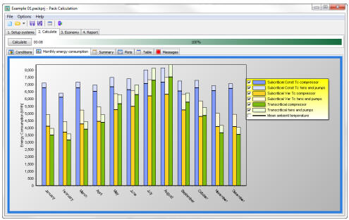

<link rel="stylesheet" href="../style.css">

# PackCalc (Køling)

<figure id="center_img">

</figure>

Pack Calculation er et program til sammenligning af årsenergiforbruget af køleanlæg. Blandt andet kan transkritiske CO2 anlæg sammenlignes med traditionelle anlæg.

Programmet foretager denne sammenligning på baggrund af en given geografisk placering.

Indtil videre indeholder programmet 11 almindeligt anvendte kredsprocesser, og man kan vælge mellem mere end 4000 kommercielt tilgængelige kompressorer.

Programmet er udviklet i samarbejde med både danske og udenlandske firmaer, og udviklingen er delvist financieret af Dansk Energi under [ELFORSK](https://ens.dk/tilskud-og-puljer/elforsk) programmet.

PackCalc findes i en licensbelagt version som ikke er kompatibel med BSim. Se seneste information om [PackCalc på IPU's hjemmeside](https://www.ipu.dk/indhold/koele-og-energiteknik/pack-calculation-ii/pack-calculation-ii.aspx).

En ældre, gratis version som er kompatibel med BSim kan hentes fra SBi's hjemmeside.

