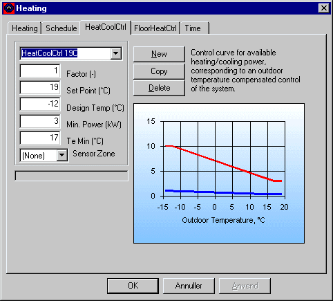

<link rel="stylesheet" href="../style.css">

# Opvarmning - Varmeregulering

Reguleringskurven er defineret som en sammenhængende, brudt linie, bestående af tre rette liniestykker. Kurven forbinder to punkter:

P1 = (Max Power , Design Temp) og P2 = (Min Power , Te Min)

Den til rådighed værende effekt er lig med den maksimale effekt (*Max Power*) ved udetemperaturer lavere end den dimensionerende udetemperatur (*Design Temp*) og lig med den minimale effekt (*Min Power*) ved udetemperaturer højere end Te Min. Ved udetemperaturer herimellem varierer den til rådighed værende effekt lineært efter formlen:

$$ P_{heating} = P_{min} + (P_{max} - P_{min}) \cdot \frac{t_0 - t_{min}}{t_{design - t_{min}}} \; \text{when} \; t_{design} \leq t_0 \leq t_{min} \tag{1} $$

<figure id="center_img">

<figcaption>Definition af reguleringen (Heating | HeatCoolCtrl) for en radiator. Den røde kurve viser den til rådighed værende effekt som en funktion af udetemperaturen med de inddata som er givet. Den blå kurve viser den uregulerbare del af varmeafgivelsen (angivet på fanebladet "Heating"). Kurverne opdateres når fokus skifter fra et inddatafelt til et andet.</figcaption>
</figure>

*Factor* angiver, at kun en vis del af den beregnede effekt er til rådighed inden for de til reguleringen knyttede tidsplaner. Faktoren kan også benyttes ved specifikation af simple reguleringssystemer (fx manuel shuntventil), hvor varmeeffekten reguleres efter årstiden. Standardværdien for *Factor* er 1,0.

*Set Point* angiver indstillingen af rumtermostaten. Den temperatur som søges opretholdt, er den operative temperatur i sensor zonen.

*Design Temp* angiver den dimensionerende udetemperatur for radiatoren.

*Min Power* angiver den mindste til rådighed værende effekt i anlægget, før varmelevering regnes afbrudt. *Min Power* er sammenhørende med temperaturen *Te Min*.

*Te Min* angiver udetemperaturen, hvor den til rådighed værende effekt i radiatoren når sin mindste værdi, *Min Power*. Varmeydelsen sættes til 0 uden for tidsangivelserne i [tidsplanen](https://help.bsim.dk/support/kb/articles/79O3DZ9E/systemer---schedule).

*Sensor Zone* angiver i hvilken termisk zone føleren for varmeanlægget befinder sig. Dette har især betydning hvis der ønskes simuleret et gulvvarmeanlæg, hvor selve gulvvarmezonen er opbygget som en selvstændig termisk zone med varmeafgivelse reguleret efter temperaturen i en anden termisk zone. Hvis der står (*None*) i feltet betyder det at, sensoren befinder sig i den termiske zone hvor reguleringen benyttes. Det samme varmesystem kan således stadig benyttes i flere termiske zoner, uden at der reguleres efter temperaturen i den samme termiske zone. **NB:** Funktionaliteteten er pt. ikke 100 % checket og resultaterne bør derfor underkastes en nøje vurdering!
