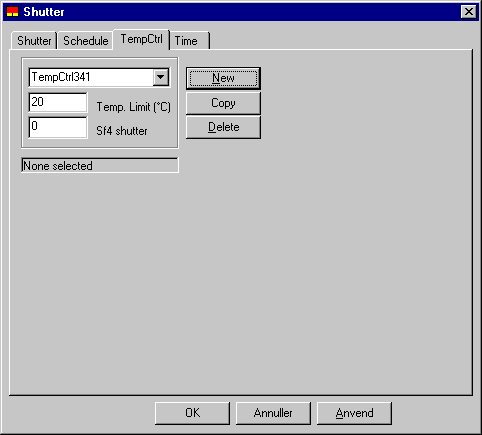

# Skodderegulering

<figure id="center_img">

<figcaption>Dialog (Shutter | TempCtrl) for definition af reguleringen for en natskodde.</figcaption>
</figure>

Inden for den tilhørende tidsangivelse kontrolleres det, om udetemperaturen i den første time ligger under værdien angivet i parameteren *Temp. Limit.* Hvis dette er tilfældet, vil skodden blive lukket og forblive lukket, indtil tidsangivelsen afbrydes første gang. Normalt defineres en tidsangivelse, der forudsætter, at skodden lukkes i en sammenhængende periode af vinteren, eller at skodden lukkes om natten, når temperaturen er under en grænseværdi indlæst i reguleringen.

 

*Sf4* shutter angiver sollysfaktoren for WinDoor, når skodden er lukket for. Sollysfaktoren er kun relevant i forbindelse med dagslysafhængig lysregulering. Den er knyttet til ét bestemt punkt i rummet, og er defineret som belysningsstyrken i dette punkt divideret med den udvendige belysningsstyrke på WinDoor-planen. Når skodden er lukket, erstatter Sf4 de for vinduet definerede sollysfaktorer SF1, SF2 og SF3. Standardværdien for SF4 er 0, ligesom for de øvrige sollysfaktorer. Dagslysfaktorerne er nærmere beskrevet under tidsplanen for [belysning](https://help.bsim.dk/support/kb/articles/wQXxbnQK/belysning).