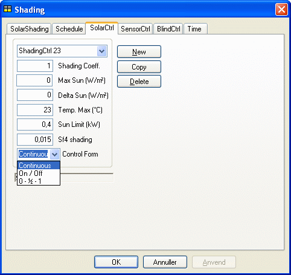

<link rel="stylesheet" href="../style.css">

# Regulering efter solindfald og temperatur

Ved denne afskærmningsform reguleres afskærmningen efter solindfaldet gennem det aktuelle vindue. Der angives en grænse for, hvor stort solindfaldet må være (Max Sun, W/m²), før afskærmningen aktiveres. Når denne grænse i en given halvtime overskrides trækkes afskærmningen så meget for, at grænseværdien (så vidt muligt) overholdes. Hvis solindfaldet i den efterfølgende halvtime stiger, undersøges det, om afskærmningen igen skal reguleres. Hvis solindfaldet ved den aktuelle indstilling af afskærmningen overskrider værdien af (Max Sun + Delta Sun, W/m²), reguleres afskærmningen så denne nye grænseværdi (summen) (så vidt muligt) overholdes. Ved at angive en høj værdi af Delta Sun vil der være relativt færre reguleringer af afskærmningen i løbet af dagen. Samtidig med regulering af afskærmningen efter solindfaldet kan solafskærmningen også regulere efter den aktuelle operative temperatur i den aktuelle termiske zone. Kriteriet for at afskærmningen aktiveres er, at temperaturgrænsen (Temp. Max, °C) overskrides. Er dette tilfældet, reguleres afskærmningen så meget, at temperaturgrænsen (så vidt muligt) overholdes. Regulering efter temperaturen vil dog kun ske, hvis det samlede solindfald gennem alle vinduer i den termiske zone overstiger grænseværdien Sun Limit (i kW). Regulering af afskærmningen, både ud fra solindfaldskriteriet og temperaturkriteriet, kan ske ved tre forskellige reguleringsformer: on/off, 0 - ½ - 1 samt kontinuerlig. Tabellen giver en oversigt over data i dialogen for SolarCtrl.

<figure id="center_img">

<figcaption>Dialog (Shading | SolarCtrl) for definition af reguleringen for solafskærmning.</figcaption>
</figure>

Data i dialogen for reguleringstypen SolarCtrl.

| Parameter        | Beskrivelse | Varianter / interval, enhed | Standardværdi |
|------------------|-------------|-----------------------------:|:-------------:|
| Shading Coeff.   | Solafskærmningsfaktor for afskærmningen, når den er trukket helt for. Denne værdi overskriver evt. værdi angivet for systemet SolarShading. | 0–1,0 | 0,5 |
| Max Sun          | Grænse for solindfaldet gennem det aktuelle vindue, hvorover afskærmningen aktiveres.   **NB**: Hvis "0" indtastes som grænse for MaxSun benyttes værdien fra fanen SolarShading - det anbefales at benytte et tal > 0. | 0–800 W/m² | 150 W/m² |
| Delta Sun        | Benyttes til at bestemme ny grænse for afskærmningen, når den i forvejen er aktiveret. Når solindfaldet ved den aktuelle indstilling ændrer sig med en værdi (+/–) på mindst Delta Sun, justeres afskærmningen igen. | 0–500 W/m² | 75 W/m² |
| Temp Max         | Grænse for den operative temperatur, hvorover afskærmningen aktiveres (så vidt muligt), forudsat at det samlede solindfald samtidig overstiger SunLimit. | 10–40 °C | 26 °C |
| Sun Limit        | Nedre grænse for det samlede solindfald gennem alle vinduer i den aktuelle termiske zone, hvorunder regulering efter temperaturkriteriet ikke kommer i funktion. | 0–20 kW | 0,3 kW |
| Sf4 shading      | Sollysfaktor for vinduet med afskærmningen trukket helt for (relevant for dagslysafhængig lysregulering, knyttet til ét bestemt punkt i rummet). | 0–0,5 | 0,05 |
| Control Form     | Reguleringsprincip for afskærmningen (on/off, 0–½–1 eller Continuous). | on/off / 0–½–1 / Continuous | Continuous |

*Sf4 shading* angiver sollysfaktoren for den aktuelle WinDoor, når solafskærmningen er trukket for. Sollysfaktoren er kun relevant i forbindelse med dagslysafhængig lysregulering, og er knyttet til **ét** bestemt punkt i rummet. Sollysfaktoren er defineret som belysningsstyrken i dette punkt divideret med den udvendige belysningsstyrke på WinDoor-planet. Når solafskærmningen er trukket (helt eller delvist) for, erstatter Sf4 de øvrige definerede [sollysfaktorer](https://bsim.outseta.com/support/kb/articles/49EdwkQ7/sollysfaktorer-for-windoors) Sf1, Sf2 og Sf3 for den 'del' af WinDoor, hvor afskærmningen er trukket for. Er afskærmningen fx 'trukket 60 % for', beregnes dagslyset ved vægtning (0,6/0,4) af de to værdier, der beregnes med og uden afskærmning.

Standardværdien for Sf4 er 0, ligesom de [øvrige sollysfaktorer](https://bsim.outseta.com/support/kb/articles/49EdwkQ7/sollysfaktorer-for-windoors). Dagslysfaktorerne er nærmere beskrevet under tidsplanen for [belysning](https://help.bsim.dk/support/kb/articles/wQXxbnQK/belysning).

Det kan være vanskeligt at afgøre hvilken afskærmningsform, der bedst kan simulere den faktiske brug af solafskærmningen i en konkret bygning. Afskærmningsformen må også vurderes i relation til den tilknyttede tidsangivelse, og specielt for manuelle systemer i relation til den mulige tilstedeværelse af personer i hver enkelt termisk zone.
