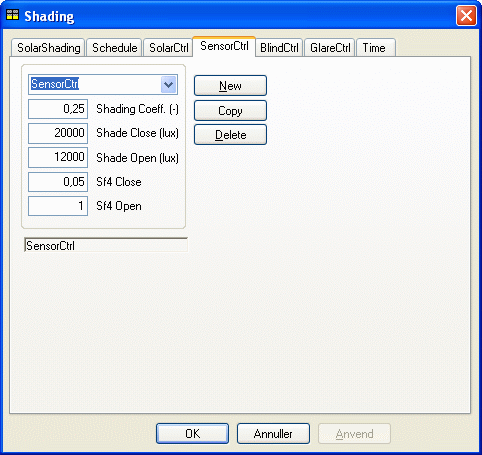

<link rel="stylesheet" href="../style.css">

# Regulering efter lysføler på facaden

Ved denne afskærmningsform styres afskærmningen efter lysindfaldet på facaden. Når belysningsstyrken målt udvendigt på fladen, hvori det aktuelle vindue er placeret, overstiger værdien af *Shade Close* (lux), trækkes afskærmningen for. Afskærmningen forbliver trukket for, indtil belysningsstyrken på facaden falder under værdien *Shade Open* (lux). Figuren viser dialogen for definition af reguleringstypen SensorCtrl.

<figure id="center_img">

<figcaption>Dialog til definition af regulering af solafskærmning efter udvendig sensor - SensorCtrl.</figcaption>
</figure>

*Data i dialogen for reguleringstypen SensorCtrl.*

| Parameter      | Beskrivelse                                                                                                                                           | Varianter / interval, enhed | Standardværdi |
|----------------|-------------------------------------------------------------------------------------------------------------------------------------------------------|-----------------------------:|:-------------:|
| Shading Coeff. | Solafskærmningsfaktor for afskærmningen, når den er trukket helt for. Denne værdi overskriver evt. værdi angivet for systemet SolarShading.         | 0–1,0                       | 0,5           |
| Shade Close    | Grænse for lysindfaldet (belysningsstyrken) på facaden, hvorover afskærmningen trækkes for.                                                          | 3.000–80.000 lux            | 20.000 lux    |
| Shade Open     | Grænse for lysindfaldet (belysningsstyrken) på facaden, hvorunder afskærmningen trækkes fra.                                                        | 2.000–20.000 lux            | 10.000 lux    |
| Sf4 shading    | Sollysfaktor for vinduet med afskærmningen trukket for.                                                                                             | 0–0,5                       | 0,05          |