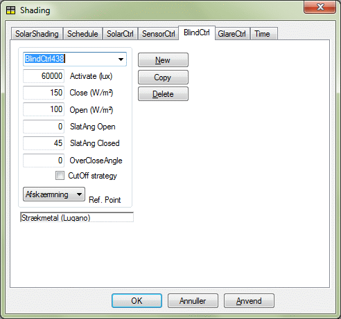
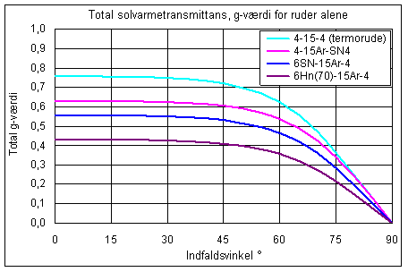
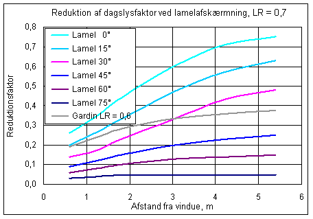
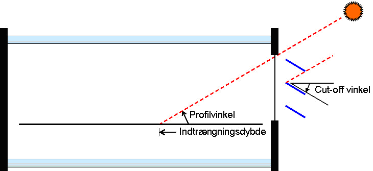
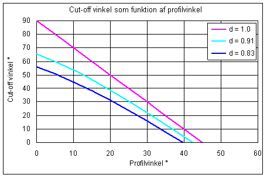
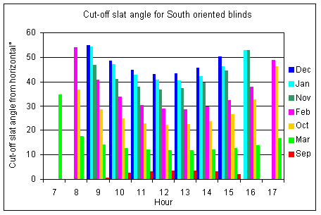

<link rel="stylesheet" href="../style.css">

# Regulering med lameller efter solindfald og direkte solstråling

Denne afskærmningsform kan benyttes ved regulering af persienner eller andre typer afskærmninger med drejelige lameller. Afskærmningen reguleres efter størrelsen af solindfaldet gennem systemet rude + afskærmning. Reguleringen er bestemt af grænseværdier af solindfaldet for, hvornår afskærmningen aktiveres (lukkes mere i) og for, hvornår den deaktiveres (åbnes mere). Ved starten af den aktuelle tidsangivelse antages solafskærmningen at være i indstilling "*Open*". Hvis solindfaldet i denne indstilling overstiger værdien af *Close* (W/m²), lukker lamellerne mere i, indtil værdien af solstrålingen gennem systemet kommer ned på værdien af *Close*. Solstrålingen beregnes ved tabelopslag af g-værdi for den aktuelle profilvinkel. Da der er forskellige g-værdier for direkte og diffus stråling (sidstnævnte er uafhængig af profilvinkel), må den optimale drejning findes ved iteration.

Det er vigtigt at bemærke, at afskærmningsfaktoren for afskærmningen er den "aktuelle" faktor, som gælder for afskærmningen alene, men i kombination med den aktuelle rudetype. Typiske g-værdier for forskellige rudetyper er vist i grafen nederst på siden.

<figure id="center_img">

<figcaption>Dialog til definition af regulering for persienner - BlindCtrl.</figcaption>
</figure>

| **Parameter**       | **Beskrivelse**                                                                                                                                              | **Varianter / interval, enhed** | **Standardværdi** |
|---------------------|--------------------------------------------------------------------------------------------------------------------------------------------------------------|--------------------------------:|:-----------------:|
| Close               | Grænse for solindfaldet gennem afskærmningen, hvorover afskærmningen aktiveres (lukkes mere i).                                                              | 50–800 W/m²                     | 150               |
| Open                | Grænse for solindfaldet gennem afskærmningen, hvorunder afskærmningen aktiveres (åbnes mere).                                                                | 20–500 W/m²                     | 80                |
| SlatAngle Open      | Vinkel for maksimal åbning af lamellerne (målt fra vandret = 0°).                                                                                            | 0–45°                           | 0                 |
| SlatAngle Close     | Hældningen på afskærmningens lameller i lukket position.                                                                                                     | 30–90°                          | 90                |
| OverClose Angle     | Tillæg til cut-off vinkel, som kun benyttes ved Cut-off strategi (reducerer antal reguleringer hvis > 0).                                                    | 0–5°                            | 0                 |
| CutOff Strategy     | Reguleringsstrategi, hvor lamellerne indstilles så direkte sol netop udelukkes (cut-off).                                                                    | til / fra                       | fra               |
| [Ref. Point](www.help.bsim.dk)          | Mulighed for at vælge et foruddefineret [referencepunkt](www.help.bsim.dk) hvor dagslysniveauet bestemmer styringen af solafskærmningen.                                         | —                               | —                 |

Den totale soltransmittans ved en given vinkel (β) på afskærmningens lameller bestemmes af:

$$ E_{total} = E_{dif} \cdot g_{s, dif}(\beta) \cdot g_{g, dif} + E_{dir} \cdot g_{s, dir}(\beta, \theta_p) \cdot g_{g, dir}(\theta_i) $$

*   Etotal er den totale transmitterede solstråling, W/m²,

*   Edif er udvendig diffus strålingsintensitet, W/m²,

*   Edir er udvendig direkte strålingsintensitet, W/m²,

*   gs,dif er total solstrålingstransmittans for afskærmningen for diffus stråling ved den givne hældning (β) af lamellerne,

*   gs,dir er total solstrålingstransmittans for afskærmningen for direkte stråling ved den aktuelle hældning (β) af lamellerne og den aktuelle profilvinkel Θp

*   gg,dif er rudens solstrålingstransmittans for direkte stråling ved den aktuelle indfaldsvinkel (Θi),

*   β er hældningen af afskærmningens lameller, målt fra vandret,

*   Θp er [profilvinklen](https://help.bsim.dk/support/kb/articles/7mawb19E/profilvinkel),

*   Θi er indfaldsvinklen for den direkte solstråling. 

<figure id="center_img">

<figcaption>g-værdier for ruder som funktion af indfaldsvinklen. De fire rudetyper er (fra oven): En traditionel termorude (U-værdi ca. 2,6 W/m²K), to energiruder med energibelægningen på henholdsvis det yderste og det inderste glas samt en solafskærmende rude. U-værdi for de nederste 3 ruder er ca. 1,2 W/m²K.</figcaption>
</figure>

## **Reduktion af dagslyset ved brug af lamelafskærmning**

Når den aktuelle vinkel på afskærmningens lameller er beregnet, kan lysreduktionen i et valgt referencepunkt beregnes. Ved lys-beregningen skelnes der ikke mellem, om afskærmningen er placeret indvendigt eller udvendigt. Forløbet af reduktionsfaktoren for en hvid afskærmning er vist i figuren, hvoraf det fremgår at lysreduktionen er væsentligt større tæt ved vinduet end længere inde i rummet. Reduktionsfaktoren kan benyttes ved simulering af dagslysstyring i BSim, idet den også benyttes som en tilnærmelse ved beregnede sollysfaktorer.

<figure id="center_img">

<figcaption>Typisk reduktion af dagslyset ved en solafskærmning med hvide lameller. Reduktionsfaktoren kan benyttes ved simulering af dagslysstyring i BSim, idet den også benyttes som en tilnærmelse ved beregnede sollysfaktorer.</figcaption>
</figure>

### **Cut-off styring**   
Cut-off styring er en særlig reguleringsvariant for afskærmningstyper med lameller. Ved denne reguleringsform indstilles afskærmningens lameller i en sådan vinkel at direkte solstråling lige præcis ikke kan passere afskærmningen.

<figure id="center_img">

<figcaption>Cut-off.</figcaption>
</figure>

Den kritiske åbningsvinkel (cut-off) afhænger af solens profilvinkel samt forholdet mellem afstand og bredde af afskærmningslameller. Cut-off vinklen kan bestemmes af:

$$ \beta_c = \arctan\left\{ \frac{\tan\theta \pm d \cdot \sqrt{1 + \tan^2\theta - d^2}}{d^2 - 1} \right\} \; \text{hvor minus skal benyttes} $$

*   Θ er [profilvinklen](www.help.bsim.dk) beregnet ud fra solens azimut minus vinduets azimut samt solhøjden,

*   d er forholdet mellem lamellernes afstand og deres bredde.

For en traditionel (indvendig) persienne er der typisk et overlap af lamellerne på ca. 20 % i lukket tilstand, hvilket giver en værdi af d = 1 / 1,2 = 0,83. Den følgende figur viser kurver for cut-off vinklen som funktion af profilvinklen ved forskellige forhold mellem bredde og afstand af lamellerne.

<figure id="center_img">

<figcaption>Variationen I Cut-Off vinkel for en lamelbaseret solafskærmning som funktion af solens profilvinkel og for forskellige forhold (d) mellem lamelafstand og lamelbredde.</figcaption>
</figure>

Når feltet for CutOff Strategy er hakket af i BlindCtrl dialogen, undersøges det, om der vil være direkte solindfald ved den aktuelle indstilling af afskærmningen. Hvis der er direkte sol på facaden, defineret ved at værdien af Close er overskredet, drejes afskærmningens lameller til den kritiske vinkel βc plus eventuel værdi af OverCloseAngle. Hvis OverCloseAngle sættes til en værdi større end 0, bliver antallet af reguleringer i løbet af dagen reduceret. Den følgende fiigur viser hvordan CutOff vinklen varierer for en lamelbaseret solafskærmning på en sydvendt facade hen over dagen i de måneder, hvor vinklen er større end 0.

<figure id="center_img">

<figcaption>Variation af CutOff vinklen for en sydvendt facade i løbet af dagen og for forskellige måneder (den 15. i måneden). Diagrammet gælder for Danmarks breddegrad og for en værdi af lamelbredde og lamelafstand på 0,83. For alle tidspunkter, som ikke er vist på grafen er CuttOff vinklen 0 eller mindre.</figcaption>
</figure>