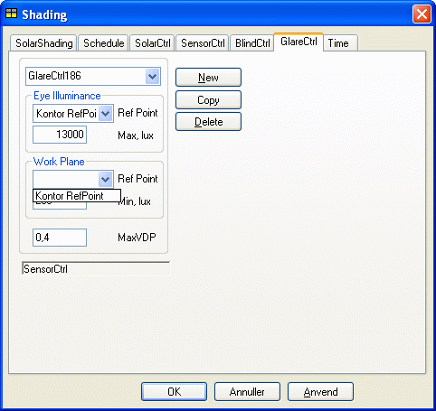
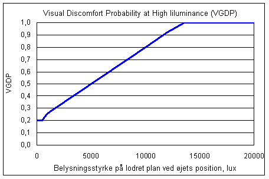
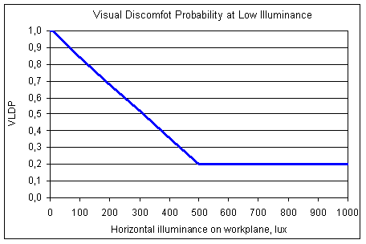

<link rel="stylesheet" href="../style.css">

# Regulering efter blændingsforhold og belysningsstyrke

Ofte antages det, at solafskærmninger reguleres efter solindfaldet, eller efter temperaturen i lokalet. Flere forskningsundersøgelser viser imidlertid, at brugeren i højere grad regulerer efter gener fra dagslyset, dvs. fra direkte solindfald eller høj himmelluminans. Forskningen viser også, at brugerne ofte lader solafskærmningen forblive lukket, indtil dagslyset i rummet bliver utilstrækkeligt til de aktuelle arbejdsopgaver. Ved reguleringstypen *GlareCtrl* søger man at minimere visuel diskomfort, dels på grund af gener fra blænding og dels på grund af for lidt lys. De to kriterier for diskomfort er udtrykt ved et indeks, der angiver sandsynligheden for at en bruger oplever visuel diskomfort, VDP (Visual Discomfort Probability). BSim dialogen for *GlareCtrl* er vist i figuren.

Reguleringen sker i forhold til belysningsniveauet i to [referencepunkter](https://bsim.outseta.com/support/kb/articles/79O3J49E/referencepunkt), dels for øjets placering og dels for et arbejdsplan.

<figure id="center_img">

<figcaption>BSim dialog for definition af GlareCtrl. Ud fra den ønskede maksimale værdi af VDP beregnes grænseværdier belysningsstyrken i de to valgte referencepunkter (normalt på lodret plan ved øje-position samt på arbejdsplan).</figcaption>
</figure>

### **Visual discomfort probability på grund af høj belysningsstyrke**   

Som grundlag for beregning af visuel diskomfort på grund af blænding benyttes et forenklet udtryk for en formel udviklet i EU-projektet [ECCO-Build](https://vbn.aau.dk/ws/portalfiles/portal/691269896/sbi-2011-15.pdf.pdf). Den forenklede formel, der udtrykker sandsynligheden for at en person vil opleve diskomfort ud fra belysningsstyrken på øjet, har udtrykket:

Ev < 500:                   VGDP = 0,2  
Ev > 13.000:               VGDP = 1  
VGDP = 6⋅10-5 Ev + 0,2 

*   Ev er belysningsstyrken på et lodret plan ved øjet,

*   VGDP er sandsynligheden for oplevelse af blænding.

Udtrykket, vist grafisk i nedenstående figur, illustrerer at der er store variationer i personers oplevelse af blænding. Mens nogle vil opleve ubehagsblænding allerede ved en belysningsstyrke på øjet på 1.000 lux, kan andre tolerere belysningsstyrker på helt op til 13.000 lux.

<figure id="center_img">

<figcaption>Diskomfort pga. blænding (Visual discomfort probability due to glare, VGDP), normalt defineret ved belysningsstyrken på lodret plan ved brugerens øjenposition.</figcaption>
</figure>

### **Visual discomfort probability på grund af lav belysningsstyrke på arbejdsplan**

Sandsynligheden for oplevelse af visuel diskomfort på grund af blænding skal vurderes i sammenhæng med sandsynligheden for diskomfort pga. for lav belysningsstyrke. Et udtryk for sandsynligheden for oplevelse af diskomfort på grund af for lav belysningsstyrke på arbejdsplanet er udviklet af Lindelöf (Lindelöf, D., Morel, N., 2005. Bayesian Optimization of User Visual Comfort. Lux Europa 10th European Lighting Conference):

Eh < 10 (lux):                VGDP = 1,0

Eh < Eopt:                     LDP = (1-VLDPmin) (Eopt-Eh) / Eopt + VLDPmin

VGDP = VLDPmin

*   Eh er belysningsstyrken på horisontalplan (arbejdsplan),

*   Eopt er den ønskede (optimale) belysningsstyrke på arbejdsplanet (eller arbejdsobjektet), som afhænger af den aktuelle arbejdsopgave,

*   VLDP er sandsynligheden for oplevelse af visuel diskomfort pga. for lidt lys,

*   VLDPmin er den laveste værdi som diskomfortindekset kan antage (typisk 0,2).

Ved behov for regulering pga. blænding afhænger reguleringsformen af afskærmningstypen. For typen *Venetian* (blind) søges belysningsstyrken i det valgte referencepunkt (normalt lodret plan ved øjets position) reduceret netop så meget, at blændingsgrænsen overholdes. Regulering sker ud fra opslag i en tabel, og ud fra den valgte indstilling af lamellerne kan den aktuelle solafskærningsfaktor og dermed solindfaldet beregnes.

For typerne *Curtain* eller *Screen* trækkes afskærmningen helt for, og den nye belysningsstyrke beregnes ud fra reduktionsfaktorerne gardin. Afskærmningens indstilling er ved starten af hvert tidsstep (halvtime) ligesom i forrige tidsstep. Hvis blændingskriteriet er overholdt, undersøges det, om afskærmningen kan åbnes mere for at opnå en højere belysningsstyrke i det andet referencepunkt (normalt på vandret arbejdsplan) samt for at opnå størst muligt udsyn.

<figure id="center_img">

<figcaption>Visuel discomfort pga. for lidt lys (visual discomfort probability,VLDP), normalt defineret ved belysningsstyrken på arbejdsplanet (eller arbejdsobjektet). Den ønskede værdi af belysningsstyrken (Min. Lux) vælges af brugeren ud fra den aktuelle arbejdsopgave. I figuren er værdien 500 lux.</figcaption>
</figure>
