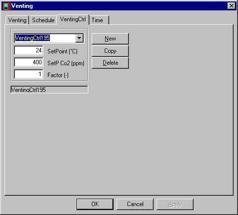

<link rel="stylesheet" href="../style.css">

# Udluftningskontrol

Det antages, at når temperaturen i kontorerne kommer over en vis værdi, vil personalet åbne vinduerne for at lufte ud. Ved de i nedenstående dialogs viste data antages det, at når indetemperaturen overstiger setpunktet på 24 °C, udluftes der netop så meget, som det er nødvendigt for at holde temperaturen nede på setpunktet. Der kan dog ikke opnås et luftskifte større end det, der beregnes efter data på udluftningsfanebladet, multipliceret med værdien af *Factor.*

<figure id="center_img">

<figcaption>Reguleringen (Venting | VentingCtrl) af udluftningen styres af den operative temperatur i den termiske zone med en andel af basisluftskiftet.</figcaption>
</figure>

*Set Point* angiver den grænse for indetemperaturen, hvorover udluftningen regnes aktiveret. Over setpunktet udluftes der netop så meget at setpunktet kan overholdes. Ofte vil der være flere systemer, som kan reguleres for at holde indetemperaturen på den ønskede værdi eller inden for det ønskede interval. Temperatursetpunkterne i reguleringerne for disse systemer er da bestemmende for den rækkefølge, som systemerne aktiveres i.

SetP Co2 Setpunkt for CO2 koncentration (ppm). Angives 0 styres der ikke efter CO2. Over setpunktet udluftes der netop så meget at setpunktet kan overholdes. Hvis SetP Co2 er angivet (> 0) styres først efter den ønskede CO2 koncentration, og derefter styres efter temperatur setpunktet.

 **OBS**: Hvis set-punktet for CO2 reguleringen er for tæt på $ \left( \frac{\text{CO}_2 \text{SetP} - \text{CO}_2 \text{Ude}}{\text{CO}_2 \text{Ude}} \leq 0{,}05 \right) $, den fastsatte faste værdi for CO2 indholdet i udeluften kan det ønskede set-punkt for indeluften ikke opnås idet det kræver at luftskiftet stiger til uendelig.   
For at opnå det ønskede set-punkt for CO2 indholdet i indeluften reguleres udeluftmængden efter [basisluftskiftet og vindbidraget](https://help.bsim.dk/support/kb/articles/gWKDJlmp/udluftning).

Ved at indlæse en værdi for *Factor* mindre end 1,0 angives det, at der inden for den tilhørende tidsangivelse kun kan opnås et luftskifte, beregnet ud fra formlen med data fra udluftningsdialogen, multipliceret med *Factor.* I tilfældet med naturlig ventilation svarer det til, at åbningsarealerne reduceres med *Factor.*